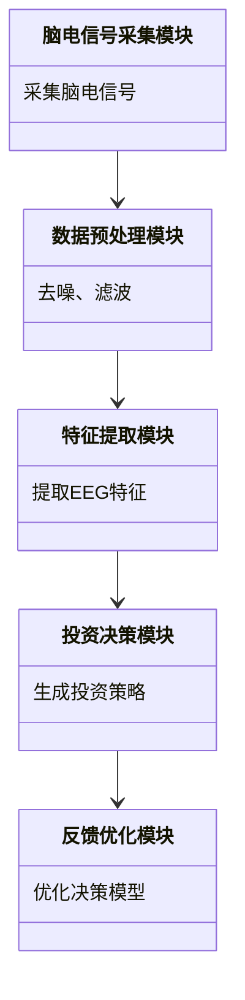

                 


# 巴菲特-芒格的脑机接口工作效率提升投资：认知增强的产业化

## 关键词：脑机接口，巴菲特，芒格，投资效率，认知增强，人工智能，神经科学

## 摘要：  
本文探讨了如何将脑机接口（BCI）技术应用于巴菲特和芒格的投资理念中，以提升工作效率和投资决策的准确性。通过分析BCI的核心原理、算法设计以及系统架构，结合实际案例，本文展示了如何利用认知增强技术优化投资策略，实现投资效率的产业化提升。

---

## 第一部分: 脑机接口与巴菲特-芒格投资理念的结合

### 第1章: 脑机接口技术概述

#### 1.1 脑机接口的定义与核心原理
##### 1.1.1 脑机接口的基本概念  
脑机接口（Brain-Computer Interface，BCI）是一种通过采集和分析人脑神经信号，将大脑意图直接转化为计算机指令的技术。它通过采集 EEG（脑电图）、fMRI（功能性磁共振成像）或 MEG（脑磁图）等信号，解析大脑活动，实现人与机器的直接交互。

##### 1.1.2 脑机接口的核心技术原理  
1. **数据采集**：通过 EEG 电极采集大脑电信号。  
2. **信号处理**：对采集到的信号进行降噪、滤波和特征提取。  
3. **模式识别**：利用机器学习算法识别特定的脑电特征，转化为计算机可识别的指令。  

##### 1.1.3 脑机接口的发展历程  
从实验室研究到产业化应用，BCI 技术逐步成熟，广泛应用于医疗、教育、娱乐和投资等领域。

#### 1.2 巴菲特与芒格的投资理念
##### 1.2.1 巴菲特的价值投资理论  
巴菲特的价值投资强调长期、基本面分析和安全边际，注重企业内在价值。  

##### 1.2.2 芒格的多元思维模型  
芒格的多元思维模型强调跨学科思考，将多个领域的知识结合起来，形成全面的认知框架。  

##### 1.2.3 投资决策中的认知优势  
认知优势是指投资者通过独特认知能力获得超额收益的能力。BCI 技术可以增强这种认知优势。

---

### 第2章: 脑机接口在投资中的应用潜力

#### 2.1 脑机接口如何增强认知能力
##### 2.1.1 提高注意力与专注力  
通过实时监测大脑活动，BCI 可以帮助投资者集中注意力，减少外界干扰。

##### 2.1.2 增强决策速度与准确性  
BCI 可以实时分析大脑活动，辅助投资者快速做出更准确的决策。

##### 2.1.3 提升情绪管理能力  
通过监测和调节大脑情绪活动，BCI 可以帮助投资者避免情绪化决策。

#### 2.2 巴菲特与芒格投资理念的脑机接口实现
##### 2.2.1 价值投资的神经科学基础  
利用BCI技术分析投资者在评估企业价值时的神经活动，优化投资决策。

##### 2.2.2 多元思维模型的脑机接口优化  
通过BCI技术，投资者可以实时获取多个领域的知识关联，提升跨领域分析能力。

##### 2.2.3 投资决策中的认知增强策略  
结合BCI技术，投资者可以实现认知能力的实时增强，提升决策效率和准确性。

---

### 第3章: 脑机接口的核心算法与数学模型

#### 3.1 脑电信号处理算法
##### 3.1.1 傅里叶变换在脑电信号分析中的应用  
傅里叶变换用于将时间序列的脑电信号转换到频域，分析不同频率的神经活动。

##### 3.1.2 独立成分分析（ICA）在脑电信号分离中的作用  
ICA 用于分离混合的脑电信号，提取独立的神经源信号。

##### 3.1.3 基于深度学习的脑电信号分类算法  
深度学习模型（如卷积神经网络）用于分类脑电信号，识别特定的神经活动模式。

#### 3.2 投资决策模型的数学框架
##### 3.2.1 投资决策树的构建与优化  
通过决策树算法，构建基于神经信号的投资决策模型。

##### 3.2.2 基于马尔可夫链的投资状态转移模型  
马尔可夫链用于建模投资决策过程中的状态转移，预测未来市场趋势。

##### 3.2.3 基于强化学习的投资策略优化算法  
强化学习算法用于优化投资策略，通过奖励机制提升决策质量。

---

### 第4章: 脑机接口与投资决策系统的架构设计

#### 4.1 投资决策系统的功能模块划分
##### 4.1.1 数据采集模块  
负责采集投资者的脑电信号和其他市场数据。

##### 4.1.2 脑电信号处理模块  
对采集到的信号进行预处理和特征提取。

##### 4.1.3 投资决策模块  
基于处理后的信号和市场数据，生成投资决策。

##### 4.1.4 反馈与优化模块  
根据实际投资结果优化决策模型。

#### 4.2 系统架构设计
##### 4.2.1 系统功能设计  
使用 mermaid 类图展示系统功能模块之间的关系。



##### 4.2.2 系统架构设计  
使用 mermaid 架构图展示系统整体架构。


---

## 第5章: 脑机接口在投资中的实际应用

### 5.1 项目实战：基于BCI的投资决策辅助系统
#### 5.1.1 环境安装与配置  
安装 EEG 数据采集设备和相关软件工具。

#### 5.1.2 系统核心功能实现  
实现 EEG 数据采集、处理和投资决策生成功能。

#### 5.1.3 代码实现与解读  
```python
# 示例代码：基于EEG特征的投资决策模型
import numpy as np
from sklearn.svm import SVC

def preprocess_eeg(data):
    # 数据预处理函数
    return data

def extract_features(data):
    # 特征提取函数
    return data

def train_model(X, y):
    # 训练投资决策模型
    model = SVC()
    model.fit(X, y)
    return model

# 示例数据
X = np.random.randn(100, 10)
y = np.random.randint(0, 2, 100)

model = train_model(X, y)
print("投资决策模型训练完成")
```

#### 5.1.4 实际案例分析  
分析一个具体的投资案例，展示BCI技术在投资决策中的实际应用。

---

## 第6章: 总结与展望

### 6.1 总结
本文探讨了脑机接口技术在提升巴菲特和芒格投资理念效率中的应用，展示了其在认知增强和投资决策中的潜力。

### 6.2 展望
未来，随着BCI技术的不断发展，其在投资领域的应用将更加广泛，认知增强技术将推动投资效率的进一步提升。

---

## 参考文献  
（此处列出相关参考文献）

---

通过以上内容，本文系统地分析了脑机接口技术在投资中的应用潜力，结合实际案例和数学模型，展示了其在提升投资效率中的重要价值。

