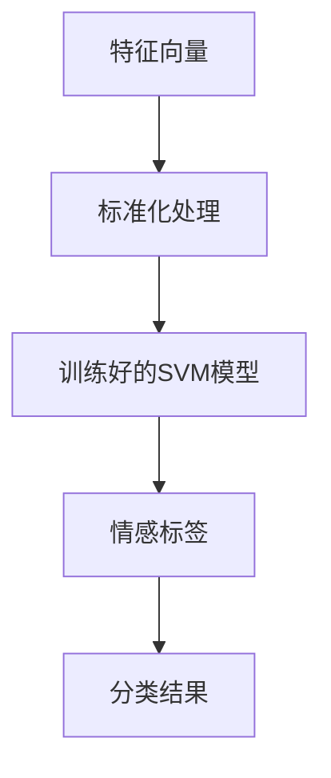
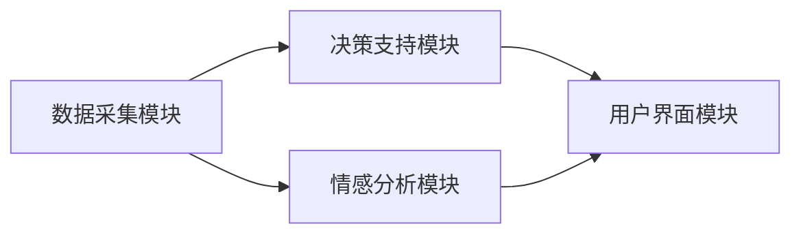

                 


# 巴菲特-芒格的脑机接口情感调节投资：心理健康的新方法

> **关键词**: 巴菲特、芒格、脑机接口、情感调节、投资决策、心理健康

> **摘要**: 本文探讨了脑机接口（BCI）技术在情感调节中的应用，特别是如何将其与巴菲特和芒格的投资理念相结合，以优化投资决策和提升心理健康。文章详细分析了脑机接口技术的基本原理、情感调节算法的设计、系统架构的实现以及实际案例的应用，展示了如何通过技术手段实现情感与投资的高效结合。

---

## 第一部分: 背景介绍与核心概念

### 第1章: 投资决策中的心理因素

#### 1.1 投资决策的基本原理
投资决策是人类行为中的重要组成部分，涉及复杂的心理过程。投资者在面对市场波动时，常常会受到情绪的影响，如贪婪、恐惧和过度自信等心理偏差。这些情绪不仅会影响决策的质量，还可能导致投资损失。

#### 1.2 巴菲特与芒格的投资理念
巴菲特和芒格作为投资界的传奇人物，他们的成功部分归功于对心理因素的深刻理解。他们强调长期价值投资，注重基本面分析，而非短期情绪波动。然而，情绪管理仍然是投资决策中的关键因素。

#### 1.3 脑机接口技术的基本概念
脑机接口（BCI）是一种能够直接连接人脑与外部设备的技术，通过采集和分析脑电信号，实现对人类意图的解读和控制。近年来，BCI技术在医疗、康复和心理健康领域的应用逐渐增多。

### 第2章: 脑机接口情感调节技术的原理

#### 2.1 情感调节的基本原理
情感调节是指个体通过认知或行为策略来调整自身情绪状态的过程。在投资决策中，情感调节可以帮助投资者克服情绪偏差，做出更理性的决策。

#### 2.2 脑机接口在情感调节中的应用
脑机接口可以通过采集和分析脑电信号，识别投资者的情感状态，并提供实时反馈或干预，帮助其调节情绪。例如，当投资者表现出过度焦虑时，系统可以通过提示或引导帮助其冷静下来。

---

## 第二部分: 算法原理与系统架构

### 第3章: 情感分类算法的设计与实现

#### 3.1 基于脑电的特征提取算法
特征提取是情感分类的关键步骤。常用的特征包括功率谱密度、时域特征（如均值、标准差）和频域特征（如心率变异性）。以下是特征提取的流程图：

```mermaid
graph TD
A[原始脑电信号] --> B[特征提取]
B --> C[功率谱密度]
B --> D[时域特征]
B --> E[频域特征]
C, D, E --> F[特征向量]
F --> G[情感分类器]
```

#### 3.2 情感分类算法
常用的情感分类算法包括支持向量机（SVM）、随机森林（RF）和深度学习模型（如卷积神经网络CNN）。以下是基于SVM的情感分类流程图：



### 第4章: 投资决策辅助系统的架构设计

#### 4.1 系统组成与功能
投资决策辅助系统主要包括数据采集模块、情感分析模块、决策支持模块和用户界面模块。以下是系统的架构图：



#### 4.2 系统接口设计
系统接口包括脑电信号采集接口、情感分类算法接口和投资决策优化接口。以下是接口交互图：


---

## 第三部分: 项目实战与案例分析

### 第5章: 项目环境与核心实现

#### 5.1 环境配置
项目需要以下工具和库：
- 数据采集：使用EEGLAB进行脑电信号采集。
- 数据处理：使用Python的scikit-learn和TensorFlow进行特征提取和模型训练。
- 可视化：使用Matplotlib进行数据可视化。

#### 5.2 核心代码实现
以下是情感分类算法的Python代码示例：

```python
import numpy as np
from sklearn.svm import SVC
from sklearn.metrics import accuracy_score

# 特征提取
def extract_features(data):
    # 假设data是脑电信号矩阵，shape为[样本数, 通道数, 时间点数]
    features = []
    for i in range(data.shape[0]):
        # 提取功率谱密度特征
        psd = np.abs(np.fft.fft(data[i])) ** 2
        features.append(np.mean(psd))
    return features

# 情感分类
def classify_emotion(features, labels):
    model = SVC()
    model.fit(features, labels)
    return model

# 应用到投资决策
def investment_decision(model, new_features):
    predicted_emotion = model.predict(new_features)
    return predicted_emotion
```

### 第6章: 实际案例分析

#### 6.1 案例背景
假设一位投资者在市场波动剧烈时表现出过度焦虑的情绪。系统通过脑电信号采集和分析，识别出其情绪状态，并提供相应的调节建议。

#### 6.2 系统反馈与干预
系统会根据情感分类结果，提示投资者冷静下来，并建议关注长期价值而非短期波动。

---

## 第四部分: 总结与展望

### 第7章: 最佳实践与注意事项

#### 7.1 实施脑机接口情感调节的关键点
- 数据采集的准确性：确保脑电信号的高质量采集。
- 模型的泛化能力：选择适合目标人群的情感分类模型。
- 用户隐私保护：确保数据的安全性和隐私性。

#### 7.2 投资者的心理调适
投资者需要接受技术辅助的观念，并结合自身的投资策略，灵活运用系统提供的建议。

### 第8章: 未来展望

#### 8.1 技术进步的潜力
随着脑机接口技术的不断发展，情感调节在投资中的应用将更加智能化和个性化。

#### 8.2 行业影响与挑战
脑机接口技术的应用可能改变投资行业的格局，但也需要克服技术成熟度和成本问题。

---

## 参考文献

（此处可以列出相关文献和资料，根据实际需要添加）

---

通过本文的分析与探讨，我们可以看到，脑机接口技术在情感调节中的应用为投资决策提供了新的可能性。结合巴菲特和芒格的投资理念，这种技术可以帮助投资者更好地管理情绪，做出更理性的决策。未来，随着技术的进一步发展，脑机接口在投资领域的应用前景将更加广阔。

