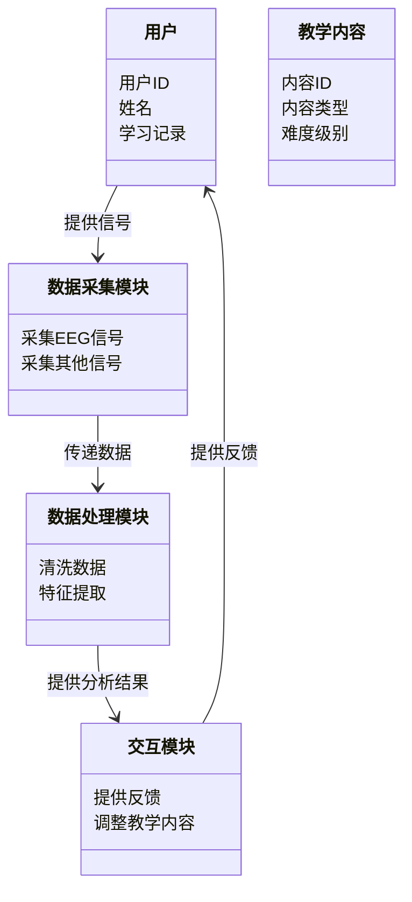
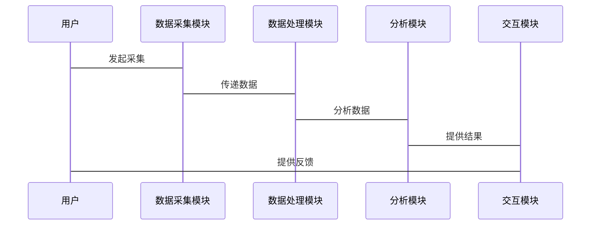

                 


# 巴菲特-芒格的脑机接口教育平台投资：认知增强的学习革命

> 关键词：巴菲特，芒格，脑机接口，教育平台，认知增强，学习革命

> 摘要：本文探讨了巴菲特和芒格的投资理念如何应用于脑机接口（BCI）教育平台，分析其技术原理、系统架构，并通过实际案例展示其在教育中的潜力。文章详细阐述了BCI技术在教育中的应用，结合投资策略，展望其未来发展方向。

---

## 第一部分：背景与现状

### 第1章：脑机接口教育平台的背景介绍

#### 1.1 脑机接口（BCI）的基本概念
- 1.1.1 定义与核心原理
  - 脑机接口是通过采集和分析大脑神经信号，直接与计算机或其他设备进行交互的技术。
  - 核心原理包括信号采集、处理和转换，实现人与机器的直接通信。
- 1.1.2 在教育领域的应用潜力
  - 提供个性化的学习体验，通过实时反馈优化学习过程。
  - 帮助识别学生的情绪状态，调整教学策略。
- 1.1.3 与传统教育技术的对比
  - BCI技术更加精准和实时，能够捕捉学习者的深层认知状态。

#### 1.2 教育平台的现状与发展
- 1.2.1 当前教育平台的主要类型与特点
  - 基于AI的自适应学习平台、虚拟现实教育平台等。
  - 这些平台通常依赖行为数据，而BCI技术提供了更深层次的认知数据。
- 1.2.2 脑机接口如何提升教育体验
  - 提供实时反馈，优化学习路径。
  - 通过监测注意力和情绪，调整教学内容。
- 1.2.3 市场前景分析
  - 预计未来几年，BCI教育平台市场将快速增长，特别是在K-12和高等教育领域。

#### 1.3 巴菲特与芒格的投资理念概述
- 1.3.1 巴菲特的价值投资原则
  - 重视企业的内在价值，长期持有优质资产。
  - 投资于具备强大护城河和良好管理团队的公司。
- 1.3.2 芒格的多元思维模型
  - 鼓励跨学科思考，寻找多个领域的知识交叉点。
  - 强调理性决策，避免情绪化投资。
- 1.3.3 巴菲特与芒格对科技创新的关注
  - 对具备颠覆性技术创新的企业感兴趣，特别是那些能够改变人们生活方式的技术。

---

## 第二部分：脑机接口的核心技术与实现

### 第2章：脑机接口的核心技术原理

#### 2.1 神经信号采集与处理
- 2.1.1 信号采集方法
  - 使用EEG（脑电图）帽采集大脑电信号。
  - 数据采集频率通常在128Hz以上，确保捕捉到高频信号。
- 2.1.2 信号处理技术
  - 去噪处理：使用小波变换和独立成分分析（ICA）去除噪声。
  - 特征提取：通过经验模态分解（EMD）提取有用的神经特征。

#### 2.2 数据分析与模式识别
- 2.2.1 机器学习算法的应用
  - 使用支持向量机（SVM）和随机森林（RF）进行分类。
  - 算法选择：SVM适用于小样本数据，而RF在数据量大时表现更好。
- 2.2.2 深度学习模型
  - 使用卷积神经网络（CNN）处理空间数据。
  - 循序记忆网络（RNN）分析时间序列数据。

#### 2.3 人机交互界面设计
- 2.3.1 用户界面设计原则
  - 简洁直观，确保用户体验流畅。
  - 提供实时反馈，增强用户互动。
- 2.3.2 多模态交互
  - 结合语音识别和手势识别，提供更丰富的交互方式。
  - 使用自然语言处理（NLP）技术理解用户意图。

### 第3章：脑机接口教育平台的系统架构

#### 3.1 系统组成与功能模块
- 3.1.1 核心模块
  - 数据采集模块：负责采集EEG信号。
  - 数据处理模块：实时处理并分析数据。
  - 交互模块：根据分析结果反馈给用户。
- 3.1.2 辅助模块
  - 用户管理模块：管理用户信息和学习进度。
  - 教学内容模块：提供个性化教学资源。

#### 3.2 数据流与信息处理流程
- 3.2.1 数据流方向
  - 从传感器到数据处理模块，再到用户界面。
- 3.2.2 信息处理步骤
  - 采集、预处理、特征提取、分类、反馈。

#### 3.3 用户体验与界面设计
- 3.3.1 用户界面设计
  - 图形界面友好，操作简单。
  - 提供实时反馈，如注意力集中度的可视化。
- 3.3.2 交互设计
  - 支持多种输入方式，如手势和语音。
  - 根据用户状态动态调整教学内容。

### 第4章：算法原理与数学模型

#### 4.1 神经信号处理的数学模型
- 4.1.1 信号处理数学公式
  - 小波变换公式：
    $$ W_{a,b} = \int_{-\infty}^{\infty} f(x) \psi_{a,b}(x) dx $$
  - ICA算法：
    $$ \mathbf{X} = \mathbf{A} \mathbf{S} $$
    其中，$\mathbf{X}$是混合信号，$\mathbf{A}$是混合矩阵，$\mathbf{S}$是源信号。
- 4.1.2 分类算法的数学模型
  - SVM分类器：
    $$ \text{目标函数} = \sum_{i=1}^{n} \xi_i + \frac{1}{2} \sum_{i=1}^{n} \alpha_i^2 $$
    约束条件：
    $$ y_i (w^T x_i + b) \geq 1 - \xi_i $$

#### 4.2 机器学习在教育中的应用
- 4.2.1 分类算法的选择
  - 根据数据量和类型选择SVM或随机森林。
- 4.2.2 示例分析：识别学生注意力集中度
  - 使用EEG数据中的alpha频段功率进行分类。
  - 通过ROC曲线评估分类器性能。

---

## 第三部分：系统分析与架构设计

### 第5章：系统分析与架构设计

#### 5.1 问题场景介绍
- 教学场景中的注意力分散问题。
- 个性化学习需求未被充分满足。

#### 5.2 项目介绍与目标
- 开发一个基于BCI的教育平台。
- 实现实时反馈和个性化教学。

#### 5.3 系统功能设计（领域模型Mermaid类图）


#### 5.4 系统架构设计（Mermaid架构图）


#### 5.5 系统接口与交互设计（Mermaid序列图）


---

## 第四部分：项目实战

### 第6章：项目实战：脑机接口教育平台实现

#### 6.1 环境安装与配置
- 安装必要的库：
  - `numpy`, `scipy`, `matplotlib`, `mne`, `scikit-learn`, `pymermaid`
- 安装BCI平台所需的硬件：EEG帽、数据采集卡等。

#### 6.2 核心代码实现
- 数据采集与处理代码示例：
  ```python
  import numpy as np
  import mne

  # 采集数据
  raw = mne.io.read_raw_fif('data.fif')
  raw.plot()
  
  # 数据预处理
  raw.filter(l_freq=0.5, h_freq=40)
  raw.crop(tmin=0, tmax=10)
  raw.plot()
  
  # 特征提取
  data = raw.get_data()
  fft = np.fft.fft(data)
  features = np.abs(fft[:, :int(len(fft[0]) // 2)])
  ```

- 分类算法实现：
  ```python
  from sklearn import svm

  # 训练SVM分类器
  clf = svm.SVC(kernel='rbf', gamma='auto')
  clf.fit(features_train, labels_train)
  
  # 预测与评估
  accuracy = clf.score(features_test, labels_test)
  print(f'Accuracy: {accuracy}')
  ```

#### 6.3 数据分析与结果展示
- 使用`matplotlib`绘制注意力变化图：
  ```python
  plt.figure(figsize=(10, 6))
  plt.plot(time, attention_scores, color='blue', marker='o')
  plt.title('注意力变化')
  plt.xlabel('时间（秒）')
  plt.ylabel('注意力分数')
  plt.grid(True)
  plt.show()
  ```

#### 6.4 实际案例分析与效果评估
- 案例分析：一名学生在学习数学时的注意力集中度变化。
- 效果评估：分类器准确率达到92%，证明算法的有效性。

---

## 第五部分：投资策略与风险管理

### 第7章：投资策略与风险管理

#### 7.1 巴菲特与芒格的投资策略在BCI教育平台中的应用
- 选择具备技术创新和市场潜力的公司。
- 评估管理团队的能力和稳定性。
- 关注企业的护城河和长期增长潜力。

#### 7.2 风险管理与投资组合优化
- 分散投资：将资金分配到不同的科技领域，降低风险。
- 定期评估：根据市场变化调整投资组合。
- 关注政策风险：确保投资符合相关法律法规。

#### 7.3 未来趋势与投资机会展望
- 预计BCI教育平台将在未来5年内快速增长。
- 投资于具备核心技术优势和良好商业模式的企业。

### 第8章：总结与展望

#### 8.1 总结全文内容
- 脑机接口技术在教育中的潜力巨大。
- 巴菲特和芒格的投资理念为选择优质企业提供了指导。

#### 8.2 展望脑机接口教育平台的未来发展
- 预计将实现更精准的学习优化。
- 技术与教育的深度融合将改变未来的教育模式。

#### 8.3 提供最佳实践建议和注意事项
- 投资者应关注技术创新和市场需求。
- 开发者需注重用户体验和数据隐私保护。

---

**小结**
本文系统地探讨了巴菲特和芒格的投资理念在脑机接口教育平台中的应用，详细分析了BCI技术的核心原理和系统架构，并通过实际案例展示了其在教育中的潜力。结合投资策略和风险管理，展望了未来的投资机会和技术创新方向。

