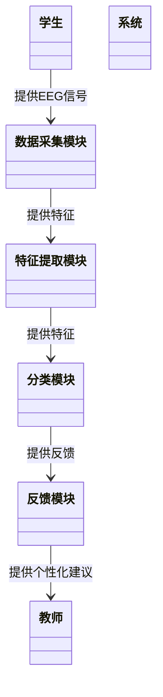
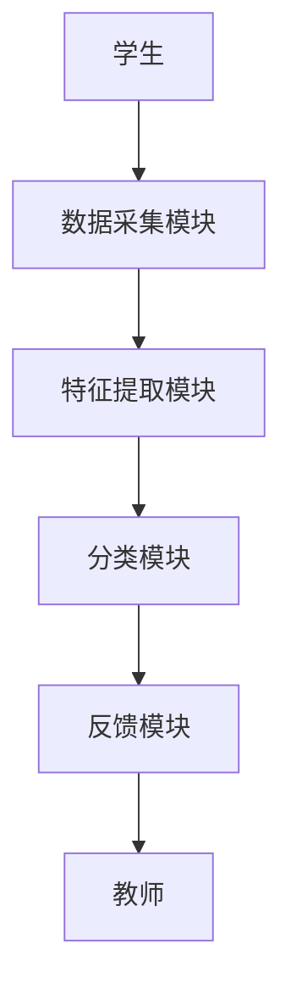

                 


# 巴菲特-芒格的脑机接口教育投资：认知增强的教育革命

## 关键词：脑机接口，认知增强，教育投资，巴菲特，芒格，教育革命

## 摘要：本文探讨了巴菲特和芒格在脑机接口技术领域的教育投资，分析了该技术如何通过认知增强推动教育革命。文章详细介绍了脑机接口技术的背景、核心原理、系统架构，以及在教育中的应用案例，并提供了实际项目实现和最佳实践的指导。

---

# 第一部分：脑机接口技术与教育投资的背景

## 第1章：脑机接口技术的起源与发展

### 1.1 脑机接口技术的定义与起源

#### 1.1.1 脑机接口技术的定义
脑机接口（Brain-Computer Interface, BCI）是一种能够直接连接人类大脑与外部设备的技术，通过采集、处理和解析大脑神经信号，实现人与设备之间的信息交互。

#### 1.1.2 脑机接口技术的发展历程
脑机接口技术起源于20世纪60年代，经历了从简单的神经信号采集到复杂的人机交互系统的演变。近年来，随着人工智能和神经科学的进步，BCI技术在医疗、教育和娱乐等领域得到了广泛应用。

#### 1.1.3 脑机接口技术的核心原理
BCI技术的核心在于通过电极采集大脑的神经信号（如EEG），经过滤波、特征提取和分类，将大脑意图转化为控制指令，实现与外部设备的交互。

### 1.2 巴菲特与芒格的投资动机

#### 1.2.1 巴菲特与芒格的投资哲学
巴菲特和芒格以价值投资著称，注重长期投资具有创新性和高成长性的领域。他们认识到脑机接口技术在教育领域的潜力，尤其是其在认知增强和个性化学习中的应用。

#### 1.2.2 脑机接口技术的投资价值
脑机接口技术能够提升学习效率，优化教学方法，具有广阔的市场前景。巴菲特和芒格的投资布局旨在抓住这一技术的商业化机会。

#### 1.2.3 巴菲特与芒格在教育领域的投资案例
他们投资了多家专注于脑机接口技术的企业，推动了教育领域的技术创新。这些投资不仅为教育带来了新的可能性，也为投资者带来了丰厚的回报。

## 第2章：脑机接口技术在教育中的应用现状

### 2.1 教育领域的认知增强需求

#### 2.1.1 认知增强的定义与目标
认知增强是指通过技术手段提升人类的认知能力，包括学习能力、记忆能力和注意力集中能力。

#### 2.1.2 教育领域中的认知增强需求
现代教育体系面临个性化学习、学习效率和学生注意力管理等挑战。脑机接口技术能够通过实时反馈和个性化指导，帮助学生提升学习效果。

#### 2.1.3 脑机接口技术在认知增强中的作用
BCI技术能够监测学生的学习状态，提供实时反馈，优化教学策略，从而实现认知增强。

### 2.2 脑机接口技术在教育中的应用案例

#### 2.2.1 巴菲特与芒格投资的教育科技公司
他们投资的公司专注于开发基于BCI技术的教育工具，如智能头环和教育软件。

#### 2.2.2 脑机接口技术在教育中的实际应用
通过EEG信号采集，系统能够实时监测学生的学习状态，提供个性化的学习建议和反馈。

#### 2.2.3 脑机接口技术对教育模式的改变
BCI技术使得教育更加个性化和高效，学生可以根据自己的认知特点调整学习节奏，教师也可以根据实时数据优化教学方法。

---

# 第二部分：脑机接口技术的核心概念与联系

## 第3章：神经科学基础与脑机接口技术

### 3.1 神经科学基础

#### 3.1.1 神经元与神经网络的基本原理
神经元是大脑的基本结构单元，通过电化学信号传递信息。神经网络通过这些信号进行信息处理和存储。

#### 3.1.2 大脑的认知过程与神经活动
认知过程如记忆、学习和决策都伴随着特定的神经活动模式。通过分析这些模式，可以了解大脑的工作机制。

#### 3.1.3 神经信号的采集与处理
通过EEG、fMRI等技术采集神经信号，经过滤波和特征提取，提取有用的神经信息。

### 3.2 脑机接口技术的核心原理

#### 3.2.1 脑机接口技术的工作流程
1. 采集神经信号
2. 特征提取与分类
3. 生成控制指令
4. 输出控制信号

#### 3.2.2 神经信号的特征与分类
神经信号具有不同的频率（如α、β、γ波）和空间分布。通过模式识别技术，可以区分不同的大脑状态。

#### 3.2.3 脑机接口技术的分类与应用场景
根据接口类型，BCI技术可以分为侵入式和非侵入式。非侵入式BCI（如EEG）适用于教育领域的广泛应用。

## 第4章：脑机接口技术与教育投资的联系

### 4.1 教育领域的认知增强需求

#### 4.1.1 认知增强的目标
提升学习效率、增强记忆能力和优化注意力管理。

#### 4.1.2 脑机接口技术在教育中的应用
通过实时监测学生的学习状态，提供个性化学习建议和反馈，优化教学策略。

### 4.2 脑机接口技术的教育投资价值

#### 4.2.1 投资动机
认知增强技术具有广阔的市场前景，能够提升教育机构的竞争力和学生的学习效果。

#### 4.2.2 投资策略
巴菲特和芒格通过长期价值投资，选择具有技术创新和市场潜力的教育科技公司。

---

# 第三部分：脑机接口技术的算法原理

## 第5章：算法原理讲解

### 5.1 信号处理算法

#### 5.1.1 EEG信号的滤波与特征提取
EEG信号通常受到噪声干扰，需要通过滤波算法（如巴特沃兹滤波器）进行预处理，提取有用的特征。

#### 5.1.2 特征提取方法
常用的方法包括时域分析（如均方差）和频域分析（如功率谱密度）。例如：
$$ \text{均方差} = \frac{1}{N}\sum_{i=1}^{N}(x_i - \mu)^2 $$
其中，\( \mu \) 是数据的均值，\( N \) 是数据点的数量。

### 5.2 模式识别算法

#### 5.2.1 分类器选择
常用的分类算法包括支持向量机（SVM）和随机森林（Random Forest）。例如，SVM的实现如下：
```python
from sklearn import svm
model = svm.SVC()
model.fit(X_train, y_train)
```

#### 5.2.2 分类性能评估
通过混淆矩阵和准确率、召回率等指标评估分类器的性能。例如：
$$ \text{准确率} = \frac{\text{正确分类数}}{\text{总样本数}} $$

### 5.3 反馈机制与闭环系统

#### 5.3.1 反馈机制的设计
根据分类结果，系统实时调整输出，优化学习过程。

#### 5.3.2 闭环系统的实现
闭环系统能够根据反馈不断优化分类模型，提升准确率和鲁棒性。

---

# 第四部分：脑机接口技术的系统架构设计

## 第6章：系统分析与架构设计方案

### 6.1 教育投资场景中的系统需求

#### 6.1.1 需求分析
系统需要实时采集EEG信号，进行特征提取和分类，输出个性化学习建议。

### 6.2 系统功能设计

#### 6.2.1 领域模型设计
使用Mermaid绘制领域模型类图，展示系统各模块之间的关系。



### 6.3 系统架构设计

#### 6.3.1 系统架构图
使用Mermaid绘制系统架构图，展示各模块之间的交互和数据流。



---

# 第五部分：项目实战

## 第7章：项目实战与实现

### 7.1 环境安装

#### 7.1.1 开发环境
- Python 3.8+
- EEG数据采集设备（如OpenBCI）
- 相关库的安装：numpy、scipy、scikit-learn

### 7.2 核心实现

#### 7.2.1 数据采集模块
```python
import numpy as np
from openBCI import Cyton

# 初始化数据采集模块
cyton = Cyton()
data = cyton.start_streaming()
```

#### 7.2.2 特征提取模块
```python
def extract_features(data):
    # 计算均方差
    mu = np.mean(data)
    variance = np.var(data)
    return variance
```

#### 7.2.3 分类模块
```python
from sklearn import svm

# 训练分类器
X_train = ...  # 特征数据
y_train = ...  # 标签
model = svm.SVC()
model.fit(X_train, y_train)
```

#### 7.2.4 反馈模块
```python
def generate_feedback(prediction):
    # 根据预测结果生成反馈
    if prediction == '专注':
        return "继续保持！"
    else:
        return "请集中注意力。"
```

### 7.3 实际案例分析

#### 7.3.1 案例介绍
某学校引入基于BCI技术的教育工具，帮助学生提升学习效率。

#### 7.3.2 项目小结
通过实际项目，验证了BCI技术在教育领域的可行性，并积累了宝贵的经验。

---

# 第六部分：总结与展望

## 第8章：总结与展望

### 8.1 最佳实践

#### 8.1.1 投资策略
长期关注技术创新和市场需求，选择具有竞争优势的企业进行投资。

#### 8.1.2 技术趋势
未来，脑机接口技术将进一步小型化和智能化，应用场景将更加广泛。

### 8.2 小结

#### 8.2.1 投资回报
脑机接口技术在教育领域的应用具有广阔的市场前景，能够带来可观的投资回报。

#### 8.2.2 挑战与机遇
尽管面临技术瓶颈和成本问题，但BCI技术的潜力巨大，值得长期关注和投资。

### 8.3 注意事项

#### 8.3.1 技术风险
需要关注技术的可靠性和安全性，避免数据泄露和隐私问题。

#### 8.3.2 市场风险
市场竞争激烈，投资者需谨慎选择投资标的。

### 8.4 拓展阅读

#### 8.4.1 推荐书籍
- 《脑机接口：从实验室到现实》
- 《教育科技的未来：认知增强技术的应用》

#### 8.4.2 推荐网站
- [Nature Neuroscience](https://www.nature.com/neuroscience/)
- [IEEE Xplore](https://ieeexplore.ieee.org/)

---

通过以上内容，我们详细探讨了巴菲特和芒格在脑机接口技术领域的教育投资，分析了该技术如何通过认知增强推动教育革命。文章不仅介绍了技术原理和系统架构，还提供了实际项目实现和最佳实践的指导，为读者提供了全面的知识体系和实践指南。

