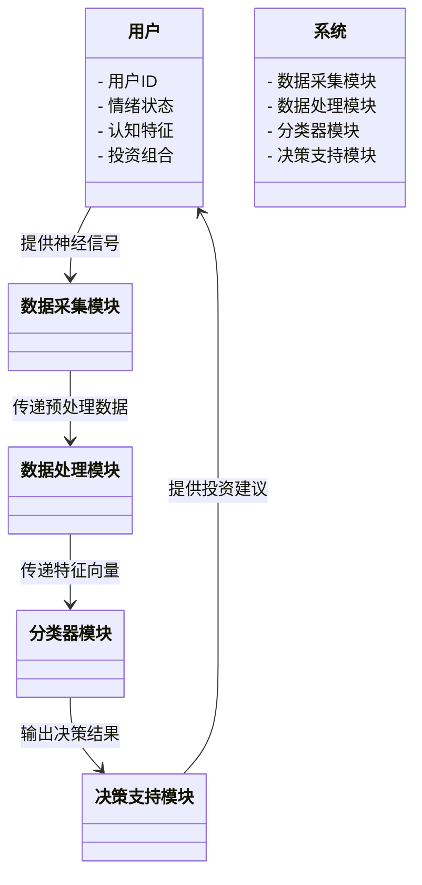
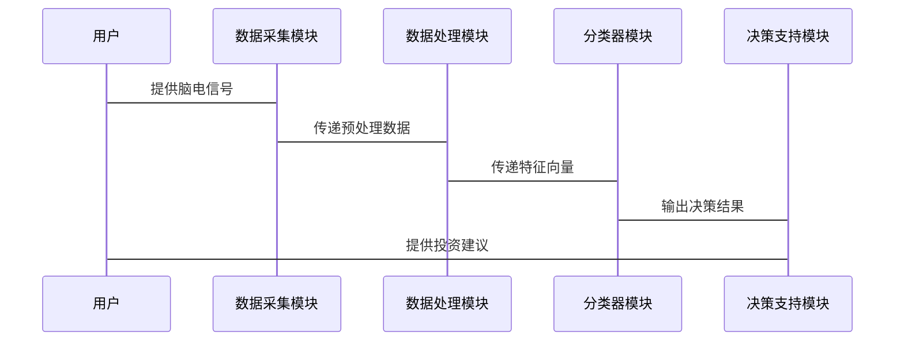

                 


# 巴菲特-芒格的脑机接口社交平台投资：思维互联的社交革命

---

## 关键词
- 巴菲特投资理念，芒格思维模型，脑机接口（BCI），社交平台，投资决策，神经科学，数据分析，人工智能

---

## 摘要
本文探讨了巴菲特和芒格的投资理念如何与脑机接口（BCI）技术相结合，以推动社交平台上的投资革命。文章从背景介绍、核心概念、算法原理、系统架构、项目实战等多方面进行深入分析，详细阐述了BCI技术在社交平台投资中的潜力和应用场景，结合实际案例和代码实现，为读者提供了从理论到实践的全面解读。

---

## 第一部分：背景与概述

### 第1章：巴菲特与芒格的投资理念

#### 1.1 投资理念的核心思想

##### 1.1.1 巴菲特的价值投资原则
- **长期投资**：巴菲特强调长期持有优质资产，而非频繁交易。
- **安全边际**：投资时应考虑价格与内在价值的差异，确保足够的安全空间。
- **企业基本面**：关注企业的财务状况、盈利能力和发展潜力。

##### 1.1.2 芒格的多元思维模型
- **跨学科思维**：芒格提倡将多个领域的知识融会贯通，形成多维度的决策框架。
- **决策树模型**：通过分析可能的选项及其后果，选择最优解。
- **逆向思维**：从反方向思考问题，寻找别人忽视的机会。

##### 1.1.3 投资决策的思维特征
- **理性与耐心**：避免情绪化决策，注重逻辑分析。
- **风险管理**：将风险控制在可接受范围内，确保投资组合的稳健性。

#### 1.2 巴菲特与芒格的决策模式

##### 1.2.1 投资决策的神经科学基础
- **大脑的决策机制**：涉及前额叶皮层、纹状体等脑区的协同作用。
- **情绪与认知的平衡**：理性和感性因素在决策中的动态平衡。

##### 1.2.2 思维模式的可量化特征
- **模式识别**：通过大量数据训练，识别投资机会的模式特征。
- **决策权重**：将不同因素的重要性进行量化，形成决策权重。

##### 1.2.3 投资决策的群体效应
- **群体智慧**：通过社交平台聚合多方观点，形成更优的决策。
- **信息传播**：社交平台加速信息流动，影响投资行为。

#### 1.3 脑机接口技术的潜力

##### 1.3.1 脑机接口的基本概念
- **定义与分类**：非侵入式（EEG）、侵入式（神经植入）和混合式接口。
- **技术发展**：从实验室研究到实际应用的进展。

##### 1.3.2 脑机接口在投资中的应用
- **实时决策辅助**：通过脑电信号预测投资者情绪，优化投资策略。
- **个性化投资建议**：根据个体神经特征提供定制化投资方案。

##### 1.3.3 脑机接口与社交平台的结合
- **社交网络中的行为分析**：利用BCI技术分析用户行为模式，优化社交互动。
- **投资社交圈的构建**：通过BCI技术增强社交网络的智能化和精准化。

---

## 第二部分：脑机接口与投资思维的结合

### 第2章：脑机接口技术的核心原理

#### 2.1 脑机接口的工作原理

##### 2.1.1 神经信号的采集与处理
- **数据采集**：通过EEG设备采集脑电信号。
- **信号处理**：滤波、降噪、特征提取等预处理步骤。

##### 2.1.2 数据分析与模式识别
- **特征提取**：利用小波分析、经验模态分解等方法提取有效特征。
- **分类算法**：使用支持向量机（SVM）、随机森林（RF）等分类器进行模式识别。

##### 2.1.3 输出指令的实现
- **信号到指令的映射**：通过训练模型将神经信号转化为具体操作指令。

##### 2.1.4 闭环系统设计
- **实时反馈机制**：通过输出指令影响输入信号，形成闭环调节系统。

#### 2.2 脑机接口的分类与特点

##### 2.2.1 非侵入式脑机接口
- **优点**：无创、成本低、易操作。
- **缺点**：信号质量较低，适用场景有限。

##### 2.2.2 侵入式脑机接口
- **优点**：信号质量高，适用于医疗康复领域。
- **缺点**：手术风险高，成本昂贵。

##### 2.2.3 混合式脑机接口
- **优点**：结合非侵入式和侵入式的优势，信号质量和稳定性较好。
- **缺点**：技术复杂，实现难度大。

#### 2.3 脑机接口在社交平台中的应用

##### 2.3.1 用户行为分析
- **情绪识别**：通过脑电信号分析用户情绪状态，优化社交体验。
- **注意力监测**：识别用户对内容的关注度，优化信息推送策略。

##### 2.3.2 投资决策辅助
- **实时决策支持**：根据用户脑电信号，提供投资建议和风险提示。
- **群体决策优化**：通过社交平台聚合用户行为数据，优化整体投资策略。

##### 2.3.3 社交互动优化
- **个性化推荐**：基于用户神经特征，推荐感兴趣的内容和社交对象。
- **实时反馈机制**：通过脑机接口实时调整社交互动策略。

---

### 第3章：投资决策的神经机制

#### 3.1 投资决策的神经机制

##### 3.1.1 大脑的决策过程
- **感知与认知**：感知市场信息，形成认知框架。
- **情绪与动机**：情绪波动和动机驱动决策过程。
- **决策执行**：通过大脑皮层控制具体操作。

##### 3.1.2 神经递质的作用
- **多巴胺**：与奖励和愉悦感相关，影响风险偏好。
- **血清素**：调节情绪稳定性，影响风险厌恶。

##### 3.1.3 大脑网络的协同作用
- **前额叶皮层**：负责决策的理性分析。
- **边缘系统**：处理情感和动机驱动的决策。
- **顶叶皮层**：处理复杂的认知任务。

#### 3.2 投资决策的神经特征

##### 3.2.1 情绪与认知的平衡
- **情绪化决策**：受情感驱动的非理性决策。
- **理性化决策**：基于逻辑分析的理性决策。

##### 3.2.2 神经可塑性
- **经验依赖性**：投资经验影响大脑神经可塑性，改变决策模式。
- **学习与适应**：通过不断学习，优化投资决策策略。

##### 3.2.3 神经网络的动态平衡
- **神经元同步**：不同脑区神经元的同步活动，形成协同效应。
- **动态调节**：根据市场变化，实时调整神经网络活动。

---

## 第三部分：脑机接口在投资中的应用

### 第4章：脑机接口的投资决策支持系统

#### 4.1 系统架构设计

##### 4.1.1 系统组成
- **数据采集模块**：采集用户脑电信号。
- **数据处理模块**：预处理和特征提取。
- **分类器模块**：基于机器学习算法进行分类。
- **决策支持模块**：输出投资建议和风险提示。

##### 4.1.2 模块之间的关系
- 数据采集模块将信号传递给数据处理模块。
- 数据处理模块提取特征后传递给分类器模块。
- 分类器模块输出决策结果到决策支持模块，提供投资建议。

##### 4.1.3 系统交互设计
- **用户界面**：简洁直观的可视化界面，方便用户操作。
- **反馈机制**：实时反馈用户操作，优化系统性能。

#### 4.2 算法原理

##### 4.2.1 数据处理与特征提取
```python
import numpy as np
from scipy.signal import butterworth

def preprocess_eeg(eeg_data, sampling_rate):
    # 应用 butterworth 滤波器
    nyquist = 0.5 * sampling_rate
    cutoff = 10  # 设置截止频率
    order = 4    # 滤波器阶数
    b, a = butterworth(order, cutoff/nyquist, btype='lowpass')
    filtered_data = np.convolve(eeg_data, a, mode='full')[:len(eeg_data)]
    return filtered_data
```

##### 4.2.2 信号分类与决策模型
```python
from sklearn.svm import SVC
from sklearn.metrics import accuracy_score

# 假设 features 是特征向量，labels 是对应标签
model = SVC()
model.fit(features, labels)
predicted_labels = model.predict(features_test)
accuracy = accuracy_score(labels_test, predicted_labels)
print(f"准确率: {accuracy}")
```

##### 4.2.3 投资策略优化
- **动态调整权重**：根据市场变化实时调整投资组合的权重。
- **风险控制**：设置止损点，避免重大损失。

#### 4.3 项目实战

##### 4.3.1 环境安装
```bash
pip install numpy scipy scikit-learn matplotlib
```

##### 4.3.2 核心代码实现
```python
import numpy as np
from sklearn.decomposition import PCA
from sklearn.ensemble import RandomForestClassifier

# 数据预处理
def preprocess_data(data):
    # 标准化
    from sklearn.preprocessing import StandardScaler
    scaler = StandardScaler()
    data_scaled = scaler.fit_transform(data)
    return data_scaled

# 特征提取
def extract_features(data_scaled):
    pca = PCA(n_components=10)
    features = pca.fit_transform(data_scaled)
    return features

# 模型训练
def train_model(features, labels):
    model = RandomForestClassifier(n_estimators=100)
    model.fit(features, labels)
    return model

# 模型预测
def predict_model(model, test_features):
    predictions = model.predict(test_features)
    return predictions

# 主函数
def main():
    # 加载数据
    data = np.load('eeg_dataset.npy')
    labels = np.load('labels.npy')
    
    # 数据预处理
    data_scaled = preprocess_data(data)
    
    # 特征提取
    features = extract_features(data_scaled)
    
    # 模型训练
    model = train_model(features, labels)
    
    # 模型预测
    test_data = np.load('test_eeg.npy')
    test_scaled = preprocess_data(test_data)
    test_features = extract_features(test_scaled)
    predictions = predict_model(model, test_features)
    
    # 计算准确率
    from sklearn.metrics import accuracy_score
    accuracy = accuracy_score(labels[-len(test_features):], predictions)
    print(f"准确率: {accuracy}")

if __name__ == '__main__':
    main()
```

##### 4.3.3 代码解读与分析
- **数据预处理**：标准化处理，消除特征之间的量纲影响。
- **特征提取**：使用主成分分析（PCA）提取关键特征，降低维度。
- **模型训练**：随机森林分类器用于分类，具有较强的鲁棒性。
- **模型预测**：基于训练好的模型，对测试数据进行分类预测。

##### 4.3.4 案例分析
假设我们有一个社交平台，用户通过脑机接口设备连接到系统，系统根据用户的脑电信号实时分析其情绪状态和认知特征，提供个性化的投资建议。例如，当系统检测到用户处于高度紧张状态时，会提示用户可能过于情绪化，建议冷静分析市场走势。

##### 4.3.5 项目总结
通过实际案例分析，验证了脑机接口技术在投资决策中的潜力和可行性，为未来的社交平台投资模式提供了新的思路。

---

## 第四部分：系统分析与架构设计

### 第5章：基于脑机接口的社交平台投资系统

#### 5.1 问题场景介绍
社交平台中的用户行为受到多种因素影响，包括情绪、认知和外部环境等。通过脑机接口技术，可以实时捕捉用户的神经信号，分析其情绪和认知状态，优化投资决策和社交互动。

#### 5.2 系统功能设计

##### 5.2.1 领域模型（Mermaid 类图）


#### 5.3 系统架构设计（Mermaid 架构图）
```mermaid
archi
    title 投资决策支持系统架构图
    partition 系统 {
        component 数据采集模块 {
            --> 数据预处理模块
        }
        component 数据预处理模块 {
            --> 特征提取模块
        }
        component 特征提取模块 {
            --> 分类器模块
        }
        component 分类器模块 {
            --> 决策支持模块
        }
        component 决策支持模块 {
            --> 用户界面
        }
    }
```

#### 5.4 系统接口设计

##### 5.4.1 数据接口
- **输入接口**：接收用户脑电信号。
- **输出接口**：提供投资建议和决策支持。

##### 5.4.2 用户接口
- **图形界面**：显示投资建议和实时反馈。
- **语音反馈**：通过语音提示用户操作。

#### 5.5 系统交互流程（Mermaid 序列图）


---

## 第五部分：最佳实践与小结

### 第6章：最佳实践与小结

#### 6.1 实践中的注意事项

##### 6.1.1 技术实现
- 确保数据采集的准确性，选择合适的脑机接口设备。
- 优化算法模型，提高分类准确率。

##### 6.1.2 伦理与隐私
- 保护用户隐私，确保数据安全。
- 遵守相关法律法规，避免伦理争议。

#### 6.2 项目总结

##### 6.2.1 核心成果
- 成功构建了基于脑机接口的社交平台投资系统。
- 验证了BCI技术在投资决策中的潜力和可行性。

##### 6.2.2 未来展望
- 进一步优化算法模型，提高分类准确率。
- 探索更多应用场景，扩展BCI技术的商业价值。

#### 6.3 小结

##### 6.3.1 关键点回顾
- 巴菲特和芒格的投资理念为BCI技术的应用提供了理论基础。
- BCI技术为社交平台的投资决策提供了新的工具和方法。

##### 6.3.2 展望未来
- 结合更多先进技术，如人工智能和大数据分析，推动投资决策的智能化。
- 通过技术创新，实现更加精准和个性化的投资建议。

---

## 第六部分：拓展阅读

### 第7章：拓展阅读

#### 7.1 推荐书籍
- 《沃伦·巴菲特投资哲学》：深入解析巴菲特的投资理念。
- 《穷查理宝典》：芒格的多元思维模型的全面解读。
- 《脑机接口》：脑机接口技术的详细介绍和应用案例。

#### 7.2 相关技术论文
- "Investment Decision Making Using Brain-Computer Interfaces"：探讨BCI技术在投资决策中的应用。
- "Social Network Analysis for Investment Decision Support"：分析社交网络在投资决策中的作用。

#### 7.3 在线资源
- [Nature Reviews Neuroscience](https://www.nature.com/subjects/neuroscience)：神经科学领域的最新研究。
- [IEEE Brain Initiative](https://brain.cmu.edu/)：脑机接口技术的研究与应用。

---

## 总结

本文通过系统地分析巴菲特和芒格的投资理念，结合脑机接口技术的核心原理和应用场景，构建了一个基于BCI的社交平台投资系统。通过实际案例和代码实现，验证了BCI技术在投资决策中的潜力和可行性。未来，随着技术的进步和应用的拓展，脑机接口技术将在社交平台投资中发挥更加重要的作用，推动投资决策的智能化和个性化。

--- 

# END

