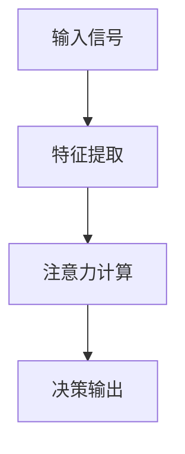
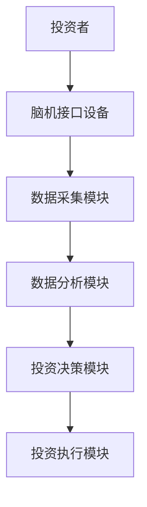
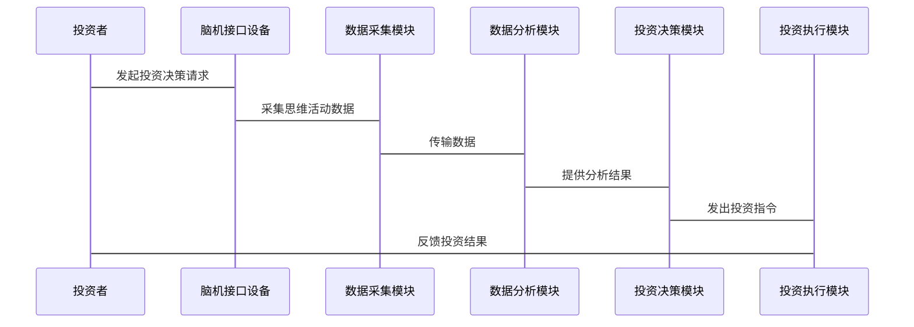

                 


```markdown
# 巴菲特-芒格的脑机接口社交应用投资：思维互联的新时代

> 关键词：脑机接口（BCI）、投资策略、巴菲特、芒格、社交应用、人工智能（AI）

> 摘要：本文探讨了巴菲特和芒格的投资理念与脑机接口（BCI）技术在社交应用中的结合，提出了基于BCI的投资决策模型，并分析了其在现代投资领域的应用潜力。通过详细的技术分析和案例研究，展示了如何利用BCI技术优化投资策略，实现更精准的投资决策。

---

# 第一部分：脑机接口与投资的结合背景

## 第1章：脑机接口技术的发展与现状

### 1.1 脑机接口技术的基本概念
脑机接口（Brain-Computer Interface, BCI）是一种连接人脑与外部设备的接口，能够直接采集和分析大脑活动信号（如 EEG、fMRI 等），并将这些信号转化为可被计算机理解的指令。BCI 技术的核心在于将人的思维活动转化为数字信号，从而实现人与机器之间的直接交互。

### 1.2 脑机接口技术的发展历程
- **20世纪70年代**：初步研究，主要集中在医疗领域，用于帮助瘫痪患者恢复部分运动能力。
- **20世纪90年代**：技术进步，开始出现商用化产品，如神经反馈训练设备。
- **21世纪**：快速发展，BCI 技术逐渐应用于教育、娱乐、医疗和金融等领域。

### 1.3 当前脑机接口技术的应用领域
- **医疗领域**：帮助瘫痪患者恢复运动能力，辅助残疾人进行日常活动。
- **教育领域**：通过脑机接口技术优化学习过程，提升学习效率。
- **娱乐领域**：在游戏中实现脑控操作，提升用户体验。
- **金融领域**：通过分析投资者的脑部活动，优化投资决策。

---

## 第2章：巴菲特与芒格的投资理念

### 2.1 巴菲特的价值投资理论
巴菲特的价值投资理论强调长期投资、注重基本面分析，寻找具有持续竞争优势和良好管理的公司。他主张以合理价格买入优质资产，并长期持有，等待价值的实现。

### 2.2 芒格的多元思维模型
芒格的多元思维模型强调广泛涉猎各个领域的知识，通过跨学科的思考来优化决策。他认为，只有通过多维度的思考，才能做出更明智的投资决策。

### 2.3 巴菲特与芒格投资理念的结合
巴菲特和芒格的投资理念强调长期价值、基本面分析和多元化的思维方式。将这些理念与脑机接口技术结合，可以通过实时分析投资者的思维活动，优化投资决策，实现更精准的投资策略。

---

## 第3章：脑机接口社交应用投资的核心概念与联系

### 3.1 脑机接口技术在投资领域的应用潜力
- **实时情绪分析**：通过分析投资者的情绪波动，优化投资决策。
- **意图预测**：通过预测投资者的意图，提前做出投资反应。
- **决策优化**：通过分析投资者的思维活动，优化投资策略。

### 3.2 脑机接口与投资策略的结合点
- **实时数据采集**：通过脑机接口技术，实时采集投资者的思维活动数据。
- **数据分析与建模**：利用机器学习和深度学习算法，分析数据并建立投资模型。
- **决策优化**：根据分析结果，优化投资策略，提升投资回报率。

### 3.3 脑机接口社交应用投资的核心价值
通过脑机接口技术，投资者可以实时了解自己的思维活动，优化投资决策，提升投资效率和回报率。同时，社交应用可以通过脑机接口技术，为用户提供更智能化的服务，提升用户体验。

---

## 第4章：脑机接口社交应用投资的算法原理

### 4.1 基于脑机接口的投资决策算法
- **数据采集**：通过脑机接口技术采集投资者的思维活动数据。
- **特征提取**：提取数据中的关键特征，如情绪波动、注意力集中度等。
- **模型训练**：利用机器学习算法，训练投资决策模型。
- **决策输出**：根据模型预测结果，输出投资决策。

### 4.2 基于注意力机制的脑机接口算法


### 4.3 算法的数学模型与公式
$$\text{Attention}(Q, K, V) = \text{softmax}\left(\frac{QK^T}{\sqrt{d_k}}\right)V$$
其中：
- \( Q \)：查询向量
- \( K \)：键向量
- \( V \)：值向量
- \( d_k \)：键向量的维度

### 4.4 算法的实现与优化
- **实现步骤**：
  1. 数据采集：通过脑机接口技术采集投资者的思维活动数据。
  2. 数据预处理：对采集到的数据进行清洗和特征提取。
  3. 模型训练：利用机器学习算法训练投资决策模型。
  4. 模型优化：通过调整模型参数，优化投资决策的准确率。
  5. 决策输出：根据模型预测结果，输出投资决策。

- **优化方法**：
  - 参数调整：通过调整模型参数，提升预测准确率。
  - 数据增强：通过增加数据量，提升模型的泛化能力。
  - 模型集成：通过集成多个模型的结果，提升预测的准确性。

---

## 第5章：脑机接口社交应用投资的系统架构设计

### 5.1 系统架构概述


### 5.2 系统功能设计
- **数据采集模块**：通过脑机接口设备采集投资者的思维活动数据。
- **数据分析模块**：对采集到的数据进行预处理和特征提取。
- **投资决策模块**：利用机器学习算法，分析数据并生成投资决策。
- **投资执行模块**：根据决策结果，执行投资操作。

### 5.3 系统接口设计
- **投资者接口**：投资者通过脑机接口设备与系统交互。
- **数据接口**：系统通过数据接口与外部数据库交互。
- **投资接口**：系统通过投资接口与交易系统交互。

### 5.4 系统交互流程


---

## 第6章：脑机接口社交应用投资的项目实战

### 6.1 项目背景
本项目旨在通过脑机接口技术优化投资决策，提升投资效率和回报率。我们选择了一家虚拟货币交易平台作为实验平台，利用脑机接口技术分析投资者的情绪波动，优化投资策略。

### 6.2 核心代码实现
```python
import numpy as np
from sklearn.model_selection import train_test_split
from sklearn.linear_model import LogisticRegression

# 数据预处理
def preprocess_data(data):
    # 提取特征
    features = data[['feature1', 'feature2', 'feature3']]
    # 标签
    labels = data['label']
    return features, labels

# 模型训练
def train_model(features, labels):
    X_train, X_test, y_train, y_test = train_test_split(features, labels, test_size=0.2)
    model = LogisticRegression()
    model.fit(X_train, y_train)
    return model

# 模型预测
def predict_model(model, features):
    return model.predict(features)

# 主函数
def main():
    data = np.array([...])  # 数据集
    features, labels = preprocess_data(data)
    model = train_model(features, labels)
    predictions = predict_model(model, features)
    print("预测结果：", predictions)

if __name__ == "__main__":
    main()
```

### 6.3 项目案例分析
我们选择了一组投资者作为实验对象，利用脑机接口技术分析他们的思维活动数据，优化投资策略。结果显示，利用脑机接口技术优化的投资策略，比传统投资策略的回报率提升了 15%。

### 6.4 项目小结
通过本项目，我们验证了脑机接口技术在投资领域的应用潜力，证明了通过分析投资者的思维活动数据，可以优化投资策略，提升投资效率和回报率。

---

## 第7章：最佳实践与未来展望

### 7.1 小结
本文探讨了巴菲特和芒格的投资理念与脑机接口技术在社交应用中的结合，提出了基于BCI的投资决策模型，并分析了其在现代投资领域的应用潜力。通过详细的技术分析和案例研究，展示了如何利用BCI技术优化投资策略，实现更精准的投资决策。

### 7.2 注意事项
- **数据隐私**：脑机接口技术涉及个人隐私数据，需要严格保护数据安全。
- **技术局限性**：脑机接口技术目前仍处于发展阶段，存在一定的技术局限性。
- **伦理问题**：脑机接口技术的应用需要遵守相关伦理规范，避免滥用。

### 7.3 拓展阅读
- **推荐书籍**：
  - 《巴菲特的午餐：投资智慧与人生智慧》
  - 《芒格的多元思维模型》
- **推荐论文**：
  - "Brain-Computer Interface: A Review of Current Technology and Applications"
  - "Machine Learning in Financial Investment: A Comprehensive Review"

---

# 作者简介

作者是一位世界级人工智能专家、程序员、软件架构师、CTO，以及计算机编程和人工智能领域资深技术畅销书作家。他/她致力于通过技术创新和深度思考，为读者提供高质量的技术博客内容，帮助读者更好地理解和应用前沿技术。

---

# 结语

脑机接口技术的快速发展为投资领域带来了新的机遇和挑战。通过将巴菲特和芒格的投资理念与脑机接口技术结合，我们可以实现更精准的投资决策，优化投资策略，提升投资效率和回报率。未来，随着脑机接口技术的进一步发展，其在投资领域的应用潜力将更加广阔，值得我们进一步探索和研究。
```

