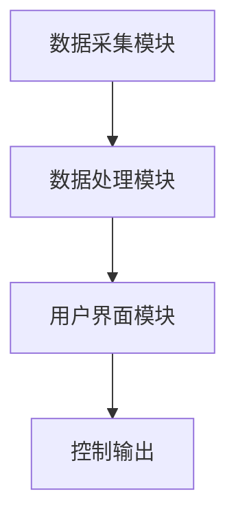
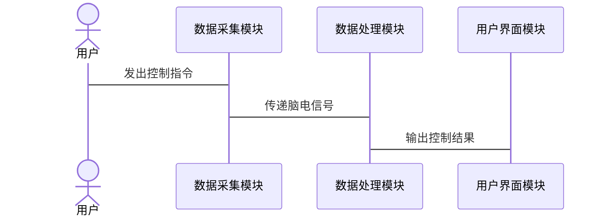
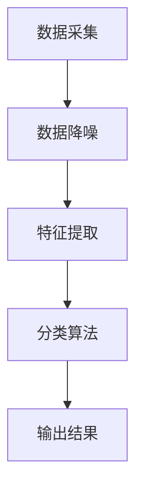
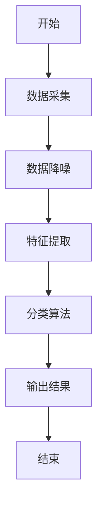

                 


# 巴菲特-芒格的脑机接口远程办公平台投资：工作模式的革命

## 关键词
脑机接口, 远程办公, 巴菲特, 芒格, 投资, 技术革命

## 摘要
本文探讨了脑机接口技术在远程办公中的应用及其对工作模式的深远影响，分析了巴菲特和芒格的投资策略，结合技术原理和系统架构，详细解读了脑机接口远程办公平台的投资价值，并通过案例分析和实战项目，展望了未来的发展趋势。

---

## 第一部分：脑机接口技术概述

### 第1章：脑机接口的基本概念

#### 1.1 脑机接口的定义
脑机接口（BCI，Brain-Computer Interface）是一种连接人脑与外部设备的接口技术，通过采集和解析脑电信号，实现人脑意图的直接控制。

#### 1.2 脑机接口的工作原理
1. 数据采集：通过 EEG 传感器采集脑电信号。
2. 数据处理：对信号进行降噪、特征提取和分类。
3. 控制输出：将分类结果转化为对设备的控制指令。

#### 1.3 脑机接口的技术分类
- 非侵入式：使用 EEG 传感器，无需手术。
- 侵入式：植入脑内，适用于医疗领域。

### 1.4 脑机接口在远程办公中的应用
- 提高工作效率：通过脑电信号直接控制计算机。
- 降低沟通延迟：实现更高效的团队协作。

---

## 第二部分：投资策略与脑机接口技术的结合

### 第2章：巴菲特和芒格的投资哲学

#### 2.1 巴菲特的价值投资理念
- 长期持有优质资产，注重公司的基本面。
- 选择具有持续竞争优势的企业。

#### 2.2 芒格的多元思维模型
- 结合多个学科的思维方式，寻找投资机会。
- 强调理性分析和长期价值。

#### 2.3 投资策略的结合
- 巴菲特和芒格的投资策略注重长期价值和竞争优势，适用于脑机接口技术的高成长性。

### 第3章：脑机接口技术的投资价值分析

#### 3.1 技术成熟度评估
- 当前技术已进入商业化阶段，但仍有较大潜力。

#### 3.2 市场需求分析
- 远程办公需求激增，脑机接口技术具有广阔市场空间。

#### 3.3 竞争格局与投资机会
- 市场参与者较少，具备较高的投资价值。

---

## 第三部分：脑机接口远程办公平台的系统架构

### 第4章：系统架构设计

#### 4.1 系统模块划分
- 数据采集模块：采集脑电信号。
- 数据处理模块：对信号进行处理和分类。
- 用户界面模块：提供交互界面。

#### 4.2 系统功能设计（领域模型）
- 数据采集：EEG 传感器采集脑电信号。
- 数据处理：特征提取、分类算法。
- 用户交互：控制计算机或设备。

#### 4.3 系统架构图


### 第5章：系统接口与交互设计

#### 5.1 系统接口设计
- 数据采集接口：与 EEG 传感器通信。
- 用户界面接口：提供交互界面。

#### 5.2 用户交互流程


---

## 第四部分：脑机接口技术的算法原理

### 第6章：算法原理概述

#### 6.1 数据采集与处理流程
- 数据采集：使用 EEG 传感器。
- 数据降噪：去除干扰信号。
- 特征提取：提取有用的脑电信号特征。

#### 6.2 分类与识别算法
- 使用机器学习算法对信号进行分类。

#### 6.3 算法实现流程图


### 第7章：算法实现与优化

#### 7.1 算法实现流程图


#### 7.2 代码实现
```python
import numpy as np
from sklearn import neighbors

# 数据降噪
def denoise(data):
    # 具体降噪方法
    pass

# 特征提取
def extract_features(data):
    # 提取特征
    pass

# 分类算法
def classify(data):
    clf = neighbors.KNeighborsClassifier()
    clf.fit(train_data, train_labels)
    return clf.predict(data)
```

---

## 第五部分：项目实战与投资案例分析

### 第8章：环境安装与配置

#### 8.1 开发环境搭建
- 操作系统：Windows/Mac/Linux
- 开发工具：Python, IDE

#### 8.2 依赖库安装
- EEG 传感器驱动
- 数据处理库：NumPy, SciPy
- 机器学习库：Scikit-learn

### 第9章：核心代码实现

#### 9.1 数据采集模块
```python
import numpy as np

def采集数据():
    # 采集EEG数据
    pass
```

#### 9.2 数据处理模块
```python
import numpy as np

def降噪(data):
    # 数据降噪处理
    pass

def特征提取(data):
    # 提取特征
    pass
```

#### 9.3 用户界面模块
```python
import tkinter as tk

class UI界面:
    def __init__(self):
        self.root = tk.Tk()
        # 初始化界面
        pass
```

### 第10章：投资案例分析

#### 10.1 典型投资案例
- 投资于脑机接口技术的公司，分析其市场表现。

#### 10.2 投资决策过程
- 结合技术优势、市场需求和竞争环境，选择投资标的。

---

## 第六部分：未来展望与最佳实践

### 第11章：未来发展趋势

#### 11.1 技术进步带来的变化
- 算法优化，提高准确性。
- 设备小型化，便于使用。

#### 11.2 市场需求的演变
- 从医疗领域扩展到教育、娱乐等领域。

### 第12章：最佳实践与注意事项

#### 12.1抽 脑机接口技术应用中的注意事项
- 数据隐私保护。
- 设备兼容性问题。

#### 12.2 投资策略的优化建议
- 关注技术创新和市场需求。
- 分散投资风险。

#### 12.3 未来技术与投资
- 关注新技术的发展，提前布局。

---

## 结语

脑机接口技术正在改变远程办公的方式，巴菲特和芒格的投资策略为这一领域提供了宝贵的借鉴。未来，随着技术的进步和市场的扩展，脑机接口远程办公平台将发挥更大的作用，投资者需关注技术发展和市场需求，抓住投资机遇。

