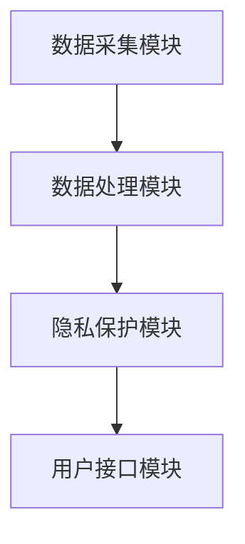

                 


### 第四部分：数字人权与脑机接口投资

#### 第4章 数字人权的定义与重要性

##### 4.1 数字人权的基本概念
- **4.1.1 数字人权的定义**  
  数字人权是指在数字技术广泛应用的情况下，个人在数字空间中享有的权利和自由。这些权利包括隐私权、数据主权、信息自由等，确保个人在数字时代不受不公正的待遇或侵犯。

- **4.1.2 数字人权的背景与演变**  
  随着互联网和信息技术的快速发展，数字人权的概念逐渐从传统的隐私权扩展到数据主权、算法公正性等领域。脑机接口技术的出现，进一步挑战了数字人权的边界。

- **4.1.3 数字人权的核心要素**  
  包括隐私权、数据主权、知情权、同意权、反歧视权等。这些要素在脑机接口技术的应用中显得尤为重要，因为脑机接口直接涉及个人的生物数据和神经信息。

##### 4.2 脑机接口对数字人权的影响

- **4.2.1 脑机接口技术的双刃剑效应**  
  脑机接口技术在医疗、教育、娱乐等领域具有巨大潜力，但同时也可能引发隐私泄露、数据滥用、算法偏见等问题。

- **4.2.2 隐私权的挑战**  
  脑机接口采集的是用户的神经数据，这些数据的敏感性和独特性使得隐私保护变得尤为重要。如果这些数据被不当使用，可能导致用户的身份盗窃、信息操控等问题。

- **4.2.3 数据主权的挑战**  
  脑机接口数据的跨境流动可能引发数据主权问题。如何在跨国投资中确保数据主权，是一个复杂的问题，涉及到国际法律和政策。

##### 4.3 芒格的长期价值投资视角下的数字人权

- **4.3.1 长期投资与数字人权的关联**  
  芒格强调投资的长期价值，认为企业应关注社会的整体利益。在脑机接口投资中，芒格可能会关注那些在技术开发过程中注重隐私保护和数字人权的企业。

- **4.3.2 股东权益与数字人权**  
  股东权益不仅包括经济利益，还包括企业对社会的责任。在数字时代，企业如果忽视数字人权，可能会面临社会责任的压力，进而影响企业的长期价值。

#### 第5章 脑机接口隐私保护的算法与系统设计

##### 5.1 隐私保护的算法实现

- **5.1.1 数据加密算法**  
  使用加密算法对脑机接口采集的数据进行加密，确保数据在传输和存储过程中的安全性。例如，使用AES（高级加密标准）对数据进行加密。

- **5.1.2 数据匿名化处理**  
  通过数据匿名化技术，如随机化处理、数据混淆等，确保数据无法被逆向追踪到个人。

- **5.1.3 同态加密技术**  
  同态加密允许在加密数据上进行计算，结果仍保持加密状态，这样可以在不暴露原始数据的情况下进行数据分析。

##### 5.2 脑机接口系统架构设计

- **5.2.1 系统功能模块**  
  包括数据采集模块、数据处理模块、隐私保护模块、用户接口模块等。

- **5.2.2 系统架构图**  
  使用Mermaid绘制系统架构图，展示各模块之间的关系和数据流。



- **5.2.3 接口设计**  
  定义系统各个模块之间的接口，例如数据采集模块向数据处理模块提供原始数据，数据处理模块向隐私保护模块提供加密数据，隐私保护模块向用户接口模块提供脱敏后的数据。

#### 第6章 项目实战：脑机接口隐私保护系统开发

##### 6.1 环境安装与配置

- **6.1.1 系统需求**  
  需要安装Python、相关库（如NumPy、Scikit-learn、PyTorch等）以及脑机接口开发工具包。

- **6.1.2 安装步骤**  
  ```bash
  pip install numpy scikit-learn pytorch
  ```

##### 6.2 核心代码实现

- **数据加密模块**  
  ```python
  import numpy as np
  from cryptography.hazmat.primitives import hashes
  from cryptography.hazmat.backends import default_backend

  def encrypt_data(data):
      backend = default_backend()
      hash_algorithm = hashes.SHA256()
      digest = hashes.Hash(hash_algorithm, backend=backend).update(data).finalize()
      return digest
  ```

- **数据匿名化处理模块**  
  ```python
  def anonymize_data(data):
      # 使用随机化处理
      randomized_data = np.random.normal(data.mean(), 0.1, data.shape)
      return randomized_data
  ```

- **同态加密模块**  
  ```python
  import numpy as np
  from cryptography.fermat import integers

  def homomorphic_encrypt(data):
      key = integers.modular.Modular.add(1000, 500)  # 示例加密密钥
      encrypted_data = [(x + key) % 1000 for x in data]
      return encrypted_data
  ```

##### 6.3 案例分析

- **场景描述**  
  某脑机接口公司开发了一款可穿戴设备，用于监测用户的脑电波信号。为了保护用户隐私，公司决定在设备中集成数据加密和匿名化处理功能。

- **实施步骤**  
  1. 数据采集模块采集用户的脑电波信号。  
  2. 数据处理模块对信号进行初步处理，提取有用的特征。  
  3. 隐私保护模块对特征数据进行加密和匿名化处理。  
  4. 处理后的数据通过用户接口模块传输到云端存储或进行进一步分析。

##### 6.4 项目总结

- **经验总结**  
  通过本项目的实施，我们验证了脑机接口隐私保护技术的可行性和有效性。数据加密和匿名化处理能够有效保护用户的隐私，同时不影响数据的可用性。

- **改进建议**  
  未来可以在算法优化、数据处理效率提升等方面进一步改进，同时探索更多隐私保护技术，如联邦学习等。

#### 第7章 数字人权视角下的投资策略与未来展望

##### 7.1 投资策略

- **长期价值投资**  
  巴菲特和芒格的投资策略强调长期价值，这在脑机接口领域尤为重要。投资者应关注那些在技术开发过程中注重隐私保护和数字人权的企业。

- **风险管理**  
  在投资过程中，风险控制是关键。投资者需要评估脑机接口技术带来的潜在隐私风险，并选择那些在隐私保护方面表现良好的企业。

- **社会责任投资（SRI）**  
  社会责任投资不仅关注企业的经济效益，还关注其社会责任。在数字时代，企业是否重视数字人权已成为社会责任投资的重要考量因素。

##### 7.2 未来展望

- **技术发展**  
  随着脑机接口技术的不断发展，隐私保护和数字人权的挑战也将随之变化。未来可能会出现更先进的隐私保护技术，如完全同态加密、零知识证明等。

- **政策法规**  
  随着技术的发展，相关的政策法规也需要不断完善。未来可能会有更多关于脑机接口隐私保护的法律法规出台，以应对技术带来的挑战。

- **国际合作**  
  数字人权是全球性的问题，需要国际社会的共同努力。未来可能会有更多的国际合作，共同制定脑机接口领域的隐私保护标准和规范。

### 附录

#### 附录A：相关技术术语表

- **脑机接口（BCI）**：通过技术手段直接连接大脑与计算机或其他设备，实现信息的传递和控制。
- **数据加密**：通过对数据进行编码，使其在未经授权的情况下无法被读取或理解。
- **隐私保护**：保护个人隐私，防止未经授权的访问和数据滥用。
- **数字人权**：在数字技术环境下，个人享有的权利和自由，包括隐私权、数据主权等。

#### 附录B：参考文献

-巴菲特的著作和演讲  
-芒格的著作和演讲  
-脑机接口相关的学术论文和研究报告  
-数字人权相关的法律和政策文件  

### 总结

脑机接口技术的快速发展带来了巨大的机遇，同时也带来了隐私保护和数字人权的挑战。巴菲特和芒格的投资哲学为我们提供了一个长期价值投资的视角，帮助我们在技术发展中找到那些既能创造经济价值，又能保护隐私和数字人权的企业。未来，随着技术的进一步发展和政策法规的完善，脑机接口隐私保护和数字人权的保护将变得更加重要，这也将成为科技投资中的核心考量因素。

