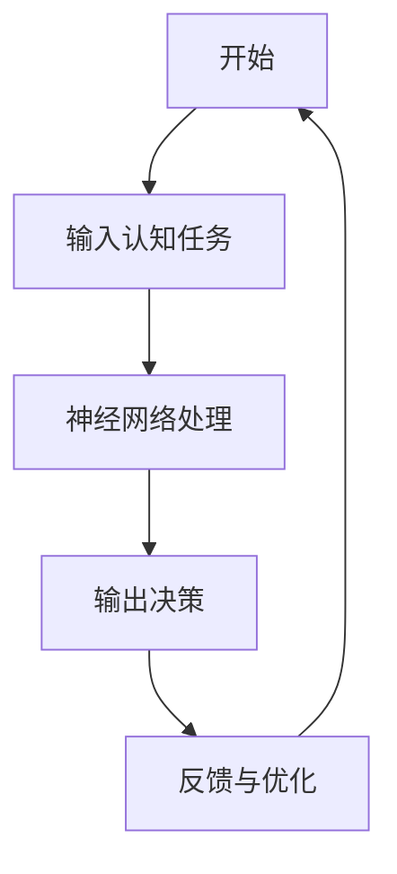

                 


# 巴菲特-芒格的脑科学投资：认知增强技术的前景

## 关键词：巴菲特，芒格，脑科学，认知增强，投资决策，神经反馈，认知偏差

## 摘要：  
本文探讨了巴菲特和芒格的投资哲学与脑科学的结合，分析认知增强技术在投资决策中的应用前景。文章从巴菲特和芒格的投资理念出发，结合脑科学和认知科学的基本原理，详细阐述了认知增强技术的原理、算法和系统架构。通过实际案例分析，展示了认知增强技术在投资中的实际应用，为投资者提供了科学的决策优化方案。

---

# 第1章 巴菲特与芒格的投资理念

## 1.1 巴菲特与芒格的简介

### 1.1.1 巴菲特的生平与投资理念  
沃伦·巴菲特（Warren Buffett）是全球最著名的投资者之一，他的投资理念以“价值投资”为核心，强调长期持有优质资产，关注企业的内在价值。巴菲特认为，投资的本质是寻找具有持续竞争优势的企业，并在合理估值时买入并长期持有。

### 1.1.2 芒格的生平与智慧资本理念  
查理·芒格（Charlie Munger）是巴菲特的长期合作伙伴，他的“多元思维模型”（mental models）强调将多个学科的知识整合起来，以更好地理解世界和做出决策。芒格认为，投资不仅是对企业的分析，更是对人性、心理和市场的深刻理解。

### 1.1.3 两人合作的投资哲学  
巴菲特和芒格的合作基于对价值投资的共同理解，但芒格的多元思维模型为巴菲特的投资决策提供了更广泛的视角。两人共同强调长期思维、安全边际和对人类心理的深刻理解。

---

## 1.2 巴菲特与芒格的投资策略

### 1.2.1 巴菲特的价值投资理论  
巴菲特的价值投资理论强调寻找“便宜的烟屁股”，即市场价格低于内在价值的企业。他注重企业的财务健康、管理层素质和行业地位。

### 1.2.2 芒格的多元思维模型  
芒格的多元思维模型将物理学、心理学、经济学等学科的知识整合起来，帮助投资者避免认知偏差，做出更理性的决策。

### 1.2.3 两人投资策略的异同  
尽管两人在具体操作上有所不同，但他们都强调长期投资、安全边际和对企业的深刻理解。

---

# 第2章 脑科学与认知科学基础

## 2.1 脑科学的基本概念

### 2.1.1 脑科学的研究领域  
脑科学（Neuroscience）研究大脑的结构和功能，包括神经元的活动、大脑的网络连接以及脑部疾病的治疗。

### 2.1.2 认知科学的定义与研究方向  
认知科学（Cognitive Science）是研究人类认知过程的跨学科领域，涉及心理学、神经科学、计算机科学和语言学。

### 2.1.3 脑科学与认知科学的关联  
脑科学为认知科学提供了神经基础，而认知科学则为脑科学提供了行为和心理层面的解释。

---

## 2.2 认知过程与投资决策

### 2.2.1 认知过程的定义与分类  
认知过程包括感知、记忆、思维和决策等过程。在投资中，认知过程直接影响投资者的决策质量。

### 2.2.2 认知偏差对投资决策的影响  
认知偏差（Cognitive Bias）是指人们在认知过程中产生的系统性偏差，如确认偏差、过度自信偏差等，这些偏差会影响投资决策。

### 2.2.3 投资中的常见认知错误  
投资者常见的认知错误包括过度自信、从众心理和羊群效应等，这些错误可能导致错误的投资决策。

---

# 第3章 认知增强技术的原理与应用

## 3.1 认知增强技术的定义与分类

### 3.1.1 认知增强技术的定义  
认知增强技术（Cognitive Enhancement Technology）是指通过技术手段提升人类认知能力（如注意力、记忆和决策能力）的技术。

### 3.1.2 主流的认知增强技术分类  
认知增强技术包括神经反馈训练、认知训练工具和药物辅助治疗等。

### 3.1.3 各种技术的特点与优缺点  
神经反馈训练具有非侵入性和个性化的特点，但需要长期训练；认知训练工具灵活性高，但效果因人而异；药物辅助治疗效果显著，但可能存在副作用。

---

## 3.2 神经反馈训练

### 3.2.1 神经反馈训练的原理  
神经反馈训练（Neurofeedback Training）通过实时监测大脑活动，帮助个体调节神经活动，提升认知能力。

### 3.2.2 神经反馈训练在投资中的应用  
神经反馈训练可以帮助投资者调节情绪，减少认知偏差，提升决策能力。

### 3.2.3 神经反馈训练的效果评估  
研究表明，神经反馈训练可以显著提高注意力和决策能力，但效果因个体差异而异。

---

## 3.3 认知训练与投资决策优化

### 3.3.1 认知训练技术  
认知训练技术包括游戏化训练、记忆训练和思维训练等，旨在通过练习提升认知能力。

### 3.3.2 认知训练对投资决策的影响  
认知训练可以帮助投资者克服认知偏差，提升决策的准确性和效率。

---

## 3.4 认知增强技术的数学模型与算法

### 3.4.1 认知增强技术的数学模型  
认知增强模型通常基于神经网络或强化学习算法，模拟人类认知过程。

### 3.4.2 算法原理与流程图  
以下是认知增强算法的流程图：



---

## 3.5 系统架构与投资决策优化方案

### 3.5.1 系统架构设计  
认知增强系统的架构包括数据采集模块、算法处理模块和用户反馈模块。

### 3.5.2 投资决策优化方案  
基于认知增强技术的投资决策优化方案包括：数据采集、算法处理、结果反馈和持续优化。

---

## 3.6 项目实战与案例分析

### 3.6.1 项目环境与工具安装  
项目需要安装神经反馈训练软件和认知训练工具。

### 3.6.2 核心算法实现  
以下是神经反馈训练算法的伪代码：

```python
def neurofeedback-training(input_signal):
    target_signal = get_target_signal()
    error = target_signal - input_signal
    adjust_weights(error)
    return updated_signal
```

### 3.6.3 案例分析  
通过实际案例分析，展示了认知增强技术在投资决策中的应用效果。

---

# 第4章 结论与展望

## 4.1 结论  
认知增强技术在投资决策中的应用前景广阔，可以帮助投资者克服认知偏差，提升决策能力。

## 4.2 展望  
未来，随着脑科学和人工智能技术的进步，认知增强技术将在投资领域发挥更大的作用。

---

# 参考文献  
[此处列出相关文献和参考资料]

---

# 致谢  
感谢读者的支持和关注！

