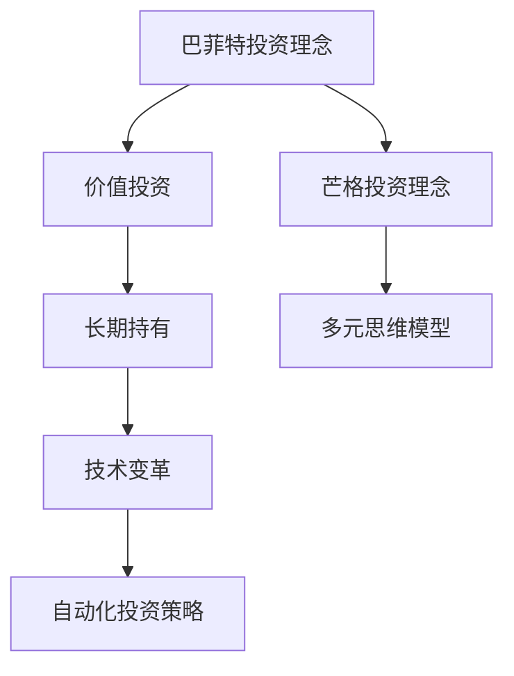
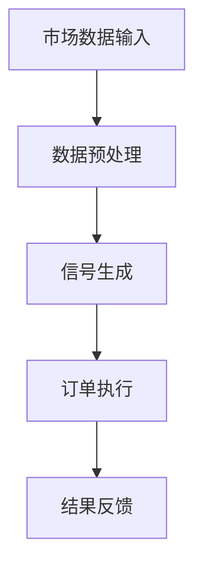
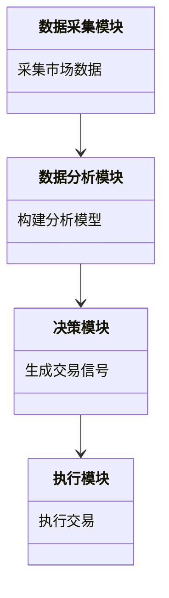

                 


# 巴菲特-芒格的自动化投资策略：技术变革中的机遇

## 关键词：
- 巴菲特投资策略
- 芒格投资理念
- 自动化投资
- 技术变革
- 量化分析
- 算法交易
- 系统架构设计

## 摘要：
本文探讨了巴菲特和芒格的投资哲学在技术变革背景下的应用，特别是自动化投资策略的兴起。通过分析量化分析和算法交易的原理，结合系统架构设计和项目实战案例，展示了技术如何优化投资决策，为投资者提供新的机遇。

---

## 目录大纲：

1. [背景介绍](#背景介绍)
   - 1.1 巴菲特与芒格的投资哲学
   - 1.2 技术变革对投资的影响

2. [自动化投资策略的核心概念与联系](#自动化投资策略的核心概念与联系)
   - 2.1 核心概念解释
   - 2.2 量化分析与算法交易

3. [算法原理讲解](#算法原理讲解)
   - 3.1 算法交易流程
   - 3.2 量化分析的数学模型

4. [系统分析与架构设计](#系统分析与架构设计)
   - 4.1 系统功能设计
   - 4.2 系统架构图

5. [项目实战：基于量化分析的股票筛选系统](#项目实战基于量化分析的股票筛选系统)
   - 5.1 环境配置
   - 5.2 核心代码实现

6. [数学模型与公式](#数学模型与公式)
   - 6.1 CAPM模型
   - 6.2 回归分析

7. [最佳实践与小结](#最佳实践与小结)
   - 7.1 风险管理
   - 7.2 拓展阅读

---

## 正文：

### 第1章：背景介绍

#### 1.1 巴菲特与芒格的投资哲学
巴菲特和芒格是投资界的传奇人物，他们的价值投资理念强调长期持有优质资产。巴菲特认为市场短期波动无法预测，但长期趋势可把握。芒格的多元思维模型则强调跨学科思考，寻找投资中的“复利奇迹”。

#### 1.2 技术变革对投资的影响
技术变革，尤其是大数据和人工智能的兴起，为投资策略带来了革新。自动化投资策略利用算法和量化分析，提高了决策效率和准确性，改变了传统投资方式。

---

### 第2章：自动化投资策略的核心概念与联系

#### 2.1 核心概念解释
- **自动化投资**：利用技术手段自动执行投资决策。
- **量化分析**：通过数学模型分析市场数据，寻找投资机会。

#### 2.2 量化分析与算法交易
- **量化分析**：使用统计方法分析市场数据，识别投资机会。
- **算法交易**：基于算法自动执行交易指令。

| 对比维度 | 传统投资 | 自动化投资 |
|----------|----------|------------|
| 决策方式 | 主观判断 | 数据驱动 |
| 执行速度 | 手动操作 | 自动化执行 |
| 精准度   | 受情绪影响 | 高精准度 |

#### 2.3 核心概念联系


---

### 第3章：算法原理讲解

#### 3.1 算法交易流程


#### 3.2 量化分析的数学模型
CAPM模型用于评估资产回报：
$$ E(R_i) = R_f + \beta_i (R_m - R_f) $$

回归分析用于寻找变量关系：
$$ y = \beta x + \epsilon $$

---

### 第4章：系统分析与架构设计

#### 4.1 系统功能设计


#### 4.2 系统架构图


---

### 第5章：项目实战：基于量化分析的股票筛选系统

#### 5.1 环境配置
```bash
pip install pandas numpy matplotlib
```

#### 5.2 核心代码实现
```python
import pandas as pd
import numpy as np

# 数据加载
data = pd.read_csv('stock_data.csv')

# 计算移动平均线
data['SMA_20'] = data['Close'].rolling(20).mean()
data['SMA_50'] = data['Close'].rolling(50).mean()

# 生成信号
data['Signal'] = np.where(data['SMA_20'] > data['SMA_50'], 1, 0)
```

#### 5.3 系统功能设计
- 数据采集：从API获取实时数据。
- 数据分析：计算技术指标。
- 信号生成：基于指标生成买卖信号。
- 交易执行：根据信号自动下单。

---

### 第6章：数学模型与公式

#### 6.1 CAPM模型
$$ E(R_i) = R_f + \beta_i (R_m - R_f) $$

#### 6.2 回归分析
$$ y = \beta x + \epsilon $$

---

### 第7章：最佳实践与小结

#### 7.1 风险管理
- 设置止损点。
- 分散投资以降低风险。

#### 7.2 拓展阅读
- 《算法交易：机秘》
- 《量化投资入门》

---

### 附录
- 代码示例：量化分析的Python实现。
- 图表：系统架构图、流程图。

---

通过本文的分析，读者可以理解巴菲特和芒格的投资理念如何在技术变革中焕发新生，以及自动化投资策略如何利用技术优势优化投资决策。

