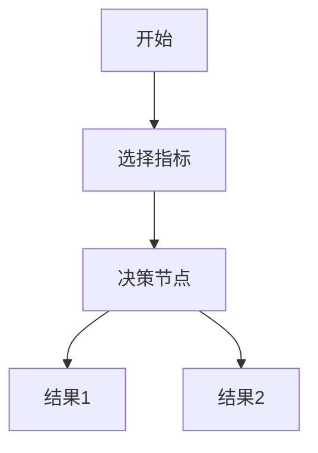
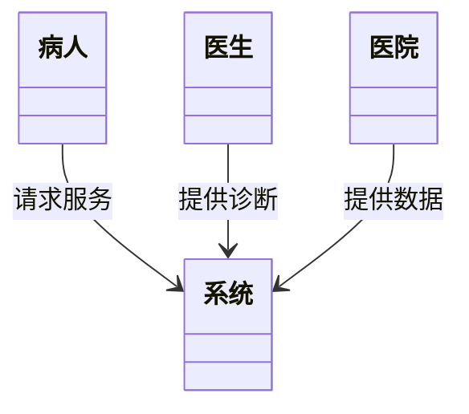

                 


# 巴菲特-芒格的远程医疗投资：医疗服务的未来模式

> 关键词：巴菲特、芒格、远程医疗、投资策略、医疗科技、人工智能

> 摘要：本文探讨了巴菲特和芒格在远程医疗领域的投资策略，分析了远程医疗的技术基础、市场机会以及投资逻辑。通过结合技术驱动和价值投资的理念，阐述了远程医疗作为未来医疗服务模式的核心趋势，并提供了实际案例和投资模型以供参考。

---

## 第1章: 引言

远程医疗作为医疗科技的重要组成部分，正在改变传统的医疗服务模式。巴菲特和芒格的投资策略以其独特的眼光和长期价值的理念著称，本文将结合他们的投资哲学，分析远程医疗的投资机会与挑战。

---

## 第2章: 远程医疗的背景与现状

### 2.1 背景介绍

远程医疗是指通过互联网技术实现患者与医生之间的远程诊断和治疗。随着5G、人工智能和区块链等技术的发展，远程医疗逐渐成为医疗行业的重要趋势。

#### 2.1.1 核心概念术语说明

- **远程医疗（Telemedicine）**：通过电子通信技术和计算机技术实现的远程医疗服务。
- **5G技术**：提供高速、低延迟的网络支持，是远程医疗技术发展的关键。
- **人工智能（AI）**：在疾病诊断、药物研发等方面发挥重要作用。
- **区块链技术**：用于医疗数据的安全存储与共享。

#### 2.1.2 问题背景

传统医疗行业存在资源分配不均、看病难、看病贵的问题。远程医疗通过技术手段解决了这些问题，提高了医疗服务的效率和可及性。

#### 2.1.3 问题解决

远程医疗通过技术手段实现了医疗资源的优化配置，降低了患者的医疗成本，提高了医疗效率。

#### 2.1.4 边界与外延

远程医疗不仅包括远程诊断，还涉及远程手术、医疗数据共享等多个方面。

#### 2.1.5 核心要素组成

- 患者：医疗服务的主体。
- 医生：提供医疗服务的主体。
- 技术：包括5G、AI、区块链等。

---

## 第3章: 技术驱动的远程医疗

### 3.1 核心概念与联系

#### 3.1.1 核心概念原理

远程医疗的核心是通过技术手段实现医疗服务的数字化和智能化。

#### 3.1.2 概念属性特征对比表格

| 技术 | 特性 | 描述 |
|------|------|------|
| 5G   | 高速 | 提供快速数据传输 |
| AI    | 智能 | 用于疾病诊断和预测 |
| 区块链 | 安全 | 保障医疗数据的安全性 |

#### 3.1.3 ER实体关系图

```mermaid
er
  %% 远程医疗的实体关系图
  病人 --> 患病记录
  医生 --> 诊断结果
  医院 --> 医疗服务
```

---

## 第4章: 巴菲特与芒格的投资逻辑

### 4.1 巴菲特的价值投资理念

#### 4.1.1 长期结构性变化的把握

巴菲特注重投资那些能够长期受益于行业趋势的公司。

#### 4.1.2 安全边际与风险控制

巴菲特别强调投资的安全边际，避免高风险投资。

### 4.2 芒格的多元思维模型

#### 4.2.1 逆向思维与跨学科思考

芒格通过跨学科的视角，寻找市场中的非共识性机会。

---

## 第5章: 远程医疗的投资机会分析

### 5.1 技术驱动的投资机会

#### 5.1.1 人工智能在疾病诊断中的应用

AI技术可以提高诊断的准确性和效率。

#### 5.1.2 5G技术推动的远程手术

5G技术为远程手术提供了高速、低延迟的网络支持。

---

## 第6章: 远程医疗的数学模型与算法原理

### 6.1 投资价值评估模型

#### 6.1.1 基于决策树的分析



#### 6.1.2 数学公式

投资价值 = 财务状况 × 市场潜力 × 技术优势

---

## 第7章: 系统分析与架构设计

### 7.1 系统功能设计

#### 7.1.1 领域模型类图



---

## 第8章: 项目实战

### 8.1 环境安装

安装Python和相关库。

### 8.2 核心代码实现

```python
import pandas as pd
import numpy as np

# 示例数据
data = {'收入': [100, 200, 300], '利润': [20, 30, 40]}
df = pd.DataFrame(data)

# 计算投资价值
investment_value = df['收入'] * df['利润']
print(investment_value)
```

---

## 第9章: 总结与展望

远程医疗的投资潜力巨大，巴菲特和芒格的投资理念为这一领域提供了重要的指导。

---

## 第10章: 附录

### 10.1 数据来源

提供相关数据的来源和工具链接。

---

通过以上内容，我们详细分析了巴菲特和芒格在远程医疗领域的投资策略，并结合技术驱动和价值投资的理念，阐述了远程医疗作为未来医疗服务模式的核心趋势。希望本文能为读者提供有价值的见解和启发。

