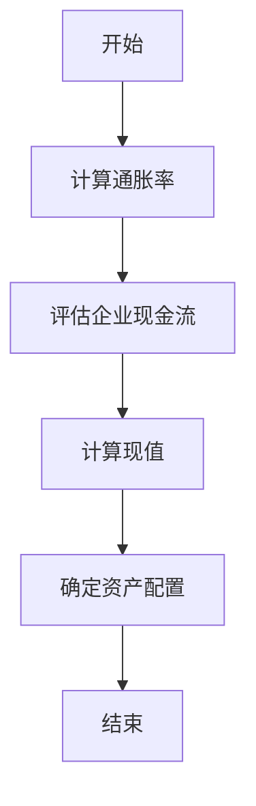

                 


```markdown
# 巴菲特-芒格的通胀对冲策略：如何保护投资组合

> 关键词：通胀对冲，巴菲特，芒格，资产配置，护城河企业，投资组合，风险管理

> 摘要：本文深入探讨了巴菲特和芒格的通胀对冲策略，分析了其核心原理、数学模型、系统架构及实战案例，结合最佳实践和风险管理，为投资者提供全面的指导。

---

## 第1章: 通货膨胀与巴菲特-芒格投资策略基础

### 1.1 通货膨胀的定义与影响
通货膨胀是指物价总水平在一段时间内持续上涨，导致货币购买力下降。它对经济和投资的影响深远，尤其对固定收益资产造成压力。投资者需通过合理配置资产来抵消通胀的影响。

### 1.2 巴菲特与芒格的投资理念
- **巴菲特**：价值投资，寻找具备持续盈利能力的企业，长期持有。
- **芒格**：多元思维模型，强调安全边际和护城河企业。

---

## 第2章: 通胀对冲的核心概念与背景

### 2.1 通胀对冲的定义与目标
通胀对冲旨在通过资产配置和优质企业投资，抵消通胀对购买力的侵蚀，确保投资组合的保值与增值。

### 2.2 核心概念与联系
- **资产配置**：分散投资，平衡风险。
- **护城河企业**：具备竞争优势，能抵御通胀冲击。

---

## 第3章: 巴菲特-芒格通胀对冲策略的核心原理

### 3.1 资产配置与通胀对冲
- **分散投资**：通过不同资产类别对冲通胀风险。
- **数学模型**：使用现金流折现法评估企业价值。

### 3.2 护城河企业与通胀对冲
- **定义**：具备独特竞争优势的企业，如品牌、技术垄断等。
- **选择标准**：高ROE、稳定现金流、强大定价能力。

---

## 第4章: 通胀对冲策略的数学模型与算法

### 4.1 通胀对冲的数学模型
- **现金流折现法**：$$DCF = \sum_{t=1}^{n} \frac{CF_t}{(1 + r)^t}$$
- **资产回报率与通胀关系**：$$r = \text{通胀率} + \text{实际回报率}$$

### 4.2 算法流程图（使用mermaid）



---

## 第5章: 投资组合的系统分析与架构设计

### 5.1 系统分析
- **领域模型**：用mermaid类图展示投资组合的组成部分。
- **架构设计**：用mermaid架构图展示系统模块。

### 5.2 系统交互设计
- **投资决策流程**：用mermaid序列图展示用户与系统交互。

---

## 第6章: 巴菲特-芒格策略的项目实战

### 6.1 环境安装与准备
- **工具**：安装Excel或Python分析工具。
- **数据源**：获取历史股价和宏观经济数据。

### 6.2 核心实现与代码解读
- **资产配置代码**：```python
def calculate_asset_allocation(portfolio_value, inflation_rate):
    # 计算通胀对冲资产配置
    return portfolio_value * (1 - inflation_rate)
```

---

## 第7章: 最佳实践与风险管理

### 7.1 最佳实践 tips
- 定期重新平衡投资组合。
- 保持对护城河企业的关注。

### 7.2 小结
巴菲特和芒格的通胀对冲策略通过资产配置和优质企业投资，有效保护投资组合价值。

### 7.3 注意事项
- 定期评估投资组合。
- 风险管理至关重要。

---

## 参考文献
- 巴菲特股东大会记录
- 芒格的《穷查理宝典》
- 相关学术论文
```

