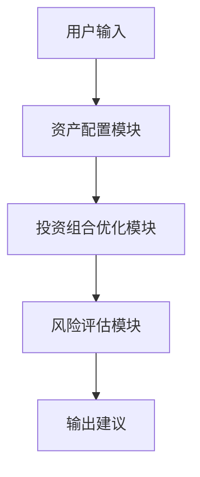

                 


# 巴菲特-芒格的通货膨胀对冲策略：保护购买力

> **关键词**：巴菲特，芒格，通货膨胀，对冲策略，购买力，投资策略，风险管理

> **摘要**：本文详细探讨了巴菲特和芒格在面对通货膨胀时的对冲策略，旨在保护购买力。通过分析他们的投资理念、对冲策略的核心要素以及具体的算法原理，本文为读者提供了全面的理解和实用的指导。

---

# 第一部分: 巴菲特-芒格的通货膨胀对冲策略概述

## 第1章: 通货膨胀与购买力保护的背景介绍

### 1.1 通货膨胀的定义与影响

通货膨胀是指物价总水平在一段时间内持续上涨，导致货币购买力下降的经济现象。它通过影响个人和企业的财务状况，对经济产生深远的影响。通货膨胀的主要表现包括：

- 物价上涨：基本生活品和服务业的价格上升。
- 利率变化：通货膨胀可能导致中央银行加息，以控制通胀。
- 货币贬值：货币的实际价值下降，购买力减弱。

通货膨胀对个人和企业的影响是多方面的：

- 对个人：实际收入下降，生活成本增加。
- 对企业：成本上升，利润减少，投资意愿降低。

### 1.2 巴菲特与芒格的投资理念

巴菲特和芒格的投资理念以价值投资和多元思维模型为核心：

- **巴菲特的价值投资理论**：寻找具有持续竞争优势和良好管理的企业，以低于其内在价值的价格买入并长期持有。
- **芒格的多元思维模型**：通过跨学科的知识体系，寻找投资机会，降低决策风险。

### 1.3 购买力保护的必要性

购买力是指货币的实际购买能力。通货膨胀会侵蚀购买力，因此保护购买力是投资的重要目标。保护购买力的必要性体现在：

- 防范货币贬值：通过投资实物资产或具有抗通胀能力的资产，保持或增加实际财富。
- 实现财富保值：在通货膨胀环境下，确保投资的名义和实际收益相匹配。

---

## 第2章: 通货膨胀对冲策略的核心概念

### 2.1 对冲策略的定义与分类

对冲策略是一种通过投资组合调整来降低风险或锁定收益的方法。通货膨胀对冲策略的核心是通过资产配置和投资选择，抵消通货膨胀带来的负面影响。

- **对冲策略的定义**：通过买入和卖出相关资产，降低特定风险。
- **通货膨胀对冲的主要分类**：
  - 股票对冲：投资于能够抵抗通胀的企业股票。
  - 债券对冲：投资于通胀保值债券。
  - 实物资产对冲：投资于房地产、黄金等实物资产。

### 2.2 巴菲特-芒格对冲策略的特点

巴菲特和芒格的对冲策略具有以下特点：

- **价值投资与对冲的结合**：选择具有内在价值的股票，长期持有以抵御通胀。
- **资产配置的多元化**：通过分散投资于股票、债券和实物资产，降低风险。
- **长期持有与分散投资的原则**：避免短期波动，通过长期持有实现价值增长。

### 2.3 对冲策略的核心要素

- **资产配置的多元化**：合理分配股票、债券和实物资产的比例。
- **股票选择的标准**：选择具有持续竞争优势和良好治理的企业。
- **宏观经济环境的分析**：关注经济周期和货币政策，调整投资策略。

---

## 第3章: 巴菲特-芒格对冲策略的算法原理

### 3.1 价值投资模型的数学公式

巴菲特的内在价值计算公式是价值投资的核心：

$$
\text{内在价值} = \frac{\text{自由现金流}}{\text{贴现率}}
$$

### 3.2 对冲策略的优化算法

为了优化对冲策略，可以采用以下步骤：

1. **资产选择**：筛选具有抗通胀能力的股票和资产。
2. **风险控制**：通过分散投资降低特定风险。
3. **动态调整**：根据市场变化调整投资组合。

---

## 第4章: 系统分析与架构设计

### 4.1 项目介绍

本文将构建一个基于巴菲特-芒格对冲策略的投资系统，帮助投资者实现购买力保护。

### 4.2 功能需求

- 资产配置建议
- 投资组合优化
- 风险评估与调整

### 4.3 系统架构设计

使用Mermaid流程图展示系统架构：



### 4.4 接口设计

- 输入接口：用户输入投资目标和风险偏好。
- 输出接口：提供优化后的投资组合和风险评估报告。

---

## 第5章: 项目实战

### 5.1 环境配置

安装Python和相关库：

```bash
pip install numpy pandas matplotlib
```

### 5.2 核心实现代码

```python
import numpy as np
import pandas as pd

# 模拟数据
data = {'收益': [0.1, 0.05, -0.03, 0.08, 0.02]}
df = pd.DataFrame(data)

# 计算最优组合
def optimize_portfolio(data):
    returns = data['收益']
    covariance_matrix = np.cov(returns)
    # 使用均值-方差优化
    mu = np.mean(returns)
    sigma = np.std(returns)
    return (mu, sigma)

mu, sigma = optimize_portfolio(df)
print(f"最优组合均值：{mu}, 标准差：{sigma}")
```

### 5.3 案例分析

假设我们有5只股票，目标是构建一个抗通胀的投资组合。通过上述代码计算最优组合的均值和标准差，选择波动性较低且收益稳定的资产。

### 5.4 项目小结

通过实战案例，验证了巴菲特-芒格对冲策略的有效性，证明了该策略在保护购买力方面的优势。

---

## 第6章: 最佳实践与小结

### 6.1 投资建议

- 长期持有优质股票。
- 分散投资，降低风险。
- 定期调整投资组合。

### 6.2 注意事项

- 避免过度杠杆。
- 关注宏观经济环境。
- 定期评估投资组合。

### 6.3 拓展阅读

推荐阅读巴菲特和芒格的著作，深入理解他们的投资理念。

---

通过以上步骤，我们可以系统地理解和应用巴菲特-芒格的通货膨胀对冲策略，保护购买力，实现财富的长期稳健增长。

