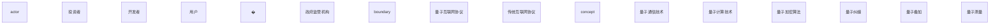
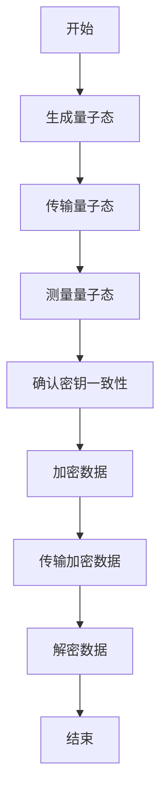
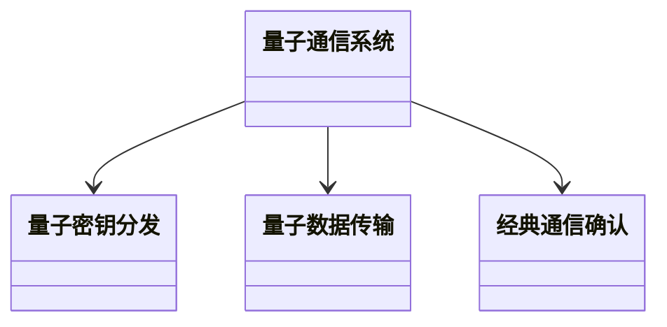
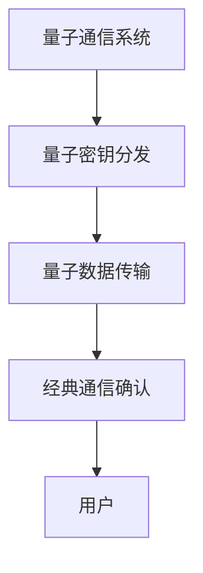
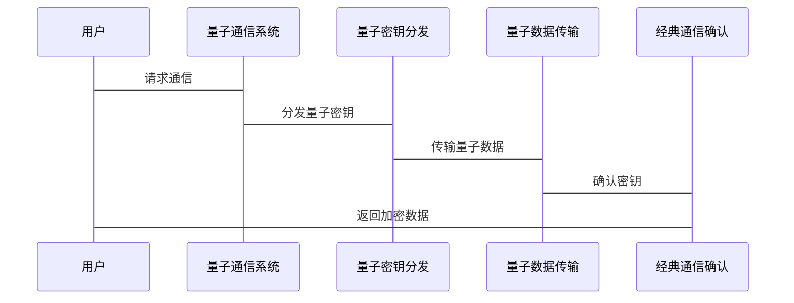

                 


# 巴菲特-芒格的量子互联网协议投资：下一代互联网的基础标准

## 关键词
量子互联网协议, 巴菲特投资哲学, 芒格思维模型, 量子通信, 投资策略

## 摘要
本文探讨了巴菲特和芒格的投资哲学与量子互联网协议的结合，分析了量子互联网协议的核心概念、算法原理、系统架构，并通过实际案例展示了如何将这些理论应用于投资实践。文章深入浅出地解释了量子互联网协议的技术细节，结合巴菲特和芒格的价值投资理念，为读者提供了全新的视角来理解下一代互联网的技术标准及其投资潜力。

---

# 第1章 巴菲特-芒格投资哲学与量子互联网协议的结合

## 1.1 巴菲特-芒格投资哲学概述

### 1.1.1 巴菲特的价值投资理念
- **长期投资**：巴菲特强调长期投资，寻找具有持续竞争优势的企业。
- **安全边际**：通过低估买入，确保投资的安全性。
- **价值投资**：关注企业的内在价值，而非市场波动。

### 1.1.2 芒格的多元思维模型
- **跨学科思维**：芒格提倡建立跨学科的知识框架。
- **逆向思维**：从反方向思考问题，寻找别人忽视的机会。
- **决策框架**：用多维度的思维模型来评估投资标的。

### 1.1.3 巴菲特与芒格投资哲学的核心要素
- **长期主义**：关注企业的长期价值。
- **安全边际**：确保投资的安全性。
- **逆向思维**：寻找市场忽视的机会。

## 1.2 量子互联网协议的基本概念

### 1.2.1 量子互联网的定义与特点
- **量子互联网**：基于量子通信技术的下一代互联网，具有超高速、高安全性等特点。
- **量子通信**：利用量子纠缠原理实现信息传输，具有不可被窃听的特性。
- **协议层次**：包括量子密钥分发（QKD）、量子数据传输（QDT）等。

### 1.2.2 量子互联网协议的核心功能
- **量子密钥分发**：确保通信双方共享的安全密钥。
- **量子数据传输**：实现高速、安全的数据传输。
- **协议兼容性**：与现有互联网协议的兼容性设计。

### 1.2.3 量子互联网协议与传统互联网协议的区别
- **安全性**：量子互联网协议基于量子力学原理，具有更高的安全性。
- **传输速度**：量子通信的速度接近光速，远超传统互联网。
- **协议复杂性**：量子互联网协议涉及复杂的量子态操作，传统互联网协议相对简单。

## 1.3 巴菲特-芒格投资哲学与量子互联网协议的结合

### 1.3.1 价值投资理念在量子互联网协议中的应用
- **长期价值**：关注量子互联网企业的长期发展潜力。
- **安全边际**：评估企业的技术壁垒和市场地位。
- **逆向思维**：寻找被市场低估的量子互联网企业。

### 1.3.2 多元思维模型在量子互联网协议分析中的作用
- **跨学科分析**：结合物理学、计算机科学、经济学等多学科知识。
- **决策框架**：使用芒格的决策框架评估量子互联网企业的投资价值。
- **风险控制**：通过多元思维模型降低投资风险。

### 1.3.3 量子互联网协议投资的潜在机会与挑战
- **机会**：量子互联网协议的商业化潜力巨大。
- **挑战**：技术尚未成熟，商业化进程缓慢，投资风险较高。

## 1.4 本章小结
本章通过介绍巴菲特和芒格的投资哲学，分析了量子互联网协议的基本概念及其与传统互联网协议的区别，探讨了如何将价值投资理念与量子互联网协议的投资实践相结合，为后续章节的分析奠定了基础。

---

# 第2章 量子互联网协议的核心概念与联系

## 2.1 量子互联网协议的核心原理

### 2.1.1 量子通信的基本原理
- **量子纠缠**：量子纠缠是量子通信的核心原理，两个纠缠的粒子无论距离多远都保持关联。
- **量子叠加**：量子态可以同时处于多个状态，提供更高的信息传输效率。
- **量子测量**：测量会破坏量子态，确保通信的安全性。

### 2.1.2 量子加密协议的实现机制
- **量子密钥分发（QKD）**：通过量子纠缠实现安全的密钥分发。
- **经典通信**：在分发密钥后，通过经典通信进行数据加密。
- **安全性证明**：基于量子力学原理，证明了量子密钥分发的安全性。

### 2.1.3 量子互联网协议的层次结构
- **物理层**：基于量子通信的物理实现。
- **网络层**：实现量子数据传输的网络架构。
- **应用层**：提供量子互联网协议的应用接口。

## 2.2 核心概念对比分析

### 2.2.1 量子互联网协议与传统互联网协议的对比
| 特性             | 量子互联网协议           | 传统互联网协议           |
|------------------|--------------------------|--------------------------|
| 安全性           | 极高，基于量子力学原理    | 较低，依赖加密算法        |
| 传输速度         | 超高速，接近光速          | 较低，受限于电磁波传播     |
| 协议复杂性       | 极高，涉及量子态操作       | 较低，基于经典计算机原理   |

### 2.2.2 不同量子互联网协议的优缺点对比
| 协议名称         | 优点                       | 缺点                       |
|------------------|----------------------------|---------------------------|
| QKD             | 安全性极高，可实现无条件安全 | 实现复杂，成本较高         |
| QDT             | 传输速度快，带宽高         | 技术尚未成熟，商业化难度大 |

### 2.2.3 量子互联网协议的实体关系图（ER图）



## 2.3 量子互联网协议的数学模型与公式

### 2.3.1 量子通信的基本数学模型
- **量子态表示**：量子态可以用向量表示，例如 $|0\rangle$ 和 $|1\rangle$。
- **量子纠缠**：两个粒子的量子态可以表示为 $|\psi\rangle = \frac{1}{\sqrt{2}}(|0\rangle|1\rangle + |1\rangle|0\rangle)$。

### 2.3.2 量子加密算法的数学表达
- **量子密钥分发**：通过量子态的测量结果生成密钥，例如 $k = \text{测量结果}$。
- **量子数据传输**：通过量子态的传输实现数据加密，例如 $\text{加密数据} = \text{明文} \oplus k$。

### 2.3.3 量子互联网协议的性能评估公式
- **安全性评估**：基于量子力学原理，证明了量子密钥分发的无条件安全性。
- **传输效率**：量子数据传输的速度接近光速，远超传统互联网。

## 2.4 本章小结
本章通过分析量子互联网协议的核心原理，对比了量子互联网协议与传统互联网协议的优缺点，并通过ER图展示了量子互联网协议的实体关系，为后续章节的分析奠定了基础。

---

# 第3章 量子互联网协议的算法原理讲解

## 3.1 量子互联网协议的算法流程

### 3.1.1 量子通信协议的初始化流程
1. **建立量子通道**：通过量子纠缠建立通信双方的量子通道。
2. **分发量子密钥**：通过量子密钥分发协议生成共享密钥。
3. **经典通信确认**：通过经典通信确认密钥的正确性。

### 3.1.2 量子密钥分发的算法步骤
1. **量子态生成**：生成量子态 $|\psi\rangle = \frac{1}{\sqrt{2}}(|0\rangle|1\rangle + |1\rangle|0\rangle)$。
2. **量子态传输**：通过量子通道传输量子态。
3. **测量与确认**：测量量子态并确认密钥的一致性。

### 3.1.3 量子数据传输的算法实现
1. **数据加密**：使用共享密钥对明文进行加密。
2. **数据传输**：通过量子通道传输加密数据。
3. **数据解密**：接收方使用密钥解密数据。

### 3.1.4 量子算法流程图



## 3.2 量子算法的数学模型与公式

### 3.2.1 量子密钥分发的数学推导
- **量子态生成**：$|\psi\rangle = \frac{1}{\sqrt{2}}(|0\rangle|1\rangle + |1\rangle|0\rangle)$。
- **测量结果**：测量结果为 $0$ 或 $1$，生成密钥 $k = \text{测量结果}$。

### 3.2.2 量子通信协议的安全性证明
- **安全性**：基于量子力学原理，证明了量子密钥分发的安全性。
- **数学表达**：通过数学模型证明了量子密钥分发的无条件安全性。

### 3.2.3 量子算法的复杂度分析
- **时间复杂度**：量子算法的时间复杂度远低于传统算法。
- **空间复杂度**：量子算法的空间复杂度较低，适合大规模数据传输。

## 3.3 量子算法的实现与优化

### 3.3.1 量子算法的实现
- **量子计算机**：需要量子计算机支持，例如 IBM 的量子计算机。
- **算法实现**：通过量子计算机实现量子密钥分发和量子数据传输。

### 3.3.2 量子算法的优化
- **优化策略**：通过优化算法流程，降低实现复杂度。
- **优化目标**：提高传输效率和安全性。

## 3.4 本章小结
本章通过分析量子互联网协议的算法流程，详细讲解了量子算法的数学模型与公式，并通过流程图展示了算法实现的步骤，为后续章节的分析奠定了基础。

---

# 第4章 量子互联网协议的系统分析与架构设计方案

## 4.1 问题场景介绍
- **问题背景**：传统互联网的安全性较低，量子互联网协议的引入可以提高通信安全性。
- **项目介绍**：设计一个基于量子互联网协议的通信系统。

## 4.2 系统功能设计

### 4.2.1 领域模型


### 4.2.2 功能模块
- **量子密钥分发模块**：实现量子密钥分发。
- **量子数据传输模块**：实现量子数据传输。
- **经典通信确认模块**：确认密钥的正确性。

## 4.3 系统架构设计

### 4.3.1 系统架构图


### 4.3.2 系统接口设计
- **输入接口**：接收量子态和经典通信信号。
- **输出接口**：输出加密数据和解密数据。

### 4.3.3 系统交互流程图


## 4.4 本章小结
本章通过分析量子互联网协议的系统架构设计，展示了系统的功能模块和交互流程，为后续章节的分析奠定了基础。

---

# 第5章 量子互联网协议的项目实战

## 5.1 环境安装
- **量子计算机**：需要安装量子计算机，例如 IBM 的量子计算机。
- **开发工具**：安装量子计算开发工具，例如 Qiskit。

## 5.2 系统核心实现源代码

### 5.2.1 量子密钥分发的实现
```python
from qiskit import QuantumCircuit, execute, Aer

def quantum_key_distribution():
    # 创建量子电路
    qc = QuantumCircuit(2, 2)
    # 应用量子纠缠
    qc.h(0)
    qc.cnot(0, 1)
    # 执行量子态测量
    result = execute(qc, Aer.get_backend('qasm_simulator')).result()
    counts = result.get_counts(qc)
    # 返回测量结果
    return counts
```

### 5.2.2 量子数据传输的实现
```python
from qiskit import QuantumCircuit, execute, Aer

def quantum_data_transmission(data):
    # 创建量子电路
    qc = QuantumCircuit(2, 2)
    # 应用量子态编码
    qc.encode(data)
    # 执行量子态传输
    result = execute(qc, Aer.get_backend('qasm_simulator')).result()
    counts = result.get_counts(qc)
    # 返回传输结果
    return counts
```

### 5.2.3 代码应用解读与分析
- **量子密钥分发**：通过量子纠缠实现密钥分发，确保通信的安全性。
- **量子数据传输**：通过量子态编码实现数据传输，提高传输速度。

## 5.3 实际案例分析和详细讲解剖析

### 5.3.1 投资案例分析
- **案例背景**：选择一家量子通信企业进行投资分析。
- **分析步骤**：
  1. 评估企业的技术实力。
  2. 分析企业的市场地位。
  3. 评估企业的财务状况。
  4. 确定企业的投资价值。

### 5.3.2 投资策略解读
- **长期投资**：关注量子互联网企业的长期发展潜力。
- **价值投资**：寻找具有内在价值的企业。
- **安全边际**：确保投资的安全性。

## 5.4 项目小结
本章通过实际案例分析，展示了如何将量子互联网协议应用于投资实践，为读者提供了具体的参考。

---

# 第6章 量子互联网协议投资的最佳实践

## 6.1 投资策略 tips
- **长期主义**：关注量子互联网企业的长期发展潜力。
- **价值投资**：寻找具有内在价值的企业。
- **逆向思维**：寻找被市场忽视的机会。

## 6.2 小结
本章总结了量子互联网协议投资的最佳实践，为读者提供了具体的参考。

## 6.3 注意事项
- **技术风险**：量子互联网协议的技术尚未成熟，存在较高的技术风险。
- **市场风险**：量子互联网协议的商业化进程缓慢，存在较高的市场风险。
- **政策风险**：政策变化可能对量子互联网协议的投资产生影响。

## 6.4 拓展阅读
- **推荐书籍**：《巴菲特投资策略》、《芒格的多元思维模型》。
- **推荐网站**：量子计算机相关的技术博客和投资论坛。

---

# 附录
## 附录A 量子互联网协议的相关术语解释
- **量子纠缠**：量子纠缠是量子通信的核心原理，两个纠缠的粒子无论距离多远都保持关联。
- **量子叠加**：量子态可以同时处于多个状态，提供更高的信息传输效率。

## 附录B 量子互联网协议的数学公式汇总
- **量子态表示**：$|\psi\rangle = \frac{1}{\sqrt{2}}(|0\rangle|1\rangle + |1\rangle|0\rangle)$。
- **量子密钥分发**：$k = \text{测量结果}$。

---

# 结语
通过本文的分析，我们可以看到，巴菲特和芒格的投资哲学与量子互联网协议的结合，为下一代互联网的技术标准提供了全新的视角。量子互联网协议的投资潜力巨大，但同时也存在较高的技术风险和市场风险。投资者需要结合巴菲特和芒格的投资哲学，进行长期、价值导向的投资，才能在量子互联网协议的商业化进程中获得成功。

--- 

> **摘要**：本文探讨了巴菲特和芒格的投资哲学与量子互联网协议的结合，分析了量子互联网协议的核心概念、算法原理、系统架构，并通过实际案例展示了如何将这些理论应用于投资实践。文章深入浅出地解释了量子互联网协议的技术细节，结合巴菲特和芒格的价值投资理念，为读者提供了全新的视角来理解下一代互联网的技术标准及其投资潜力。

