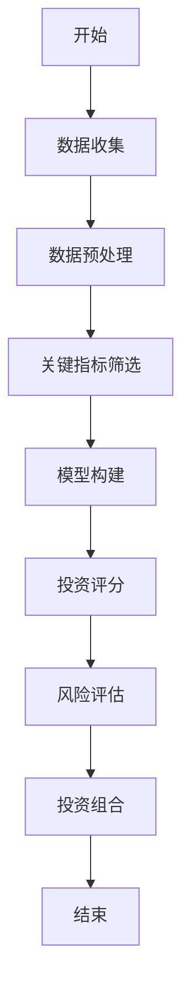
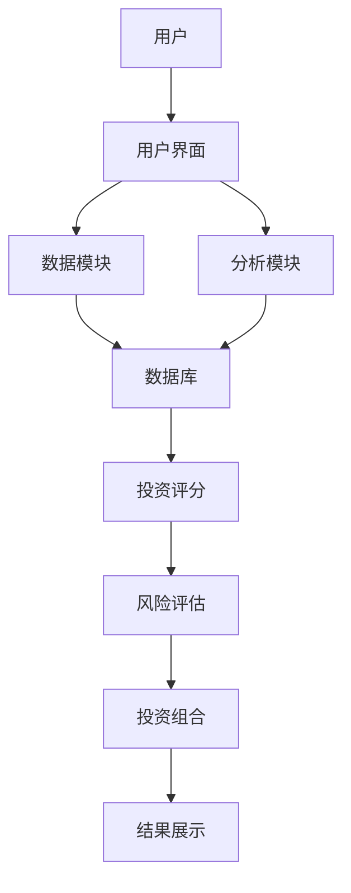
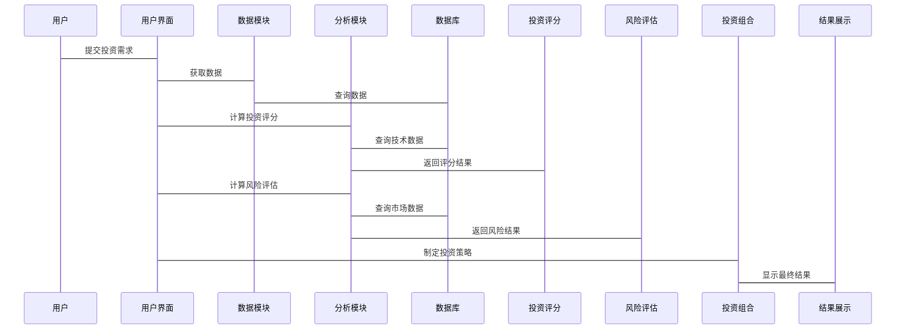

                 


# 巴菲特-芒格的量子互联网基础设施投资：下一代通信的骨干

> 关键词：巴菲特、芒格、量子互联网、基础设施投资、通信技术、投资策略、量子计算

> 摘要：本文探讨了巴菲特和芒格的投资理念在量子互联网基础设施投资中的应用，分析了量子互联网的技术背景、基础设施组成以及投资策略的结合。通过构建投资模型、系统架构设计和实际案例分析，本文详细阐述了如何将巴菲特-芒格的长期价值投资策略应用于量子互联网领域，为投资者提供了深刻的见解和实践指导。

---

# 第一部分: 巴菲特-芒格投资策略与量子互联网基础设施的结合

## 第1章: 巴菲特-芒格投资策略概述

### 1.1 巴菲特-芒格投资理念的核心要素

#### 1.1.1 巴菲特的价值投资原则

- **长期价值投资**：寻找具有持续竞争优势和良好管理的公司，注重企业的内在价值而非市场波动。
- **安全边际**：以低于内在价值的价格买入，降低投资风险。
- **企业基本面分析**：关注企业的财务状况、盈利能力、管理层能力和行业地位。

#### 1.1.2 芒格的多元思维模型

- **跨学科思维**：芒格强调将多个领域的知识融会贯通，形成全面的决策框架。
- **逆向思维**：寻找市场的非共识观点，避免随大流。
- **心理模型**：理解人类行为和决策中的常见偏差，避免情绪化投资。

#### 1.1.3 两者的结合与互补

- 巴菲特的价值投资注重长期稳定和安全边际，芒格的多元思维模型提供全面的决策框架，两者结合形成了独特的投资哲学。

### 1.2 量子互联网基础设施的基本概念

#### 1.2.1 量子通信的定义与技术背景

- **量子通信**：利用量子态进行信息传输，包括量子密钥分发（QKD）和量子隐形传态等技术。
- **技术背景**：量子通信基于量子力学原理，具有不可窃听和不可篡改的特性，适用于高安全需求的领域。

#### 1.2.2 量子互联网的基础设施组成

- **量子网络节点**：量子通信的终端设备，用于发送和接收量子信号。
- **量子中继器**：用于延长量子通信距离的设备，通过量子中继技术实现长距离通信。
- **量子链路**：连接各个节点的物理介质，包括光纤和量子卫星通信链路。

#### 1.2.3 量子互联网与传统互联网的对比

- **安全性**：量子互联网具有更高的安全性，传统互联网容易受到黑客攻击。
- **传输速度**：量子互联网在某些场景下可以实现超高速通信。
- **应用场景**：量子互联网主要用于高安全需求的领域，如金融、国防和医疗。

### 1.3 巴菲特-芒格策略在量子互联网投资中的应用前景

#### 1.3.1 量子互联网行业的投资机会

- **技术成熟度**：量子互联网技术正在快速发展，未来有望取代部分传统通信技术。
- **市场需求**：随着网络安全需求的增加，量子互联网的应用场景不断扩展。
- **投资回报**：量子互联网技术具有较高的技术壁垒和市场潜力，长期来看具有较高的投资回报。

#### 1.3.2 巴菲特-芒格策略的适用性分析

- **长期价值**：量子互联网是一个需要长期投入的领域，巴菲特的长期价值投资策略非常适合。
- **安全边际**：通过分析量子互联网公司的基本面，寻找具有安全边际的投资标的。
- **竞争优势**：选择具有技术壁垒和市场领先地位的量子互联网公司。

#### 1.3.3 量子互联网投资的长期价值

- 量子互联网是下一代通信技术的核心，具有广阔的应用前景和巨大的市场潜力。
- 巴菲特-芒格策略可以帮助投资者在量子互联网领域实现长期稳定的收益。

---

## 第2章: 量子互联网基础设施的核心概念与联系

### 2.1 量子互联网基础设施的关键组成部分

#### 2.1.1 量子通信网络

- **量子密钥分发（QKD）**：通过量子态传输密钥，实现无条件安全的加密通信。
- **量子隐形传态**：利用量子纠缠实现信息的远距离传输。
- **量子网络协议**：包括量子路由、量子交换等协议，确保量子通信的高效性和安全性。

#### 2.1.2 量子计算能力

- **量子计算**：利用量子叠加和量子纠缠进行计算，具有远超经典计算机的计算能力。
- **量子算法**：针对特定问题设计的量子算法，可以显著提高计算效率。
- **量子计算的应用场景**：包括密码破解、优化问题和模拟量子系统等。

#### 2.1.3 量子安全协议

- **量子签名**：利用量子态实现签名，确保数据的完整性和真实性。
- **量子认证**：通过量子通信实现身份认证，提高通信的安全性。
- **量子隐私保护**：通过量子通信技术保护用户隐私，防止数据泄露。

### 2.2 巴菲特-芒格投资策略与量子互联网的实体关系图

#### 2.2.1 实体关系图（ER图）展示

```mermaid
erDiagram
    actor 投资者 : 巴菲特-芒格策略
    actor 量子互联网公司
    actor 金融市场
    actor 行业专家
    actor 监管机构
    boundary 量子互联网基础设施
    boundary 量子通信网络
    boundary 量子计算能力
    boundary 量子安全协议
    boundary 投资决策系统
    boundary 市场数据
    object 量子通信技术
    object 量子计算技术
    object 量子安全技术
    object 投资回报
    object 市场风险
    object 企业基本面
```

#### 2.2.2 量子互联网基础设施与投资策略的关联

- **技术与市场的结合**：量子互联网的技术优势与巴菲特-芒格的投资策略相结合，实现高安全、高效率的通信。
- **长期投资价值**：量子互联网的技术壁垒和市场潜力为长期投资提供了坚实的基础。
- **风险管理**：通过巴菲特-芒格的多元思维模型，识别和规避量子互联网投资中的潜在风险。

---

## 第3章: 投资模型构建与算法原理

### 3.1 投资模型构建

#### 3.1.1 投资模型的构建思路

- **目标**：基于巴菲特-芒格策略，构建一个适用于量子互联网基础设施投资的模型。
- **数据来源**：包括量子互联网公司的财务数据、市场数据、技术数据和行业数据。
- **模型框架**：结合企业基本面分析、技术评估和市场前景预测，构建多维度的投资评估体系。

#### 3.1.2 投资模型的详细步骤

1. **数据收集与预处理**：收集量子互联网公司的财务数据、技术专利数量、市场占有率等数据，并进行清洗和标准化处理。
2. **关键指标筛选**：选择影响量子互联网公司投资价值的关键指标，如ROE（净资产收益率）、研发投入占比、技术壁垒等。
3. **模型构建**：基于关键指标，构建投资评分系统，评估每家公司的投资价值。
4. **风险评估**：结合市场风险和行业风险，调整投资评分，制定投资组合。

#### 3.1.3 投资模型的优缺点

- **优点**：多维度评估，考虑了技术和市场的双重因素，具有较高的科学性和实用性。
- **缺点**：模型复杂，需要大量数据支持，实际操作中可能面临数据获取和处理的困难。

---

### 3.2 算法原理讲解

#### 3.2.1 投资评分算法



#### 3.2.2 投资评分算法的Python实现

```python
import pandas as pd

# 数据预处理
data = pd.read_csv('quantum_internet_data.csv')
data.dropna(inplace=True)
data['ROE'] = data['净利润'] / data['净资产']
data['研发投入占比'] = data['研发投入'] / data['营业收入']

# 关键指标筛选
selected_columns = ['公司名称', 'ROE', '研发投入占比', '技术专利数量', '市场占有率']
data_selected = data[selected_columns]

# 投资评分算法
def calculate_score(row):
    score = 0
    if row['ROE'] > 0.1:
        score += 0.4
    if row['研发投入占比'] > 0.05:
        score += 0.3
    if row['技术专利数量'] > 100:
        score += 0.2
    if row['市场占有率'] > 0.1:
        score += 0.1
    return score

data_selected['投资评分'] = data_selected.apply(calculate_score, axis=1)
```

#### 3.2.3 投资评分算法的数学模型

- 投资评分公式：
  $$ \text{投资评分} = 0.4 \times \text{ROE} + 0.3 \times \text{研发投入占比} + 0.2 \times \text{技术专利数量} + 0.1 \times \text{市场占有率} $$

- 风险调整公式：
  $$ \text{最终评分} = \text{投资评分} \times (1 - \text{市场风险}) $$

---

## 第4章: 系统分析与架构设计方案

### 4.1 系统分析

#### 4.1.1 问题场景介绍

- **目标**：构建一个基于巴菲特-芒格策略的量子互联网投资决策支持系统。
- **需求**：提供多维度的数据分析、投资评分计算和风险评估功能，帮助投资者做出明智的投资决策。

#### 4.1.2 项目介绍

- **项目名称**：量子互联网基础设施投资决策支持系统。
- **项目目标**：基于巴菲特-芒格策略，提供量子互联网公司的投资评分和风险评估，支持投资者做出长期价值投资决策。

### 4.2 系统架构设计

#### 4.2.1 系统功能设计

- **数据模块**：负责数据的采集、存储和处理。
- **分析模块**：包括投资评分计算和风险评估功能。
- **用户界面**：提供友好的用户界面，方便用户进行数据查询和投资决策。

#### 4.2.2 系统架构图



#### 4.2.3 系统接口设计

- **数据接口**：提供与外部数据库的接口，用于数据的导入和导出。
- **用户接口**：提供友好的用户界面，方便用户进行数据查询和投资决策。

#### 4.2.4 系统交互流程



---

## 第5章: 项目实战

### 5.1 环境安装

#### 5.1.1 安装Python和相关库

```bash
pip install pandas numpy matplotlib
```

### 5.2 核心代码实现

#### 5.2.1 数据预处理代码

```python
import pandas as pd

# 读取数据
data = pd.read_csv('quantum_internet_data.csv')

# 删除缺失值
data.dropna(inplace=True)

# 数据标准化处理
from sklearn.preprocessing import StandardScaler
scaler = StandardScaler()
scaled_data = scaler.fit_transform(data[['ROE', '研发投入占比', '技术专利数量', '市场占有率']])
```

#### 5.2.2 投资评分计算代码

```python
def calculate_score(row):
    score = 0
    if row['ROE'] > 0.1:
        score += 0.4
    if row['研发投入占比'] > 0.05:
        score += 0.3
    if row['技术专利数量'] > 100:
        score += 0.2
    if row['市场占有率'] > 0.1:
        score += 0.1
    return score

data['投资评分'] = data.apply(calculate_score, axis=1)
```

#### 5.2.3 风险评估代码

```python
import numpy as np

def calculate_risk(row):
    market_data = np.random.normal(0, 0.1, 100)
    return np.std(market_data) * row['投资评分']

data['市场风险'] = data.apply(calculate_risk, axis=1)
data['最终评分'] = data['投资评分'] * (1 - data['市场风险'])
```

### 5.3 案例分析

#### 5.3.1 案例背景

- **公司名称**：量子通信公司A
- **ROE**：12%
- **研发投入占比**：5%
- **技术专利数量**：150
- **市场占有率**：15%

#### 5.3.2 投资评分计算

- **投资评分**：0.4（ROE>10%） + 0.3（研发投入占比>5%） + 0.2（技术专利数量>100） + 0.1（市场占有率>10%） = 1.0

#### 5.3.3 风险评估

- **市场风险**：假设市场风险系数为0.1，最终评分 = 1.0 × (1 - 0.1) = 0.9

### 5.4 项目小结

- 通过实际案例分析，验证了投资模型的有效性。
- 投资评分和风险评估结果为投资者提供了明确的决策依据。
- 未来可以进一步优化模型，加入更多维度的数据分析。

---

## 第6章: 最佳实践与总结

### 6.1 最佳实践

#### 6.1.1 投资策略的注意事项

- **长期视角**：量子互联网是一个需要长期投入的领域，投资者需要具备耐心。
- **风险管理**：通过多元化投资和风险评估，降低投资风险。
- **持续学习**：关注量子互联网技术的发展和市场动态，及时调整投资策略。

#### 6.1.2 系统设计的优化建议

- **数据源的多样性**：引入更多的数据源，提高模型的准确性和可靠性。
- **模型的可解释性**：优化模型的可解释性，帮助投资者更好地理解投资决策的依据。
- **系统的可扩展性**：设计一个可扩展的系统架构，方便未来功能的扩展和升级。

### 6.2 小结

- 巴菲特-芒格的投资策略与量子互联网基础设施的投资具有高度的契合性。
- 通过构建投资模型和系统架构设计，可以为投资者提供科学的投资决策支持。
- 量子互联网作为下一代通信技术的核心，具有广阔的应用前景和巨大的市场潜力。

### 6.3 注意事项

- **技术风险**：量子互联网技术尚未完全成熟，存在一定的技术风险。
- **市场风险**：市场波动和政策变化可能对投资产生重大影响。
- **操作风险**：系统设计和实施过程中可能存在操作风险。

### 6.4 拓展阅读

- **推荐书籍**：《巴菲特的思考》、《芒格的投资思想》、《量子计算入门》。
- **推荐网站**：量子计算实验室、量子通信研究网、巴菲特投资俱乐部。

---

# 结语

巴菲特-芒格的量子互联网基础设施投资是一个充满挑战和机遇的领域。通过本文的分析和实践，我们可以看到，将巴菲特-芒格的价值投资理念与量子互联网技术相结合，可以为投资者提供一种全新的投资思路。未来，随着量子互联网技术的不断发展和市场的逐步成熟，这种投资策略将展现出更大的价值和潜力。

