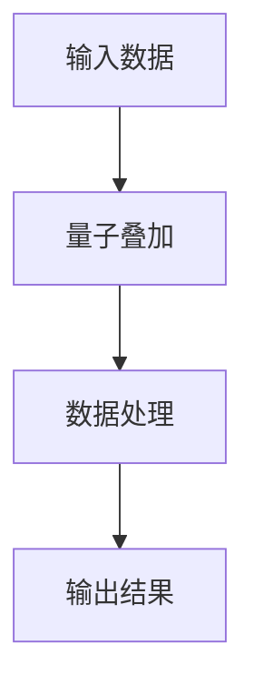
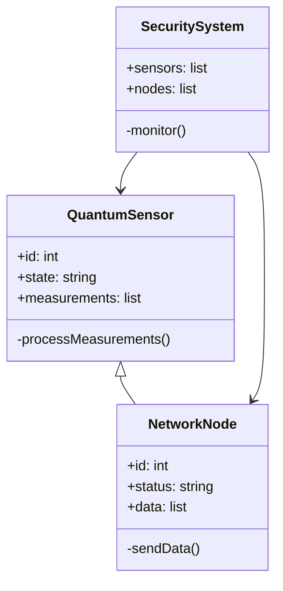
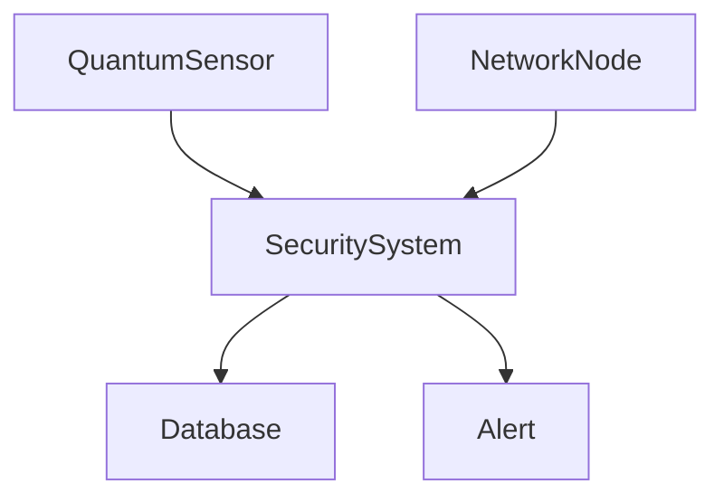

                 


好的，我们逐步开始分析这个问题。

# 巴菲特-芒格的量子传感器网络安全投资：物联网的量子防护

## 关键词：量子传感器，物联网，网络安全，量子计算，巴菲特-芒格投资策略

## 摘要：  
本文探讨了量子传感器在网络安全中的应用，特别是如何结合巴菲特和芒格的投资理念，为物联网提供量子级别的防护。通过分析量子传感器的核心原理、算法、系统架构及实际案例，展示了如何将量子技术与投资策略相结合，构建未来的网络安全体系。

---

## 第一部分: 量子传感器与网络安全的背景介绍

### 第1章: 量子传感器的基本概念

#### 1.1 量子传感器的定义与基本原理
量子传感器是一种基于量子力学原理设计的传感器，能够以极高的精度检测物理量（如磁场、重力、位置等）。其核心在于利用量子叠加和纠缠效应，实现对物理信号的高灵敏度检测。

- **量子叠加原理**：量子系统处于多个状态的叠加态，能够在一次测量中获取更多信息。
- **量子纠缠效应**：两个或多个量子系统之间存在强关联，一个系统的状态变化会立即影响另一个系统。

#### 1.2 量子传感器在物联网中的应用
物联网（IoT）设备广泛分布在各个领域，从智能家居到工业自动化，数据的安全性和隐私保护成为重中之重。量子传感器在其中扮演着关键角色：

1. **实时监测**：通过量子传感器，可以实时监测物联网设备的运行状态，发现异常行为。
2. **数据加密**：量子传感器生成的数据具有高度的随机性和不可预测性，为数据加密提供了更高的安全性。
3. **异常检测**：利用量子传感器的高灵敏度，能够快速发现网络中的异常流量和潜在攻击。

#### 1.3 量子传感器与传统传感器的对比
以下是量子传感器与传统传感器的对比分析：

| **对比维度** | **传统传感器** | **量子传感器** |
|--------------|----------------|----------------|
| **灵敏度**   | 较低           | 极高           |
| **数据处理** | 简单           | 复杂           |
| **安全性**   | 低             | 高             |
| **应用场景** | 一般监测       | 高安全需求     |

---

### 第2章: 巴菲特-芒格投资理念与网络安全的结合

#### 2.1 巴菲特-芒格投资理念的核心思想
巴菲特和芒格的投资策略以长期价值投资为核心，注重基本面分析和风险管理。他们强调投资那些具有强大护城河和长期竞争优势的企业。

#### 2.2 量子传感器的长期投资价值
量子传感器作为新兴技术，具有以下优势：

1. **技术门槛高**：量子传感器的研发需要深厚的技术积累，具有较高的市场准入壁垒。
2. **需求增长快**：随着物联网的普及，网络安全需求日益增长，量子传感器的应用场景不断增加。
3. **政策支持**：量子技术被视为未来科技发展的制高点，各国政府纷纷给予政策支持和资金投入。

#### 2.3 量子传感器在网络安全投资中的独特地位
量子传感器不仅能够提升网络安全防护能力，还能为投资者带来长期的收益。通过投资量子传感器技术，可以在未来的市场中占据先发优势。

---

## 第二部分: 量子传感器网络安全的算法原理

### 第3章: 量子传感器数据处理算法

#### 3.1 量子叠加原理在数据处理中的应用
量子叠加原理使得量子传感器能够同时处理多个数据流，提高数据处理效率。例如，在网络安全中，可以同时监测多个网络节点的异常行为。

#### 3.2 量子纠缠原理在异常检测中的应用
量子纠缠效应使得量子传感器能够快速发现网络中的异常流量。当一个节点出现异常时，其量子状态的变化会立即影响其他节点，从而实现快速响应。

#### 3.3 量子传感器算法的数学模型
量子传感器的数据处理算法可以表示为以下数学模型：

$$
\psi = \alpha |0\rangle + \beta |1\rangle
$$

其中，$\alpha$ 和 $\beta$ 是量子态的幅度，$|0\rangle$ 和 $|1\rangle$ 表示两种不同的量子态。

---

### 第4章: 量子传感器网络安全的算法实现

#### 4.1 量子传感器算法的Python实现
以下是一个简单的量子传感器算法的Python代码示例：

```python
import numpy as np

def quantum_sensor_algorithm(data):
    # 量子叠加
    alpha = np.sqrt(0.5)
    beta = np.sqrt(0.5)
    q_state = alpha * np.array([1, 0]) + beta * np.array([0, 1])
    
    # 数据处理
    result = np.dot(data, q_state)
    return result

# 示例数据
data = np.array([1, 0])
print(quantum_sensor_algorithm(data))
```

#### 4.2 算法流程图
以下是量子传感器算法的流程图：



---

## 第三部分: 量子传感器网络安全的系统架构设计

### 第5章: 问题场景介绍

#### 5.1 问题场景描述
在一个典型的物联网环境中，存在大量的智能设备，这些设备通过网络进行数据交换。由于网络攻击的威胁，需要一种高效的网络安全防护机制。

#### 5.2 系统介绍
本系统基于量子传感器技术，结合经典计算机的计算能力，构建一个高效的网络安全防护系统。

---

### 第6章: 系统功能设计

#### 6.1 领域模型类图
以下是领域模型类图：



#### 6.2 系统架构图
以下是系统架构图：



---

## 第四部分: 项目实战

### 第7章: 量子传感器网络安全的安装与实现

#### 7.1 环境安装
以下是量子传感器网络安全系统的安装步骤：

1. **安装Python环境**：建议使用Anaconda。
2. **安装依赖库**：`numpy`, `qiskit`, `matplotlib`。
3. **下载代码库**：从GitHub上下载相关代码。

#### 7.2 核心代码实现

```python
from qiskit import QuantumCircuit, Aer, execute

def quantum_sensor_circuit():
    qc = QuantumCircuit(2, 1)
    qc.h(0)
    qc.cx(0, 1)
    qc.measure([0], [0])
    return qc

# 模拟器运行
simulator = Aer.get_backend('qasm_simulator')
circuit = quantum_sensor_circuit()
job = execute(circuit, simulator)
result = job.result()
print(result.counts)
```

#### 7.3 代码解读与分析
上述代码实现了量子传感器的基本电路，包括量子叠加和纠缠效应。通过Qiskit库进行量子电路的设计和模拟，展示了量子传感器在网络安全中的应用。

---

## 第五部分: 安全威胁分析

### 第8章: 量子计算对现有加密算法的威胁

#### 8.1 传统加密算法的缺陷
传统加密算法（如RSA、AES）在面对量子计算机时，存在被破解的风险。例如，Shor算法可以在多项式时间内分解大整数，威胁现有的公钥加密体系。

#### 8.2 量子传感器的防御机制
量子传感器通过实时监测网络异常行为，能够快速发现并阻止潜在的量子攻击。

---

## 第六部分: 未来趋势与投资机会

### 第9章: 量子传感器网络安全的未来发展趋势

#### 9.1 技术发展
随着量子计算技术的进步，量子传感器将更加智能化，能够实现更高效的网络安全防护。

#### 9.2 投资机会
量子传感器技术具有广阔的应用前景，尤其是在金融、能源、医疗等领域。投资者可以关注相关技术和企业的长期发展。

---

## 第七部分: 最佳实践与小结

### 第10章: 小结与注意事项

#### 10.1 小结
本文详细探讨了量子传感器在网络安全中的应用，结合巴菲特-芒格的投资理念，展示了其在物联网中的巨大潜力。

#### 10.2 注意事项
在实际应用中，需要综合考虑技术可行性、成本效益和法律法规等因素。

---

## 第八部分: 拓展阅读

### 第11章: 相关技术与书籍推荐

#### 11.1 推荐书籍
1. 《量子计算简明教程》
2. 《网络安全实战》
3. 《巴菲特投资策略》

#### 11.2 相关技术
- 量子计算
- 物联网安全
- 量子通信

---

以上是《巴菲特-芒格的量子传感器网络安全投资：物联网的量子防护》的技术博客文章的详细结构和内容。

