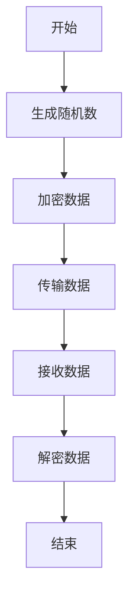
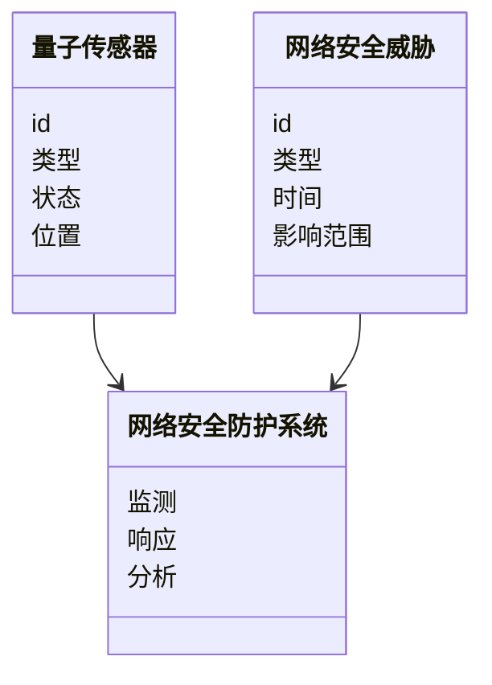
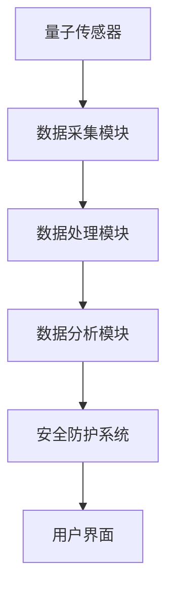
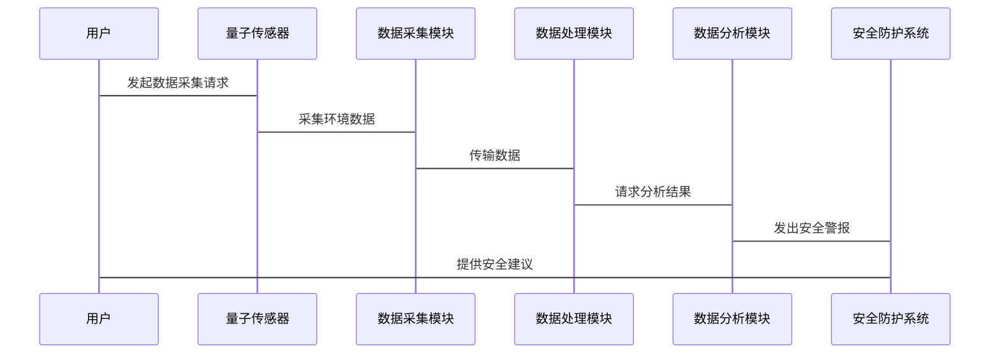

                 


# 巴菲特-芒格的量子传感器网络安全投资：物联网的防护盾

## 关键词：量子传感器，网络安全，物联网，巴菲特，芒格，投资策略

## 摘要：本文探讨了巴菲特和芒格的投资理念如何应用于量子传感器技术，特别是在物联网安全领域的应用。通过分析量子传感器的核心原理、算法、系统架构以及实际案例，本文详细阐述了如何利用量子传感器构建物联网的安全防护体系，并提出了相应的投资策略和最佳实践。

---

## 第一部分：量子传感器网络安全的背景与概念

### 第1章：物联网安全的现状与挑战

#### 1.1 物联网安全的现状
- **物联网的快速发展**：物联网设备的普及带来了数据量的爆炸式增长，同时也带来了前所未有的安全挑战。
- **物联网安全问题的严重性**：从智能家居到工业物联网，安全漏洞可能导致严重的经济损失和隐私泄露。
- **当前网络安全防护的局限性**：传统基于软件的防护手段在面对量子攻击时显得力不从心。

#### 1.2 量子传感器的出现
- **量子传感器的基本概念**：量子传感器是一种基于量子力学原理的新型传感器，能够以极高的精度检测环境中的物理量。
- **量子传感器在网络安全中的应用潜力**：量子传感器可以用于检测网络中的异常信号，实时监测网络环境的变化，从而实现更高效的网络安全防护。
- **量子传感器与传统传感器的对比**：从灵敏度、响应速度、抗干扰能力等方面分析量子传感器的优势。

#### 1.3 巴菲特和芒格的投资理念
- **巴菲特的价值投资策略**：巴菲特注重长期价值，寻找那些具有持久竞争优势的企业进行投资。
- **芒格的多元思维模型**：芒格强调跨学科思考，将不同领域的知识结合起来，形成全面的决策框架。
- **投资与技术结合的哲学思考**：技术进步与投资策略的结合，如何通过技术创新实现长期的市场优势。

---

## 第2章：量子传感器与物联网安全的结合

### 2.1 量子传感器在物联网中的应用
- **量子传感器在数据采集中的优势**：量子传感器能够以更高的精度和更低的功耗采集数据，适用于物联网中的多种场景。
- **量子传感器在网络安全中的独特作用**：通过实时监测网络环境的变化，量子传感器可以提前发现潜在的安全威胁。
- **量子传感器在物联网防护中的具体应用场景**：从智能家居到工业物联网，量子传感器可以用于实时监测网络环境，快速响应安全事件。

### 2.2 物联网安全防护的新范式
- **传统物联网安全防护的不足**：传统基于软件的防护手段在面对高级持续性威胁（APT）时显得力不从心。
- **量子传感器如何改变物联网安全防护**：通过实时监测网络环境的变化，量子传感器可以实现更主动、更高效的网络安全防护。
- **量子传感器与物联网安全防护的结合模式**：从硬件到软件，从监测到响应，量子传感器如何构建物联网的安全防护体系。

### 2.3 巴菲特和芒格投资理念的延伸
- **从长期价值角度审视量子传感器技术**：量子传感器作为一项颠覆性技术，具有长期的市场潜力。
- **多元思维模型在技术投资中的应用**：通过跨学科思考，结合技术发展趋势和市场需求，找到具有投资价值的量子传感器技术。
- **风险控制与技术投资的平衡**：在技术投资中，如何在技术创新与市场风险之间找到平衡点。

---

## 第3章：量子传感器网络安全的核心概念与联系

### 3.1 核心概念原理
- **量子传感器的基本工作原理**：量子传感器通过测量量子力学中的某些物理量（如磁场、加速度等）来实现对外界环境的感知。
- **量子传感器在网络安全中的应用原理**：通过实时监测网络环境中的物理量变化，量子传感器可以发现潜在的安全威胁。

### 3.2 核心概念属性特征对比
| 特性        | 传统传感器          | 量子传感器          |
|-------------|---------------------|---------------------|
| 灵敏度      | 较低                | 极高                |
| 响应速度    | 较慢                | 极快                |
| 抗干扰能力  | 较差                | 极强                |

### 3.3 ER实体关系图

```mermaid
erd
    entity 量子传感器 {
        id
        类型
        灵敏度
        响应速度
        抗干扰能力
    }
    entity 物联网设备 {
        id
        类型
        连接方式
        位置
    }
    entity 网络安全威胁 {
        id
        类型
        潜在影响
        时间
    }
    量子传感器 -[检测]-> 网络安全威胁
    物联网设备 -[依赖]-> 量子传感器
```

---

## 第4章：量子传感器网络安全的算法原理

### 4.1 量子加密算法



### 4.2 量子加密算法的数学模型

$$ E(x) = x \oplus k $$

$$ D(y) = y \oplus k $$

其中，$x$ 是明文，$y$ 是密文，$k$ 是量子密钥。

### 4.3 量子加密算法的实现代码

```python
import random

def quantum_encrypt(plaintext, key_length):
    # 生成随机量子密钥
    key = [random.choice([0, 1]) for _ in range(key_length)]
    # 加密过程
    ciphertext = []
    for bit in plaintext:
        encrypted_bit = bit ^ key[len(ciphertext) % len(key)]
        ciphertext.append(encrypted_bit)
    return ciphertext

def quantum_decrypt(ciphertext, key):
    plaintext = []
    for i in range(len(ciphertext)):
        decrypted_bit = ciphertext[i] ^ key[i % len(key)]
        plaintext.append(decrypted_bit)
    return plaintext
```

---

## 第5章：量子传感器网络安全的系统分析与架构设计

### 5.1 系统功能设计（领域模型）



### 5.2 系统架构设计



### 5.3 系统接口设计

- **数据采集接口**：量子传感器通过特定接口采集环境数据。
- **数据处理接口**：对采集到的数据进行预处理和特征提取。
- **数据分析接口**：对数据进行深度分析，识别潜在的安全威胁。

### 5.4 系统交互流程



---

## 第6章：量子传感器网络安全的项目实战

### 6.1 环境安装
- **硬件安装**：安装量子传感器设备，确保设备正常工作。
- **软件安装**：安装数据采集模块、数据处理模块和数据分析模块。

### 6.2 核心代码实现

```python
def main():
    import quantum_sensor as qs
    import security_system as ss

    # 初始化量子传感器
    sensor = qs.QuantumSensor()
    # 初始化安全防护系统
    security = ss.SecuritySystem()

    # 数据采集与处理
    while True:
        data = sensor采集数据()
        processed_data = 处理数据(data)
        # 分析数据并触发安全防护
        security.analyze_and_defend(processed_data)

if __name__ == "__main__":
    main()
```

### 6.3 案例分析
- **案例背景**：某工业物联网企业的安全防护升级项目。
- **实施过程**：部署量子传感器，构建安全防护系统，实时监测网络环境。
- **结果分析**：通过量子传感器的实时监测，成功防御了多次潜在的安全攻击。

### 6.4 项目总结
- **项目成果**：通过量子传感器的部署，实现了更高效、更主动的网络安全防护。
- **经验总结**：技术与投资的结合需要长期的规划和持续的投入。

---

## 第7章：量子传感器网络安全的投资策略与最佳实践

### 7.1 投资策略
- **长期价值投资**：选择具有长期市场潜力的量子传感器技术。
- **多元化投资**：结合不同领域的量子传感器技术，构建多元化投资组合。
- **风险管理**：在技术创新与市场风险之间找到平衡点。

### 7.2 小结
- 量子传感器作为一项颠覆性技术，将在未来的物联网安全领域发挥重要作用。
- 投资者需要从长期价值和多元化角度出发，选择具有潜力的量子传感器技术。

### 7.3 注意事项
- **技术风险**：量子传感器技术尚处于发展阶段，存在技术不成熟的风险。
- **市场风险**：市场需求可能不如预期，投资者需要关注市场动态。
- **法律风险**：需要遵守相关法律法规，确保技术的合规性。

### 7.4 拓展阅读
- 推荐阅读巴菲特和芒格的经典著作，深入了解他们的投资理念。
- 关注量子计算和量子传感器领域的最新技术进展。

---

## 结语

通过本文的分析，我们可以看到，量子传感器技术在物联网安全领域的应用潜力巨大。结合巴菲特和芒格的投资理念，我们可以更好地把握技术投资的机遇和风险，为未来的网络安全防护提供更有力的保障。

