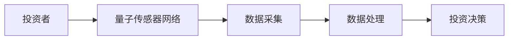
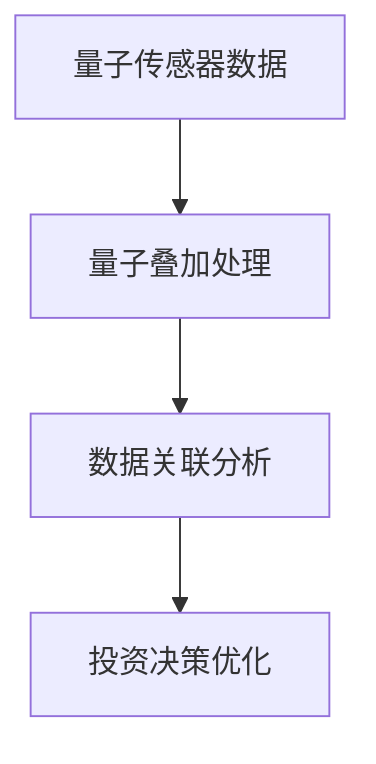
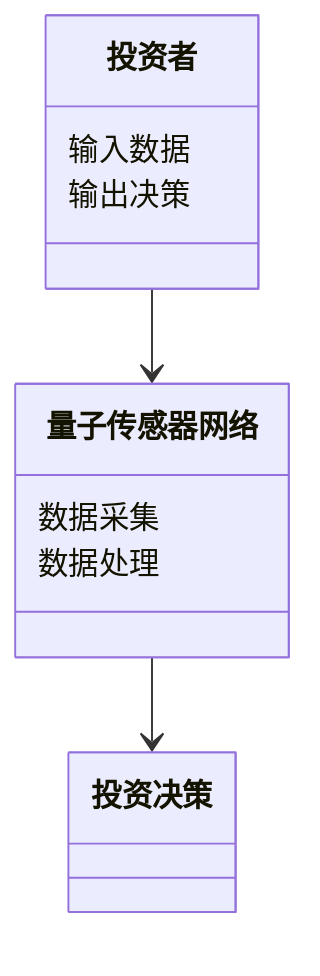
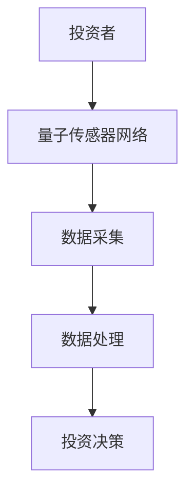

                 


# 巴菲特-芒格的量子传感器网络投资：物联网的下一代基础设施

## 关键词：量子传感器网络，物联网，巴菲特，芒格，投资策略，系统架构，算法原理

## 摘要：本文探讨了量子传感器网络在物联网中的应用及其对投资策略的影响。结合巴菲特和芒格的投资理念，分析了量子传感器网络的核心原理、算法模型、系统架构，并通过实际案例展示了其在投资决策中的应用。文章最后总结了量子传感器网络投资的优势与挑战，并展望了其未来的发展前景。

---

## 第一部分：量子传感器网络投资的背景与基础

### 第1章：量子传感器网络与物联网概述

#### 1.1 量子传感器网络的定义与特点

量子传感器网络是一种基于量子技术的传感器网络，通过量子叠加和纠缠原理，实现高精度、高灵敏度的数据采集和传输。其特点包括：

- **高灵敏度**：量子传感器能够检测极微弱的信号，远超传统传感器的灵敏度。
- **抗干扰性**：量子传感器网络通过量子纠缠实现数据传输，具有极强的抗干扰能力。
- **实时性**：量子传感器网络能够实现数据的实时采集和处理，适用于需要快速决策的应用场景。

#### 1.2 物联网的下一代基础设施

物联网（Internet of Things，IoT）通过将各种设备、传感器和数据终端连接到互联网，实现数据的共享和智能化管理。随着技术的发展，物联网的下一代基础设施需要更高的数据处理能力、更低的延迟和更高的安全性。量子传感器网络作为一种新兴技术，能够满足这些需求，成为物联网的下一代基础设施。

#### 1.3 巴菲特与芒格的投资理念

巴菲特和芒格的价值投资理念强调长期、安全和价值。芒格的多元思维模型则强调通过跨学科的思考，寻找投资机会。将量子传感器网络的投资理念与巴菲特和芒格的理论结合，可以为投资者提供新的视角。

---

### 第2章：量子传感器网络的核心概念与原理

#### 2.1 量子传感器网络的实体关系图

以下是一个简单的实体关系图，展示了量子传感器网络的主要组成部分：



#### 2.2 量子传感器网络的算法原理

量子传感器网络的算法原理基于量子叠加和纠缠。以下是一个简单的量子算法流程图：



---

## 第二部分：量子传感器网络的投资策略模型

### 第3章：量子传感器网络的投资策略模型

#### 3.1 投资策略模型的数学公式

投资价值的计算公式如下：

$$
\text{投资价值} = \sum_{i=1}^{n} w_i \cdot x_i
$$

其中，$w_i$ 是权重，$x_i$ 是传感器数据。

#### 3.2 投资组合优化的数学模型

投资组合优化的数学模型如下：

$$
\max \sum_{i=1}^{n} r_i \cdot x_i \\
\text{subject to} \quad \sum_{i=1}^{n} x_i = 1
$$

---

## 第三部分：量子传感器网络的系统架构设计

### 第4章：量子传感器网络的系统架构设计

#### 4.1 系统功能设计

量子传感器网络系统的功能设计包括数据采集、数据处理和投资决策三个模块：



#### 4.2 系统架构设计

量子传感器网络的系统架构设计如下：



---

## 第四部分：量子传感器网络的项目实战

### 第5章：量子传感器网络的项目实战

#### 5.1 项目环境安装

以下是一个简单的量子传感器网络环境安装步骤：

1. 安装必要的依赖库：
   ```bash
   pip install qiskit
   pip install numpy
   pip install matplotlib
   ```

2. 安装量子传感器网络框架：
   ```bash
   git clone https://github.com/quantum-sensor-network/qs-network.git
   cd qs-network
   pip install .
   ```

#### 5.2 核心代码实现

以下是量子传感器网络的核心代码实现：

```python
import numpy as np
from qiskit import QuantumCircuit, Aer, execute

def quantum_sensor_circuit(n):
    qc = QuantumCircuit(n)
    for i in range(n):
        qc.h(i)
    qc.measure_all()
    return qc

# 模拟量子传感器网络
simulator = Aer('qasm_simulator')
circuit = quantum_sensor_circuit(2)
result = execute(circuit, simulator).result()
```

#### 5.3 案例分析

以下是一个简单的投资决策案例分析：

假设我们有三个传感器数据，分别为 $x_1=0.8$，$x_2=0.6$，$x_3=0.9$，权重分别为 $w_1=0.4$，$w_2=0.3$，$w_3=0.3$。计算投资价值：

$$
\text{投资价值} = 0.4 \times 0.8 + 0.3 \times 0.6 + 0.3 \times 0.9 = 0.32 + 0.18 + 0.27 = 0.77
$$

---

## 第五部分：量子传感器网络的投资策略总结

### 第6章：量子传感器网络投资策略的总结

#### 6.1 投资策略的优势

- **高精度**：量子传感器网络能够提供高精度的数据，为投资决策提供可靠依据。
- **抗干扰**：量子传感器网络具有抗干扰能力，能够在复杂环境中稳定运行。
- **实时性**：量子传感器网络能够实现数据的实时采集和处理，满足快速决策的需求。

#### 6.2 投资策略的注意事项

- **技术成熟度**：量子传感器网络技术仍处于发展阶段，需要关注技术成熟度和稳定性。
- **数据安全**：量子传感器网络的数据传输需要考虑安全性，防止数据泄露和攻击。
- **成本问题**：量子传感器网络的建设和维护成本较高，需要考虑成本效益。

#### 6.3 未来展望

随着量子技术的不断发展，量子传感器网络在物联网中的应用前景广阔。未来，随着技术的成熟和成本的降低，量子传感器网络将更加普及，为投资决策提供更强大的支持。

---

## 结语

量子传感器网络作为物联网的下一代基础设施，结合巴菲特和芒格的投资理念，为投资决策提供了新的视角和工具。通过量子传感器网络的高精度、抗干扰和实时性，投资者可以更好地捕捉市场机会，优化投资策略。尽管目前技术仍处于发展阶段，但其潜力巨大，值得进一步研究和应用。

