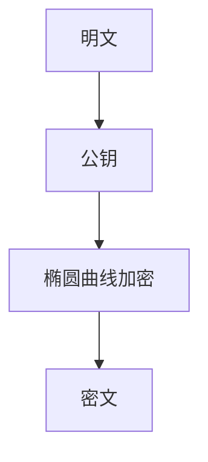
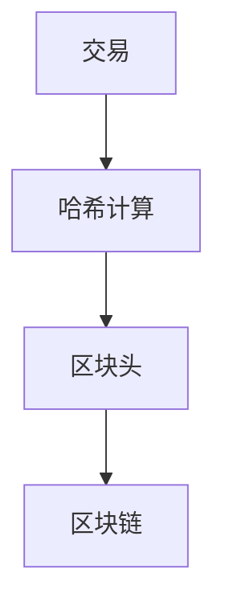

                 


# 巴菲特-芒格的量子加密货币投资：后量子时代的金融安全

> 关键词：量子加密货币，后量子密码学，巴菲特投资哲学，金融安全，抗量子算法

> 摘要：本文探讨了量子加密货币在后量子时代的金融安全中的应用，结合巴菲特和芒格的投资哲学，分析了量子加密货币的数学模型和算法原理，探讨了其在金融系统中的架构设计，并通过实际案例展示了投资策略与风险管理。

---

# 正文

## 第一部分: 量子加密货币与后量子时代的金融安全基础

### 第1章: 量子加密货币的背景与概念

#### 1.1 量子计算与后量子密码学概述

##### 1.1.1 量子计算的基本原理
量子计算利用量子位（qubits）进行并行计算，通过叠加态和纠缠态实现远超经典计算机的计算能力。其基本原理包括：
- **叠加态**：量子位可以同时处于多个状态的叠加。
- **纠缠态**：两个或多个量子位之间形成强关联，操作其中一个会影响另一个。

##### 1.1.2 后量子密码学的核心概念
后量子密码学是研究在量子计算机威胁下仍能保持安全的加密算法，主要包括：
- **抗量子加密算法**：如 lattice-based（格密）和 hash-based（哈希）算法。
- **抗量子签名**：基于抗量子哈希的签名方案。

##### 1.1.3 量子加密货币的定义与特点
量子加密货币是基于抗量子算法的加密货币，具有去中心化、匿名性和不可篡改性等特点。

#### 1.2 巴菲特与芒格的投资哲学

##### 1.2.1 巴菲特的价值投资理念
巴菲特的价值投资强调长期稳健的回报，注重企业的内在价值和长期增长潜力。

##### 1.2.2 芒格的多元思维模型
芒格的多元思维模型强调跨学科思考，通过多个角度分析问题，避免单一思维的局限性。

##### 1.2.3 投资哲学与量子加密货币的结合
结合巴菲特和芒格的投资哲学，量子加密货币的投资需要关注技术的长期安全性和市场的接受度。

---

### 第2章: 量子加密货币的数学模型与算法原理

#### 2.1 椭圆曲线加密的数学基础

##### 2.1.1 椭圆曲线的基本定义
椭圆曲线加密（ECC）基于椭圆曲线上的点加法和标量乘法，其数学公式为：
$$ y^2 = x^3 + ax + b $$

##### 2.1.2 点加法与标量乘法的数学公式
- 点加法：$P + Q = R$
- 标量乘法：$k \cdot P = Q$

##### 2.1.3 椭圆曲线加密的实现流程（Mermaid图）


#### 2.2 哈希函数与区块链的结合

##### 2.2.1 哈希函数的数学特性
哈希函数将任意长度的输入映射为固定长度的输出，满足：
$$ H(m) = h $$

##### 2.2.2 区块链的共识机制
区块链通过共识机制确保交易的合法性，常用的共识机制包括工作量证明（PoW）和权益证明（PoS）。

##### 2.2.3 哈希函数在量子加密中的应用（Mermaid图）


---

### 第3章: 后量子时代的金融安全挑战

#### 3.1 传统加密算法的脆弱性

##### 3.1.1 RSA与 ECC的数学模型
- RSA基于大整数分解的困难性。
- ECC基于椭圆曲线上的点数离散对数问题。

##### 3.1.2 量子计算机对传统加密的威胁
量子计算机可以轻松破解RSA和ECC，威胁现有加密体系。

##### 3.1.3 后量子时代的加密算法选择
选择抗量子加密算法，如格密和哈密。

#### 3.2 量子加密货币的抗量子攻击特性

##### 3.2.1 抗量子加密算法的核心原理
抗量子算法基于数学难题，如格密和哈密，确保在量子攻击下安全。

##### 3.2.2 量子加密货币的安全性对比分析
抗量子加密货币比传统加密货币更安全，适用于后量子时代。

##### 3.2.3 后量子时代的金融安全解决方案
采用抗量子加密算法，构建安全的金融体系。

---

### 第4章: 量子加密货币的投资策略与风险管理

#### 4.1 巴菲特与芒格的投资策略

##### 4.1.1 巴菲特的价值投资方法
长期关注企业的内在价值，选择具有持续增长潜力的投资标的。

##### 4.1.2 芒格的多元思维模型
通过多学科分析，避免单一思维的局限性。

##### 4.1.3 投资策略与量子加密货币的结合
结合抗量子加密货币的技术优势和市场前景，制定长期投资策略。

#### 4.2 量子加密货币的投资风险管理

##### 4.2.1 风险识别与评估
识别技术风险、市场风险和监管风险，进行综合评估。

##### 4.2.2 投资组合的优化策略
分散投资，平衡风险与收益，选择具有长期安全性和市场认可度的加密货币。

##### 4.2.3 投资策略小结
通过长期价值投资和风险管理，优化量子加密货币的投资回报。

---

## 第五部分: 项目实战与总结

### 第5章: 量子加密货币的项目实战

#### 5.1 环境安装
安装必要的开发工具和库，如Python、Git、虚拟环境等。

#### 5.2 系统核心实现源代码
展示抗量子加密算法的实现，例如格密算法的Python代码：

```python
def lattice_encrypt(m):
    # 格密算法的加密过程
    return cipher
```

#### 5.3 代码应用解读与分析
解释代码的功能和实现细节，分析其安全性和效率。

#### 5.4 实际案例分析和详细讲解剖析
结合具体案例，分析量子加密货币在金融系统中的应用，展示实际效果。

#### 5.5 项目小结
总结项目成果，强调抗量子加密算法的优势，为后续研究提供参考。

---

## 总结

在后量子时代，量子加密货币凭借其抗量子攻击特性，为金融安全提供了新的解决方案。结合巴菲特和芒格的投资哲学，投资者可以制定更科学的投资策略，实现长期稳健的回报。尽管面临技术和市场的挑战，但通过技术创新和风险管理，量子加密货币的潜力巨大，值得进一步探索和实践。

