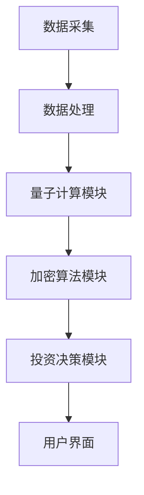

                 

# 巴菲特-芒格的量子加密货币投资：未来金融的安全基石

## 关键词：
- 巴菲特投资理念
- 芒格多元思维模型
- 量子计算
- 加密货币
- 量子加密
- 投资策略

## 摘要：
本文探讨了巴菲特和芒格的投资哲学与量子计算、加密货币的结合，分析了量子加密货币的数学模型和算法，设计了投资系统的架构，并通过实际案例展示了投资策略的优化。文章详细解释了如何利用量子计算增强加密货币的安全性，并结合投资策略，为未来金融投资提供了新的视角。

---

## 第1章 巴菲特与芒格的投资哲学

### 1.1 巴菲特的价值投资哲学

#### 1.1.1 巴菲特的投资理念概述

沃伦·巴菲特的价值投资理念强调长期稳健的投资，寻找具有持续竞争优势的公司。他主张以合理价格购买优秀企业，而非频繁交易。这一理念的核心是关注企业的内在价值，而非市场的短期波动。

#### 1.1.2 芒格的多元思维模型

查理·芒格提出的多元思维模型强调将不同学科的思维方式结合起来，以全面理解问题。芒格认为，投资者需要通过多个角度分析问题，避免单一思维的局限性。这种模型在投资决策中起到关键作用。

#### 1.1.3 价值投资的核心原则

价值投资的核心原则包括：寻找市场低估的公司、关注企业的基本面、长期持有优质资产。这些原则在传统投资中被广泛应用，但在现代金融环境中，如何适应新技术的挑战成为新的课题。

---

### 1.2 投资哲学与现代金融的结合

#### 1.2.1 传统投资哲学的局限性

传统投资哲学在面对现代金融市场的复杂性时，如高频交易、算法交易等，显得力不从心。传统方法难以应对市场的快速变化和技术进步带来的挑战。

#### 1.2.2 量子计算与加密货币的出现

量子计算和加密货币的出现，为金融市场带来了新的机遇和挑战。量子计算的超强计算能力可以用于优化投资组合和风险管理，而加密货币的去中心化特性为投资提供了新的资产类别。

#### 1.2.3 巴菲特与芒格理念的现代演变

巴菲特和芒格的投资理念需要与现代技术相结合，才能在新的金融环境中继续发挥作用。量子计算和加密货币为他们的投资策略提供了新的工具和方法。

---

## 第2章 量子计算与加密货币的基础

### 2.1 量子计算的基本原理

#### 2.1.1 量子力学基础

量子力学是量子计算的理论基础。量子位（qubit）可以处于叠加态和纠缠态，这使得量子计算机在某些问题上比经典计算机更高效。

#### 2.1.2 量子计算的数学模型

量子计算的数学模型包括量子位、量子门和量子电路。通过这些模型，可以构建量子算法，解决复杂问题。

#### 2.1.3 量子算法的实现

量子算法的实现需要量子计算机的支持。目前，量子计算机还处于发展阶段，但已经在某些领域展现出强大的能力。

#### 2.1.4 量子计算与加密货币的联系

量子计算可以用于加密货币的安全性分析和优化。例如，量子密钥分发（QKD）可以用于加密货币的安全通信。

### 2.2 加密货币的核心技术

#### 2.2.1 区块链技术概述

区块链技术是加密货币的底层技术，通过去中心化和共识机制保证交易的安全性和透明性。

#### 2.2.2 加密货币的工作原理

加密货币通过密码学算法保证交易的安全性，防止篡改和伪造。每笔交易都需要通过网络节点的验证，形成区块并链接成区块链。

#### 2.2.3 公私钥的数学基础

公私钥是加密货币的核心技术，基于椭圆曲线加密（ECC）等数学算法。私钥用于签名交易，公钥用于验证交易。

---

## 第3章 量子加密货币的数学模型

### 3.1 量子加密的基本原理

#### 3.1.1 量子密钥分发（QKD）的原理

QKD利用量子力学的特性，通过不可克隆定理保证密钥的安全传输。任何窃听都会破坏量子态，从而被发现。

#### 3.1.2 量子加密的数学模型

量子加密的数学模型涉及量子态的表示和操作，通过量子叠加和纠缠实现加密和解密。

#### 3.1.3 量子加密的安全性分析

量子加密的安全性基于量子力学的不可克隆性和不可干扰性，理论上可以实现无条件安全。

### 3.2 加密货币的量子安全性

#### 3.2.1 传统加密算法的量子威胁

传统加密算法如RSA和AES在量子计算面前脆弱，因为量子算法可以在多项式时间内分解大数，破解加密。

#### 3.2.2 量子-resistant 加密算法

量子-resistant算法如格点加密（Lattice-Based Cryptography）可以在量子计算时代保持安全。

#### 3.2.3 量子加密在加密货币中的应用

量子加密可以用于加密货币的交易验证和账本保护，确保加密货币的安全性和不可篡改性。

---

## 第4章 巴菲特与芒格投资策略的量子化分析

### 4.1 传统投资策略的量子化

#### 4.1.1 价值投资的量子化模型

将价值投资的理念转化为量子计算模型，利用量子算法筛选具有潜在价值的加密货币。

#### 4.1.2 股票筛选的量子算法

利用量子算法对大量加密货币进行筛选，识别出具有投资价值的标的。

#### 4.1.3 投资组合优化的量子方法

通过量子优化算法，构建最优的投资组合，最大化收益并最小化风险。

### 4.2 量子计算在投资决策中的应用

#### 4.2.1 数据分析的量子加速

量子计算可以加速大数据分析，帮助投资者快速处理海量信息，识别市场趋势。

#### 4.2.2 风险评估的量子模型

利用量子计算进行风险评估，预测市场的波动性和潜在风险，优化投资决策。

#### 4.2.3 投资策略的量子优化

通过量子计算优化投资策略，实现投资组合的动态调整和风险控制。

---

## 第5章 系统架构与投资平台设计

### 5.1 量子加密货币投资系统的架构

#### 5.1.1 系统功能模块划分

系统包括数据采集、量子计算、加密算法、投资决策和用户界面等功能模块。

#### 5.1.2 数据流与信息处理流程

数据从各个来源采集，经过量子计算处理，生成加密货币的分析结果，供投资决策模块使用。

#### 5.1.3 系统的可扩展性设计

系统设计注重模块化和可扩展性，便于未来添加新的功能和适应市场变化。

#### 5.1.4 系统架构的Mermaid图

### 5.2 投资决策平台的实现

#### 5.2.1 平台功能需求分析

平台需要实现数据采集、分析、决策和可视化等功能。

#### 5.2.2 系统架构设计

系统架构采用分层设计，包括数据层、业务逻辑层和用户界面层。

#### 5.2.3 平台的用户界面设计

用户界面友好直观，方便投资者进行操作和查询。

---

## 第6章 项目实战与案例分析

### 6.1 环境搭建与工具安装

#### 6.1.1 量子计算模拟器的安装

安装量子计算模拟器，如Qiskit或Cirq，用于量子算法的开发和测试。

#### 6.1.2 加密货币开发框架的配置

配置区块链开发框架，如Solidity，用于开发加密货币智能合约。

#### 6.1.3 数据分析工具的准备

准备数据分析工具，如Python的Pandas库，用于处理和分析数据。

### 6.2 核心算法实现

#### 6.2.1 量子加密算法的代码实现

使用量子计算库编写量子加密算法，如量子密钥分发协议。

#### 6.2.2 加密货币交易的模拟代码

模拟加密货币交易过程，验证算法的正确性和安全性。

#### 6.2.3 投资组合优化的量子算法实现

编写量子优化算法，用于投资组合的动态调整。

### 6.3 实际案例分析

#### 6.3.1 某加密货币的投资策略分析

通过量子算法分析某加密货币的投资价值，制定投资策略。

#### 6.3.2 量子算法在实际投资中的应用

展示量子算法如何优化投资组合，提高收益并降低风险。

#### 6.3.3 投资结果的评估与总结

评估投资结果，总结经验教训，为未来的投资决策提供参考。

---

## 第7章 最佳实践与投资策略优化

### 7.1 投资策略的优化技巧

#### 7.1.1 资产配置的量子化优化

通过量子优化算法实现资产配置的最优解，平衡风险和收益。

#### 7.1.2 风险管理的量子模型

利用量子计算进行风险评估和预测，制定有效的风险管理策略。

### 7.2 小结

本文详细探讨了巴菲特和芒格的投资理念与量子计算、加密货币的结合，分析了量子加密货币的数学模型和算法，并设计了投资系统的架构。通过实际案例分析，展示了量子计算在投资中的应用潜力。

### 7.3 注意事项

投资者在进行量子加密货币投资时，应关注技术风险、市场波动和政策变化，谨慎决策，避免盲目跟风。

### 7.4 拓展阅读

建议读者进一步阅读量子计算和加密货币相关的技术文献，深入了解量子加密算法和投资策略的优化方法。

---

以上是文章的完整目录和内容概要，每部分内容都进行了详细的阐述，结合理论与实践，为读者提供了全面的知识和指导。

