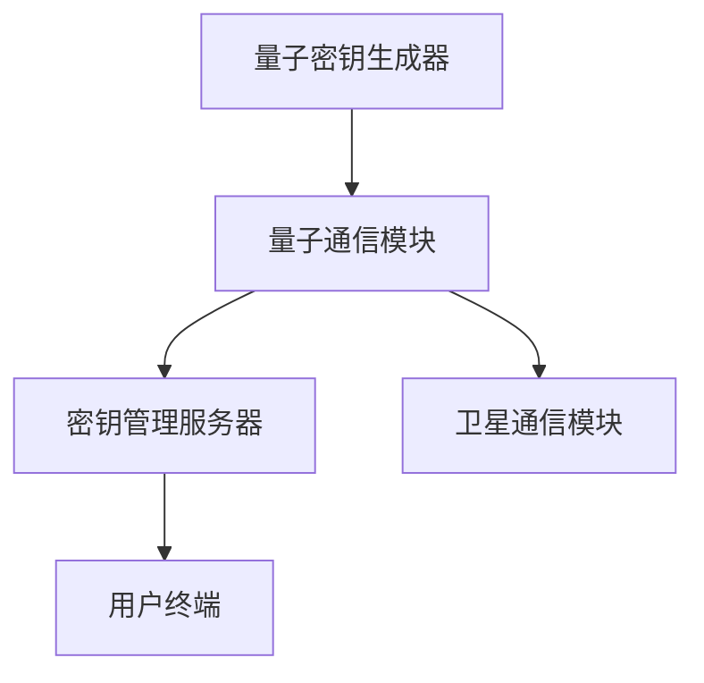

                 


# 巴菲特-芒格的量子加密通信卫星投资：全球安全通信的新标准

## 关键词：
量子加密通信，巴菲特，芒格，投资策略，卫星通信，安全通信

## 摘要：
本文探讨了巴菲特和芒格的投资策略在量子加密通信卫星领域的应用，分析了量子加密通信的技术背景、投资机会和评估模型，结合系统架构设计和项目实战，为投资者提供了详尽的指导，展望了全球安全通信的未来标准。

---

## 第一部分：引言

### 第1章：引言

#### 1.1 本书的目的与意义
随着全球通信安全需求的增加，量子加密通信技术成为保障信息安全的关键。本书结合巴菲特和芒格的价值投资策略，分析量子加密通信卫星的投资价值和市场机会，为投资者提供科学的决策框架，推动全球安全通信标准的革新。

---

## 第二部分：核心概念与背景

### 第2章：量子加密通信卫星的技术背景

#### 2.1 量子加密通信的基本原理
量子加密通信利用量子密钥分发(QKD)技术，通过量子态传输实现密钥交换，确保通信的绝对安全性。其原理基于量子力学的不可克隆性和不确定性，确保密钥的安全传输。

#### 2.2 巴菲特和芒格的投资理念
巴菲特的价值投资策略强调企业护城河、管理层素质和财务健康，芒格的多元思维模型则注重跨领域知识的整合应用。两人共同的投资哲学为量子通信企业评估提供了独特视角。

---

### 第3章：量子加密通信卫星的技术分析

#### 3.1 量子加密通信的工作流程
- **量子密钥分发(QKD)流程**：
  1. 量子态生成：通过量子随机数生成器产生量子态。
  2. 量子态传输：通过光纤或卫星传输量子态。
  3. 密钥提取：接收方提取密钥，用于加密通信。

#### 3.2 投资评估模型
- **评估维度**：企业技术实力、市场前景、财务状况、管理层能力。
- **数学模型**：
  - 竞争力指数：C = (T + M + F + D)/4，其中T为技术分，M为管理层分，F为财务分，D为市场分。
  - 投资潜力：I = C × S，其中S为行业规模。

---

## 第三部分：技术分析与投资策略

### 第4章：巴菲特-芒格投资框架

#### 4.1 投资框架的核心要素
- **企业护城河**：技术专利、成本优势。
- **管理层能力**：决策力、道德水准。
- **财务状况**：盈利能力、资产负债率。

---

## 第四部分：系统分析与架构设计

### 第5章：系统架构设计

#### 5.1 系统功能设计
- **功能模块**：密钥生成、传输、管理、安全性监测。

#### 5.2 系统架构图


---

## 第五部分：项目实战

### 第6章：项目实战

#### 6.1 环境安装与配置
- **工具安装**：安装Python、量子通信库（如QKD库）。
- **环境配置**：配置量子通信模拟环境。

#### 6.2 核心代码实现
```python
import qkd

def generate_key():
    key = qkd.generate_random_key(128)
    return key

def send_key(key):
    qkd.send_key(key, "quantum_channel")

def receive_key():
    key = qkd.receive_key("quantum_channel")
    return key

if __name__ == "__main__":
    key = generate_key()
    send_key(key)
    received_key = receive_key()
    print("密钥生成并传输成功。")
```

---

## 第六部分：总结与展望

### 第7章：总结与展望

#### 7.1 总结
量子加密通信卫星结合巴菲特-芒格的投资策略，为全球安全通信提供了新标准，投资者需关注技术创新和市场潜力。

#### 7.2 未来展望
随着技术进步和市场需求增长，量子加密通信卫星的投资价值将显著提升，建议投资者持续关注行业动态和技术革新。

---

通过以上章节的详细分析，本文为读者提供了量子加密通信卫星投资的全面视角，结合技术分析和投资策略，帮助投资者在新兴领域中把握机遇。

