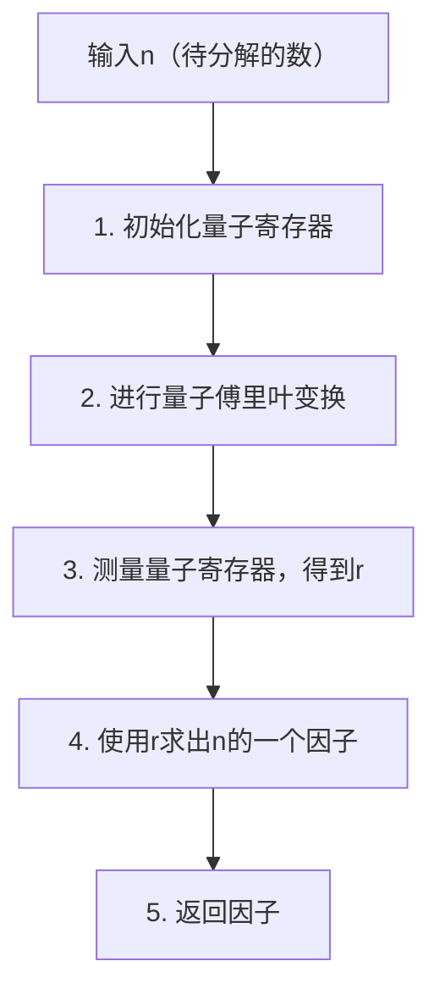
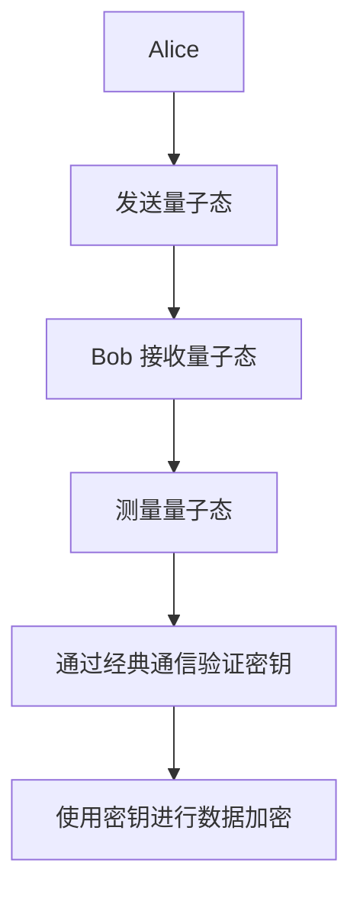
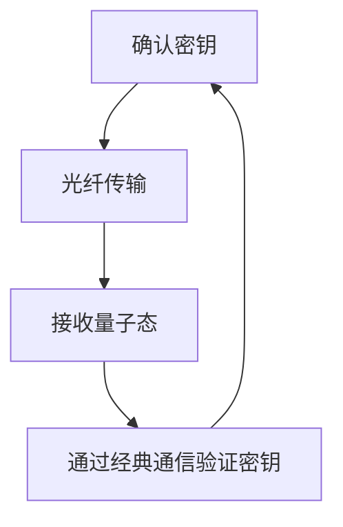
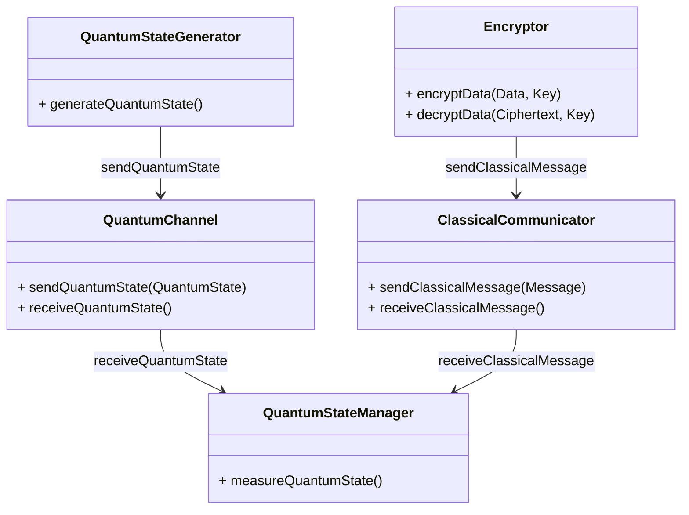

                 


# 巴菲特-芒格的量子加密通信投资：后量子时代的数据安全

## 关键词：
量子加密通信，后量子时代，巴菲特，芒格，数据安全，量子计算，投资策略

## 摘要：
本文深入探讨了量子加密通信在后量子时代的数据安全中的应用，结合巴菲特和芒格的投资理念，分析了量子加密技术如何影响投资策略和风险管理。文章从量子计算的基本原理到量子加密算法的实现，再到系统架构与安全设计，详细阐述了量子加密技术的原理和应用，并通过实际案例分析，展示了如何将量子加密技术应用于投资实践。最后，本文展望了量子加密技术的未来发展方向，并提出了相应的投资策略和风险管理建议。

---

## 第一部分：量子加密通信的背景与概述

### 第1章：量子加密通信的背景与概述

#### 1.1 量子计算的基本原理

量子计算是基于量子力学原理的一种计算方式，与经典计算有着本质的区别。量子计算的核心在于利用量子叠加和量子纠缠的特性，能够在更短的时间内完成某些复杂的计算任务。

**1.1.1 量子位与经典位的区别**

- **经典位（bit）**：经典计算机中的基本单位，只能是0或1。
- **量子位（qubit）**：量子计算机中的基本单位，可以同时处于0和1的叠加态。

**1.1.2 量子叠加与量子纠缠的原理**

- **量子叠加**：量子位可以同时处于多个状态的叠加态，例如|0⟩和|1⟩的叠加态可以表示为α|0⟩ + β|1⟩，其中α和β是复数，满足|α|² + |β|² = 1。
- **量子纠缠**：两个或多个量子位之间形成一种特殊的关系，使得其中一个量子位的状态能够直接影响另一个量子位的状态，即使它们相隔很远。

**公式推导：**

假设我们有两个量子位，它们处于纠缠态：
$$
|\psi\rangle = \frac{1}{\sqrt{2}}(|00\rangle + |11\rangle)
$$
这意味着当第一个量子位测量为0时，第二个量子位必然为0；当第一个量子位测量为1时，第二个量子位必然为1。

**1.1.3 量子计算的基本运算**

量子计算中的基本运算包括量子门操作，例如Hadamard门、CNOT门等。这些门操作可以对量子位的状态进行变换，从而实现复杂的计算任务。

**Hadamard门的作用：**
$$
H|0\rangle = \frac{1}{\sqrt{2}}(|0\rangle + |1\rangle)
$$
$$
H|1\rangle = \frac{1}{\sqrt{2}}(|0\rangle - |1\rangle)
$$

---

#### 1.2 后量子时代的背景

后量子时代是指在量子计算机已经能够有效破解现有加密算法的时代。在这个时代，传统的加密算法将不再安全，因此需要寻找新的加密方法，例如量子加密通信。

**1.2.1 传统加密算法的局限性**

传统的加密算法，如RSA和椭圆曲线加密，依赖于大数分解和离散对数问题的难度。然而，随着量子计算机的发展，这些问题将变得容易被解决。

**1.2.2 量子计算对现有加密技术的威胁**

- **RSA算法**：基于大数分解的问题，量子计算机可以通过Shor算法在多项式时间内分解大数，从而破解RSA加密。
- **椭圆曲线加密**：基于离散对数问题，量子计算机同样可以通过Shor算法在多项式时间内解决问题。

**Shor算法的流程图：**



**1.2.3 后量子时代的定义与特征**

后量子时代是指在量子计算机已经能够有效破解传统加密算法的时代。这个时代的主要特征是需要采用新的加密技术，如量子加密通信，来保证数据的安全性。

---

#### 1.3 量子加密通信的重要性

**1.3.1 量子加密通信的核心优势**

量子加密通信的主要优势在于其安全性。通过量子密钥分发（QKD），可以在通信双方之间建立一个安全的密钥，从而实现信息的加密传输。

**1.3.2 量子加密在数据安全中的应用领域**

- **金融领域**：保护金融交易的安全性，防止数据泄露和篡改。
- **军事领域**：保障军事通信的安全，防止敌方窃取信息。
- **商业领域**：保护企业的敏感数据，防止竞争对手的窃取。

**1.3.3 量子加密与投资策略的关系**

量子加密技术不仅能够保护数据的安全性，还能够在投资策略中发挥重要作用。例如，投资者可以通过量子加密技术来保护自己的投资信息，防止被竞争对手窃取。

---

## 第二部分：量子加密算法的原理与实现

### 第2章：量子加密算法的原理与实现

#### 2.1 量子加密算法的核心原理

**2.1.1 量子加密算法的基本模型**

量子加密算法的核心是量子密钥分发（QKD），其基本模型包括以下几个步骤：

1. **生成量子密钥**：通信双方通过量子态的传输和测量，生成一个共享的量子密钥。
2. **密钥验证**：通过经典通信对生成的密钥进行验证，确保其完整性和正确性。
3. **数据加密**：使用生成的量子密钥对数据进行加密，确保数据的安全传输。

**量子密钥分发的流程图：**



**2.1.2 量子加密算法的数学基础**

量子加密算法的数学基础主要涉及量子态的叠加和纠缠，以及量子测量的原理。例如，量子态的叠加可以表示为：

$$
|\psi\rangle = \alpha|0\rangle + \beta|1\rangle
$$

其中，α和β是复数，满足归一化条件：

$$
|\alpha|^2 + |\beta|^2 = 1
$$

**2.1.3 量子加密算法的关键步骤**

1. **量子态的生成与传输**：Alice生成一个量子态，并将其发送给Bob。
2. **量子态的测量**：Bob对收到的量子态进行测量，生成一个随机的密钥。
3. **密钥的验证与同步**：通过经典通信对生成的密钥进行验证，并确保Alice和Bob的密钥同步。

---

#### 2.2 量子加密算法的实现流程

**2.2.1 量子密钥分发（QKD）的实现**

QKD的实现过程包括以下几个步骤：

1. **量子态的生成**：Alice生成一组量子态，例如通过激光器生成单光子。
2. **量子态的传输**：通过光纤或量子中继器将量子态传输给Bob。
3. **量子态的测量**：Bob对收到的量子态进行测量，生成一个随机的密钥。
4. **密钥的验证**：通过经典通信对生成的密钥进行验证，并确保其完整性和正确性。

**QKD的实现流程图：**



**2.2.2 量子加密协议的设计**

量子加密协议的设计需要考虑以下几个方面：

1. **协议的安全性**：确保协议能够抵抗各种潜在的攻击，例如中间人攻击。
2. **协议的效率**：确保协议能够在合理的时间内完成密钥的生成和验证。
3. **协议的可扩展性**：确保协议能够适用于不同的通信环境和网络条件。

**2.2.3 量子加密算法的优化与改进**

随着量子计算技术的发展，量子加密算法也在不断优化和改进。例如，通过引入更多的量子纠缠和更复杂的量子态，可以进一步提高密钥的安全性和传输效率。

---

#### 2.3 量子加密算法的数学模型

**2.3.1 量子加密的数学表达式**

量子加密的数学表达式主要涉及量子态的叠加和纠缠。例如，两个量子位的纠缠态可以表示为：

$$
|\psi\rangle = \frac{1}{\sqrt{2}}(|00\rangle + |11\rangle)
$$

**2.3.2 量子加密算法的公式推导**

通过公式推导，可以进一步理解量子加密算法的数学模型和实现原理。例如，量子密钥分发的协议可以通过以下公式表示：

$$
|\psi\rangle = \alpha|0\rangle + \beta|1\rangle
$$

其中，α和β是复数，满足归一化条件：

$$
|\alpha|^2 + |\beta|^2 = 1
$$

**2.3.3 量子加密算法的复杂度分析**

量子加密算法的复杂度分析主要涉及计算资源和时间复杂度。例如，QKD协议的时间复杂度可以通过以下公式表示：

$$
T = O(n)
$$

其中，n是量子态的数量。

---

## 第三部分：数据安全与投资策略

### 第3章：数据安全与投资策略

#### 3.1 投资者视角下的数据安全

**3.1.1 投资者对数据安全的需求**

在后量子时代，投资者对数据安全的需求日益增加。例如，金融投资者需要保护自己的交易数据，防止被竞争对手窃取。

**3.1.2 量子加密技术在投资中的应用**

量子加密技术在投资中的应用主要体现在以下几个方面：

1. **保护投资信息**：通过量子加密技术，投资者可以保护自己的投资信息，防止被竞争对手窃取。
2. **确保交易的安全性**：通过量子加密通信，投资者可以确保自己的交易信息不会被第三方窃取或篡改。
3. **提升投资决策的准确性**：通过量子加密技术，投资者可以更准确地获取市场信息，从而做出更明智的投资决策。

**3.1.3 量子加密技术对投资策略的影响**

量子加密技术对投资策略的影响主要体现在以下几个方面：

1. **投资信息的保密性**：通过量子加密技术，投资者可以确保自己的投资信息不会被泄露，从而保护自己的投资策略。
2. **投资决策的及时性**：通过量子加密通信，投资者可以更快地获取市场信息，从而做出更及时的投资决策。
3. **投资风险的降低**：通过量子加密技术，投资者可以降低投资风险，例如防止投资信息被篡改或伪造。

---

#### 3.2 巴菲特和芒格的投资理念与量子加密技术

**3.2.1 巴菲特的投资理念**

巴菲特的投资理念主要包括长期价值投资和安全边际原则。他认为，投资者应该选择那些具有长期竞争优势和良好管理的企业进行投资。

**3.2.2 芒格的智慧与量子加密技术**

芒格的智慧主要包括独立思考和避免从众心理。他认为，投资者应该独立思考，避免受到市场情绪的影响。

**3.2.3 量子加密技术与投资策略的结合**

通过结合巴菲特和芒格的投资理念，可以更好地利用量子加密技术来优化投资策略。例如，投资者可以通过量子加密技术来保护自己的投资信息，从而更好地实现长期价值投资的目标。

---

#### 3.3 量子加密技术在投资中的实际应用

**3.3.1 量子加密技术在金融交易中的应用**

在金融交易中，量子加密技术可以用于保护交易信息的安全性，防止信息被窃取或篡改。

**3.3.2 量子加密技术在投资风险管理中的应用**

通过量子加密技术，投资者可以更好地管理投资风险，例如通过量子加密通信来确保风险管理信息的安全性。

**3.3.3 量子加密技术在投资决策支持中的应用**

通过量子加密技术，投资者可以更准确地获取市场信息，从而做出更明智的投资决策。

---

#### 3.4 量子加密技术的长期投资价值

**3.4.1 量子加密技术的市场前景**

随着量子计算技术的发展，量子加密技术的市场需求将不断增加。例如，金融行业对量子加密技术的需求将随着金融交易的增加而增加。

**3.4.2 量子加密技术的投资机会**

投资者可以通过投资量子加密技术相关的企业或项目，来获得长期的投资回报。例如，投资者可以投资于量子加密通信设备制造商或量子加密算法研究机构。

**3.4.3 量子加密技术的挑战与风险**

尽管量子加密技术具有广阔的市场前景，但其发展也面临一些挑战和风险，例如技术壁垒高、市场竞争激烈等。

---

## 第四部分：系统架构与安全设计

### 第4章：系统架构与安全设计

#### 4.1 量子加密通信系统的架构设计

**4.1.1 系统功能设计**

量子加密通信系统的功能设计包括以下几个方面：

1. **量子态生成**：生成量子态，例如单光子或纠缠态。
2. **量子态传输**：通过光纤或量子中继器将量子态传输给接收方。
3. **量子态测量**：接收方对收到的量子态进行测量，生成密钥。
4. **密钥验证**：通过经典通信对生成的密钥进行验证。
5. **数据加密**：使用生成的密钥对数据进行加密，确保数据的安全传输。

**系统功能设计的mermaid类图：**



**4.1.2 系统架构设计**

量子加密通信系统的架构设计可以采用分层架构，包括以下几个层次：

1. **应用层**：提供用户接口和应用功能，例如数据加密和解密。
2. **量子层**：实现量子态的生成、传输和测量，例如通过光纤传输量子态。
3. **经典层**：实现经典通信和密钥验证，例如通过光纤传输经典数据。

**系统架构设计的mermaid架构图：**

```mermaid
graph TD
    ApplicationLayer --> QuantumLayer: sendQuantumState
    QuantumLayer --> ClassicalLayer: receiveQuantumState
    ClassicalLayer --> ApplicationLayer: sendClassicalMessage
```

---

#### 4.2 量子加密通信的安全性设计

**4.2.1 安全性分析**

量子加密通信的安全性主要依赖于量子密钥分发协议的安全性。通过量子密钥分发协议，通信双方可以生成一个共享的量子密钥，从而实现信息的安全传输。

**4.2.2 安全性保障措施**

1. **量子密钥分发协议的安全性**：通过选择安全的量子密钥分发协议，例如BB84协议，可以确保密钥的安全性。
2. **经典通信的安全性**：通过使用安全的经典通信渠道，例如VPN或SSL/TLS加密，可以确保密钥验证过程的安全性。
3. **量子态的保护**：通过使用量子中继器和量子存储技术，可以保护量子态的安全性，防止中间人攻击。

---

#### 4.3 量子加密通信系统的实现细节

**4.3.1 量子态的生成与传输**

量子态的生成与传输是量子加密通信系统的核心部分。例如，可以通过激光器生成单光子，并通过光纤将其传输给接收方。

**4.3.2 量子态的测量与密钥生成**

接收方对收到的量子态进行测量，生成一个随机的密钥。例如，通过测量单光子的偏振态，可以生成一个随机的二进制密钥。

**4.3.3 密钥的验证与同步**

通过经典通信对生成的密钥进行验证，并确保通信双方的密钥同步。例如，可以通过比较部分密钥来验证密钥的正确性。

---

## 第五部分：项目实战与案例分析

### 第5章：项目实战与案例分析

#### 5.1 量子加密通信系统的环境配置

**5.1.1 硬件环境**

- **量子态生成设备**：例如单光子源或纠缠态源。
- **量子态传输设备**：例如光纤或量子中继器。
- **量子态测量设备**：例如单光子探测器。

**5.1.2 软件环境**

- **量子密钥分发协议实现**：例如BB84协议的实现。
- **经典通信协议实现**：例如VPN或SSL/TLS加密。

---

#### 5.2 量子加密通信系统的实现

**5.2.1 核心代码实现**

以下是量子密钥分发协议的核心代码实现：

```python
import random

def generate_quantum_state(n):
    # 生成n个量子态，随机选择0或1
    return [random.choice([0, 1]) for _ in range(n)]

def measure_quantum_state(state):
    # 对量子态进行测量，返回测量结果
    return state

def verify_key(exchange_key, measured_key):
    # 验证生成的密钥是否正确
    return exchange_key == measured_key

# 生成量子态
n = 100
quantum_state = generate_quantum_state(n)

# 发送量子态（实际中通过量子通信信道传输）

# 接收量子态并进行测量
received_state = quantum_state
measured_key = measure_quantum_state(received_state)

# 通过经典通信验证密钥
exchange_key = measured_key[:50]  # 假设只验证前50位
verified = verify_key(exchange_key, exchange_key)

print("密钥验证结果：", verified)
```

**5.2.2 系统功能实现**

通过上述代码实现量子密钥分发协议，可以生成一个共享的量子密钥，并通过经典通信对其进行验证。

---

#### 5.3 量子加密通信的实际案例分析

**5.3.1 案例背景**

假设我们有一个金融交易系统，需要通过量子加密通信来保护交易数据的安全性。

**5.3.2 案例分析**

1. **量子密钥分发**：Alice（投资者）生成一个量子密钥，并将其发送给Bob（交易所）。
2. **密钥验证**：通过经典通信对生成的密钥进行验证。
3. **数据加密**：使用生成的密钥对交易数据进行加密，确保数据的安全传输。

**案例分析的mermaid序列图：**

```mermaid
graph TD
    Alice --> Bob: 发送量子态
    Bob --> Alice: 接收量子态
    Alice --> Bob: 生成密钥
    Bob --> Alice: 验证密钥
    Alice --> Bob: 发送加密数据
    Bob --> Alice: 接收解密数据
```

---

## 第六部分：投资策略与风险管理

### 第6章：投资策略与风险管理

#### 6.1 量子加密技术的投资机会

**6.1.1 量子加密技术的市场前景**

随着量子计算技术的发展，量子加密技术的市场需求将不断增加。例如，金融行业对量子加密技术的需求将随着金融交易的增加而增加。

**6.1.2 量子加密技术的投资机会**

投资者可以通过投资量子加密技术相关的企业或项目，来获得长期的投资回报。例如，投资者可以投资于量子加密通信设备制造商或量子加密算法研究机构。

---

#### 6.2 巴菲特和芒格的投资策略

**6.2.1 巴菲特的长期价值投资**

巴菲特的长期价值投资理念强调选择具有长期竞争优势和良好管理的企业进行投资。

**6.2.2 芒格的独立思考与风险管理**

芒格的独立思考和风险管理理念强调避免从众心理，并通过独立思考来降低投资风险。

---

#### 6.3 量子加密技术的风险管理

**6.3.1 量子加密技术的风险分析**

量子加密技术的风险主要体现在以下几个方面：

1. **技术风险**：量子计算技术的发展可能会影响量子加密技术的安全性。
2. **市场风险**：量子加密技术的市场需求可能受到市场竞争和政策法规的影响。
3. **操作风险**：量子加密技术的实施可能面临操作风险，例如技术实现难度大。

**6.3.2 量子加密技术的风险管理策略**

1. **技术风险管理**：通过持续关注量子计算技术的发展，及时调整量子加密技术的实施方案。
2. **市场风险管理**：通过多元化投资策略，降低市场风险。
3. **操作风险管理**：通过建立完善的操作流程和内部控制机制，降低操作风险。

---

## 第七部分：未来展望与挑战

### 第7章：未来展望与挑战

#### 7.1 量子加密技术的未来发展方向

**7.1.1 量子加密技术的创新**

未来的量子加密技术将更加注重创新，例如通过引入新的量子态和新的量子纠缠技术，进一步提高量子加密通信的安全性和效率。

**7.1.2 量子加密技术的标准化**

随着量子加密技术的不断发展，其标准化将变得更加重要。例如，国际标准化组织（ISO）和国际电信联盟（ITU）将推动量子加密技术的标准化。

---

#### 7.2 量子加密技术的挑战

**7.2.1 技术挑战**

量子加密技术的发展面临技术挑战，例如量子态的传输和测量技术仍需进一步突破。

**7.2.2 市场挑战**

量子加密技术的市场推广面临挑战，例如市场认知度低、成本高等。

---

#### 7.3 量子加密技术的未来发展

随着技术的进步和市场的推广，量子加密技术将在未来得到更广泛的应用。例如，金融行业将更多地采用量子加密技术来保护交易数据的安全性，而政府和军队也将更加依赖量子加密技术来保障通信的安全性。

---

## 总结

量子加密通信技术在后量子时代的数据安全中具有重要的地位。通过结合巴菲特和芒格的投资理念，我们可以更好地利用量子加密技术来优化投资策略和风险管理。尽管量子加密技术的发展面临一些挑战，但其未来的发展前景广阔，值得投资者和企业的关注和投入。

---

**摘要**：本文从量子加密通信的基本原理出发，结合巴菲特和芒格的投资理念，深入分析了量子加密技术在后量子时代的数据安全中的应用。通过详细讲解量子加密算法的实现、系统架构与安全设计，以及实际案例分析，本文为投资者提供了量子加密技术在投资中的应用策略和风险管理建议。未来，随着量子加密技术的不断发展，其在投资中的应用将更加广泛和深入。

---

# END

