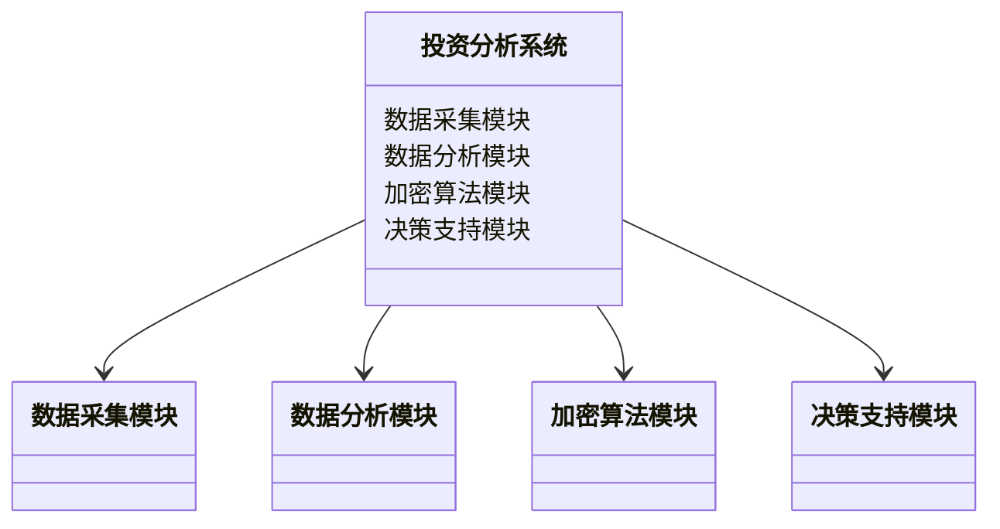
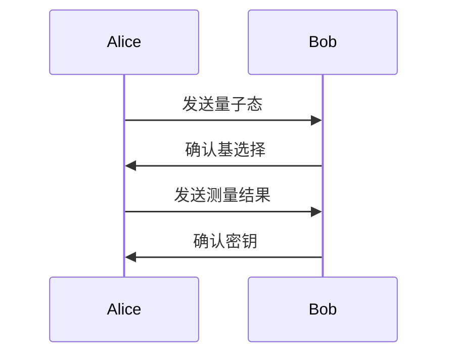

                 


# 巴菲特-芒格的量子密码学投资：后量子时代的网络安全

> 关键词：量子密码学，后量子时代，网络安全，巴菲特，芒格投资理念，Shor算法，QKD

> 摘要：本文探讨了巴菲特和芒格的投资理念与量子密码学的结合，特别是在后量子时代的网络安全背景下。通过分析量子计算对传统加密算法的威胁，本文揭示了后量子加密算法的投资机会，并展示了如何利用量子安全技术进行投资决策。文章详细讲解了量子密码学的核心原理、算法实现、系统架构，并通过实际案例分析了量子安全在投资中的应用。

---

## 第一部分: 巴菲特-芒格投资理念与量子密码学概述

### 第1章: 巴菲特-芒格投资理念与量子密码学概述

#### 1.1 巴菲特-芒格投资理念的核心要素

##### 1.1.1 巴菲特的价值投资原则

巴菲特的价值投资原则强调长期投资、安全边际和企业基本面分析。他主张投资那些具有强大护城河和持续盈利能力的企业。这种投资理念的核心在于寻找那些能够在长期市场波动中保持稳定的优质资产。

##### 1.1.2 芒格的多元思维模型

芒格的多元思维模型强调通过多学科的知识框架来理解问题。他认为，投资者应该具备跨学科的思维能力，能够将物理学、化学、心理学等知识结合起来，以做出更明智的投资决策。这种思维方式在面对复杂问题时尤为重要。

##### 1.1.3 投资理念与量子计算的结合

将巴菲特和芒格的投资理念与量子计算相结合，意味着我们需要将量子计算的技术发展和市场趋势纳入投资决策中。量子计算的崛起可能对传统加密算法构成威胁，从而影响网络安全市场的投资机会。

#### 1.2 量子密码学的基本概念

##### 1.2.1 量子计算的基本原理

量子计算利用量子叠加和量子纠缠的特性，能够在某些特定问题上比经典计算机更高效。例如，Shor算法可以在多项式时间内分解大整数，从而威胁到RSA等基于大整数分解的加密算法。

##### 1.2.2 传统密码学与量子密码学的对比

传统密码学依赖于数学上的困难问题，如大整数分解和离散对数问题。而量子密码学利用量子力学的特性，如量子密钥分发（QKD）和后量子加密算法，提供了更高的安全性。

##### 1.2.3 后量子时代的网络安全挑战

后量子时代指的是传统加密算法被量子计算机破解后的新时代。在这个时代，网络安全将面临前所未有的挑战，企业和个人需要采用新的加密技术来保护数据安全。

#### 1.3 巴菲特-芒格投资理念与量子密码学的结合

##### 1.3.1 量子计算对传统加密算法的威胁

随着量子计算机的发展，许多传统加密算法将被破解。这将对依赖这些算法的行业（如金融、医疗）构成重大威胁，同时也为新的加密技术提供了市场机会。

##### 1.3.2 后量子加密算法的投资机会

后量子加密算法（如NIST推荐的算法）将成为未来网络安全的核心技术。投资这些算法的研发和应用，可能带来巨大的商业机会。

##### 1.3.3 量子安全在投资决策中的应用

通过分析量子安全技术的市场前景，投资者可以识别出具有潜力的量子安全企业，并将其纳入投资组合中。

## 第二部分: 量子密码学的核心概念与数学模型

### 第2章: 量子密码学的核心原理

#### 2.1 量子叠加与量子纠缠的数学描述

##### 2.1.1 量子叠加原理

量子叠加原理表明，一个量子系统可以同时处于多个状态的叠加。例如，一个量子位（qubit）可以同时处于0和1的状态。

##### 2.1.2 量子纠缠的数学表达

量子纠缠是指两个或多个量子系统之间存在强关联。当一个系统的状态被测量时，另一个系统的状态也会被确定。纠缠态可以用Bell基表示。

#### 2.2 量子密钥分发（QKD）的原理

##### 2.2.1 QKD的基本流程

QKD通过量子态传输和基选择来生成共享密钥。Alice和Bob通过交换量子态并公开讨论基的选择，最终生成共享密钥。

##### 2.2.2 QKD的安全性分析

QKD的安全性基于量子力学的基本原理，任何试图窃听都会破坏量子态，从而被发现。

#### 2.3 后量子加密算法的数学模型

##### 2.3.1 椭圆曲线加密的数学基础

椭圆曲线加密（ECC）依赖于椭圆曲线上的点加法运算。其安全性基于椭圆曲线离散对数问题。

##### 2.3.2 哈希函数在后量子加密中的应用

哈希函数（如SHA-256）用于生成随机的密钥和签名。在后量子加密中，哈希函数的安全性同样重要。

#### 2.4 量子算法对传统加密算法的威胁

##### 2.4.1 Shor算法对RSA的威胁

Shor算法可以在多项式时间内分解大整数，从而破解RSA加密。

##### 2.4.2 Grover算法对对称加密的影响

Grover算法可以将对称加密的密钥空间减少一半，从而威胁到对称加密的安全性。

## 第三部分: 量子密码学的数学模型与算法实现

### 第3章: 量子算法的数学模型

#### 3.1 量子傅里叶变换的数学推导

##### 3.1.1 量子傅里叶变换的定义

量子傅里叶变换是量子计算中的一个基本变换，用于将输入状态转换到频域。

##### 3.1.2 量子傅里叶变换的公式推导

量子傅里叶变换可以通过量子位的叠加和干涉来实现。其数学表达式为：

$$
QFT|x\rangle = \frac{1}{\sqrt{2^n}} \sum_{k=0}^{2^n-1} e^{2\pi i \cdot \langle k|x \rangle / 2^n} |k\rangle
$$

其中，$n$是量子位数，$|k\rangle$是基向量。

#### 3.2 Shor算法的数学模型

##### 3.2.1 Shor算法的基本步骤

Shor算法用于分解大整数，主要包括量子部分和经典部分。量子部分通过量子傅里叶变换来寻找周期，经典部分用于验证结果。

##### 3.2.2 Shor算法的公式推导

Shor算法的核心是找到周期$r$，使得$x^r \equiv 1 \mod N$。通过量子测量，可以找到$r$的值。

---

## 第四部分: 系统分析与架构设计

### 第4章: 量子密码学系统的架构设计

#### 4.1 问题场景介绍

随着量子计算机的发展，传统加密算法的安全性受到威胁。为了应对这一挑战，需要设计一个基于后量子加密的投资分析系统。

#### 4.2 系统功能设计

##### 4.2.1 领域模型设计

领域模型展示了系统的功能模块，包括数据采集、分析、预测和决策支持。



##### 4.2.2 系统架构设计


#### 4.3 系统接口设计

##### 4.3.1 系统接口设计

系统接口包括数据输入、加密处理和结果输出。

##### 4.3.2 系统交互设计



---

## 第五部分: 项目实战

### 第5章: 量子密码学的项目实现

#### 5.1 环境安装

安装必要的库，如Qiskit和Cirq。

#### 5.2 量子随机数生成器的实现

##### 5.2.1 Python代码实现

```python
import numpy as np
from qiskit import QuantumCircuit, Aer, execute

def quantum_random_number():
    circuit = QuantumCircuit(1)
    circuit.h(0)
    circuit.measure(0, 0)
    backend = Aer.get_backend('qasm_simulator')
    result = execute(circuit, backend).result()
    return int(result.get_counts().keys()[0])
```

##### 5.2.2 代码应用解读

该代码实现了基于量子叠加的随机数生成器，利用量子态的不确定性生成随机数。

#### 5.3 后量子加密算法的实现

##### 5.3.1 QKD协议的实现

```python
def qkd_protocol(alice, bob):
    # 生成随机基
    alice_basis = np.random.choice([0, 1], size=len(alice))
    bob_basis = np.random.choice([0, 1], size=len(bob))
    
    # 公开讨论基
    common_basis = np.where(alice_basis == bob_basis)[0]
    
    # 提取密钥
    key = ''.join(str(alice[q]) for q in common_basis)
    return key
```

##### 5.3.2 代码应用解读

该代码实现了QKD协议的核心部分，包括基选择和密钥提取。

#### 5.4 实际案例分析

##### 5.4.1 投资案例分析

分析一家专注于后量子加密算法的企业，评估其市场前景和投资价值。

#### 5.4.2 投资决策模拟

通过模拟量子安全技术的市场趋势，预测其投资回报。

#### 5.4.3 项目小结

量子安全技术的投资机会巨大，但需要深入了解技术细节和市场趋势。

---

## 第六部分: 最佳实践与总结

### 第6章: 投资中的量子安全应用

#### 6.1 关键点总结

##### 6.1.1 技术趋势

后量子加密算法将成为未来的主流技术。

##### 6.1.2 风险管理

投资者需要关注量子计算的进展和企业的技术储备。

##### 6.1.3 持续学习

保持对量子计算和投资市场的关注，及时调整投资策略。

#### 6.2 注意事项

##### 6.2.1 技术风险

量子计算的发展可能比预期慢。

##### 6.2.2 市场风险

后量子加密算法的市场接受度可能低于预期。

#### 6.3 拓展阅读

推荐阅读NIST的后量子加密标准文档和相关学术论文。

---

## 第七部分: 结语

后量子时代的网络安全将彻底改变投资格局。通过将巴菲特和芒格的投资理念与量子密码学结合，投资者可以在新的市场环境下找到机遇。然而，这也需要投资者具备跨学科的知识和对技术趋势的敏锐洞察。

---

# 结束语

量子计算的崛起将推动网络安全技术的革新。投资者需要紧跟技术发展，抓住后量子加密算法的投资机会，同时规避传统加密算法被淘汰的风险。通过巴菲特和芒格的投资理念，我们可以更好地应对后量子时代的网络安全挑战。

---

# 参考文献

（此处列出相关参考文献，如NIST的后量子加密标准文档、量子计算相关书籍等。）

