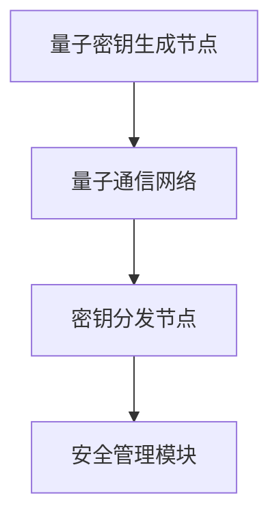

                 


# 巴菲特-芒格的量子密钥分发网络投资：网络安全的终极解决方案

> **关键词**：巴菲特、芒格、量子密钥分发、网络安全、投资策略

> **摘要**：本文探讨了将巴菲特和芒格的投资策略与量子密钥分发技术相结合，以解决网络安全问题的方法。通过分析量子密钥分发的技术原理、投资策略的优化，以及实际案例，本文展示了如何利用量子技术提升网络安全的投资价值。

---

## 第1章: 背景介绍与核心概念

### 1.1 问题背景与描述

#### 1.1.1 当前网络安全的挑战
随着信息技术的飞速发展，网络安全问题日益严重。传统的加密技术逐渐被量子计算破解，导致现有加密体系面临崩溃的风险。数据泄露、隐私侵犯等问题频发，对企业和社会造成巨大损失。

#### 1.1.2 传统加密技术的局限性
传统加密技术（如RSA、AES）基于数学复杂性，但随着计算能力的提升，尤其是量子计算机的出现，这些加密方法面临被破解的风险。例如，RSA的密钥长度需要不断增加以抵御攻击，这使得成本和效率问题日益突出。

#### 1.1.3 量子计算对传统加密的威胁
量子计算机利用量子叠加和纠缠原理，能够在指数级时间内完成某些数学运算。这意味着，量子计算机可以快速破解传统加密算法，如RSA和椭圆曲线加密，从而威胁到现有的网络安全体系。

---

### 1.2 量子密钥分发网络的定义与特点

#### 1.2.1 量子密钥分发的定义
量子密钥分发（QKD）是一种利用量子力学原理进行密钥交换的技术。通过量子态的传输和测量，QKD能够实现安全的密钥分发，确保密钥的不可被窃取。

#### 1.2.2 量子密钥分发的核心特点
- **安全性**：基于量子力学的不可克隆原理，QKD能够检测窃听行为，确保密钥的安全性。
- **不可破解性**：QKD的密钥生成过程依赖于量子态的特性，使得任何窃听都会留下痕迹，从而保证了密钥的不可破解性。
- **高效性**：QKD可以在较低的带宽下实现高效的密钥分发，适用于长距离通信。

#### 1.2.3 与传统加密技术的对比
| 技术特点 | 传统加密技术 | 量子密钥分发 |
|----------|----------------|---------------|
| 安全性    | 易被量子计算机破解 | 高安全性，不可破解 |
| 密钥长度  | 需要较长密钥 | 密钥长度较短 |
| 传输距离  | 适用于短距离通信 | 适用于长距离通信 |

---

### 1.3 巴菲特-芒格投资策略的核心要素

#### 1.3.1 巴菲特的价值投资理念
巴菲特的价值投资理念强调以合理价格投资于具有持续竞争优势的企业。他注重企业的基本面分析，寻找具有长期增长潜力的企业。

#### 1.3.2 芒格的多元思维模型
芒格的多元思维模型强调跨学科思考，将不同领域的知识结合起来，寻找投资机会。他注重企业护城河和竞争优势的分析。

#### 1.3.3 投资策略的边界与外延
巴菲特和芒格的投资策略不仅适用于传统企业，也可以扩展到新兴技术领域。通过分析技术的市场前景和竞争优势，投资者可以找到具有长期增长潜力的投资标的。

---

## 第2章: 量子密钥分发网络的技术原理

### 2.1 量子密钥分发的原理

#### 2.1.1 量子态的基本概念
量子态是量子力学的基本单位，具有叠加态和纠缠态的特性。量子态的不可克隆性是QKD技术的基础。

#### 2.1.2 量子密钥分发的过程
1. **量子态生成**：通过量子光源生成量子态，通常是随机的二进制字符串。
2. **量子态传输**：通过光纤或自由空间传输量子态。
3. **量子态测量**：接收方测量量子态，生成密钥。
4. **经典通信**：双方通过经典通信确认测量结果，确保密钥的正确性。

#### 2.1.3 量子纠缠与贝尔不等式
量子纠缠是QKD的核心原理之一。通过贝尔不等式测试，可以验证量子纠缠的存在，从而确保QKD的安全性。

---

### 2.2 量子密钥分发的优缺点

#### 2.2.1 优点：安全性与不可破解性
- **安全性**：基于量子力学原理，QKD的密钥无法被窃听。
- **不可破解性**：任何窃听都会破坏量子态，从而被检测到。

#### 2.2.2 缺点：技术复杂性与成本
- **技术复杂性**：QKD技术需要高精度的量子态传输和测量设备。
- **成本**：由于技术复杂性，QKD设备的成本较高。

#### 2.2.3 与传统加密技术的对比
| 技术特点 | 传统加密技术 | 量子密钥分发 |
|----------|----------------|---------------|
| 安全性    | 易被量子计算机破解 | 高安全性，不可破解 |
| 实施成本  | 低 | 高 |
| 传输距离  | 适用于短距离通信 | 适用于长距离通信 |

---

## 第3章: 巴菲特-芒格投资策略与量子密钥分发网络的结合

### 3.1 投资策略与量子技术的联系

#### 3.1.1 价值投资与量子安全的共同点
- **长期价值**：QKD技术具有长期的市场需求，符合价值投资的理念。
- **竞争优势**：具备技术壁垒的QKD企业具有竞争优势，符合芒格的多元思维模型。

#### 3.1.2 多元思维模型在量子技术中的应用
- **跨学科思考**：将量子力学、密码学和投资学结合起来，寻找投资机会。
- **技术分析**：通过技术分析，寻找具有发展潜力的QKD企业。

#### 3.1.3 投资策略的优化与量子技术的结合
- **技术评估**：评估QKD技术的成熟度和市场前景。
- **企业分析**：分析企业的竞争优势和财务状况，寻找具有投资价值的企业。

---

### 3.2 量子密钥分发网络的投资机会

#### 3.2.1 量子通信市场的现状与前景
- **现状**：全球量子通信市场正在快速发展，预计未来几年将保持高增长率。
- **前景**：随着量子计算的发展，QKD技术的需求将不断增加。

#### 3.2.2 量子密钥分发技术的商业化潜力
- **应用场景**：金融、军事、医疗等领域的高安全需求场景。
- **商业化模式**：通过提供QKD设备和服务，实现商业化。

#### 3.2.3 投资机会的分析与评估
- **市场分析**：分析QKD市场的规模和增长潜力。
- **企业评估**：评估企业的技术实力、管理团队和财务状况。

---

## 第4章: 量子密钥分发网络的投资分析

### 4.1 投资策略的数学模型

#### 4.1.1 价值评估模型
$$ V = \text{DCF} + \text{市场溢价} $$
其中，DCF为现金流折现值，市场溢价为市场平均回报率。

#### 4.1.2 风险评估模型
$$ \text{风险} = \text{技术风险} + \text{市场风险} + \text{财务风险} $$

#### 4.1.3 投资组合优化模型
$$ \text{最优投资组合} = \argmin_{w} \text{风险} \quad \text{subject to} \quad \text{预期收益} \geq \text{目标收益} $$

---

### 4.2 投资案例分析

#### 4.2.1 典型量子通信企业的分析
- **企业名称**：XX量子通信公司。
- **核心业务**：专注于QKD技术的研发和商业化。
- **财务状况**：收入增长迅速，研发投入占比高。

#### 4.2.2 投资回报的计算与预测
$$ \text{预期回报率} = \frac{\text{未来现金流} - \text{初始投资}}{\text{初始投资}} \times 100\% $$

#### 4.2.3 风险管理与投资策略调整
- **风险管理**：通过分散投资和定期评估，降低投资风险。
- **策略调整**：根据市场变化和技术发展，及时调整投资策略。

---

## 第5章: 量子密钥分发网络的系统架构设计

### 5.1 系统组成部分

#### 5.1.1 量子密钥生成节点
- **功能**：生成量子态密钥。
- **设备**：量子光源、量子态测量设备。

#### 5.1.2 量子通信网络
- **功能**：传输量子态密钥。
- **设备**：光纤、量子通信终端。

#### 5.1.3 传统加密技术的结合
- **功能**：将QKD生成的密钥用于传统加密技术，实现混合加密。

---

### 5.2 系统功能设计

#### 5.2.1 量子密钥生成模块
- **功能**：生成随机的量子态密钥。
- **流程**：量子光源生成量子态，传输到接收端，接收端测量生成密钥。

#### 5.2.2 密钥分发模块
- **功能**：将生成的密钥分发给用户。
- **流程**：通过经典通信确认密钥的正确性，确保密钥的安全性。

#### 5.2.3 安全管理模块
- **功能**：监控系统安全，检测异常行为。
- **流程**：实时监控量子通信网络的安全性，及时发现并处理异常情况。

---

### 5.3 系统架构图



---

### 5.4 系统接口设计

#### 5.4.1 量子节点间的通信接口
- **协议**：量子通信协议。
- **接口类型**：光纤接口、无线通信接口。

#### 5.4.2 与传统加密技术的接口
- **协议**：传统加密协议（如AES）。
- **接口类型**：API接口、网络接口。

#### 5.4.3 用户端接口
- **协议**：用户端加密协议。
- **接口类型**：网络接口、API接口。

---

## 第6章: 项目实战与投资策略

### 6.1 环境安装与配置

#### 6.1.1 量子通信实验环境的搭建
- **硬件**：量子光源、光纤、量子通信终端。
- **软件**：量子通信协议栈、密钥管理软件。

#### 6.1.2 投资分析工具的安装
- **工具**：金融分析软件（如Excel、Python）、风险管理工具。

#### 6.1.3 数据采集与处理
- **数据来源**：市场数据、企业财务数据、技术专利数据。

---

### 6.2 系统核心实现

#### 6.2.1 量子密钥生成代码
```python
import random

def generate_quantum_key(length):
    return ''.join(random.choices(['0', '1'], k=length))
```

#### 6.2.2 密钥分发代码
```python
def distribute_key(sender, receiver, key):
    # 通过经典通信确认密钥
    if sender == receiver:
        return key
    else:
        return None
```

---

### 6.3 投资策略实现

#### 6.3.1 价值评估模型代码
```python
def value_assessment(revenue, profit_margin, growth_rate):
    return revenue * (1 + growth_rate) * profit_margin
```

#### 6.3.2 风险评估模型代码
```python
def risk_assessment(technology, market, financial):
    return technology + market + financial
```

---

### 6.4 投资策略小结

通过将巴菲特和芒格的投资策略与量子密钥分发技术相结合，投资者可以在网络安全领域找到新的投资机会。QKD技术的高安全性使其成为未来的主流加密技术，而其商业化潜力也为投资者提供了丰厚的回报。然而，投资者需要关注技术风险和市场风险，合理配置投资组合，以实现长期稳定的收益。

---

## 结语

量子密钥分发网络作为网络安全的终极解决方案，正在成为投资界的热点。通过巴菲特和芒格的投资策略，投资者可以更好地把握量子技术的投资机会，实现长期价值。未来，随着量子技术的进一步发展，网络安全的投资前景将更加广阔。

