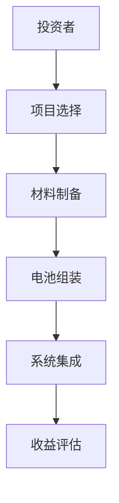

                 

# 巴菲特-芒格的量子点太阳能电池投资：新能源革命的催化剂

## 关键词：
巴菲特，芒格，量子点太阳能电池，新能源革命，投资策略，技术分析

## 摘要：
本文探讨巴菲特和芒格的投资理念如何应用于量子点太阳能电池这一新兴技术领域。通过分析其技术优势、市场潜力和投资策略，揭示该技术如何成为推动新能源革命的关键催化剂。

---

# 第一部分：背景介绍

## 第1章：巴菲特与芒格的投资哲学

### 1.1 巴菲特的价值投资理论

#### 1.1.1 价值投资的核心理念
- **长期主义**：投资应基于企业的长期价值，而非短期市场波动。
- **安全边际**：购买价格低于内在价值，以降低风险。
- **企业基本面**：关注企业的盈利能力、财务状况和竞争优势。

#### 1.1.2 巴菲特的投资策略与选股标准
- **选股标准**：寻找具有持续竞争优势、良好管理和稳定现金流的公司。
- **集中投资**：将资金集中在少数优质企业，以最大化收益。

#### 1.1.3 芒格的多元思维模型
- **跨学科思维**：通过多个学科的视角分析问题，避免单一思维的局限性。
- **决策框架**：结合概率论和逆向思维，评估投资的潜在风险和回报。

### 1.2 投资中的风险与回报

#### 1.2.1 风险与回报的权衡
- **高风险高回报**：新能源技术虽然前景广阔，但存在技术失败和市场波动的风险。
- **分散投资**：通过多元化投资降低风险，平衡不同领域和公司的投资。

#### 1.2.2 投资中的机会成本
- **机会成本**：选择投资某个项目意味着放弃其他潜在机会。
- **资本效率**：确保资金用于最有前景的领域，最大化资本回报。

#### 1.2.3 长期投资与复利效应
- **复利的重要性**：长期投资的复利效应能够显著提升回报。
- **耐心投资**：避免短期波动，坚持长期价值。

---

## 第2章：新能源革命的背景与催化剂

### 2.1 新能源革命的兴起

#### 2.1.1 全球能源结构的转变
- **化石能源的局限性**：资源枯竭、环境污染、气候变化等问题推动能源转型。
- **可再生能源的重要性**：太阳能、风能等可再生能源成为主要能源。

#### 2.1.2 可再生能源技术的进步
- **技术创新**：高效储能、智能电网和新型太阳能技术的进步推动能源革命。
- **政策支持**：各国政府的补贴和政策激励促进可再生能源的发展。

#### 2.1.3 政策驱动与市场趋势
- **政策驱动**：政府政策和法规对可再生能源的支持。
- **市场趋势**：市场需求的增长和技术成本的下降推动行业扩张。

### 2.2 量子点太阳能电池的技术优势

#### 2.2.1 量子点材料的基本特性
- **纳米尺度**：量子点材料在纳米尺度上表现出独特的光电性质。
- **可调性**：通过调整材料尺寸和组成，可以调节其光电特性。

#### 2.2.2 量子点太阳能电池的工作原理
- **光吸收**：量子点材料吸收特定波长的光，产生电子-空穴对。
- **电荷分离**：在电场作用下，电子和空穴分离，产生电流。
- **效率提升**：通过优化材料和结构设计，提高光电转换效率。

#### 2.2.3 与传统太阳能电池的对比分析
| 特性           | 量子点太阳能电池       | 传统太阳能电池       |
|----------------|------------------------|-----------------------|
| 效率           | 更高，可达15%以上       | 较低，通常在10%左右     |
| 材料成本       | 更低，材料丰富          | 较高，依赖稀有元素      |
| 灵活性          | 更高，可应用于多种场景   | 较低，结构相对固定      |
| 技术复杂性     | 较高，涉及纳米技术       | 较低，技术相对成熟      |

---

# 第三部分：量子点太阳能电池的技术与市场分析

## 第3章：量子点太阳能电池的技术原理

### 3.1 量子点材料的科学基础

#### 3.1.1 量子点的定义与分类
- **定义**：量子点是纳米尺度的半导体颗粒，通常直径在1-10纳米之间。
- **分类**：按材料类型分为CdSe、CdTe、InP等。

#### 3.1.2 量子点的光电特性
- **吸收光谱**：量子点的吸收光谱可以通过调节尺寸和材料进行调制。
- **发射光谱**：量子点的发光颜色可以通过调节尺寸和材料实现多样化。

#### 3.1.3 量子点材料的制备方法
- **化学合成法**：通过溶液化学反应合成量子点，成本低，易于规模生产。
- **物理合成法**：利用真空沉积等物理方法制备量子点，设备投资大，但纯度高。

---

## 第4章：量子点太阳能电池的市场分析

### 4.1 量子点太阳能电池的市场现状

#### 4.1.1 市场规模
- **全球市场规模**：预计到2030年，全球太阳能电池市场规模将超过1000亿美元。
- **增长率**：年均增长率保持在8%以上，特别是在新兴市场。

#### 4.1.2 市场驱动因素
- **技术进步**：量子点太阳能电池效率提升，成本下降。
- **政策支持**：各国政府推动可再生能源发展，提供财政补贴和税收优惠。

#### 4.1.3 市场竞争格局
- **主要参与者**：First Solar、Applied Materials、SunPower等。
- **新兴企业**： startups专注于量子点技术，推动技术创新。

### 4.2 投资分析

#### 4.2.1 投资策略与案例
- **巴菲特和芒格的投资策略**：寻找具有技术优势、良好管理和市场前景的公司。
- **案例分析**：假设投资某量子点太阳能电池公司，分析其技术、市场、财务状况。

#### 4.2.2 风险评估
- **技术风险**：技术尚未成熟，可能存在研发失败的风险。
- **市场风险**：市场竞争激烈，可能导致利润率下降。
- **政策风险**：政策变化可能影响行业的发展。

---

# 第四部分：技术与经济性分析

## 第5章：技术分析

### 5.1 量子点太阳能电池的技术指标

#### 5.1.1 效率分析
- **实验室效率**：目前实验室中量子点太阳能电池的效率可达16%以上。
- **商业化效率**：商业化产品效率约为12%-14%。

#### 5.1.2 成本分析
- **材料成本**：量子点材料成本低于传统硅基太阳能电池。
- **制造成本**：制造工艺简单，适合大规模生产。

### 5.2 经济模型

#### 5.2.1 投资回报率
- **公式**：$$ ROI = \frac{年收益 - 初始投资}{初始投资} \times 100\% $$
- **案例分析**：假设初始投资1000万美元，年收益1200万美元，ROI为20%。

#### 5.2.2 经济分析工具
- **净现值（NPV）**：$$ NPV = \sum_{t=0}^{n} \frac{现金流_t}{(1 + r)^t} $$
- **内部收益率（IRR）**：评估项目的盈利能力。

---

## 第6章：系统架构与投资决策

### 6.1 系统架构设计

#### 6.1.1 系统功能设计
- **功能模块**：包括材料制备、电池组装、系统集成。
- **模块化设计**：每个模块独立运行，便于维护和升级。

#### 6.1.2 系统架构图

---

## 第7章：项目实战

### 7.1 案例分析

#### 7.1.1 项目背景
- **公司名称**：XYZ Quantum Solar
- **公司简介**：专注于量子点太阳能电池的研发和生产，拥有领先的技术和团队。

#### 7.1.2 技术分析
- **技术优势**：高效转换率，低成本材料。
- **市场定位**：目标市场为新兴经济体和发展中国家。

#### 7.1.3 财务分析
- **收入预测**：预计第一年收入1000万美元，第二年增长20%。
- **成本结构**：材料成本占总成本的40%，人工成本占30%。

---

## 第8章：总结与展望

### 8.1 总结

#### 8.1.1 投资机会
- **技术优势**：量子点太阳能电池的高效率和低成本使其成为有吸引力的投资标的。
- **市场潜力**：随着技术进步和成本下降，市场需求将快速增长。

#### 8.1.2 投资策略
- **长期投资**：巴菲特和芒格的长期投资策略适用于这一领域。
- **风险管理**：通过多元化投资和严格的风险评估降低投资风险。

### 8.2 展望

#### 8.2.1 未来技术趋势
- **新材料研发**：开发新型量子点材料，进一步提高效率。
- **智能制造**：引入自动化和智能化制造技术，降低成本，提高效率。

#### 8.2.2 市场发展趋势
- **全球化布局**：各国政府推动可再生能源发展，促进市场扩张。
- **政策支持**：持续的政策支持和技术进步将推动行业进一步发展。

---

# 结语

量子点太阳能电池作为新能源革命的重要催化剂，其技术优势和市场潜力使其成为投资者关注的焦点。巴菲特和芒格的投资理念与这一技术的结合，不仅为投资者提供了新的投资机会，也为新能源技术的推广和应用提供了资金支持。未来，随着技术的进步和市场的扩展，量子点太阳能电池将在能源转型中发挥重要作用。

