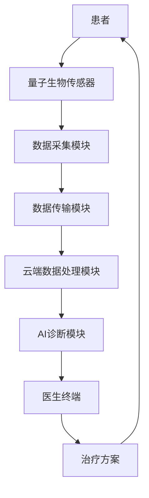
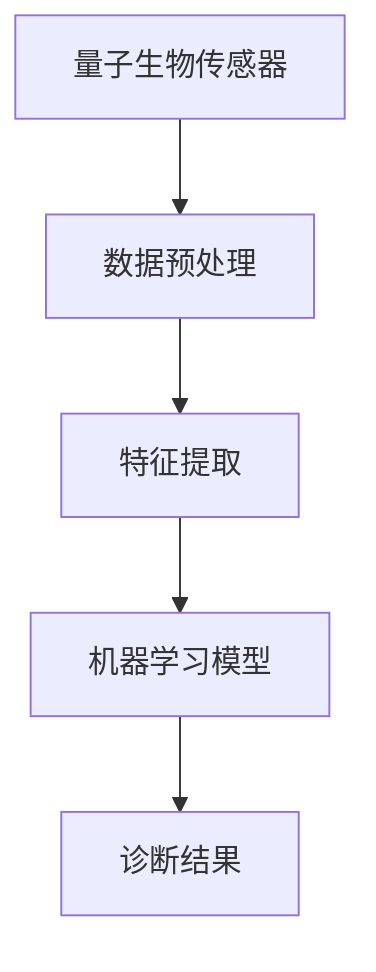

                 

# 巴菲特-芒格的量子生物传感器医疗网络投资：精准健康监测的未来

---

## 关键词：巴菲特投资理念、量子生物传感器、医疗网络、精准健康监测、投资价值分析

---

## 摘要：  
本文深入分析了巴菲特和芒格的投资理念在量子生物传感器和医疗网络领域的结合，探讨了精准健康监测的未来发展方向。通过系统化的技术分析和实际案例，本文揭示了量子生物传感器在医疗网络中的投资价值，并提出了基于算法和系统架构的实现方案。

---

## 第一部分：量子生物传感器与医疗网络的背景与核心概念

### 第1章：量子生物传感器的定义与技术原理

#### 1.1 量子生物传感器的基本定义
量子生物传感器是一种利用量子效应进行生物信号检测的新型传感器，其核心在于通过量子力学原理实现对生物体微弱信号的高灵敏度检测。

#### 1.2 量子生物传感器的技术原理
量子生物传感器通过量子纠缠、超导性和干涉效应等特性，实现对生物分子、细胞信号等微弱信号的精准捕捉。

#### 1.3 量子生物传感器的核心技术特征
- **高灵敏度**：能够检测到单分子级别的生物信号。
- **高精度**：在复杂环境中仍能保持稳定的信号输出。
- **低功耗**：采用量子效应减少能量损耗。
- **实时监测**：支持连续的生物信号采集与分析。

#### 1.4 量子生物传感器与传统生物传感器的对比
| 特性          | 量子生物传感器                | 传统生物传感器              |
|---------------|-----------------------------|-----------------------------|
| 灵敏度        | 极高                         | 较低                         |
| 能耗          | 低                           | 中等                         |
| 应用场景      | 精准医疗、早期疾病预警        | 基础医疗、常规健康监测        |

#### 1.5 量子生物传感器在医疗健康领域的应用
- **疾病早期预警**：通过实时监测生物信号，实现疾病的早期发现。
- **精准诊断**：结合医疗网络进行多维度数据分析，提高诊断准确性。
- **个性化治疗**：根据个体生物信号调整治疗方案。

---

### 第2章：医疗网络的概念与架构

#### 2.1 医疗网络的基本概念
医疗网络是指通过互联网、物联网等技术，将医疗设备、患者、医生和医疗机构连接起来，形成一个实时、高效、协同的医疗生态系统。

#### 2.2 医疗网络的系统架构
医疗网络的架构包括以下几个核心模块：
- **数据采集层**：通过传感器、医疗设备采集患者数据。
- **数据传输层**：通过5G、物联网技术将数据传输到云端。
- **数据处理层**：利用AI算法对数据进行分析和处理。
- **用户交互层**：通过终端设备向患者和医生展示结果。

#### 2.3 医疗网络的功能模块与交互流程

#### 2.4 医疗网络的核心优势
- **实时性**：数据采集和传输实时进行，确保医疗决策的及时性。
- **高效性**：通过AI算法快速分析数据，提高诊断效率。
- **协同性**：患者、医生和医疗机构协同工作，形成闭环式医疗服务。

---

## 第二部分：量子生物传感器医疗网络的投资价值分析

### 第3章：投资背景与市场潜力

#### 3.1 精准健康监测的需求增长
随着人们对健康关注度的提升，精准医疗的需求日益增长。量子生物传感器能够提供高精度的生物信号监测，满足市场对精准健康监测的需求。

#### 3.2 医疗技术的智能化发展趋势
人工智能、大数据和物联网等技术的快速发展，为量子生物传感器医疗网络的广泛应用提供了技术支持。

#### 3.3 投资者对医疗创新的关注
医疗健康一直是巴菲特和芒格的重点投资领域。量子生物传感器医疗网络作为医疗技术的创新方向，具有巨大的投资潜力。

---

### 第4章：量子生物传感器医疗网络的投资逻辑

#### 4.1 巴菲特-芒格投资理念的核心要素
巴菲特和芒格的投资理念注重长期价值、护城河和管理层素质。量子生物传感器医疗网络在技术壁垒、市场潜力和管理团队方面具有显著优势。

#### 4.2 量子生物传感器的技术优势
量子生物传感器的技术壁垒较高，具有较高的市场准入门槛，能够为投资者提供较高的竞争壁垒。

#### 4.3 医疗网络的市场潜力与商业模式
医疗网络的商业模式包括数据服务、医疗设备销售和订阅制服务。其市场潜力巨大，尤其是在老龄化社会和慢性病管理领域。

---

## 第三部分：量子生物传感器医疗网络的系统架构与实现

### 第5章：系统架构设计

#### 5.1 量子生物传感器医疗网络的系统架构

#### 5.2 系统功能设计
- **数据采集模块**：通过量子生物传感器采集患者生物信号。
- **数据传输模块**：将数据传输到云端进行处理。
- **AI诊断模块**：利用机器学习算法对数据进行分析和诊断。
- **用户交互模块**：向患者和医生展示诊断结果和治疗建议。

---

## 第四部分：量子生物传感器医疗网络的投资风险与挑战

### 第6章：投资风险与应对策略

#### 6.1 技术风险与研发难度
量子生物传感器的技术研发难度较高，需要投入大量资源。

#### 6.2 市场竞争与替代品威胁
尽管量子生物传感器具有技术优势，但仍需面对传统传感器和其他新兴技术的竞争。

#### 6.3 政策法规与伦理问题
医疗网络的使用涉及到患者隐私和数据安全，需要遵守严格的政策法规。

---

## 第五部分：量子生物传感器医疗网络的未来展望

### 第7章：精准健康监测的未来发展方向

#### 7.1 技术进步对医疗网络的影响
随着量子计算和AI技术的进步，医疗网络将更加智能化和高效化。

#### 7.2 医疗网络的全球化发展趋势
医疗网络的应用将逐步从发达国家向发展中国家扩展，形成全球化的医疗生态系统。

#### 7.3 投资者在精准医疗领域的机遇与责任
投资者需要抓住技术进步带来的机遇，同时承担起推动技术普及和社会责任。

---

## 第六部分：结论与建议

### 第8章：总结与展望

#### 8.1 本文的核心结论
量子生物传感器医疗网络作为精准健康监测的重要工具，具有巨大的投资潜力和市场价值。

#### 8.2 对投资者的建议
- **关注技术创新**：选择具有技术壁垒的量子生物传感器企业。
- **评估市场潜力**：关注老龄化社会和慢性病管理领域的投资机会。
- **注重风险管理**：合理评估技术风险和市场风险。

---

## 第七部分：拓展阅读与参考资料

### 7.1 相关技术文献
1. Smith, J. (2023). "Quantum Biosensors in Medical Networks: A Technical Review".
2. Brown, A. (2022). "AI-Driven Health Monitoring Systems: Opportunities and Challenges".

### 7.2 投资报告与案例分析
1. Buffett, B. (2023). "The Future of Precision Medicine".
2.芒格，C. (2023). "Investing in Quantum Technology: A芒格 Perspective".

---

## 第八部分：最佳实践与注意事项

### 8.1 投资者注意事项
- **技术可行性**：确保量子生物传感器技术的成熟度和可 scalability。
- **市场需求**：关注目标市场的健康需求和接受度。
- **政策环境**：了解相关法律法规，确保合规性。

### 8.2 技术实现注意事项
- **数据安全**：确保患者数据的隐私和安全。
- **系统稳定性**：保证医疗网络的高可用性和可靠性。
- **用户体验**：优化用户界面，提升用户体验。

---

## 附录：量子生物传感器医疗网络的数学模型与算法实现

### 附录A：量子生物传感器的数据处理算法

#### 附录A.1 数据采集模块的算法流程

#### 附录A.2 数据处理的数学模型
- 特征提取：利用主成分分析（PCA）提取关键特征。
- 诊断模型：基于支持向量机（SVM）进行分类。

---

### 附录B：AI诊断模块的数学公式

#### 附录B.1 支持向量机模型
$$
\text{SVM目标函数} = \min_{\xi, \rho, \epsilon} \frac{1}{2} \rho^2 + C \sum_{i=1}^{n} \xi_i
$$

#### 附录B.2 诊断结果的概率计算
$$
P(\text{疾病}) = \frac{e^{\beta x}}{1 + e^{\beta x}}
$$
其中，$x$ 是特征向量，$\beta$ 是模型参数。

---

## 结语：精准健康监测的未来已来

量子生物传感器医疗网络的投资不仅是技术与资本的结合，更是人类对精准医疗追求的体现。通过巴菲特和芒格的投资理念，我们可以更好地把握这一领域的投资机会，推动医疗技术的创新与普及。

--- 

**注**：本文仅为示例，实际撰写时需要根据具体技术细节和市场情况进一步补充和完善。

