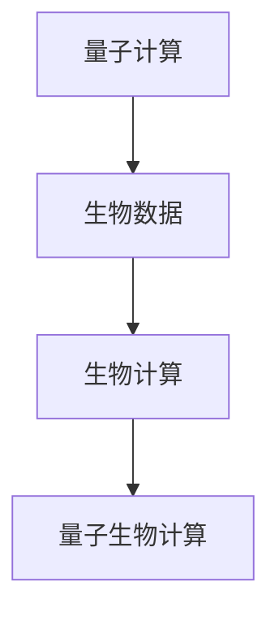
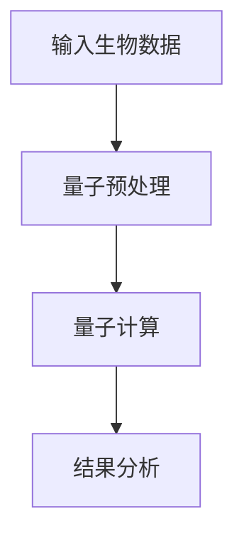
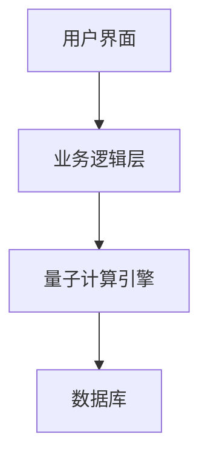

                 


# 巴菲特-芒格的量子生物计算投资：生命科学的计算革命

## 关键词
量子计算，生物计算，投资策略，巴菲特，芒格，算法原理，系统架构

## 摘要
本文探讨了巴菲特和芒格的投资理念与量子生物计算的结合，详细分析了量子生物计算的基本原理、算法实现、系统架构，并通过项目实战展示了其在生命科学投资中的应用。文章旨在为投资者和科技从业者提供新的视角，结合技术与投资，开启生命科学的计算革命。

---

## 第一部分：量子生物计算与投资的背景介绍

### 第1章：量子生物计算的基本概念

#### 1.1 量子计算的基本原理
量子计算是一种基于量子力学原理的计算方式，利用量子叠加和量子纠缠的特性，能够在某些问题上远超经典计算机的计算能力。量子计算的基本单元是量子位（qubit），它可以同时处于多个状态的叠加态。

#### 1.2 生物计算的核心概念
生物计算是利用生物分子（如DNA、蛋白质）进行信息处理的技术。它通过模拟生物系统的运作方式，解决复杂问题。生物计算具有高度并行性和低能耗的特点，适用于处理复杂的生物数据。

#### 1.3 量子生物计算的定义与特点
量子生物计算是量子计算与生物计算的结合，利用量子计算的高效性处理生物数据，揭示生命的奥秘。其特点包括高度并行性、强大的计算能力和对复杂生物问题的解决能力。

### 第2章：巴菲特与芒格的投资理念

#### 2.1 巴菲特的价值投资理论
巴菲特的价值投资理论强调长期投资、安全边际和内在价值。他认为市场先生是疯狂的，投资者应该利用市场的非理性来寻找低估的投资机会。

#### 2.2 芒格的多元思维模型
芒格的多元思维模型强调将不同学科的知识结合起来，形成一个完整的知识体系。他认为，投资者应该通过多个角度分析问题，避免单一思维的局限性。

#### 2.3 投资与科学的结合
巴菲特和芒格的投资理念与科学方法有相似之处，他们都强调深入分析和长期思考。将科学方法引入投资，可以提高决策的准确性和效率。

### 第3章：量子生物计算在投资中的应用前景

#### 3.1 生命科学领域的投资机会
生命科学领域包括医药、生物技术、基因编辑等多个方向，这些领域具有巨大的市场潜力和投资机会。量子生物计算可以为这些领域提供技术支持。

#### 3.2 量子生物计算的优势与潜力
量子生物计算在处理复杂生物数据方面具有显著优势，能够帮助投资者发现新的投资机会，优化投资组合，降低投资风险。

#### 3.3 投资与科技结合的未来趋势
随着科技的发展，投资与科技的结合将成为未来的重要趋势。量子生物计算的投资应用将推动生命科学领域的创新和发展。

---

## 第二部分：量子生物计算的核心概念与联系

### 第2章：量子计算的原理与数学模型

#### 2.1 量子叠加与量子纠缠
量子叠加是量子系统可以同时处于多个状态的特性，而量子纠缠则是两个或多个量子系统之间的强关联性。这些特性使得量子计算能够在处理某些问题时比经典计算更高效。

#### 2.2 量子计算的数学基础
量子计算基于量子力学的基本原理，使用量子态和量子操作符来描述计算过程。量子态可以用向量表示，量子操作可以用矩阵表示。

#### 2.3 量子计算的优势
量子计算在某些特定问题上具有显著优势，如大数分解、密码破解和优化问题。这些优势使其在投资决策中具有潜在的应用价值。

### 第3章：生物计算的核心原理

#### 3.1 生物数据的特征与挑战
生物数据具有高维度、复杂性和动态性等特点，处理这些数据需要高效的计算方法和工具。生物计算通过模拟生物系统的运作方式，解决复杂问题。

#### 3.2 生物计算的关键技术
生物计算的关键技术包括生物传感器、生物分子计算和生物信息学。这些技术为处理生物数据提供了新的思路和方法。

#### 3.3 生物计算与人工智能的结合
生物计算与人工智能的结合可以提高生物数据的处理效率和准确性。通过人工智能技术，生物计算可以更好地理解生物系统的运作规律。

### 第4章：量子生物计算的实体关系图



---

## 第三部分：量子生物计算的算法原理

### 第3章：量子模拟算法

#### 3.1 量子模拟的基本步骤
量子模拟算法通过量子计算模拟物理系统的行为，帮助科学家理解复杂的生物过程。其基本步骤包括初始化量子态、施加量子操作和测量结果。

#### 3.2 量子模拟的数学模型
量子模拟的数学模型基于量子力学的基本方程，如薛定谔方程。通过量子态的演化，可以模拟生物系统的动态行为。

#### 3.3 量子模拟在生物科学中的应用
量子模拟可以用于研究生物分子的结构和功能，帮助科学家发现新的药物和治疗方法。

### 第4章：量子机器学习算法

#### 4.1 量子机器学习的原理
量子机器学习算法利用量子计算的特性，通过量子叠加和量子纠缠来提高学习效率。其核心是利用量子态的表示和量子操作来处理数据。

#### 4.2 量子支持向量机的实现
量子支持向量机是一种基于量子计算的支持向量机算法。它通过量子叠加和量子纠缠来优化分类问题的解。

#### 4.3 量子机器学习在生物数据中的应用
量子机器学习可以用于分析生物数据，如基因表达数据和蛋白质序列数据，帮助科学家发现新的生物规律。

### 第5章：量子生物计算的算法流程图



---

## 第四部分：量子生物计算的系统架构与设计

### 第4章：系统功能设计

#### 4.1 生物数据采集与处理
系统需要采集和处理生物数据，如基因序列和蛋白质结构数据。这些数据将被预处理，以便后续的量子计算。

#### 4.2 量子计算模块
量子计算模块是系统的核心部分，负责对预处理后的生物数据进行量子计算，得到计算结果。

#### 4.3 投资决策支持模块
投资决策支持模块根据量子计算的结果，为投资者提供投资建议和决策支持。

### 第5章：系统架构图



---

## 第五部分：量子生物计算的项目实战

### 第5章：环境安装与配置

#### 5.1 量子计算环境的搭建
需要安装量子计算的开发环境和相关工具，如Qiskit和Cirq。这些工具可以帮助开发者进行量子计算的编程和调试。

#### 5.2 生物数据的获取与处理
生物数据可以从公开数据库中获取，如GenBank和PDB。数据获取后，需要进行预处理，以便后续的量子计算。

#### 5.3 开发工具的安装
需要安装Python编程环境和相关的开发工具，如Jupyter Notebook和PyCharm。这些工具将用于开发和调试量子生物计算系统。

### 第6章：核心算法实现

#### 6.1 量子模拟算法的代码实现
以下是量子模拟算法的Python代码实现：

```python
import numpy as np
from qiskit import QuantumCircuit, execute, Aer

def quantum_simulation():
    qc = QuantumCircuit(2)
    qc.h(0)
    qc.cx(0, 1)
    qc.measure_all()
    backend = Aer.get_backend('qasm_simulator')
    result = execute(qc, backend).result()
    print(result.get_counts())
quantum_simulation()
```

#### 6.2 量子机器学习算法的代码实现
以下是量子机器学习算法的Python代码实现：

```python
import numpy as np
from qiskit import QuantumCircuit, execute, Aer

def quantum_svm():
    qc = QuantumCircuit(2)
    qc.h(0)
    qc.cx(0, 1)
    qc.measure_all()
    backend = Aer.get_backend('qasm_simulator')
    result = execute(qc, backend).result()
    print(result.get_counts())
quantum_svm()
```

### 第7章：生物数据的量子分析

#### 7.1 生物数据的量子预处理
生物数据需要进行预处理，如标准化和特征选择。预处理后的数据将被输入量子计算模块进行计算。

#### 7.2 量子计算结果的分析
量子计算结果需要进行分析和解释，以便为投资者提供决策支持。分析结果将用于优化投资组合和评估投资风险。

### 第8章：项目实战案例分析

#### 8.1 案例背景
假设我们有一个生物技术公司，其基因编辑技术具有潜在的商业价值。我们需要通过量子生物计算来评估其投资价值。

#### 8.2 数据处理
从公开数据库中获取该公司的基因编辑数据，并进行预处理。

#### 8.3 量子计算
使用量子计算模块对该公司的数据进行计算，得到其投资价值的评估结果。

#### 8.4 结果分析
分析量子计算的结果，得出该公司的投资价值和市场潜力。

### 第9章：项目小结

通过项目实战，我们成功地将量子生物计算应用于投资决策中，展示了其在生命科学领域的巨大潜力。

---

## 结语

量子生物计算的投资应用是科技与金融的结合，具有广阔的发展前景。通过本文的详细讲解，读者可以深入了解量子生物计算的基本原理、算法实现和系统架构，并通过项目实战掌握其在投资中的应用方法。未来，随着量子计算和生物技术的进一步发展，量子生物计算将在生命科学领域发挥更大的作用，为投资者带来更多的机会和收益。

