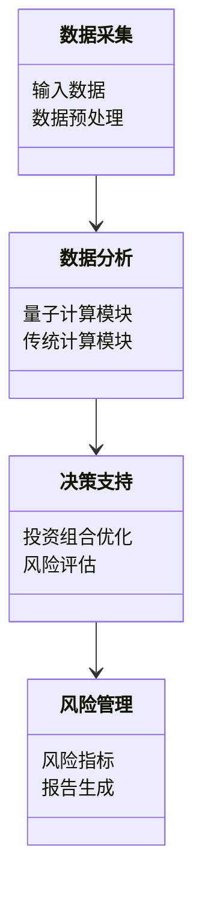

                 


# 巴菲特-芒格的量子生物计算机投资：生命科学与信息技术的融合

---

## 关键词：
- 巴菲特, 芒格, 量子计算, 生物技术, 投资策略, 信息技术, 量子生物计算机

---

## 摘要：
本文探讨了巴菲特和芒格的投资哲学如何与量子计算和生物技术相结合，形成一种新兴的投资策略。通过分析量子计算的基本原理、生命科学与信息技术的融合，以及这些技术如何应用于投资决策，文章揭示了量子生物计算机在投资领域的潜力。结合数学模型和系统架构设计，本文展示了如何利用这些技术优化投资组合，评估风险，并识别市场趋势。

---

# 第一部分: 巴菲特与芒格的投资哲学

## 第1章: 巴菲特与芒格的投资理念

### 1.1 巴菲特的价值投资理论

#### 1.1.1 价值投资的核心理念

**价值投资**是一种以基本面分析为基础的投资策略，强调以低于内在价值的价格购买优质资产。巴菲特是这一理论的代表人物，他强调长期投资、安全边际和企业的内在价值。

**核心概念**：
- **内在价值**：资产在市场上的真实价值，独立于市场价格。
- **安全边际**：购买价格与内在价值之间的差距，提供了风险缓冲。
- **长期投资**：通过持有优质资产，获得长期的资本增值。

**问题背景**：
传统的价值投资依赖于对财务报表和行业趋势的分析，但在数据量和复杂性日益增加的今天，这种方法可能难以应对市场的快速变化。

**问题解决**：
引入量子计算和生物技术，可以提高数据分析的效率和准确性，帮助投资者更好地识别内在价值和潜在风险。

---

### 1.1.2 芒格的多元思维模型

芒格提倡**多元思维模型**，认为投资者需要跨学科的知识来全面评估问题。这种方法强调将不同领域的知识结合起来，以获得更全面的视角。

**核心概念**：
- **跨学科思维**：整合物理学、生物学、心理学等多个领域的知识。
- **决策框架**：使用多个模型来分析问题，避免单一视角的局限性。

**问题背景**：
现代投资环境复杂，仅依赖单一学科的知识难以应对各种风险和机会。

**问题解决**：
通过整合量子计算和生物技术，芒格的多元思维模型可以更有效地识别投资机会和风险。

---

### 1.1.3 巴菲特与芒格投资理念的融合

巴菲特和芒格的投资理念在量子生物计算机时代找到了新的结合点。通过量子计算的高效数据处理能力和生物技术的创新，他们的价值投资理论得以扩展和深化。

**核心联系**：
- 量子计算提供强大的数据处理能力，帮助分析复杂的市场动态。
- 生物技术的突破为投资提供了新的机会，如基因编辑和精准医疗。

---

## 第2章: 量子计算与生命科学的融合

### 2.1 量子计算的基本原理

#### 2.1.1 量子位与量子叠加

**量子位（Qubit）**是量子计算的基本单位，与经典计算机的比特不同，它可以同时处于多个状态（量子叠加）。

**数学模型**：
量子态可以用向量表示，例如：
$$
|q\rangle = \alpha|0\rangle + \beta|1\rangle
$$
其中，$\alpha$ 和 $\beta$ 是复数，满足 $|\alpha|^2 + |\beta|^2 = 1$。

**问题背景**：
经典计算机在处理大规模数据时效率低下，而量子计算可以在某些领域（如组合优化）显著提高效率。

**问题解决**：
量子计算的应用可以帮助投资者快速分析大量数据，识别潜在的投资机会和风险。

---

#### 2.1.2 量子纠缠与量子并行性

**量子纠缠**使得两个或多个量子位之间的状态相互关联，这种特性可以用于并行计算，提高处理速度。

**应用场景**：
在投资领域，量子纠缠可以用于同时分析多个市场变量，识别复杂的市场模式。

---

### 2.2 生命科学与信息技术的融合

#### 2.2.1 生物技术与信息技术的结合

**生物技术**的进步依赖于信息技术的支持，例如基因组测序和生物信息学分析。

**问题背景**：
生物技术数据的复杂性和多样性使得传统方法难以高效处理。

**问题解决**：
通过量子计算和人工智能，可以加速药物研发和基因组分析。

---

## 第3章: 巴菲特与芒格投资理念与量子计算的结合

### 3.1 量子计算在投资决策中的应用

#### 3.1.1 量子算法与投资组合优化

**量子算法**，如Grover算法，可以用于优化投资组合，寻找最优配置。

**数学模型**：
优化问题可以表示为：
$$
\min_x \sum_{i=1}^n w_i x_i^2
$$
其中，$w_i$ 是权重，$x_i$ 是投资比例。

---

### 3.1.2 量子计算与风险管理

**风险管理**是投资决策的重要部分，量子计算可以帮助评估复杂的投资组合风险。

**数学模型**：
风险可以表示为波动率的函数：
$$
\sigma = \sqrt{\sum_{i=1}^n p_i^2 \sigma_i^2}
$$
其中，$p_i$ 是投资比例，$\sigma_i$ 是资产的波动率。

---

## 第4章: 系统架构与技术实现

### 4.1 系统架构设计

#### 4.1.1 系统功能设计

**领域模型**：
使用mermaid类图描述系统的主要组件，包括数据采集、分析、决策支持和风险管理。



---

#### 4.1.2 系统架构设计

**系统架构**：
使用mermaid架构图展示系统的整体结构，包括前端、后端和数据库。


---

### 4.2 项目实战

#### 4.2.1 环境搭建

**工具安装**：
- 安装Qiskit（量子计算工具包）
- 安装Python和必要的库

```bash
pip install qiskit numpy matplotlib
```

---

#### 4.2.2 核心代码实现

**量子算法实现**：
使用Qiskit编写一个简单的量子投资组合优化算法。

```python
from qiskit import QuantumCircuit, Aer, execute
from qiskit.circuit import QuantumRegister, ClassicalRegister

# 定义量子电路
qr = QuantumRegister(2)
cr = ClassicalRegister(2)
qc = QuantumCircuit(qr, cr)

qc.h(qr[0])
qc.cx(qr[0], qr[1])
qc.measure(qr, cr)

# 模拟器执行
simulator = Aer.get_backend('qasm_simulator')
job = execute(qc, simulator)
result = job.result()
print(result.get_counts())
```

---

### 4.2.3 实际案例分析

**案例分析**：
假设一个投资者希望通过量子计算优化其生物技术投资组合，可以使用上述代码进行初步分析。

---

## 第5章: 结论与展望

### 5.1 小结

本文探讨了巴菲特和芒格的投资理念与量子计算和生物技术的结合，展示了如何利用这些技术优化投资决策。

---

### 5.2 投资建议

**建议**：
- 关注量子计算和生物技术领域的新兴公司。
- 采用多元思维模型，结合多个领域的知识进行投资决策。

---

### 5.3 拓展阅读

- 《Quantum Computing for Investment》
- 《Biotechnology and Financial Markets》

---

## 总结

通过将巴菲特和芒格的投资理念与量子计算和生物技术相结合，投资者可以更好地应对复杂市场环境，捕捉新的投资机会。然而，这一领域仍需进一步研究和实践，以充分发挥其潜力。

