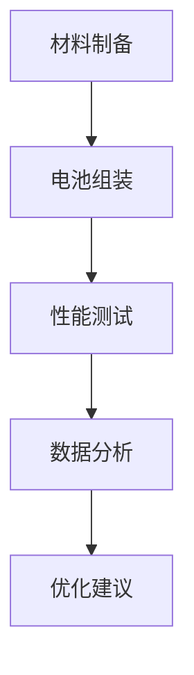

                 


# 巴菲特-芒格的量子电池材料研发投资：能源革命的关键突破

> 关键词：巴菲特投资，芒格思维模型，量子电池材料，能源革命，科技创新，投资策略

> 摘要：本文探讨了巴菲特和芒格的投资哲学在量子电池材料研发中的应用，分析了量子电池材料的科学基础、研发方法及商业可行性，结合实际案例，详细阐述了投资模型与量子电池技术的结合，为投资者和技术人员提供了深入的见解和指导。

---

## 第一部分：巴菲特与芒格的投资哲学

### 第1章：巴菲特与芒格的投资理念

#### 1.1 巴菲特的价值投资理论

- **价值投资的定义与核心原则**
  - 价值投资是通过深入分析企业的基本面，寻找被市场低估的投资标的。
  - 核心原则包括：安全边际、长期主义、集中投资。
- **巴菲特投资策略的关键要素**
  - 投资于具有持续竞争优势的企业。
  - 强调企业财务健康和管理层诚信。
- **芒格的多元思维模型**
  - 通过跨学科思维模型，寻找投资机会。
  - 强调微观经济学、心理学和决策科学的应用。

#### 1.2 巴菲特与芒格的成功案例分析

- **巴菲特的经典投资案例**
  - 可口可乐：长期持有，基于品牌价值和持续盈利能力。
  - 苹果公司：基于创新能力和市场领导地位。
- **芒格在伯克希尔的决策作用**
  - 强调安全边际和风险控制。
  - 通过多元思维模型评估投资项目。
- **两人合作的成功模式**
  - 组合投资与集中投资的平衡。
  - 长期持有与价值发现的结合。

### 第2章：量子电池材料研发的背景与挑战

#### 2.1 量子电池材料的科学基础

- **量子材料的基本概念**
  - 量子材料是指具有量子效应的新型材料，如石墨烯、拓扑绝缘体等。
  - 量子效应：材料在微观尺度下的独特性质，如量子隧道效应、量子叠加等。
- **量子效应在电池中的应用**
  - 提高电池的能量密度和充放电效率。
  - 实现快速充电和长循环寿命。
- **量子电池的优势与潜在影响**
  - 革命性提升能源存储技术。
  - 为电动汽车、可再生能源等领域带来突破。

#### 2.2 当前能源技术的瓶颈与突破方向

- **传统电池技术的局限性**
  - 理论能量密度有限，难以满足高性能需求。
  - 循环寿命和稳定性问题。
- **新能源技术的发展趋势**
  - 固态电池：提高安全性。
  - 锂离子电池的改进：优化电极材料。
- **量子电池在能源革命中的地位**
  - 有望成为下一代储能技术的核心。
  - 为可再生能源的高效存储提供解决方案。

### 第3章：巴菲特-芒格投资模型与量子电池研发的结合

#### 3.1 投资模型的核心要素

- **投资模型的构成要素**
  - 技术可行性：量子电池材料的研发是否成熟。
  - 市场需求：是否存在大规模应用的潜力。
  - 管理团队：研发团队的能力和经验。
- **投资模型的逻辑框架**
  - 第一步：识别具有革命性潜力的技术。
  - 第二步：评估技术的商业化可行性。
  - 第三步：投资于具有强大研发能力和市场前景的企业。
- **投资模型的适用范围**
  - 高科技领域：量子计算、人工智能、新能源等。
  - 创新驱动型行业：依赖技术创新的企业。

#### 3.2 量子电池研发的商业可行性分析

- **技术可行性评估**
  - 当前量子电池材料的研发进展。
  - 关键技术的突破点和时间表。
- **市场需求分析**
  - 全球能源需求的增长。
  - 政府政策的支持和行业趋势。
- **项目风险与收益评估**
  - 技术失败风险、市场接受度风险。
  - 高收益潜力和长期投资回报。

---

## 第二部分：量子电池材料研发的科学与技术

### 第4章：量子电池材料的物理特性与研发方法

#### 4.1 量子材料的物理特性

- **量子材料的基本性质**
  - 量子材料的电子结构和物理特性。
  - 量子效应如何影响材料性能。
- **量子效应的数学模型**
  - 基于量子力学的数学描述。
  - 通过公式分析量子效应对电池性能的影响。
- **量子材料的制备技术**
  - 纳米材料制备方法。
  - 新型合成技术对材料性能的提升。

#### 4.2 量子电池的研发方法

- **材料筛选与优化**
  - 利用计算模拟筛选候选材料。
  - 实验优化材料的结构和性能。
- **研发中的关键挑战**
  - 材料稳定性问题。
  - 制备过程中的技术瓶颈。
- **未来研发方向**
  - 新型量子材料的发现。
  - 提高材料的商业化可行性。

### 第5章：量子电池材料研发中的算法与数学模型

#### 5.1 算法原理

- **量子计算在材料研发中的应用**
  - 使用量子计算模拟材料结构。
  - 提高材料筛选效率。
- **机器学习算法的应用**
  - 利用机器学习预测材料性能。
  - 加速材料优化过程。
- **数学模型的构建与应用**
  - 基于量子力学的数学模型。
  - 通过模型预测材料性能。

#### 5.2 算法实现

- **量子计算算法**
  - 使用量子计算机模拟量子材料。
  - 算法步骤和实现方法。
- **机器学习算法**
  - 神经网络模型的构建与训练。
  - 数据预处理和特征提取。
- **算法优化**
  - 提高算法效率。
  - 优化算法的准确性和稳定性。

---

## 第三部分：系统分析与架构设计

### 第6章：量子电池研发系统的架构设计

#### 6.1 系统功能设计

- **领域模型**
  - 制造流程：材料制备、电池组装、性能测试。
  - 数据分析：实验数据采集与分析。
- **系统架构**
  - 分层架构：数据采集层、计算层、应用层。
  - 模块化设计：功能模块的划分与交互。

#### 6.2 系统架构图



#### 6.3 接口设计与交互流程

- **系统接口**
  - API接口定义。
  - 数据格式和通信协议。
- **交互流程**
  - 用户输入需求。
  - 系统处理并返回结果。

### 第7章：量子电池研发项目的实战分析

#### 7.1 项目环境安装

- **安装量子计算环境**
  - 安装必要的软件和库。
  - 配置量子计算平台。
- **机器学习框架安装**
  - 安装TensorFlow或PyTorch。
  - 配置环境变量。

#### 7.2 核心算法实现

- **量子计算算法实现**
  - 使用Qiskit库实现量子计算。
  - 编写量子电路和算法。
- **机器学习模型实现**
  - 构建神经网络模型。
  - 训练模型并进行预测。
- **代码示例**
  ```python
  import numpy as np
  from qiskit import QuantumCircuit, Aer, execute

  # 量子计算示例
  circuit = QuantumCircuit(2)
  circuit.h(0)
  circuit.cx(0, 1)
  circuit.measure_all()
  ```

#### 7.3 实际案例分析

- **案例背景**
  - 某量子电池材料研发项目。
  - 项目目标与技术路线。
- **数据分析与结果解读**
  - 实验数据的采集与处理。
  - 数据分析结果的解读。
- **优化建议**
  - 基于数据分析提出优化建议。
  - 提供下一步研发的方向。

---

## 第四部分：最佳实践与总结

### 第8章：最佳实践与小结

#### 8.1 投资决策的关键点

- **技术可行性**
  - 研发团队的能力。
  - 技术的成熟度。
- **市场需求**
  - 行业发展趋势。
  - 市场容量和潜在收益。

#### 8.2 注意事项与风险控制

- **技术风险**
  - 关键技术的突破难度。
  - 研发周期的不确定性。
- **市场风险**
  - 市场接受度。
  - 竞争对手的威胁。

### 第9章：拓展阅读与未来展望

- **相关书籍推荐**
  - 《巴菲特投资哲学》
  - 《量子计算入门》
- **未来研究方向**
  - 量子材料的进一步研究。
  - 投资策略与量子技术的结合。

---

通过以上详细的内容，本文从巴菲特和芒格的投资哲学出发，结合量子电池材料的研发，分析了技术与商业的结合点，为投资者和技术人员提供了系统的指导和参考。

