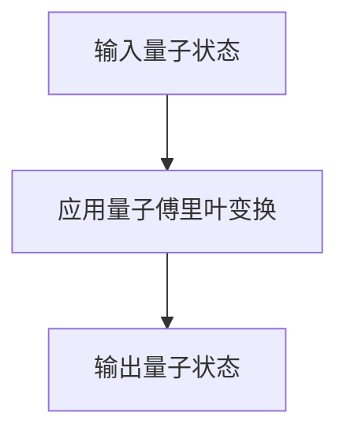
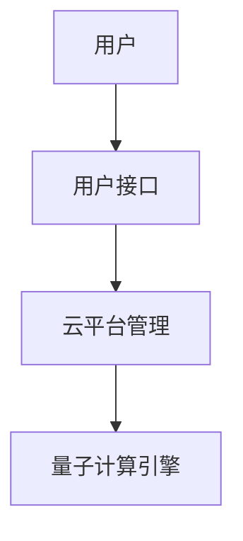

                 

# 巴菲特-芒格的量子计算云服务投资：计算能力民主化的新纪元

## 关键词：量子计算，巴菲特，芒格，计算能力，云服务，投资策略

## 摘要：
本文探讨了巴菲特和芒格投资量子计算云服务的背景、动机和潜在影响。通过分析量子计算的核心原理、商业模式以及其在金融领域的应用，揭示了计算能力民主化的新纪元。文章详细介绍了量子计算的基本概念、算法原理，并结合实际案例展示了量子计算云服务的投资价值和未来发展趋势。

---

# 第一部分：背景与概述

## 第1章：量子计算的背景与现状

### 1.1 量子计算的基本概念
量子计算是一种基于量子力学原理的计算方式，利用量子叠加和量子纠缠等特性，能够在某些特定问题上比传统计算机更高效地解决问题。量子计算机的核心单元是量子比特（qubit），与传统计算机中的二进制比特不同，量子比特可以同时处于多个状态的叠加态。

#### 量子计算的基本概念
- **量子比特（Qubit）**：量子计算的核心单元，可以同时表示0和1的叠加态。
- **量子叠加**：量子比特可以同时处于多个状态，这使得量子计算机能够在并行处理多个问题。
- **量子纠缠**：两个或多个量子比特之间形成的一种特殊关联，使得其中一个比特的状态可以瞬间影响另一个比特的状态，无论它们之间的距离有多远。

### 1.2 巴菲特和芒格的投资理念
- **巴菲特的价值投资理论**：巴菲特主张以合理的价格投资具有持续竞争优势和良好管理的企业，长期持有，避免短期市场波动的干扰。
- **芒格的多元思维模型**：芒格强调通过跨学科的知识体系来理解问题，寻找那些能够长期稳定增长的投资机会。
- **投资与科技创新的结合**：巴菲特和芒格都意识到科技创新对投资的重要性，他们认为量子计算作为一种革命性的技术，未来将在多个领域发挥重要作用。

---

## 第2章：量子计算云服务的商业模式

### 2.1 量子计算云服务的定义与特点
- **量子计算云服务**：通过云计算的方式，将量子计算机的计算能力提供给用户，用户可以通过远程接口调用量子计算机进行计算。
- **按需付费**：类似于传统云服务，用户只需支付实际使用的计算资源费用，无需购买昂贵的量子计算机。
- **易于使用**：量子计算云服务通常提供用户友好的编程接口，使得即使没有量子计算专业知识的用户也能轻松使用。

### 2.2 量子计算云服务的市场潜力
- **金融领域的应用**：量子计算在金融领域的应用主要体现在优化投资组合、风险管理和市场预测等方面。量子计算机可以快速处理大量数据，帮助投资者找到最优的投资策略。
- **计算能力的民主化**：量子计算云服务降低了使用量子计算的门槛，使得更多企业和个人能够享受到量子计算带来的优势，推动了计算能力的民主化。

---

# 第二部分：量子计算的核心原理与数学模型

## 第3章：量子叠加与量子纠缠的数学模型

### 3.1 量子叠加的数学表达
量子叠加是量子计算的核心原理之一，表示一个量子系统可以同时处于多个状态的叠加态。数学上，量子叠加可以用向量空间中的向量来表示，每个向量的元素代表对应状态的幅度。

#### 量子叠加的数学公式
$$|\psi\rangle = \alpha|0\rangle + \beta|1\rangle$$
其中，$\alpha$ 和 $\beta$ 是复数，表示量子比特处于 $|0\rangle$ 和 $|1\rangle$ 状态的幅度，满足归一化条件：
$$|\alpha|^2 + |\beta|^2 = 1$$

### 3.2 量子纠缠的数学表达
量子纠缠是量子系统中两个或多个粒子之间形成的一种特殊关联，使得其中一个粒子的状态可以瞬间影响另一个粒子的状态，无论它们之间的距离有多远。

#### 两个量子比特的纠缠态
$$|\psi\rangle = \frac{1}{\sqrt{2}}(|00\rangle + |11\rangle)$$
这是一个典型的贝尔态，表示两个量子比特处于纠缠状态。无论两个量子比特相距多远，测量其中一个量子比特的状态会立即确定另一个量子比特的状态。

---

## 第4章：量子计算的基本算法

### 4.1 Deutsch-Jozsa算法
Deutsch-Jozsa算法是一种典型的量子算法，用于判断一个函数是恒等函数还是恒等函数的反函数。该算法展示了量子计算机在某些问题上比经典计算机更高效的优势。

#### Deutsch-Jozsa算法的步骤
1. 初始化量子寄存器，将所有量子比特置于叠加态。
2. 对量子寄存器应用目标函数的量子变换。
3. 对量子寄存器应用反相位操作。
4. 对量子寄存器进行测量。

### 4.2 量子傅里叶变换
量子傅里叶变换是量子计算中的一个基本算法，用于将量子状态从时间域转换到频率域，广泛应用于量子周期寻找和量子隐含模式搜索等问题。

#### 量子傅里叶变换的流程图

---

# 第三部分：量子计算云服务的系统架构

## 第5章：量子计算云服务的系统架构

### 5.1 系统功能设计
量子计算云服务的系统功能包括：
1. 用户认证与授权：确保只有授权用户可以访问量子计算机。
2. 量子计算引擎：负责执行用户的量子计算任务。
3. 云平台管理：管理量子计算资源，监控系统运行状态。
4. 用户接口：提供友好的用户界面，方便用户提交计算任务和查看结果。

### 5.2 系统架构设计

---

# 第四部分：量子计算云服务的投资价值

## 第6章：量子计算云服务的投资分析

### 6.1 量子计算在金融领域的应用
- **优化投资组合**：量子计算机可以帮助投资者找到最优的投资组合，降低风险。
- **风险管理**：量子计算机可以快速计算出各种风险情景，帮助投资者制定更有效的风险管理策略。
- **市场预测**：量子计算机可以分析大量的市场数据，帮助投资者预测市场趋势。

### 6.2 计算能力民主化的新纪元
量子计算云服务的普及使得更多企业和个人能够享受到量子计算的优势，推动了计算能力的民主化。这种趋势将促进更多创新，推动科技的进步。

---

## 第7章：量子计算云服务的未来展望

### 7.1 技术发展的方向
- **量子比特的稳定性提升**：提高量子比特的稳定性，延长量子叠加的时间，是未来量子计算技术发展的关键。
- **量子算法的优化**：开发更多高效的量子算法，扩大量子计算机的应用范围。

### 7.2 投资策略的调整
- **长期投资**：量子计算技术的发展需要时间和资金的投入，投资者需要耐心等待技术成熟。
- **风险控制**：量子计算技术尚未完全成熟，投资者需要做好风险管理，避免过度投资。

---

## 第8章：总结与展望

### 8.1 总结
量子计算云服务的投资价值在于其能够为企业和个人提供高效的计算能力，推动科技创新和经济发展。巴菲特和芒格的投资理念与量子计算的潜力相结合，为投资者提供了新的机遇。

### 8.2 展望
随着量子计算技术的不断发展，量子计算云服务将在更多领域得到应用，计算能力的民主化将推动科技的进步和社会的发展。

---

## 参考文献
1. 《量子计算入门》
2. 《巴菲特投资哲学》
3. 《量子计算算法与实现》

---

通过本文的分析，我们可以看到，量子计算云服务的投资不仅具有技术上的潜力，还符合巴菲特和芒格的投资理念。未来，随着量子计算技术的进一步发展，计算能力的民主化将成为现实，量子计算云服务的投资价值也将进一步显现。

