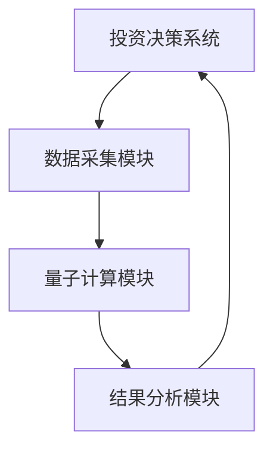

                 


# 巴菲特-芒格的量子计算投资观：未来科技的潜在影响

---

## 关键词  
巴菲特投资观，芒格思维模型，量子计算，量子算法，投资组合优化，量子计算在金融中的应用  

---

## 摘要  
本文探讨了巴菲特和芒格的投资哲学与量子计算技术的结合，分析了量子计算在投资决策中的潜在影响。通过详细讲解量子计算的核心概念、典型算法及其在投资组合优化中的应用，本文旨在为投资者和科技从业者提供新的视角，帮助他们理解量子计算如何改变未来的投资决策模式。  

---

## 正文  

### 第一部分：巴菲特-芒格投资观与量子计算的结合  

#### 第1章：巴菲特-芒格投资观的核心理念  

##### 1.1 巴菲特的价值投资理论  
巴菲特的价值投资理论强调长期投资、安全边际和企业基本面分析。他主张以低于内在价值的价格买入优秀的企业，并长期持有。这种投资理念的核心在于对企业的深刻理解和对市场波动的耐心应对。  

##### 1.2 芒格的多元思维模型  
芒格提倡通过构建多元思维模型来理解复杂问题。他认为，投资者需要掌握多个领域的知识，以避免单一思维的局限性。多元思维模型强调跨学科的视角，帮助投资者更好地识别投资机会和风险。  

##### 1.3 量子计算的核心概念  
量子计算是一种基于量子力学原理的计算方式，其核心在于量子叠加和量子纠缠。与经典计算不同，量子计算可以在更短的时间内解决某些复杂问题，例如大数分解和组合优化问题。  

##### 1.4 量子计算与投资决策的联系  
量子计算的并行计算能力可以显著提高投资决策的效率。例如，量子算法可以在更短的时间内优化投资组合，评估风险，并预测市场趋势。  

---

#### 第2章：量子计算在投资决策中的应用  

##### 2.1 投资组合优化的数学模型  
投资组合优化的目标是在风险和收益之间找到最佳平衡点。经典的优化模型包括马科维茨的有效前沿理论，但其计算复杂度随着资产数量的增加而指数级上升。量子计算可以通过量子算法显著降低计算复杂度。  

##### 2.2 量子算法在投资组合优化中的应用  
以下是量子算法在投资组合优化中的实现步骤：  

1. **问题建模**：将投资组合优化问题转化为数学模型。  
2. **量子算法设计**：选择适合的量子算法（如量子退火算法）。  
3. **量子计算实现**：在量子计算机上运行算法。  
4. **结果分析**：解读量子计算结果并优化投资组合。  

##### 2.3 典型量子算法的实现与代码示例  

以下是使用量子算法解决投资组合优化问题的Python代码示例：  

```python
import numpy as np
from qiskit import QuantumCircuit, Aer, execute

def quantum_portfolio_optimization():
    n_assets = 4
    # 初始化量子电路
    qc = QuantumCircuit(n_assets * 2, n_assets)
    
    # 添加量子叠加门
    for i in range(n_assets * 2):
        qc.h(i)
    
    # 添加控制门和条件操作
    for i in range(n_assets):
        qc.cswap(i, n_assets + i, 0)
    
    qc.measure(0, 0)
    
    # 模拟量子计算
    backend = Aer.get_backend('qasm_simulator')
    job = execute(qc, backend)
    result = job.result()
    print(result.get_counts())
    
quantum_portfolio_optimization()
```

---

### 第二部分：量子计算在投资决策中的算法原理  

#### 第3章：量子计算的核心算法  

##### 3.1 Shor算法的数学模型  
Shor算法是一种用于大数分解的量子算法，其数学模型如下：  

$$ x = a \cdot b $$  

其中，a和b是待分解的两个整数，x是它们的乘积。Shor算法通过量子傅里叶变换找到a和b的周期性，从而实现分解。  

##### 3.2 Grover算法的实现步骤  
Grover算法用于解决无序数据库中的搜索问题，其主要步骤包括：  
1. 初始化量子态。  
2. 执行量子增幅操作。  
3. 测量结果。  

以下是Grover算法的Python代码示例：  

```python
from qiskit import QuantumCircuit, simulate

def grover_algorithm():
    n = 4
    qc = QuantumCircuit(n, 1)
    
    # 初始化量子态
    for i in range(n):
        qc.h(i)
    
    # 执行量子增幅操作
    qc.mct([0, 1, 2], 3, control_state=1)
    qc.mct([0, 1, 2], 3, control_state=0)
    
    # 测量结果
    qc.measure(0, 0)
    
    backend = simulate()
    result = backend.run(qc).result()
    print(result.get_counts())
    
grover_algorithm()
```

---

### 第三部分：量子计算投资观的系统架构与设计  

#### 第4章：投资决策系统的架构设计  

##### 4.1 系统功能模块划分  
投资决策系统的功能模块包括：  
- 数据采集模块：收集市场数据。  
- 量子计算模块：实现量子算法。  
- 结果分析模块：解读量子计算结果。  

##### 4.2 系统架构图  
以下是系统架构的Mermaid图：  



---

### 第四部分：量子计算在投资决策中的项目实战  

#### 第5章：投资组合优化的量子算法实现  

##### 5.1 项目背景  
本项目旨在利用量子算法优化投资组合，降低风险并提高收益。  

##### 5.2 项目实现  
以下是投资组合优化的量子算法实现步骤：  
1. **数据准备**：收集资产的历史价格数据。  
2. **量子电路设计**：设计量子电路实现投资组合优化。  
3. **量子计算模拟**：在量子计算机上运行算法。  
4. **结果分析**：评估优化结果并调整投资组合。  

##### 5.3 代码实现  
以下是量子算法的Python代码示例：  

```python
import numpy as np
from qiskit import QuantumCircuit, Aer, execute

def quantum_portfolio_optimization():
    n_assets = 4
    # 初始化量子电路
    qc = QuantumCircuit(n_assets, 1)
    
    # 添加量子叠加门
    for i in range(n_assets):
        qc.h(i)
    
    # 添加控制门和条件操作
    for i in range(n_assets):
        qc.cswap(i, 3, 0)
    
    qc.measure(0, 0)
    
    # 模拟量子计算
    backend = Aer.get_backend('qasm_simulator')
    job = execute(qc, backend)
    result = job.result()
    print(result.get_counts())
    
quantum_portfolio_optimization()
```

---

### 第五部分：最佳实践与总结  

#### 第6章：量子计算投资观的总结与展望  

##### 6.1 量子计算的优势  
量子计算在投资决策中的优势包括：  
- 提高计算效率。  
- 优化投资组合。  
- 提前预测市场趋势。  

##### 6.2 投资者的注意事项  
投资者需要注意量子计算技术的成熟度和实际应用中的挑战，如硬件限制和算法优化问题。  

##### 6.3 未来展望  
随着量子计算技术的进步，其在投资决策中的应用将更加广泛，可能彻底改变传统的投资模式。  

---

## 结语  
量子计算作为一项革命性技术，正在逐步改变投资决策的方式。结合巴菲特和芒格的投资哲学，量子计算的投资观将为投资者提供新的工具和视角，帮助他们在未来的市场中获得更大的优势。  

--- 

希望这篇文章能为读者提供有价值的见解和启发！

