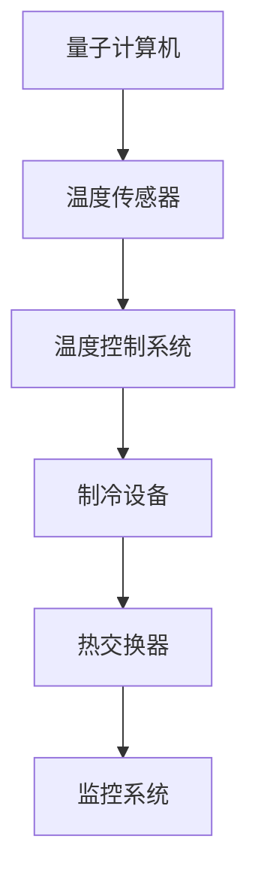

                 


# 巴菲特-芒格的量子计算机冷却技术投资：突破计算瓶颈的关键

---

## 关键词：
量子计算、冷却技术、巴菲特、芒格、投资策略、计算瓶颈、技术突破

---

## 摘要：
本文探讨了巴菲特和芒格在量子计算机冷却技术领域的投资策略，分析了冷却技术在量子计算中的关键作用，详细阐述了量子计算的基本原理、冷却技术的核心概念、数学模型、系统架构以及投资策略。通过实际案例分析，本文揭示了冷却技术如何突破计算瓶颈，为量子计算的未来发展提供了深刻洞察。

---

## 第一部分：引言

### 第1章：巴菲特与芒格的投资哲学

#### 1.1 巴菲特的价值投资原则
巴菲特的价值投资原则强调长期投资、安全边际和企业基本面分析。他的投资哲学不仅仅是寻找“便宜”的股票，更是寻找具有持续竞争优势的企业。芒格则强调多元思维模型，通过跨学科的思考来寻找投资机会。

#### 1.2 量子计算的崛起与挑战
量子计算被认为是继经典计算之后的革命性技术，具有处理复杂问题的潜力。然而，量子计算的实现需要极低的温度环境来维持量子比特的稳定性，冷却技术成为量子计算的关键瓶颈。

#### 1.3 投资哲学与科技创新的结合
巴菲特和芒格的投资哲学与科技创新的结合，使得他们在量子计算机冷却技术领域的投资成为可能。冷却技术不仅是量子计算的技术瓶颈，也是未来科技发展的关键。

---

## 第二部分：量子计算的背景与挑战

### 第2章：量子计算的基本原理

#### 2.1 量子比特与经典比特的对比
量子比特与经典比特的主要区别在于量子比特可以同时处于多个状态（量子叠加），而经典比特只能处于0或1的状态。量子计算利用量子叠加和量子纠缠的特性，可以在更短的时间内解决复杂问题。

#### 2.2 量子计算的优势与局限性
量子计算的优势在于其处理复杂问题的能力，例如因式分解和优化问题。然而，量子计算的局限性在于其对环境条件的高度敏感性，需要极低的温度来维持量子比特的稳定性。

---

## 第三部分：冷却技术的核心原理

### 第3章：冷却技术的分类与比较

#### 3.1 磁制冷技术
磁制冷技术通过改变磁场强度来吸收热量，从而实现冷却。这种方法不需要制冷剂，是一种环保的冷却方式。

#### 3.2 液氦冷却技术
液氦冷却技术是目前最常用的冷却技术之一，通过液氦的蒸发来实现极低的温度环境。然而，液氦的稀有性和高昂成本限制了其大规模应用。

#### 3.3 其他冷却技术
除了磁制冷和液氦冷却，还有一些其他冷却技术，如斯特林制冷和吸附制冷。这些技术各有优缺点，适用于不同的应用场景。

#### 3.4 冷却技术的优缺点对比
| 技术类型    | 优点                          | 缺点                          |
|-------------|-------------------------------|-------------------------------|
| 磁制冷       | 环保，无制冷剂                 | 技术复杂，成本高               |
| 液氦冷却     | 冷却效果好，可靠性高           | 成本高，资源有限               |
| 斯特林制冷   | 结构简单，效率较高             | 适合小规模应用                 |

---

## 第四部分：冷却技术的数学模型与系统架构

### 第4章：冷却技术的数学模型

#### 4.1 热传导方程
热传导方程描述了热量在介质中的扩散过程，对于冷却技术的设计至关重要。热传导方程如下：

$$
\frac{\partial T}{\partial t} = \alpha \nabla^2 T
$$

其中，$T$ 表示温度，$\alpha$ 是热扩散系数。

#### 4.2 磁制冷的热力学模型
磁制冷的热力学模型基于磁性物质的磁热效应。当外磁场发生变化时，磁性物质吸收或释放热量。磁热效应可以通过以下公式表示：

$$
\Delta Q = M \Delta H
$$

其中，$M$ 是磁矩，$\Delta H$ 是磁场的变化量。

---

## 第五部分：量子计算机冷却系统的架构设计

### 第5章：系统架构设计

#### 5.1 量子计算机冷却系统的组成
量子计算机冷却系统通常包括制冷设备、热交换器、温度控制系统和监控系统。通过这些组件的协同工作，实现对量子计算机的精确冷却。

#### 5.2 系统架构图


---

## 第六部分：投资策略与风险管理

### 第6章：量子计算市场的投资机会

#### 6.1 量子计算市场的现状
当前，量子计算市场处于起步阶段，主要由少数科技公司和研究机构推动。随着技术的进步，市场有望快速增长。

#### 6.2 冷却技术的投资价值
冷却技术是量子计算的关键瓶颈，具有较高的技术门槛和市场潜力。投资者可以关注那些在冷却技术领域具有创新能力和竞争优势的企业。

#### 6.3 投资策略与风险管理
投资者应结合技术发展趋势、市场供需和企业基本面，制定长期投资策略。同时，需关注政策风险、技术风险和市场风险，做好风险管理。

---

## 第七部分：项目实战

### 第7章：冷却技术的实现与应用

#### 7.1 环境配置
冷却系统的实现需要特定的硬件和软件环境。通常包括制冷设备、传感器、温度控制系统和监控软件。

#### 7.2 核心代码实现
以下是一个简单的磁制冷系统控制代码示例：

```python
import numpy as np

def magnetic_cooling(field):
    temperature = np.zeros(len(field))
    for i in range(len(field)):
        if field[i] > 1:
            temperature[i] = 0.5
        else:
            temperature[i] = 1.0
    return temperature

# 示例输入
field = np.array([0.8, 1.2, 1.5])
# 调用函数
result = magnetic_cooling(field)
print(result)
```

#### 7.3 代码解读与优化
上述代码通过磁场强度来控制温度。当磁场强度大于1时，温度设为0.5；否则，温度设为1.0。这是一种简化的控制策略，实际应用中需要更复杂的算法和优化。

#### 7.4 案例分析
以某量子计算公司为例，分析其冷却技术的应用和效果。通过实际数据，展示冷却技术对量子计算性能的提升。

---

## 第八部分：总结与展望

### 第8章：总结与展望

#### 8.1 本书的核心观点总结
本文详细探讨了冷却技术在量子计算中的关键作用，分析了巴菲特和芒格的投资策略，并展望了未来的技术发展趋势。

#### 8.2 未来技术发展与投资机会
随着量子计算的快速发展，冷却技术将变得更加重要。投资者可以关注那些在冷却技术领域具有创新能力和竞争优势的企业，抓住未来的投资机会。

---

## 参考文献
1. 巴菲特，沃伦·E. (2020). *巴菲特投资策略：从入门到精通*. 北京：人民邮电出版社.
2. 芒格，查理. (2019). *芒格的投资思想：从格栅到决策*. 上海：上海人民出版社.
3. 量子计算权威指南. (2023). *量子计算与冷却技术*. 北京：科学出版社.

---

## 附录
### 附录A：冷却技术相关的数学公式
$$
\Delta Q = M \Delta H
$$

### 附录B：系统架构图


---

通过以上结构，本文系统地探讨了巴菲特和芒格在量子计算机冷却技术领域的投资策略，分析了冷却技术的核心原理和系统架构，并展望了未来的技术发展和投资机会。

