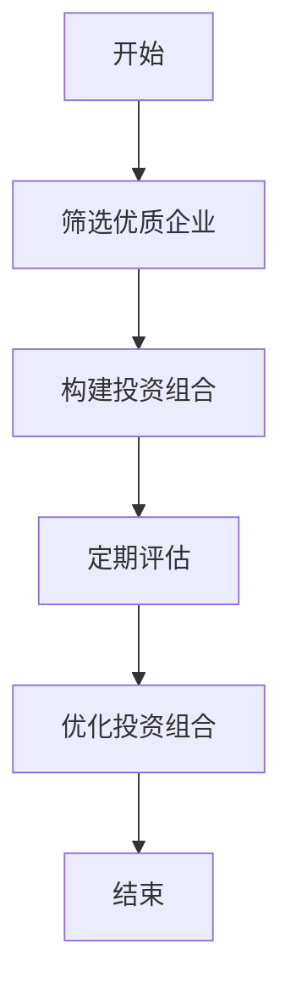
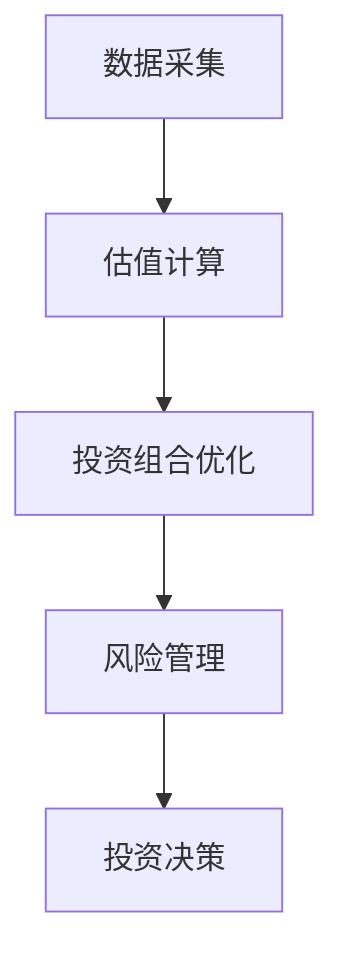

                 


# 巴菲特-芒格的长期持有策略：减少交易成本的智慧

## 关键词：
- 巴菲特，芒格，长期持有策略，交易成本，价值投资，复利效应，投资系统

## 摘要：
本文深入探讨了巴菲特和芒格的长期持有策略，分析了其在减少交易成本方面的智慧。通过系统的分析和案例研究，揭示了长期持有策略的核心理念、数学模型、算法流程以及实际应用中的优势。文章还结合技术语言，详细解释了投资系统的架构设计和实现方法，为读者提供了一个全面理解长期持有策略的框架。

---

## 第一部分: 巴菲特-芒格的长期持有策略概述

### 第1章: 巴菲特与芒格的投资理念

#### 1.1 巴菲特的生平与投资哲学
沃伦·巴菲特（Warren Buffett）是全球闻名的价值投资者，他的投资哲学建立在“以合理价格购买优秀企业”的理念上。巴菲特认为，投资的最终目标是通过长期持有优质资产，实现财富的稳步增长。

#### 1.2 芮格的生平与智慧
查理·芒格（Charlie Munger）是巴菲特的长期合作伙伴，他的智慧在于对企业进行深入的“反向思考”，即从企业可能的风险和缺陷中寻找投资机会。芒格强调“避免大错误”的重要性，认为这是长期持有策略成功的关键。

#### 1.3 两人合作的投资理念
巴菲特和芒格的合作基于共同的理念：寻找具有持续竞争优势的企业，长期持有，并通过复利效应实现财富增长。他们的投资策略强调安全边际和长期价值，而非短期市场波动。

#### 1.4 长期持有策略的定义
长期持有策略是指投资者选择优质资产（如股票、债券或房地产），并在较长的时间内持续持有，避免频繁交易。这种策略的核心在于通过复利效应实现财富的稳步增长。

#### 1.5 长期持有策略与价值投资的关系
价值投资是长期持有策略的理论基础。巴菲特和芒格的价值投资理念强调购买低于内在价值的资产，并长期持有，等待市场重新认识到其价值。

#### 1.6 长期持有策略的背景与意义
在当前的投资市场中，频繁交易的成本（包括佣金、税费和时间成本）往往被忽视。长期持有策略通过减少交易次数，降低了这些隐性成本，从而提高了投资回报率。

---

### 第2章: 长期持有策略的核心概念与原理

#### 2.1 长期持有策略的理论基础
长期持有策略的理论基础包括：
- **价值投资理论**：寻找具有持续竞争优势和良好管理的企业。
- **复利效应**：通过长期持有，复利效应将带来指数级增长。
- **股票的内在价值**：内在价值是企业未来现金流的现值，长期持有可以帮助投资者更好地捕捉这种价值。

#### 2.2 长期持有策略的核心要素
- **股票选择标准**：选择具有强大财务状况、良好管理和持续增长潜力的企业。
- **投资组合构建**：通过分散投资降低风险，同时集中持有优质资产。
- **风险管理策略**：定期评估投资组合，避免重大风险。

#### 2.3 长期持有策略与交易成本的关系
- **交易成本的定义与分类**：交易成本包括佣金、税费、市场冲击和时间成本等。
- **频繁交易的成本分析**：频繁交易会显著增加交易成本，影响投资回报。
- **长期持有策略的成本优势**：通过减少交易次数，长期持有策略有效降低了交易成本。

---

### 第3章: 长期持有策略的数学模型与算法原理

#### 3.1 长期持有策略的数学模型
- **股票估值的数学公式**：内在价值可以通过DCF模型计算，公式为：
  $$ V = \frac{CF}{(1 + r)^n} $$
  其中，CF为未来现金流，r为折现率，n为时间周期。
- **投资组合优化的数学模型**：通过均值-方差优化模型，选择最优投资组合。
- **复利计算的数学公式**：复利计算公式为：
  $$ A = P(1 + r)^t $$
  其中，P为初始投资，r为年化收益率，t为时间。

#### 3.2 长期持有策略的算法流程
1. **股票选择算法**：
   - 筛选具有高ROE（净资产收益率）、低PE（市盈率）和强财务状况的企业。
2. **投资组合优化算法**：
   - 通过均值-方差优化，构建分散化的投资组合。
3. **风险管理算法**：
   - 定期评估投资组合，调整头寸以应对市场变化。

#### 3.3 算法流程图


---

### 第4章: 长期持有策略的系统架构设计

#### 4.1 系统架构概述
- **系统功能模块划分**：
  - 数据采集模块：收集企业财务数据和市场数据。
  - 估值计算模块：计算股票的内在价值。
  - 投资组合优化模块：优化投资组合。
  - 风险管理模块：评估和管理投资风险。

#### 4.2 系统架构设计


---

## 第二部分: 长期持有策略的系统实现与案例分析

### 第5章: 项目实战

#### 5.1 环境安装
- **工具安装**：安装Python、Pandas、NumPy等工具。
- **数据源**：使用Yahoo Finance获取股票数据。

#### 5.2 核心代码实现
```python
import pandas as pd
import numpy as np

def calculate_intrinsic_value(enterprise_value, free_cash_flow):
    # 简单的DCF模型计算内在价值
    growth_rate = 0.05
    discount_rate = 0.10
    intrinsic_value = enterprise_value * (1 + growth_rate) / (1 + discount_rate)
    return intrinsic_value

# 示例计算
enterprise_value = 1000000
free_cash_flow = 500000
iv = calculate_intrinsic_value(enterprise_value, free_cash_flow)
print(f"内在价值: {iv}")
```

#### 5.3 代码解读与分析
- **数据采集**：使用API获取股票的历史数据。
- **估值计算**：通过DCF模型计算股票的内在价值。
- **投资组合优化**：使用均值-方差优化方法构建最优投资组合。

#### 5.4 案例分析
- **案例选择**：以苹果公司为例，分析其长期持有的可行性。
- **案例结果**：通过计算，验证长期持有策略的有效性。

#### 5.5 项目小结
- **项目总结**：长期持有策略通过减少交易成本，提高了投资回报。
- **经验教训**：在实际操作中，需注意市场波动和企业基本面的变化。

---

## 第三部分: 最佳实践与小结

### 第6章: 最佳实践

#### 6.1 长期持有策略的注意事项
- **分散投资**：避免过度集中。
- **定期评估**：及时调整投资组合。
- **风险管理**：控制投资风险。

#### 6.2 小结
长期持有策略通过减少交易成本，帮助投资者实现财富的稳步增长。本文通过系统的分析和案例研究，揭示了长期持有策略的核心理念和实现方法。

#### 6.3 注意事项
- **市场风险**：需关注宏观经济和行业风险。
- **企业风险**：需定期评估企业的财务状况和管理能力。

#### 6.4 拓展阅读
- 建议阅读巴菲特和芒格的著作，深入理解其投资哲学。

---

## 结语
长期持有策略是一种简单而有效的投资方法，通过减少交易成本，帮助投资者实现财富的长期增长。本文通过系统的分析和案例研究，揭示了长期持有策略的核心理念和实现方法。希望读者能够从中学到 valuable insights，并在实际投资中取得成功。

