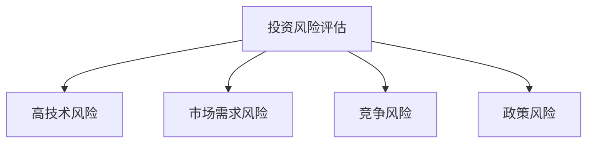

                 

# 第2章: 高超音速技术的核心概念与投资逻辑

## 2.1 高超音速技术的核心概念

### 2.1.1 高超音速技术的定义与分类

高超音速技术是一种能够在大气层内以超过5倍音速（即5马赫以上）飞行的技术，属于高速飞行器技术的一种。根据飞行速度和飞行环境的不同，高超音速技术可以分为以下几类：

- **大气层内高超音速飞行**：指飞行器在地球大气层内以5马赫以上的速度飞行。
- **跨大气层飞行**：指飞行器能够在大气层内外飞行，兼具高超音速和航天技术特点。
- **高超音速导弹**：一种利用高超音速技术的高速导弹，具有极强的突防能力。

### 2.1.2 高超音速技术的核心技术领域

高超音速技术的实现涉及多个高科技领域，主要包括以下几个方面：

- **空气动力学**：研究高速飞行器在高速气流中的运动规律和设计优化。
- **推进系统**：包括火箭发动机、冲压发动机等高速推进技术。
- **材料科学**：需要耐高温、高强度的材料以应对高速飞行中的极端环境。
- **导航与控制**：实现高精度导航和高速飞行器的稳定控制。
- **通信与数据链**：确保高速飞行器在高速运动中的实时通信和数据传输。

### 2.1.3 高超音速技术的应用场景

高超音速技术在军事和民用领域都有广泛的应用前景：

- **军事领域**：高超音速导弹可以实现对敌目标的快速打击，具有极高的突防能力。
- **民用领域**：高超音速飞行器可以用于洲际旅行，大幅缩短全球旅行时间，有望实现“多地一日游”的目标。

### 2.1.4 高超音速技术的关键技术难点

高超音速技术的实现面临诸多技术难题，主要包括：

- **高温环境下的材料耐受性**：高速飞行中，飞行器表面温度极高，需要寻找能够耐受数千摄氏度高温的材料。
- **空气动力学设计的复杂性**：高速飞行中的空气动力学效应复杂，需要进行大量的模拟和实验验证。
- **推进系统的高效性**：需要开发能够提供足够推力的高效率推进系统。
- **导航与控制的精准性**：高速飞行中，飞行器需要进行实时调整，这对导航与控制系统的精度提出了极高的要求。

### 2.1.5 高超音速技术的市场现状与未来趋势

目前，高超音速技术仍处于发展阶段，主要由政府和军事机构主导，民用领域的应用尚未大规模展开。未来，随着技术的成熟和成本的下降，高超音速技术将逐步进入民用领域，推动全球交通方式的革命性变化。

---

## 2.2 投资逻辑的构建

### 2.2.1 投资逻辑的背景与目标

高超音速技术的未来发展潜力巨大，但同时也面临着技术复杂、研发周期长、投资风险高等问题。传统的投资逻辑往往难以应对这种高技术、高风险的投资领域。因此，我们需要构建一套专门针对高超音速技术投资的逻辑框架，以帮助投资者更好地把握投资机会和风险。

### 2.2.2 投资逻辑的核心要素

一个完整的高超音速技术投资逻辑应包括以下几个核心要素：

1. **技术可行性评估**：评估高超音速技术在当前阶段的技术成熟度、存在的技术瓶颈以及未来技术突破的可能性。
2. **市场需求分析**：分析高超音速技术在军事和民用领域的市场需求，评估市场规模和增长潜力。
3. **竞争环境分析**：研究当前高超音速技术领域的竞争格局，包括主要竞争对手的技术水平、研发进展和市场布局。
4. **投资回报分析**：基于技术可行性和市场需求，评估高超音速技术投资的潜在回报率和风险。

### 2.2.3 投资逻辑的验证与优化

投资逻辑的验证和优化是一个动态的过程，需要根据实际情况不断调整和优化。以下是验证和优化的关键步骤：

1. **数据收集与分析**：收集高超音速技术相关的市场数据、技术资料和竞争信息，进行定量和定性分析。
2. **模型构建与仿真**：利用数学模型和仿真工具，对高超音速技术的投资逻辑进行验证和优化。
3. **案例分析**：通过对已有的高超音速技术投资项目进行案例分析，总结经验教训，优化投资逻辑。
4. **持续监控与调整**：密切关注高超音速技术领域的最新进展和市场变化，及时调整投资逻辑。

---

## 2.3 巴菲特与芒格的投资逻辑与高超音速技术的结合

### 2.3.1 巴菲特的价值投资理念

巴菲特的价值投资理念强调长期投资、注重企业内在价值和安全边际。他认为，投资者应选择那些具有强大竞争优势、良好财务状况和优秀管理团队的企业进行投资。

### 2.3.2 芒格的多元思维模型

芒格的多元思维模型强调从多个学科和角度去分析问题，避免单一思维的局限性。他认为，投资者应具备跨学科的知识储备，以便更好地理解和评估复杂的投资机会。

### 2.3.3 高超音速技术投资中的结合应用

在高超音速技术投资中，巴菲特的价值投资理念和芒格的多元思维模型可以结合起来，形成一种独特的投资逻辑。具体表现为：

1. **长期投资视角**：关注高超音速技术的长期发展潜力，选择具有持续创新能力和市场竞争力的企业进行投资。
2. **跨学科分析**：利用多元思维模型，从技术、市场、财务等多个角度对高超音速技术投资项目进行综合评估。
3. **风险控制**：注重投资的安全边际，选择那些具有较强技术壁垒和市场优势的企业，降低投资风险。

---

## 2.4 高超音速技术投资逻辑的数学模型与算法

### 2.4.1 投资潜力评估模型

为了量化高超音速技术的投资潜力，我们可以构建一个基于多因素分析的投资潜力评估模型。模型的公式如下：

$$
\text{投资潜力} = \sum_{i=1}^{n} w_i \cdot f_i
$$

其中：
- $w_i$ 是第 $i$ 个因素的权重。
- $f_i$ 是第 $i$ 个因素的评分（通常为 1 到 5 分）。

### 2.4.2 投资风险评估模型

投资风险是高超音速技术投资中的一个重要考量因素。我们可以使用风险矩阵模型来评估投资风险，如下图所示：

### 2.4.3 投资回报预测模型

为了预测高超音速技术投资的回报率，我们可以使用净现值（NPV）模型。模型的公式如下：

$$
\text{NPV} = \sum_{t=0}^{n} \frac{CF_t}{(1 + r)^t}
$$

其中：
- $CF_t$ 是第 $t$ 年的现金流。
- $r$ 是折现率。
- $n$ 是项目的生命周期。

---

## 2.5 本章小结

本章重点介绍了高超音速技术的核心概念与投资逻辑，分析了高超音速技术的定义、分类、应用场景和技术难点，探讨了高超音速技术的投资逻辑构建，最后结合巴菲特与芒格的投资理念，提出了高超音速技术投资的逻辑框架。通过数学模型和算法的引入，我们为高超音速技术的投资决策提供了一套科学的分析工具。

--- 

接下来，我们可以根据这个章节的内容，继续撰写后续章节。

