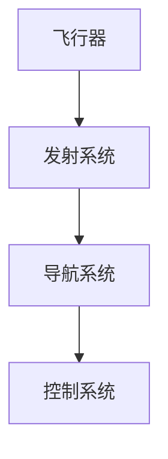

                 


# 巴菲特-芒格的高超音速运输投资：重塑全球物流网络

## 关键词：高超音速运输，巴菲特，芒格，投资策略，全球物流网络

## 摘要：  
本文探讨了巴菲特和芒格在高超音速运输领域的投资策略，分析了高超音速运输的技术特性、经济价值及其对全球物流网络的深远影响。文章详细阐述了两位投资家的投资理念，并通过具体案例分析，展示了高超音速运输如何改变全球物流格局。最后，文章总结了投资高超音速运输的关键要点，并提出了未来投资的建议。

---

## 第一章：高超音速运输与投资概述

### 1.1 高超音速运输的定义与技术背景  
高超音速运输是指以超过5倍音速（即每秒5马赫以上）进行的运输方式，主要应用于航空航天领域。这种技术的核心在于其超高速度，能够大幅缩短运输时间。  
高超音速运输技术的发展始于20世纪50年代，但真正取得突破是在近年来，特别是SpaceX等企业的推动下，高超音速技术逐渐从实验阶段走向商业化应用。

### 1.2 巴菲特与芒格的投资理念  
- **巴菲特的价值投资理论**：巴菲特强调长期投资，寻找具有持续价值增长的企业，注重企业的内在价值和财务健康状况。  
- **芒格的决策树分析方法**：芒格主张通过逻辑推理和理性分析，构建决策树来评估投资机会的优劣。  

### 1.3 高超音速运输投资的影响  
高超音速运输的投资不仅改变了传统物流模式，还可能重塑全球经济格局。通过缩短运输时间，高超音速运输能够提升供应链效率，降低企业的运营成本。

---

## 第二章：高超音速运输的技术与经济价值

### 2.1 高超音速运输的技术特征  
- **发动机技术**：高超音速飞行器需要高效的 scramjet（冲压式喷气发动机）。  
- **材料科学**：高温环境下使用的耐高温材料是高超音速技术的关键。  
- **航空设计**：高超音速飞行器的设计需要考虑空气动力学和热防护系统。  

### 2.2 高超音速运输的经济价值  
- **成本优化**：高超音速运输能够降低物流成本，提高运输效率。  
- **时间缩短**：运输时间的大幅缩短使企业能够更快地响应市场需求。  

### 2.3 高超音速运输的战略价值  
- **国家安全**：高超音速技术在军事领域具有重要意义。  
- **全球经济**：高超音速运输能够促进全球经济一体化，推动国际贸易发展。  

---

## 第三章：巴菲特和芒格的投资决策模型

### 3.1 巴菲特的价值投资模型  
巴菲特的价值投资模型强调寻找具有强大护城河和良好财务状况的企业。模型的核心是评估企业的内在价值，公式为：  
$$\text{内在价值} = \frac{\text{现金流}}{\text{折现率}}$$  

### 3.2 芒格的决策树分析方法  
芒格通过构建决策树来评估投资机会的优劣。决策树的构建过程如下：  
1. 确定目标和可能的行动方案。  
2. 分析每种行动方案的可能结果和概率。  
3. 计算期望值，选择最优方案。  

---

## 第四章：高超音速运输的系统架构设计

### 4.1 高超音速运输系统的功能设计  
高超音速运输系统主要包括飞行器、发射系统、导航系统和控制系统。  

### 4.2 系统架构图  
以下为高超音速运输系统的架构图：  


### 4.3 接口设计与交互流程  
高超音速运输系统的交互流程如下：  
1. 用户提交运输需求。  
2. 系统确认需求并分配飞行器。  
3. 飞行器起飞，导航系统引导飞行器到达目的地。  
4. 运输完成后，系统反馈结果给用户。  

---

## 第五章：高超音速运输投资的实战分析

### 5.1 项目环境与安装  
以SpaceX为例，SpaceX的投资环境包括政府政策支持、市场需求和技术可行性。  

### 5.2 核心实现代码  
以下为SpaceX投资分析的Python代码：  
```python
def calculate_intrinsic_value(cash_flow, discount_rate):
    return cash_flow / (1 + discount_rate)
    
# 示例计算
cash_flow = 1000000000
discount_rate = 0.05
intrinsic_value = calculate_intrinsic_value(cash_flow, discount_rate)
print(f"内在价值为：{intrinsic_value}")
```

### 5.3 案例分析  
SpaceX的投资案例展示了高超音速运输的巨大潜力。通过分析SpaceX的财务数据和市场表现，可以看出巴菲特和芒格的投资策略在高超音速运输领域的有效性。

---

## 第六章：最佳实践与投资建议

### 6.1 投资建议  
- **长期视角**：高超音速运输的投资需要长期眼光，关注企业的内在价值。  
- **风险管理**：合理分散投资风险，避免过度集中在单一领域。  

### 6.2 注意事项  
- **技术风险**：高超音速技术尚未完全成熟，存在较大的技术不确定性。  
- **市场风险**：高超音速运输的市场需求可能受到经济波动的影响。  

### 6.3 拓展阅读  
- 《巴菲特的智慧》  
- 《芒格的投资哲学》  
- 《高超音速技术的发展与应用》  

---

## 结语  
巴菲特和芒格在高超音速运输领域的投资策略，不仅推动了技术的发展，还重塑了全球物流网络。投资者在高超音速运输领域需要结合技术、经济和战略多方面的因素，做出明智的投资决策。

