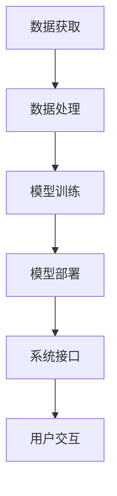

                 

<think>
好，我现在需要按照用户的要求，撰写一篇关于“巴菲特-芒格看AI在金融服务中的应用：机遇与风险”的技术博客文章。用户已经提供了一个详细的目录大纲，我需要根据这个大纲逐步展开，撰写每个章节的内容。

首先，我会从第一章开始，介绍巴菲特和芒格的投资理念。接下来，我会讨论AI在金融服务中的应用场景，分析AI如何影响投资决策、风险管理等领域。然后，我会探讨巴菲特和芒格对AI技术的看法，以及AI在金融服务中的算法和数学模型。接着，我会设计金融服务AI系统的架构，并通过项目实战来展示AI的实际应用。最后，我会总结AI在金融服务中的机遇与风险，并提出相应的建议。

在写作过程中，我会确保每个章节都包含丰富的细节和具体的例子，使用清晰的技术语言，同时加入数学公式和图表来增强理解。我还需要注意文章的结构和逻辑，确保每个部分之间衔接自然，内容全面且有深度。

好的，现在我开始撰写正文内容。

---

# 巴菲特-芒格看AI在金融服务中的应用：机遇与风险

## 关键词：巴菲特，芒格，人工智能，金融服务，投资，风险管理

## 摘要：本文探讨巴菲特和芒格的投资理念与AI技术在金融服务中的结合，分析AI带来的投资机遇与风险管理挑战。通过详细介绍AI算法、系统架构和项目实战，揭示AI如何优化金融服务，并提出在AI驱动的投资环境中，投资者需平衡技术优势与人类智慧的必要性。

---

## 第1章 巴菲特与芒格的投资哲学

### 1.1 巴菲特的价值投资原则

沃伦·巴菲特是价值投资的代表人物，他强调以低于内在价值的价格购买优质资产。他的投资理念基于以下原则：

1. **长期主义**：巴菲特认为投资是长期的事业，而非短期的交易。他建议投资者选择那些具有持续竞争优势的企业，耐心持有，等待价值的实现。
2. **安全边际**：他强调在购买股票时，应考虑其市场价格与内在价值的差距，即安全边际。这种差距越大，投资的风险越小。
3. **集中投资**：巴菲特建议将资金集中在少数几只优质股票上，而不是分散投资。他认为，集中投资于少数优质资产可以减少风险，提高收益。

### 1.2 芒格的多元思维模型

查理·芒格是巴菲特的合作伙伴，他的多元思维模型强调通过多个学科的交叉应用来理解复杂的问题。芒格认为，投资者需要掌握心理学、经济学、会计学等多个领域的知识，以避免思维盲区。

1. **复利思维**：芒格认为复利是世界第八大奇迹，投资的复利效应可以帮助投资者实现财富的长期增长。
2. **机会成本**：芒格强调机会成本的重要性，认为每一种投资决策都需要考虑放弃其他机会的成本。
3. **逆向思维**：芒格建议投资者从反方向思考问题，避免从众心理，寻找市场忽视的机会。

### 1.3 价值投资与长期主义

巴菲特和芒格的价值投资理念强调长期主义，他们认为市场的短期波动不应该影响长期投资决策。这种理念在AI驱动的投资环境中仍然具有重要意义，因为AI虽然可以提供短期的交易机会，但长期的价值投资仍然是实现财富增长的关键。

---

## 第2章 人工智能与金融服务的结合

### 2.1 人工智能的基本概念与技术特点

人工智能（AI）是模拟人类智能的计算机系统，其核心是机器学习、自然语言处理和计算机视觉等技术。AI在金融服务中的应用主要体现在以下几个方面：

1. **数据处理能力**：AI可以快速处理大量数据，提取有价值的信息，帮助投资者做出更明智的决策。
2. **预测能力**：通过机器学习算法，AI可以预测市场走势、股票价格和风险事件。
3. **自动化交易**：AI可以通过算法进行高频交易，捕捉市场中的微小机会。

### 2.2 AI在金融服务中的应用场景

#### 2.2.1 投资决策的智能化

AI可以通过分析历史数据和市场信息，帮助投资者做出更准确的投资决策。例如，AI可以通过自然语言处理技术分析新闻和社交媒体，预测市场情绪的变化。

#### 2.2.2 风险管理与信用评估

AI可以用于信用评估和风险管理。通过分析客户的信用历史和市场数据，AI可以帮助金融机构评估风险，制定更有效的风险管理策略。

#### 2.2.3 客户服务与精准营销

AI可以通过客户数据分析，帮助金融机构进行精准营销。例如，AI可以根据客户的投资偏好和风险承受能力，推荐适合的金融产品。

---

## 第3章 巴菲特与芒格视角下的AI机遇

### 3.1 巴菲特与芒格对AI技术的看法

#### 3.1.1 巴菲特对AI技术的谨慎态度

巴菲特对AI技术持谨慎态度，他认为AI可能会导致市场的过度波动，但AI在数据分析和预测方面的优势也不容忽视。

#### 3.1.2 芒格对AI技术的理性分析

芒格认为AI技术可以提高投资效率，但人类的判断力和经验仍然不可替代。他强调AI应该作为辅助工具，而非替代人类决策的工具。

#### 3.1.3 巴菲特与芒格的共同认知

巴菲特和芒格都认为AI技术在金融服务中的应用潜力巨大，但同时也强调投资者需要具备人类的智慧和判断力，避免过度依赖AI。

### 3.2 AI技术在金融服务中的优势

#### 3.2.1 数据处理能力的提升

AI可以通过机器学习算法处理大量数据，提取有价值的信息，帮助投资者做出更明智的决策。

#### 3.2.2 投资决策的智能化优化

AI可以通过预测市场走势和分析数据，优化投资决策，提高投资效率。

#### 3.2.3 风险管理的精准化

AI可以通过分析风险因素，帮助金融机构制定更有效的风险管理策略。

---

## 第4章 AI在金融服务中的算法与数学模型

### 4.1 机器学习算法概述

#### 4.1.1 监督学习与无监督学习

- **监督学习**：通过 labeled data 进行训练，预测目标变量。
- **无监督学习**：通过 unlabeled data 进行训练，发现数据中的结构和模式。

#### 4.1.2 线性回归与决策树模型

- **线性回归**：用于预测连续变量，如股票价格。
- **决策树模型**：用于分类问题，如客户信用评估。

#### 4.1.3 支持向量机与神经网络

- **支持向量机（SVM）**：用于分类和回归问题，适用于高维数据。
- **神经网络**：通过多层网络结构，模拟人类神经系统的运作。

### 4.2 时间序列分析与金融预测

#### 4.2.1 ARIMA模型的原理与应用

ARIMA（Autoregressive Integrated Moving Average）模型用于时间序列预测，适用于具有趋势和季节性的数据。

#### 4.2.2 LSTM网络在金融时间序列中的应用

LSTM（长短期记忆网络）适用于处理长序列数据，能够捕捉时间序列中的长期依赖关系。

#### 4.2.3 GARCH模型与波动率预测

GARCH（广义自回归条件异方差模型）用于预测金融资产的波动率。

### 4.3 风险评估的数学模型

#### 4.3.1 VaR模型的原理与应用

VaR（Value at Risk）用于衡量投资组合在一定置信水平下的潜在损失。

#### 4.3.2 CreditMetrics模型的介绍

CreditMetrics模型用于评估信用风险，通过模拟不同情景下的信用违约情况。

#### 4.3.3 风险调整后的收益（RAROC）计算

RAROC（风险调整后的资本回报率）用于衡量投资回报与风险之间的关系。

---

## 第5章 金融服务AI系统的架构设计

### 5.1 系统架构概述

#### 5.1.1 数据获取与处理模块

- 数据获取：从多个数据源获取金融数据，如股票价格、市场新闻等。
- 数据处理：清洗、转换和预处理数据，确保数据质量。

#### 5.1.2 模型训练与部署模块

- 模型训练：使用机器学习算法训练模型，如神经网络、支持向量机等。
- 模型部署：将训练好的模型部署到生产环境，实时处理金融数据。

#### 5.1.3 系统接口与用户交互模块

- 系统接口：提供API接口，供其他系统调用模型服务。
- 用户交互：提供用户界面，供投资者查询和分析数据。

### 5.2 系统功能设计

#### 5.2.1 投资决策模块的功能设计

- 数据分析：分析市场数据，提供投资建议。
- 风险评估：评估投资组合的风险，提供风险管理策略。

#### 5.2.2 风险管理模块的功能设计

- 风险监控：实时监控市场风险，及时发出预警。
- 风险报告：生成风险报告，帮助投资者了解市场风险。

#### 5.2.3 客户服务模块的功能设计

- 客户分析：分析客户需求，推荐适合的金融产品。
- 客户支持：提供客户服务，解答投资者疑问。

### 5.3 系统架构图



---

## 第6章 项目实战

### 6.1 环境安装

#### 6.1.1 安装Python环境

```bash
python --version
pip install numpy pandas scikit-learn
```

#### 6.1.2 安装机器学习库

```bash
pip install xgboost lightgbm
```

### 6.2 系统核心实现源代码

#### 6.2.1 数据获取与处理

```python
import pandas as pd
import numpy as np

# 获取数据
data = pd.read_csv('financial_data.csv')

# 数据清洗
data = data.dropna()
data = data[~data['date'].duplicated()]
```

#### 6.2.2 模型训练

```python
from sklearn.model

