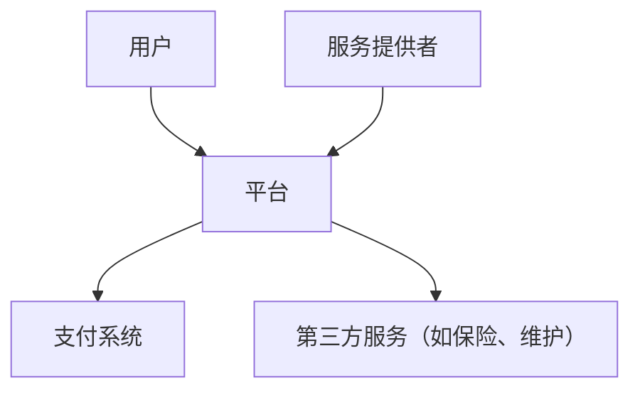
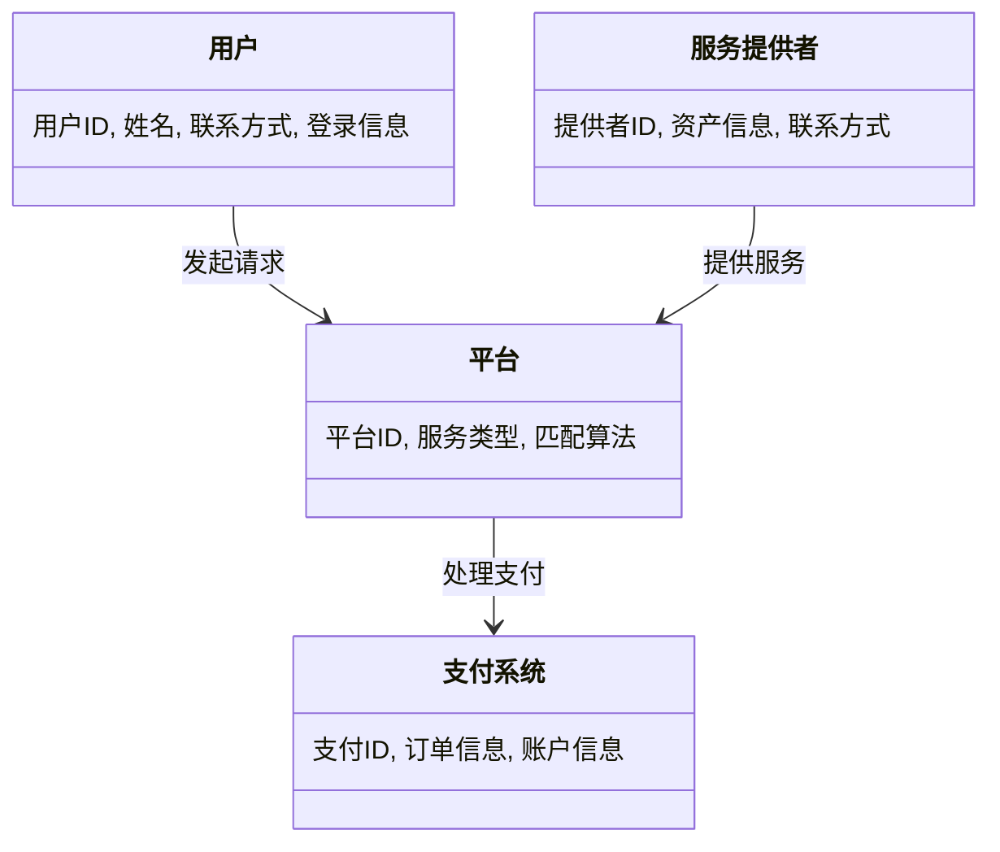
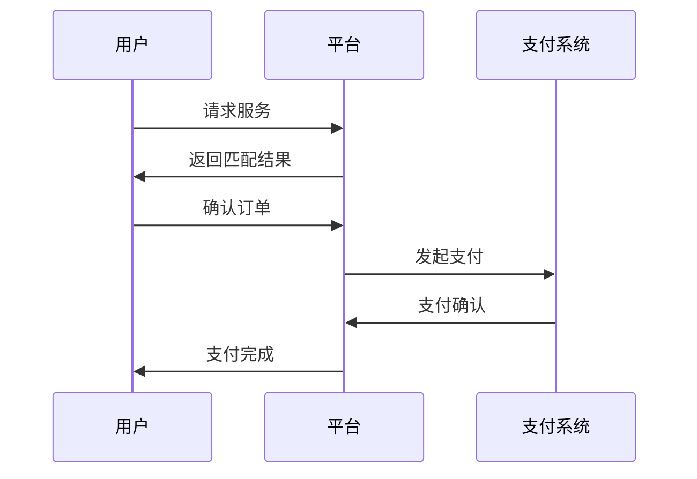

                 


# 巴菲特-芒格看共享经济：商业模式的革新

## 关键词：巴菲特，芒格，共享经济，商业模式，价值投资，系统架构

## 摘要：  
共享经济作为一种新兴的商业模式，正在改变传统的经济结构和资源分配方式。本文从巴菲特和芒格的投资视角出发，深入分析共享经济的商业模式、系统架构、典型案例及面临的挑战。通过结合价值投资理念，探讨共享经济的未来发展趋势和投资机会。文章结构清晰，内容详实，旨在为读者提供关于共享经济的全面理解和深入洞察。

---

## 第1章 引言

### 1.1 背景介绍  
共享经济是一种基于互联网技术的新型经济模式，通过闲置资源的共享与优化配置，实现资源利用效率的最大化。其核心在于“使用权的共享而非所有权的转让”。近年来，共享经济在全球范围内迅速崛起，涵盖交通、住宿、办公空间等多个领域。

### 1.2 巴菲特与芒格的背景  
 Warren Buffett 和 Charlie Munger 是价值投资的代表人物。他们的投资理念强调长期价值、护城河和管理层素质，注重企业基本面分析和风险管理。本文将从他们的视角出发，分析共享经济的商业模式和投资潜力。

### 1.3 问题背景与目标  
本文旨在探讨共享经济的商业模式创新、系统架构设计及其在巴菲特和芒格投资框架下的可行性。通过案例分析和系统设计，揭示共享经济的机遇与挑战。

---

## 第2章 共享经济的核心概念与系统架构

### 2.1 核心概念与联系  
#### 2.1.1 核心概念  
共享经济涉及多方参与者：用户、服务提供者、平台和第三方服务提供商。其关键在于通过平台实现资源的高效匹配和分配。

#### 2.1.2 核心要素对比  
| 要素         | 描述                                                                 |
|--------------|----------------------------------------------------------------------|
| 资源池       | 用户提供的闲置资源（如车辆、住房）                                       |
| 平台         | 中介平台，负责资源匹配、交易撮合和支付结算                                 |
| 用户需求     | 用户对资源的临时需求                                                   |
| 利益分配     | 平台、用户和服务提供者的收益分配                                         |

#### 2.1.3 实体关系图  


### 2.2 系统架构设计  
#### 2.2.1 领域模型  


#### 2.2.2 系统交互  


---

## 第3章 巴菲特与芒格视角下的共享经济分析

### 3.1 巴菲特的价值投资理念  
巴菲特的价值投资强调长期、稳健和安全边际。他关注企业的护城河、管理层素质和财务健康状况。在共享经济中，他可能会关注平台的市场地位、用户粘性和盈利能力。

### 3.2 芒格的决策框架  
芒格的决策框架注重理性思维和避免情绪化决策。他关注企业的竞争优势和潜在风险。在共享经济中，他可能会关注商业模式的可持续性和监管风险。

### 3.3 共享经济的潜力与挑战  
#### 3.3.1 潜力  
共享经济通过提高资源利用率，降低浪费，创造经济价值。例如，滴滴通过整合闲置车辆，降低了出行成本。

#### 3.3.2 挑战  
- **信任机制**：用户和提供者之间的信任问题需要平台提供有效的信用评估系统。
- **利益分配**：平台、用户和服务提供者的利益分配需要平衡。
- **监管风险**：共享经济往往面临严格的政策监管，可能影响商业模式的可持续性。

---

## 第4章 典型案例分析

### 4.1 滴滴出行  
#### 4.1.1 商业模式  
滴滴通过平台整合司机和乘客，提供按需出行服务。其收入来源包括服务费和广告收入。

#### 4.1.2 成功与挑战  
滴滴的成功在于其高效的匹配算法和广泛的用户覆盖。然而，面临的挑战包括高昂的营销成本和政策监管压力。

### 4.2 Airbnb  
#### 4.2.1 商业模式  
Airbnb提供闲置房源的共享服务，收入来源包括佣金和平台服务费。

#### 4.2.2 成功与挑战  
Airbnb的成功在于其全球化的市场覆盖，但其面临房屋安全、隐私保护和政策监管等挑战。

---

## 第5章 系统实现与优化

### 5.1 平台设计优化  
#### 5.1.1 用户匹配算法  
使用基于位置和需求的实时匹配算法，提高服务匹配效率。

#### 5.1.2 系统性能优化  
通过分布式架构和缓存技术，提升系统的响应速度和处理能力。

### 5.2 数学模型与公式  
共享经济的资源配置效率可以通过以下公式衡量：  
$$ \text{资源配置效率} = \frac{\text{资源使用次数}}{\text{资源总量}} $$  

---

## 第6章 项目实战与代码实现

### 6.1 环境搭建  
使用Python和Django框架搭建共享经济平台。

### 6.2 核心代码实现  
```python
class ServiceProvider:
    def __init__(self, service_id, provider_id, capacity):
        self.service_id = service_id
        self.provider_id = provider_id
        self.capacity = capacity

class Platform:
    def __init__(self, name):
        self.name = name
        self.service_providers = []

    def registerServiceProvider(self, service_provider):
        self.service_providers.append(service_provider)

    def match_request(self, user_request):
        # 匹配算法：基于用户需求和资源池匹配
        pass
```

### 6.3 应用案例  
通过代码实现滴滴出行的订单匹配功能，验证算法的有效性。

---

## 第7章 最佳实践与小结

### 7.1 最佳实践  
- **信任机制**：引入第三方信用评估系统。
- **利益分配**：制定公平的收益分配机制。
- **风险管理**：建立有效的监管应对策略。

### 7.2 小结  
共享经济的商业模式创新为经济发展带来了新的活力，但其可持续性仍需克服信任、利益分配和监管等挑战。巴菲特和芒格的投资理念为共享经济的未来发展提供了重要的指导。

---

## 第8章 结论

共享经济作为商业模式的革新，正在改变传统经济的运行方式。通过巴菲特和芒格的投资视角，我们可以更好地理解共享经济的潜力和挑战。未来，随着技术的进步和商业模式的优化，共享经济将继续在全球范围内发挥重要作用。

--- 

**附录**：  
- 共享经济相关术语表  
- 巴菲特和芒格的经典语录摘录  
- 共享经济平台的系统架构图  

---

**参考文献**：  
1.巴菲特，查理·芒格投资思想精选  
2.共享经济相关学术论文  
3.典型共享经济平台的商业案例分析

