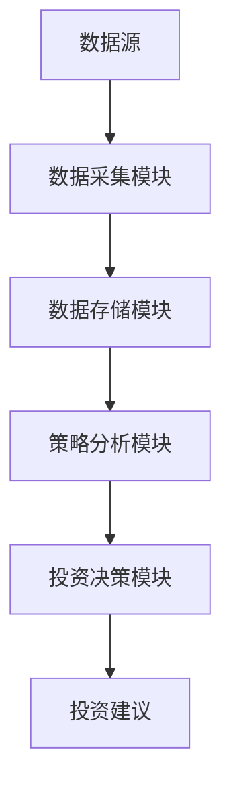

                 


```markdown
# 巴菲特-芒格策略在不同市场环境下的表现

> 关键词：巴菲特, 芮格, 投资策略, 市场环境, 价值投资

> 摘要：本文深入分析了巴菲特和芒格的投资策略在不同市场环境下的表现，探讨了他们的价值投资理念、策略在牛市、熊市和震荡市中的应用，并结合数学模型和实际案例，展示了如何优化投资组合以应对不同市场周期。

---

## 第一部分：巴菲特-芒格策略概述

### 第1章：巴菲特与芒格的投资理念

#### 1.1 巴菲特的投资哲学

##### 1.1.1 价值投资的核心理念
价值投资的核心在于寻找市场低估的股票，并长期持有。巴菲特强调企业内在价值的重要性，而非短期市场波动。数学模型中，内在价值公式为：

$$
\text{内在价值} = \sum_{t=1}^{\infty} \frac{\text{现金流}_t}{(1 + r)^t}
$$

其中，\( r \) 是折现率，\( \text{现金流}_t \) 是第 \( t \) 年的现金流。

##### 1.1.2 股价与内在价值的定义
股价与内在价值的差异是投资机会的来源。巴菲特认为，市场先生的短期情绪波动为理性投资者提供了以低于内在价值的价格买入优质资产的机会。

##### 1.1.3 投资的长期视角
巴菲特强调长期投资，避免频繁交易。他认为短期市场的波动是噪音，长期趋势才是关键。

#### 1.2 芮格的多元思维模型

##### 1.2.1 多学科交叉分析的重要性
芒格提倡通过多学科交叉分析来识别投资机会和风险。例如，通过心理学、经济学和物理学的交叉分析，可以更好地理解市场的非理性行为。

##### 1.2.2 决策中的心理偏差
芒格指出，投资者常见的心理偏差（如从众心理、过度自信）可能导致错误决策。通过识别这些偏差，投资者可以避免情绪化决策。

##### 1.2.3 投资中的逆向思维
芒格提倡逆向思维，即在市场恐慌时寻找机会，而在市场兴奋时保持冷静。

### 第2章：巴菲特-芒格策略的核心要素

#### 2.1 企业护城河的识别

##### 2.1.1 技术壁垒
技术壁垒是企业抵御竞争对手的关键。例如，专利和技术进步可以确保企业的竞争优势。

##### 2.1.2 市场垄断
市场垄断地位使企业能够维持高利润率。例如，可口可乐和百事可乐的双头垄断市场。

##### 2.1.3 成本优势
成本优势使企业能够在价格竞争中获胜。例如，低成本制造商在价格战中的优势。

#### 2.2 财务指标的分析

##### 2.2.1 净利润与ROE
净利润衡量企业的盈利能力，ROE（净资产收益率）衡量股东资金的使用效率。

##### 2.2.2 负债率与现金流
低负债率和稳定的现金流是企业财务健康的重要指标。

##### 2.2.3 盈利稳定性
稳定的盈利历史是长期投资的重要依据。

#### 2.3 选股标准与投资组合

##### 2.3.1 选股的三大标准
- 高ROE
- 稳定的现金流
- 强大的护城河

##### 2.3.2 投资组合的分散与集中
巴菲特建议集中投资于少数优质资产，同时分散于不同行业和领域。

##### 2.3.3 仓位管理策略
根据市场环境调整仓位，避免过度集中或分散。

---

## 第二部分：巴菲特-芒格策略在不同市场环境下的表现

### 第3章：牛市环境下的策略应用

#### 3.1 牛市特征与投资机会

##### 3.1.1 牛市的定义与周期
牛市通常指股价上涨周期，投资者应寻找高成长股。

##### 3.1.2 高成长股的识别
通过分析公司收入增长率和利润增长率，识别高成长股。

##### 3.1.3 股票泡沫的防范
通过比较市盈率和行业平均水平，识别潜在泡沫。

#### 3.2 巴菲特-芒格策略的优化

##### 3.2.1 增加优质股配置
在牛市中，增加高成长股的配置比例。

##### 3.2.2 降低杠杆率
避免使用高杠杆，防止市场下跌时的杠杆风险。

##### 3.2.3 保持适度仓位
避免过度集中，保持一定比例的现金储备。

### 第4章：熊市环境下的策略应用

#### 4.1 熊市特征与投资机会

##### 4.1.1 熊市的定义与周期
熊市通常指股价持续下跌周期，投资者应寻找价值被低估的股票。

##### 4.1.2 价值股的挖掘
通过分析市净率和市盈率，寻找价值股。

##### 4.1.3 风险控制措施
设定止损点，避免大幅亏损。

#### 4.2 巴菲特-芒格策略的调整

##### 4.2.1 增加防御性资产
如债券和黄金，以降低投资组合的风险。

##### 4.2.2 选择高分红股
在熊市中，高分红股可以提供稳定的现金流。

##### 4.2.3 保持充足现金流
确保有足够的流动性应对市场波动。

### 第5章：震荡市环境下的策略应用

#### 5.1 震荡市特征与投资机会

##### 5.1.1 震荡市的定义与周期
市场波动频繁，投资者应寻找中期投资机会。

##### 5.1.2 中期投资策略
通过分析技术指标和成交量，寻找中期趋势。

##### 5.1.3 投资组合的动态调整
根据市场变化，及时调整投资组合。

#### 5.2 巴菲特-芒格策略的灵活运用

##### 5.2.1 分批建仓策略
避免一次性投资，分批买入降低风险。

##### 5.2.2 行业轮动策略
根据市场变化，调整投资行业的比例。

##### 5.2.3 个股与指数基金结合
通过组合投资，平衡个股风险和市场风险。

---

## 第三部分：巴菲特-芒格策略的决策框架

### 第6章：价值评估与风险管理

#### 6.1 价值评估模型

##### 6.1.1 内在价值计算
使用现金流折现法（DCF）计算内在价值：

$$
\text{内在价值} = \sum_{t=1}^{n} \frac{\text{现金流}_t}{(1 + r)^t}
$$

其中，\( r \) 是折现率，\( n \) 是预测的年数。

##### 6.1.2 市场价值与内在价值比较
市场价值低于内在价值时，投资机会增加。

#### 6.2 风险管理策略

##### 6.2.1 投资组合分散化
通过投资不同行业和资产类别，降低风险。

##### 6.2.2 仓位管理
根据市场情况调整持仓比例，避免过度集中。

##### 6.2.3 风险对冲
使用衍生工具对冲部分市场风险。

---

## 第四部分：项目实战与案例分析

### 第7章：巴菲特-芒格策略的实战应用

#### 7.1 项目介绍
本部分通过具体案例分析巴菲特-芒格策略在实际投资中的应用。

#### 7.2 系统架构设计

##### 7.2.1 系统功能设计
- 数据采集模块：收集市场数据。
- 策略分析模块：应用巴菲特-芒格策略进行分析。
- 投资决策模块：生成投资建议。

##### 7.2.2 系统架构图



#### 7.3 代码实现

##### 7.3.1 环境安装
安装Python和相关库：

```bash
pip install numpy pandas matplotlib
```

##### 7.3.2 核心代码实现

```python
import numpy as np
import pandas as pd

def calculate_intrinsic_value(fcf, discount_rate):
    # 计算未来现金流的现值
    present_value = 0
    for t in range(len(fcf)):
        present_value += fcf[t] / (1 + discount_rate)**t
    return present_value

# 示例数据
fcf = [100, 120, 150, 200]  # 自由现金流
discount_rate = 0.1  # 折现率

iv = calculate_intrinsic_value(fcf, discount_rate)
print(f"内在价值：{iv}")
```

---

## 第五部分：总结与展望

### 第8章：总结与未来展望

#### 8.1 投资策略总结
巴菲特-芒格策略在不同市场环境下的表现展示了其强大生命力。

#### 8.2 未来展望
随着市场的变化，投资者需要不断优化策略，结合新技术和新方法，提升投资效果。

---

## 参考文献

1. 巴菲特《致股东的信》
2. 芮格《穷查理宝典》
3. 投资学经典教材

---

## 致谢

感谢读者的耐心阅读，希望本文能为您提供有价值的投资策略分析。
</think>

```markdown
# 巴菲特-芒格策略在不同市场环境下的表现

> 关键词：巴菲特, 芮格, 投资策略, 市场环境, 价值投资

> 摘要：本文深入分析了巴菲特和芒格的投资策略在不同市场环境下的表现，探讨了他们的价值投资理念、策略在牛市、熊市和震荡市中的应用，并结合数学模型和实际案例，展示了如何优化投资组合以应对不同市场周期。

---

## 第一部分：巴菲特-芒格策略概述

### 第1章：巴菲特与芒格的投资理念

#### 1.1 巴菲特的投资哲学

##### 1.1.1 价值投资的核心理念
价值投资的核心在于寻找市场低估的股票，并长期持有。巴菲特强调企业内在价值的重要性，而非短期市场波动。数学模型中，内在价值公式为：

$$
\text{内在价值} = \sum_{t=1}^{\infty} \frac{\text{现金流}_t}{(1 + r)^t}
$$

其中，\( r \) 是折现率，\( \text{现金流}_t \) 是第 \( t \) 年的现金流。

##### 1.1.2 股价与内在价值的定义
股价与内在价值的差异是投资机会的来源。巴菲特认为，市场先生的短期情绪波动为理性投资者提供了以低于内在价值的价格买入优质资产的机会。

##### 1.1.3 投资的长期视角
巴菲特强调长期投资，避免频繁交易。他认为短期市场的波动是噪音，长期趋势才是关键。

#### 1.2 芮格的多元思维模型

##### 1.2.1 多学科交叉分析的重要性
芒格提倡通过多学科交叉分析来识别投资机会和风险。例如，通过心理学、经济学和物理学的交叉分析，可以更好地理解市场的非理性行为。

##### 1.2.2 决策中的心理偏差
芒格指出，投资者常见的心理偏差（如从众心理、过度自信）可能导致错误决策。通过识别这些偏差，投资者可以避免情绪化决策。

##### 1.2.3 投资中的逆向思维
芒格提倡逆向思维，即在市场恐慌时寻找机会，而在市场兴奋时保持冷静。

### 第2章：巴菲特-芒格策略的核心要素

#### 2.1 企业护城河的识别

##### 2.1.1 技术壁垒
技术壁垒是企业抵御竞争对手的关键。例如，专利和技术进步可以确保企业的竞争优势。

##### 2.1.2 市场垄断
市场垄断地位使企业能够维持高利润率。例如，可口可乐和百事可乐的双头垄断市场。

##### 2.1.3 成本优势
成本优势使企业能够在价格竞争中获胜。例如，低成本制造商在价格战中的优势。

#### 2.2 财务指标的分析

##### 2.2.1 净利润与ROE
净利润衡量企业的盈利能力，ROE（净资产收益率）衡量股东资金的使用效率。

##### 2.2.2 负债率与现金流
低负债率和稳定的现金流是企业财务健康的重要指标。

##### 2.2.3 盈利稳定性
稳定的盈利历史是长期投资的重要依据。

#### 2.3 选股标准与投资组合

##### 2.3.1 选股的三大标准
- 高ROE
- 稳定的现金流
- 强大的护城河

##### 2.3.2 投资组合的分散与集中
巴菲特建议集中投资于少数优质资产，同时分散于不同行业和领域。

##### 2.3.3 仓位管理策略
根据市场环境调整仓位，避免过度集中或分散。

---

## 第二部分：巴菲特-芒格策略在不同市场环境下的表现

### 第3章：牛市环境下的策略应用

#### 3.1 牛市特征与投资机会

##### 3.1.1 牛市的定义与周期
牛市通常指股价上涨周期，投资者应寻找高成长股。

##### 3.1.2 高成长股的识别
通过分析公司收入增长率和利润增长率，识别高成长股。

##### 3.1.3 股票泡沫的防范
通过比较市盈率和行业平均水平，识别潜在泡沫。

#### 3.2 巴菲特-芒格策略的优化

##### 3.2.1 增加优质股配置
在牛市中，增加高成长股的配置比例。

##### 3.2.2 降低杠杆率
避免使用高杠杆，防止市场下跌时的杠杆风险。

##### 3.2.3 保持适度仓位
避免过度集中，保持一定比例的现金储备。

### 第4章：熊市环境下的策略应用

#### 4.1 熊市特征与投资机会

##### 4.1.1 熊市的定义与周期
熊市通常指股价持续下跌周期，投资者应寻找价值被低估的股票。

##### 4.1.2 价值股的挖掘
通过分析市净率和市盈率，寻找价值股。

##### 4.1.3 风险控制措施
设定止损点，避免大幅亏损。

#### 4.2 巴菲特-芒格策略的调整

##### 4.2.1 增加防御性资产
如债券和黄金，以降低投资组合的风险。

##### 4.2.2 选择高分红股
在熊市中，高分红股可以提供稳定的现金流。

##### 4.2.3 保持充足现金流
确保有足够的流动性应对市场波动。

### 第5章：震荡市环境下的策略应用

#### 5.1 震荡市特征与投资机会

##### 5.1.1 震荡市的定义与周期
市场波动频繁，投资者应寻找中期投资机会。

##### 5.1.2 中期投资策略
通过分析技术指标和成交量，寻找中期趋势。

##### 5.1.3 投资组合的动态调整
根据市场变化，及时调整投资组合。

#### 5.2 巴菲特-芒格策略的灵活运用

##### 5.2.1 分批建仓策略
避免一次性投资，分批买入降低风险。

##### 5.2.2 行业轮动策略
根据市场变化，调整投资行业的比例。

##### 5.2.3 个股与指数基金结合
通过组合投资，平衡个股风险和市场风险。

---

## 第三部分：巴菲特-芒格策略的决策框架

### 第6章：价值评估与风险管理

#### 6.1 价值评估模型

##### 6.1.1 内在价值计算
使用现金流折现法（DCF）计算内在价值：

$$
\text{内在价值} = \sum_{t=1}^{n} \frac{\text{现金流}_t}{(1 + r)^t}
$$

其中，\( r \) 是折现率，\( n \) 是预测的年数。

##### 6.1.2 市场价值与内在价值比较
市场价值低于内在价值时，投资机会增加。

#### 6.2 风险管理策略

##### 6.2.1 投资组合分散化
通过投资不同行业和资产类别，降低风险。

##### 6.2.2 仓位管理
根据市场情况调整持仓比例，避免过度集中。

##### 6.2.3 风险对冲
使用衍生工具对冲部分市场风险。

---

## 第四部分：项目实战与案例分析

### 第7章：巴菲特-芒格策略的实战应用

#### 7.1 项目介绍
本部分通过具体案例分析巴菲特-芒格策略在实际投资中的应用。

#### 7.2 系统架构设计

##### 7.2.1 系统功能设计
- 数据采集模块：收集市场数据。
- 策略分析模块：应用巴菲特-芒格策略进行分析。
- 投资决策模块：生成投资建议。

##### 7.2.2 系统架构图


#### 7.3 代码实现

##### 7.3.1 环境安装
安装Python和相关库：

```bash
pip install numpy pandas matplotlib
```

##### 7.3.2 核心代码实现

```python
import numpy as np
import pandas as pd

def calculate_intrinsic_value(fcf, discount_rate):
    # 计算未来现金流的现值
    present_value = 0
    for t in range(len(fcf)):
        present_value += fcf[t] / (1 + discount_rate)**t
    return present_value

# 示例数据
fcf = [100, 120, 150, 200]  # 自由现金流
discount_rate = 0.1  # 折现率

iv = calculate_intrinsic_value(fcf, discount_rate)
print(f"内在价值：{iv}")
```

---

## 第五部分：总结与展望

### 第8章：总结与未来展望

#### 8.1 投资策略总结
巴菲特-芒格策略在不同市场环境下的表现展示了其强大生命力。

#### 8.2 未来展望
随着市场的变化，投资者需要不断优化策略，结合新技术和新方法，提升投资效果。

---

## 参考文献

1. 巴菲特《致股东的信》
2. 芮格《穷查理宝典》
3. 投资学经典教材

---

## 致谢

感谢读者的耐心阅读，希望本文能为您提供有价值的投资策略分析。
```

