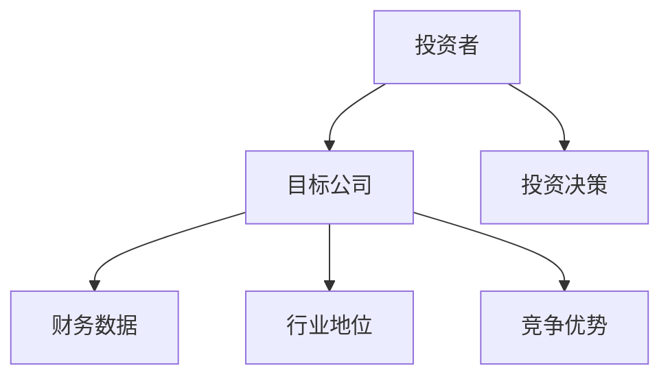
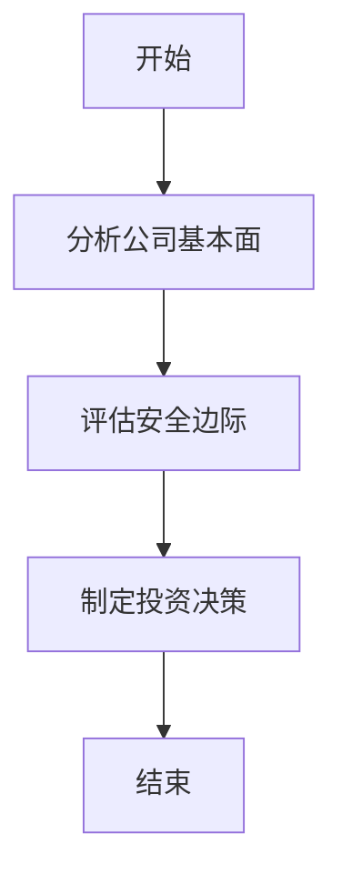
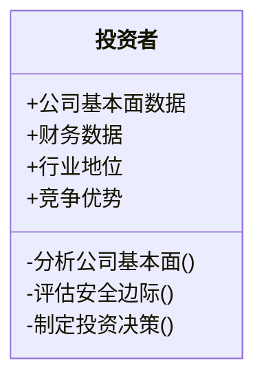
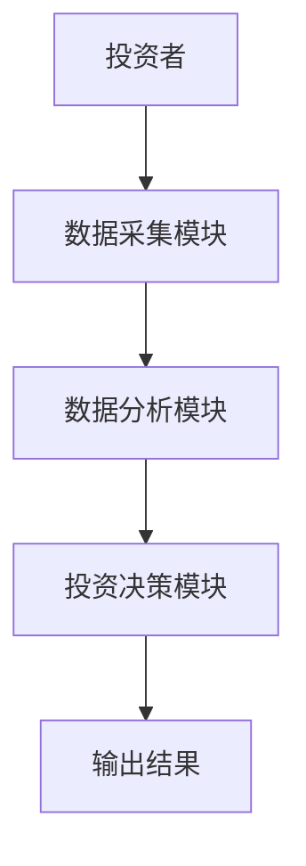
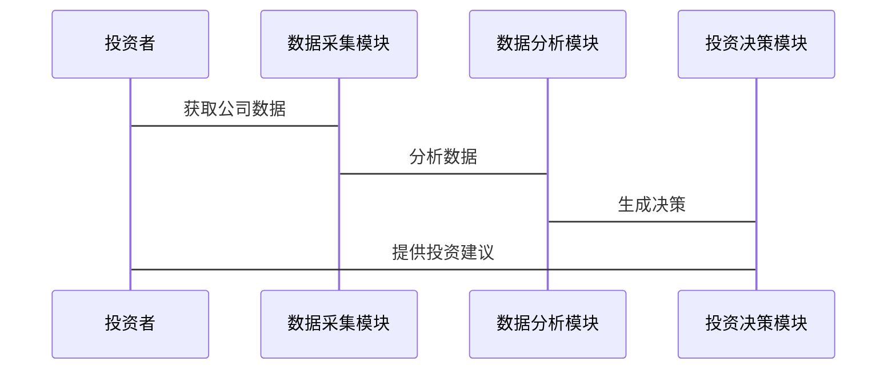

                 


# 巴菲特-芒格策略在个人投资中的应用

**关键词**: 巴菲特, 芒格, 价值投资, 投资策略, 安全边际

**摘要**: 本文系统地介绍巴菲特和芒格的投资策略及其在个人投资中的应用。从投资理念、核心概念到数学模型，从系统架构到实战案例，全面解析这些策略，帮助读者构建高效的投资体系。

---

## 第一部分: 巴菲特-芒格投资策略的背景与核心概念

### 第1章: 巴菲特-芒格投资策略概述

#### 1.1 巴菲特与芒格的背景介绍

- **1.1.1 巴菲特的生平与投资理念**  
  巴菲特是全球著名投资家，倡导价值投资，强调安全边际和长期复利效应。

- **1.1.2 芒格的哲学与决策思维**  
  芒格注重理性思考和独立判断，强调跨学科思维。

- **1.1.3 巴菲特-芒格策略的核心思想**  
  价值投资、安全边际、长期思维。

#### 1.2 投资策略的背景与问题背景

- **1.2.1 当前投资环境的复杂性**  
  市场波动大，信息不对称。

- **1.2.2 传统投资方法的局限性**  
  短期交易风险高，忽视基本面。

- **1.2.3 巴菲特-芒格策略的提出与目标**  
  提供长期稳定的收益。

#### 1.3 投资策略的核心概念与问题解决

- **1.3.1 价值投资的定义与特征**  
  寻找价格低于内在价值的股票。

- **1.3.2 安全边际的概念与作用**  
  提供缓冲，降低风险。

- **1.3.3 长期思维与复利的数学公式**  
  复利公式：$A = P(1 + r)^n$。

---

### 第2章: 巴菲特-芒格策略的核心概念与联系

#### 2.1 核心概念的原理与属性特征

- **2.1.1 价值投资的数学模型**  
  内在价值计算：$$\text{内在价值} = \sum_{t=1}^{\infty} \frac{\text{现金流}_t}{(1 + r)^t}$$

- **2.1.2 安全边际的计算方法**  
  安全边际 = 内在价值 - 市场价格。

- **2.1.3 长期思维与复利的数学公式**  
  $$\text{复利收益} = (1 + r)^n - 1$$

#### 2.2 核心概念的ER实体关系图



#### 2.3 核心概念的对比分析

- **2.3.1 价值投资与成长投资的对比**  
  价值投资注重低估值，成长投资注重高增长。

- **2.3.2 安全边际与风险投资的对比**  
  安全边际降低风险，风险投资承担更高风险。

- **2.3.3 长期思维与短期交易的对比**  
  长期思维注重复利，短期交易波动大。

---

### 第3章: 巴菲特-芒格策略的算法原理

#### 3.1 价值投资的算法流程



#### 3.2 投资决策的数学模型

$$
\text{内在价值} = \sum_{t=1}^{\infty} \frac{\text{现金流}_t}{(1 + r)^t}
$$

---

## 第二部分: 巴菲特-芒格策略的系统分析与架构设计

### 第4章: 巴菲特-芒格策略的系统分析

#### 4.1 问题场景介绍

- 投资者需要通过分析公司基本面，制定投资决策。

#### 4.2 系统功能设计



#### 4.3 系统架构设计



#### 4.4 系统接口设计

- 数据采集模块：从财务报表中获取数据。
- 投资决策模块：输出投资建议。

#### 4.5 系统交互流程



---

### 第5章: 巴菲特-芒格策略的项目实战

#### 5.1 环境安装

- 安装Python和数据分析库（Pandas、NumPy）。

#### 5.2 系统核心实现源代码

```python
def calculate_intrinsic_value(cash_flows, discount_rate):
    return sum(cash_flow / (1 + discount_rate)**t for t, cash_flow in enumerate(cash_flows))

def assess_margin_of_safety(intrinsic_value, market_price):
    return intrinsic_value - market_price

# 示例使用
cash_flows = [100, 100, 100]  # 简单假设
discount_rate = 0.05
iv = calculate_intrinsic_value(cash_flows, discount_rate)
print(f"内在价值: {iv}")
market_price = 90
mos = assess_margin_of_safety(iv, market_price)
print(f"安全边际: {mos}")
```

#### 5.3 代码应用解读与分析

- `calculate_intrinsic_value` 计算内在价值。
- `assess_margin_of_safety` 计算安全边际。

#### 5.4 实际案例分析

- 以某公司为例，计算内在价值和安全边际，制定投资决策。

#### 5.5 项目小结

- 巴菲特-芒格策略在实际中的应用效果显著。

---

## 第三部分: 巴菲特-芒格策略的最佳实践与总结

### 第6章: 最佳实践与总结

#### 6.1 投资策略的注意事项

- 风险控制：避免过度杠杆。
- 谨慎决策：避免情绪化投资。

#### 6.2 小结

- 巴菲特-芒格策略强调长期思维和安全边际。

#### 6.3 拓展阅读

- 推荐阅读巴菲特和芒格的著作。

---

**全文小结**

本文系统地介绍了巴菲特和芒格的投资策略，从理论到实践，帮助读者构建高效的投资体系。通过数学模型、系统架构和实战案例的详细讲解，读者可以更好地理解和应用这些策略，实现长期稳健的投资收益。

