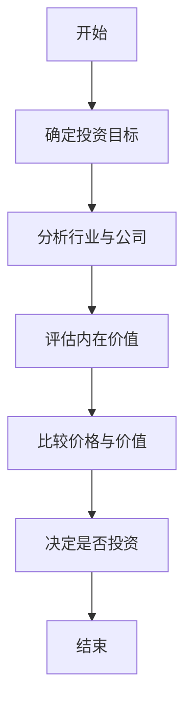

                 

# 巴菲特-芒格策略：长期投资的成功之道

> 关键词：巴菲特，芒格，价值投资，长期投资，风险管理，投资策略

> 摘要：本文深入探讨了巴菲特和芒格的投资哲学、策略和方法，分析了他们的投资理念如何帮助投资者实现长期成功。通过结合技术分析、数学模型和实际案例，本文为读者提供了全面的投资指南。

---

## 第一部分：巴菲特与芒格投资哲学

### 第1章：巴菲特与芒格的投资哲学概述

#### 1.1 巴菲特与芒格的背景介绍

沃伦·巴菲特和查理·芒格是投资界的传奇人物，他们的合作始于1950年代，共同创立了伯克希尔哈撒韦公司。巴菲特以其成功的投资策略和长期价值投资理念闻名，而芒格则以其多元思维模型和理性决策思维著称。两人的合作为投资领域带来了深远的影响。

#### 1.2 投资的核心概念

投资的本质是通过购买资产在未来获得收益。核心目标是通过分析资产的内在价值，选择价格低于内在价值的资产进行投资。投资的外延包括股票、债券、房地产等多种资产类别，而核心要素包括资产质量、财务状况、行业前景和管理团队等。

#### 1.3 巴菲特与芒格的投资理念对比

巴菲特的投资理念强调长期价值投资，即寻找那些具有持续竞争优势和稳定收益的公司，并长期持有。芒格则强调多元思维模型，认为投资者需要从多个学科中汲取知识，以全面评估投资标的的价值。

#### 1.4 投资哲学的数学模型

内在价值的计算公式为：
$$ IV = \sum_{t=1}^{n} \frac{CF_t}{(1 + r)^t} $$
其中，CF_t是第t年的现金流，r是折现率，n是投资期限。

安全边际的计算为：
$$ MS = IV - Price $$
其中，MS为安全边际，Price为市场价格。

#### 1.5 本章小结

本章介绍了巴菲特和芒格的投资哲学，强调了价值投资和多元思维模型的重要性，并通过数学模型展示了内在价值和安全边际的计算方法。

---

## 第二部分：巴菲特与芒格的投资策略

### 第2章：巴菲特与芒格的投资策略

#### 2.1 投资策略的核心原理

巴菲特和芒格的投资策略以价值投资为核心，强调选择具有强大竞争优势和良好财务状况的公司，并长期持有。策略的关键在于识别具有持续盈利能力和良好管理团队的公司。

#### 2.2 投资策略的数学模型

内在价值公式：
$$ IV = \sum_{t=1}^{n} \frac{CF_t}{(1 + r)^t} $$

安全边际计算：
$$ MS = IV - Price $$

#### 2.3 投资策略的流程图

---

## 第三部分：巴菲特与芒格的投资分析框架

### 第3章：巴菲特与芒格的投资分析框架

#### 3.1 价值评估方法

巴菲特和芒格的价值评估方法包括分析公司的财务状况、行业地位和管理团队。通过分析财务指标，如市盈率、市净率和股息率，来评估公司的内在价值。

#### 3.2 竞争优势分析

竞争优势是公司长期盈利能力的关键。巴菲特和芒格强调选择那些具有强大竞争优势的公司，如品牌优势、成本优势和市场垄断等。

#### 3.3 投资组合管理

投资组合管理是实现长期投资目标的重要手段。巴菲特和芒格建议投资者分散投资，选择具有长期竞争优势的公司，并长期持有。

---

## 第四部分：巴菲特与芒格的风险管理

### 第4章：巴菲特与芒格的风险管理

#### 4.1 风险识别

风险管理是投资过程中不可忽视的一部分。巴菲特和芒格强调识别潜在风险，如市场波动、公司基本面变化和宏观经济因素。

#### 4.2 风险应对策略

应对风险的策略包括分散投资、设定止损点和定期评估投资组合。通过这些策略，投资者可以有效降低投资风险，保护投资本金。

---

## 第五部分：巴菲特与芒格的长期投资

### 第5章：巴菲特与芒格的长期投资

#### 5.1 复利的力量

复利是长期投资成功的关键。通过长期持有优质资产，投资者可以实现财富的指数增长。

#### 5.2 投资者心态管理

心态管理是长期投资成功的重要因素。巴菲特和芒格强调保持耐心和理性，避免短期波动的影响。

---

## 第六部分：总结

### 第6章：总结

#### 6.1 投资哲学的总结

巴菲特和芒格的投资哲学强调价值投资和长期持有。通过分析公司的内在价值和竞争优势，选择具有长期盈利能力的公司。

#### 6.2 投资策略的总结

投资策略的核心是选择具有强大竞争优势和良好财务状况的公司，并长期持有。通过分散投资和风险管理，投资者可以实现长期的财富增长。

---

## 参考文献

1. 巴菲特年度股东大会演讲
2. 芒格年度股东大会演讲
3. 《巴菲特投资思想》
4. 《芒格投资思想》
5. 其他相关投资书籍和文章

---

通过以上分析，我们可以看到巴菲特和芒格的投资策略是成功的长期投资之道。他们的投资哲学和策略为投资者提供了宝贵的指导，帮助他们在复杂多变的市场中实现长期的财富增长。

