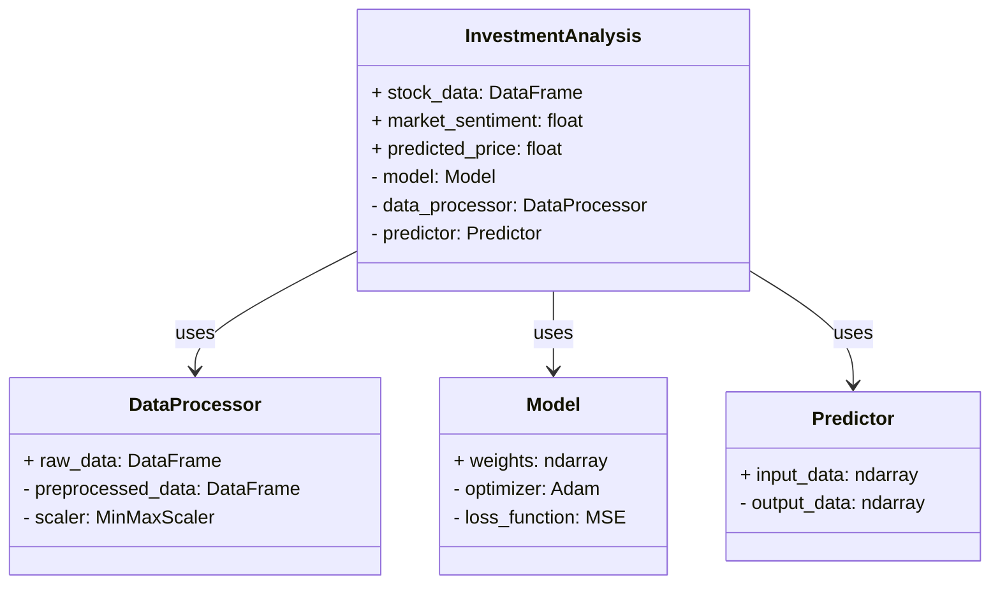
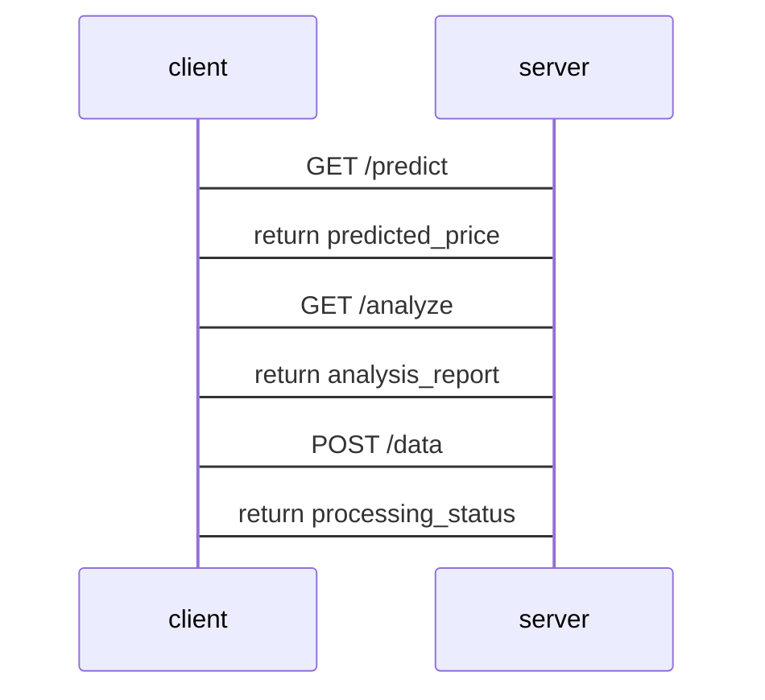

                 


# 巴菲特如何看待人工智能在投资中的应用

> 关键词：巴菲特，人工智能，投资，价值投资，机器学习，市场预测

> 摘要：本文探讨了巴菲特的投资理念与人工智能技术的结合，分析了人工智能在投资中的应用，包括数据分析、机器学习、自然语言处理等方面，并结合实际案例，详细阐述了如何将人工智能与巴菲特的价值投资理念相结合，以优化投资决策和风险控制。

---

## 第一部分：引言

### 1.1 投资与人工智能的交汇点

投资是人类经济活动的核心领域之一，而人工智能作为一项革命性技术，正在逐步改变投资的方式和策略。巴菲特作为全球最著名的价值投资者之一，他的投资理念与人工智能技术的结合，为投资领域带来了新的可能性。本文将深入探讨巴菲特如何看待人工智能在投资中的应用，分析其优缺点，并结合实际案例，展示如何将人工智能与价值投资理念相结合。

---

## 第二部分：巴菲特投资理念的核心要素

### 2.1 价值投资的定义与原则

价值投资是一种以基本面分析为基础的投资策略，强调以低于内在价值的价格买入优质资产。巴菲特的价值投资理念主要包括以下原则：

- **长期投资**：关注企业的长期价值，而非短期价格波动。
- **安全边际**：买入价格低于企业内在价值，以降低风险。
- **企业质量**：选择具有强大竞争优势、良好管理和稳定现金流的企业。

#### 2.1.1 价值投资的起源与发展

价值投资的起源可以追溯到本杰明·格雷厄姆和戴维·多德的工作。格雷厄姆提出了“安全边际”和“内在价值”等概念，强调通过分析企业的财务数据来寻找被市场低估的股票。巴菲特继承并发展了这一理念，将其应用于实践。

#### 2.1.2 巴菲特的价值投资策略

巴菲特的投资策略基于以下几点：
- 选择具有持续竞争优势的企业。
- 买入价格低于内在价值。
- 长期持有优质资产。

#### 2.1.3 价值投资的核心要素

- 企业基本面：收入、利润、现金流、资产负债表等。
- 市场情绪：市场波动与投资者心理。
- 时间因素：长期投资的重要性。

### 2.2 市场与人性：巴菲特的投资哲学

巴菲特认为，市场是由人类情绪驱动的，而投资的本质是寻找市场的非理性带来的机会。他强调，投资者应该避免被市场的短期波动所迷惑，而是专注于企业的长期价值。

#### 2.2.1 投资中的市场情绪分析

市场情绪分析是投资决策的重要部分。巴菲特认为，市场情绪往往会导致价格偏离内在价值，这为理性投资者提供了机会。

#### 2.2.2 人性在投资中的作用

人性中的贪婪和恐惧是市场波动的主要原因。巴菲特提醒投资者，要避免被情绪驱动，而是以理性和逻辑为基础进行决策。

#### 2.2.3 巴菲特对市场的长期看法

巴菲特认为，长期来看，市场是理性的，而短期波动是不可预测的。因此，投资者应该关注企业的长期价值，而不是短期价格波动。

---

## 第三部分：人工智能在投资中的应用

### 3.1 数据驱动的投资决策

人工智能的核心是数据驱动的决策。通过分析海量数据，AI可以帮助投资者发现潜在的投资机会和风险。

#### 3.1.1 数据收集与处理

投资数据的来源包括：
- 市场数据：股票价格、交易量、市场指数等。
- 公司财务数据：收入、利润、现金流等。
- 新闻和社交媒体数据：市场情绪、公司新闻等。

#### 3.1.2 数据分析与预测模型

通过机器学习算法，AI可以构建预测模型，帮助投资者预测市场趋势和企业表现。

#### 3.1.3 数据驱动的决策优势

数据驱动的决策可以帮助投资者发现潜在机会和风险，提高投资决策的效率和准确性。

### 3.2 机器学习在投资中的应用

机器学习是一种人工智能技术，通过训练模型来识别数据中的模式和趋势。

#### 3.2.1 机器学习的基本原理

机器学习的核心是通过数据训练模型，使其能够识别模式和趋势。常用的算法包括线性回归、支持向量机（SVM）、随机森林和神经网络等。

#### 3.2.2 常见算法在投资中的应用

- 线性回归：用于预测股票价格。
- 神经网络：用于复杂模式识别。
- 随机森林：用于分类和回归分析。

#### 3.2.3 机器学习的优势与局限性

优势：
- 高效性：能够快速处理大量数据。
- 精准性：能够识别复杂模式。

局限性：
- 过度拟合：模型可能过于复杂，导致预测不准确。
- 黑箱问题：模型的决策过程难以解释。

### 3.3 自然语言处理在投资中的应用

自然语言处理（NLP）是一种人工智能技术，用于分析文本数据。

#### 3.3.1 文本数据的处理与分析

NLP可以分析新闻、社交媒体和公司财报等文本数据，提取有用的信息。

#### 3.3.2 基于NLP的投资决策支持

通过分析文本数据，NLP可以帮助投资者识别市场情绪和公司新闻，从而做出更明智的投资决策。

#### 3.3.3 实际案例分析

例如，通过分析社交媒体上的 sentiment，NLP可以帮助投资者预测市场情绪的变化。

---

## 第四部分：AI与巴菲特投资理念的结合

### 4.1 AI如何增强价值投资的决策能力

人工智能可以为价值投资提供强大的支持。

#### 4.1.1 数据分析对价值发现的支持

通过分析海量数据，AI可以帮助投资者发现被低估的企业。

#### 4.1.2 AI在风险评估中的应用

AI可以通过分析企业的财务数据和市场数据，评估投资风险。

#### 4.1.3 AI对长期价值投资的支持

AI可以帮助投资者长期跟踪企业的表现，优化投资组合。

### 4.2 AI在市场情绪分析中的应用

通过分析市场情绪，AI可以帮助投资者做出更明智的决策。

#### 4.2.1 市场情绪的量化分析

通过NLP和机器学习，AI可以量化市场情绪。

#### 4.2.2 AI与巴菲特投资哲学的结合

巴菲特认为，市场情绪是投资中的重要因素。AI可以帮助投资者更好地理解和利用市场情绪。

### 4.3 价值投资与AI的融合

通过将价值投资的理念与AI技术相结合，投资者可以实现更高效的投资决策。

---

## 第五部分：小结与展望

### 5.1 小结

人工智能为投资领域带来了新的可能性。通过结合巴菲特的价值投资理念，AI可以帮助投资者更高效地发现机会和控制风险。

### 5.2 展望未来

随着AI技术的不断发展，投资领域将变得更加智能化和数据驱动。未来，AI在投资中的应用将更加广泛和深入。

---

## 第六部分：项目实战与代码实现

### 6.1 环境安装

为了实现AI驱动的投资分析，我们需要安装以下工具：
- Python
- NumPy
- Pandas
- Scikit-learn
- TensorFlow
- Plotly

### 6.2 系统功能设计

以下是系统功能设计的mermaid类图：



### 6.3 系统架构设计

以下是系统架构设计的mermaid图：

```mermaid
server
    port 80
    GET /predict -> handle_prediction()
    GET /analyze -> handle_analysis()
    POST /data -> handle_data()

client
    GET http://server/predict
    GET http://server/analyze
    POST http://server/data
```

### 6.4 系统接口设计

以下是系统接口设计的mermaid序列图：



---

## 第七部分：最佳实践与注意事项

### 7.1 最佳实践

- 数据是AI投资的关键，确保数据的准确性和完整性。
- 使用多种算法进行模型训练，避免过度拟合。
- 结合市场实际情况，调整AI模型的参数。

### 7.2 小结

通过本文的分析，我们可以看到，AI与巴菲特投资理念的结合，为投资领域带来了新的可能性。投资者可以通过AI技术，实现更高效、更精准的投资决策。

### 7.3 注意事项

- AI模型需要不断更新和优化。
- 投资者需要具备一定的技术背景，才能更好地应用AI技术。
- 需要注意市场的不可预测性，AI模型只能提供参考。

### 7.4 拓展阅读

- 《The Intelligent Investor》 by Benjamin Graham
- 《机器学习实战》 by 周志华
- 《自然语言处理实战》 by 王立勋

---

## 结语

人工智能正在改变投资领域，而巴菲特的价值投资理念为AI的应用提供了重要的指导。通过结合AI技术，投资者可以更高效地发现机会和控制风险。未来，随着技术的不断发展，AI在投资中的应用将更加广泛和深入。

--- 

以上是文章的完整内容，希望对您有所帮助！

