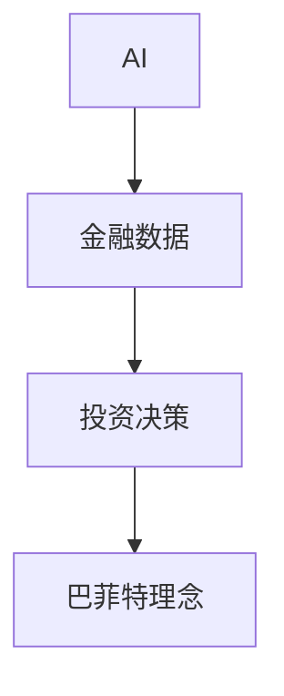
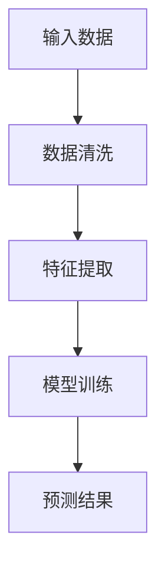
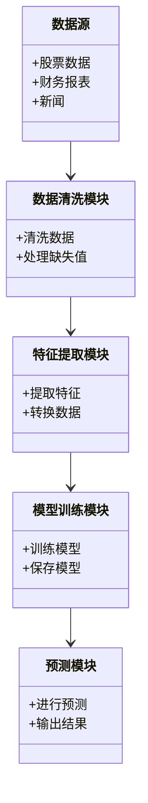
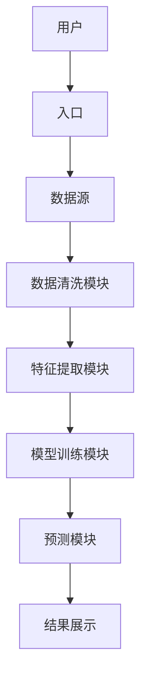
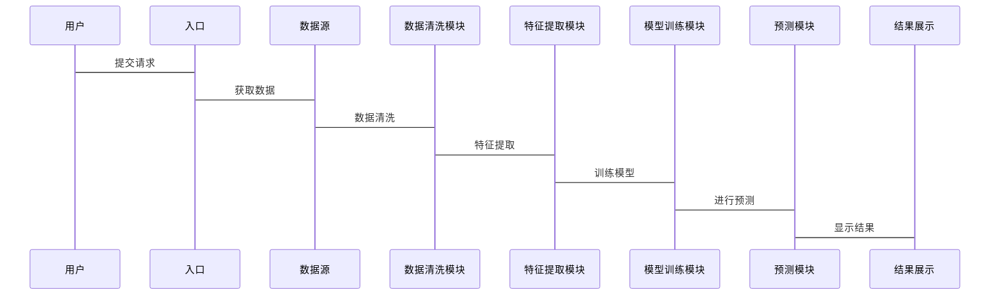

                 


# 巴菲特如何看待人工智能在金融服务中的应用

> 关键词：巴菲特，人工智能，金融服务，投资策略，机器学习，数据分析

> 摘要：本文探讨了巴菲特的投资理念与人工智能技术在金融服务中的结合。通过分析人工智能在金融数据预测、投资决策支持和风险管理中的应用，结合巴菲特的价值投资原则，阐述了AI技术如何优化金融服务，为投资者提供更精准的决策支持。文章从背景、概念、算法、系统设计、项目实战等方面进行了详细分析，最后展望了未来的发展趋势。

---

## 第一部分: 巴菲特与人工智能在金融服务中的结合

## 第1章: 巴菲特投资理念与人工智能的背景介绍

### 1.1 巴菲特投资理念的核心价值观

#### 1.1.1 价值投资的定义与原则
价值投资是一种长期投资策略，强调以低于内在价值的价格购买优质资产。巴菲特的投资原则包括：
- **长期持有**：避免频繁交易，专注于长期价值。
- **安全边际**：买入价格低于内在价值，确保投资的安全性。
- **竞争优势**：投资具有持续竞争优势的企业。

#### 1.1.2 巴菲特对市场的长期看法
巴菲特认为市场短期是投票器，长期是称重机。他强调基本面分析和企业内在价值，而非短期市场波动。

#### 1.1.3 巴菲特投资决策的关键因素
- 企业盈利能力
- 财务健康状况
- 管理团队能力
- 行业地位和竞争优势

### 1.2 人工智能在金融服务中的应用背景

#### 1.2.1 人工智能技术的快速发展
人工智能（AI）技术的进步使得数据分析和预测能力显著提升，特别是在金融领域，AI被广泛应用于股票预测、风险评估和客户画像。

#### 1.2.2 金融服务行业的数字化转型
金融行业正经历数字化转型，AI技术的应用帮助机构提高效率、降低成本，并提供更个性化的服务。

#### 1.2.3 人工智能在金融领域的优势与挑战
- **优势**：高效的数据处理能力、精准的预测模型、实时监控能力。
- **挑战**：数据隐私问题、模型过拟合风险、市场波动的不确定性。

### 1.3 巴菲特与人工智能的结合意义

#### 1.3.1 传统投资与现代技术的融合
巴菲特的价值投资理念与AI技术相结合，为投资决策提供了新的可能性。

#### 1.3.2 人工智能如何辅助投资决策
AI可以通过分析大量数据，识别潜在的投资机会，优化投资组合，并提供实时监控和风险预警。

#### 1.3.3 巴菲特投资理念的现代诠释
AI技术为巴菲特的投资理念注入了新的活力，使其能够适应快速变化的市场环境。

---

## 第2章: 人工智能在金融服务中的核心概念与联系

### 2.1 人工智能的基本原理

#### 2.1.1 机器学习的定义与分类
机器学习是一种通过数据训练模型，使其能够从经验中学习并做出预测的技术。主要分类包括：
- **监督学习**：基于标记数据进行训练，如回归和分类。
- **无监督学习**：基于未标记数据进行聚类分析。
- **强化学习**：通过试错机制优化决策策略。

#### 2.1.2 深度学习的核心算法
深度学习是一种基于人工神经网络的机器学习方法，常用于处理非结构化数据，如图像和文本。

#### 2.1.3 自然语言处理的应用场景
自然语言处理（NLP）技术可以用于分析财务报告、新闻资讯等文本数据，提取情感和关键词。

### 2.2 金融服务中的数据特征

#### 2.2.1 结构化数据与非结构化数据
- **结构化数据**：如股票价格、财务报表，适合传统数据分析。
- **非结构化数据**：如文本、图像，适合NLP和计算机视觉技术。

#### 2.2.2 金融市场的数据来源
- **公开数据**：如股价、成交量、财务报表。
- **内部数据**：如交易记录、客户行为数据。
- **外部数据**：如新闻、社交媒体信息。

#### 2.2.3 数据清洗与特征工程
数据清洗是处理缺失值、异常值和重复值的过程。特征工程是将数据转化为适合模型输入的形式。

### 2.3 人工智能与金融服务的实体关系图



---

## 第3章: 人工智能算法原理与数学模型

### 3.1 机器学习算法的分类与选择

#### 3.1.1 线性回归模型
线性回归是一种简单而强大的回归算法，适用于线性关系的数据。

公式：
$$ y = \beta_0 + \beta_1x + \epsilon $$

其中，$\beta_0$是截距，$\beta_1$是斜率，$\epsilon$是误差项。

#### 3.1.2 随机森林算法
随机森林是一种基于决策树的集成学习方法，具有高准确性和鲁棒性。

#### 3.1.3 支持向量机（SVM）的原理
SVM通过构建超平面将数据分为不同类别，适用于分类和回归任务。

### 3.2 金融预测中的数学模型

#### 3.2.1 时间序列分析的ARIMA模型
ARIMA模型适用于时间序列数据的预测。

公式：
$$ ARIMA(p, d, q) $$

其中，p是自回归阶数，d是差分阶数，q是移动平均阶数。

#### 3.2.2 线性回归模型的公式
$$ y = \beta_0 + \beta_1x + \epsilon $$

### 3.3 算法流程图



---

## 第4章: 金融服务系统的分析与架构设计

### 4.1 系统功能设计

#### 4.1.1 领域模型类图


#### 4.1.2 系统架构图


### 4.2 接口设计与交互

#### 4.2.1 系统接口设计
- 数据清洗接口：接受原始数据，返回清洗后的数据。
- 特征提取接口：接受清洗后的数据，返回特征向量。
- 模型训练接口：接受特征向量，返回训练好的模型。
- 预测接口：接受新数据，返回预测结果。

#### 4.2.2 交互流程图


---

## 第5章: 项目实战

### 5.1 环境安装

```bash
pip install numpy pandas scikit-learn matplotlib
```

### 5.2 核心代码实现

```python
import numpy as np
import pandas as pd
from sklearn.linear_model import LinearRegression
from sklearn.ensemble import RandomForestRegressor
from sklearn.metrics import mean_squared_error

# 数据加载与预处理
data = pd.read_csv('stock_data.csv')
X = data[['open', 'high', 'low', 'volume']]
y = data['close']

# 训练模型
model = LinearRegression()
model.fit(X, y)

# 预测结果
predictions = model.predict(X)
print('均方误差:', mean_squared_error(y, predictions))
```

### 5.3 案例分析与解读

#### 5.3.1 数据预处理
- 去除缺失值
- 标准化处理

#### 5.3.2 模型训练与验证
- 使用训练集训练模型
- 使用测试集验证模型性能

#### 5.3.3 结果分析
- 模型预测与实际值的对比
- 模型的准确性和稳定性分析

### 5.4 项目小结

---

## 第6章: 总结与展望

### 6.1 巴菲特价值观与人工智能的结合意义

#### 6.1.1 传统投资与现代技术的融合
AI技术为巴菲特的价值投资理念提供了新的工具和方法。

#### 6.1.2 投资决策的智能化与高效化
通过AI技术，投资者可以更快速、更准确地做出决策。

#### 6.1.3 个性化投资策略的实现
AI可以根据投资者的偏好和风险承受能力，提供个性化的投资建议。

### 6.2 未来发展趋势与挑战

#### 6.2.1 数据隐私与安全问题
随着数据的广泛应用，数据隐私和安全问题日益重要。

#### 6.2.2 模型的可解释性
复杂的AI模型需要更高的可解释性，以便投资者理解和信任。

#### 6.2.3 多模态数据的融合
结合文本、图像等多种数据源，提升预测的准确性和全面性。

---

## 附录: 代码与扩展阅读

### 附录A: 核心代码

```python
import numpy as np
import pandas as pd
from sklearn.model_selection import train_test_split
from sklearn.ensemble import RandomForestRegressor
from sklearn.metrics import r2_score

# 数据加载
data = pd.read_csv('stock_data.csv')

# 数据预处理
X = data[['open', 'high', 'low', 'volume']]
y = data['close']

# 划分训练集与测试集
X_train, X_test, y_train, y_test = train_test_split(X, y, test_size=0.2, random_state=42)

# 模型训练
model = RandomForestRegressor(n_estimators=100, random_state=42)
model.fit(X_train, y_train)

# 模型预测
y_pred = model.predict(X_test)

# 模型评估
print('R² Score:', r2_score(y_test, y_pred))
```

### 附录B: 扩展阅读

- 《The Intelligent Investor》 by Benjamin Graham
- 《机器学习实战》 by 周志华
- 《Python机器学习》 by Aurélien Géron

---

通过本文的分析，我们可以看到，人工智能技术为金融服务带来了巨大的变革，而巴菲特的价值投资理念也为AI的应用提供了重要的指导。未来，随着技术的不断发展，AI在金融服务中的应用将更加广泛和深入。

