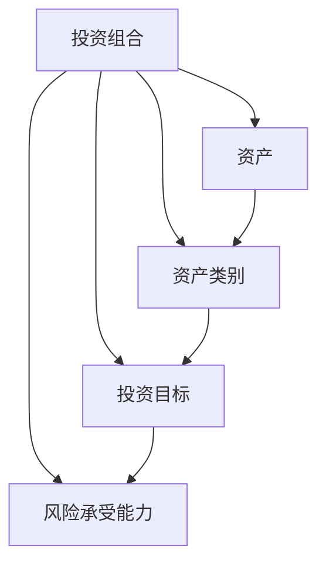
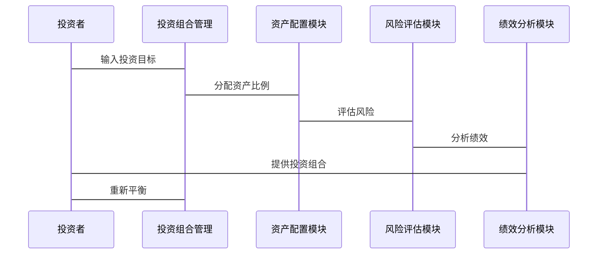
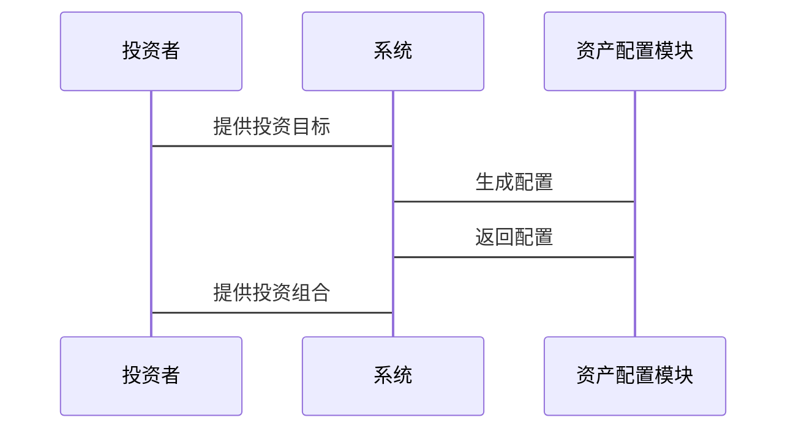
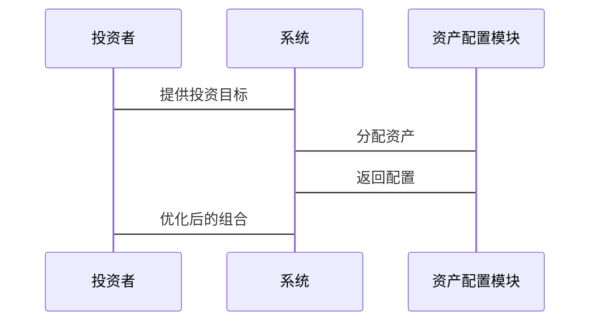
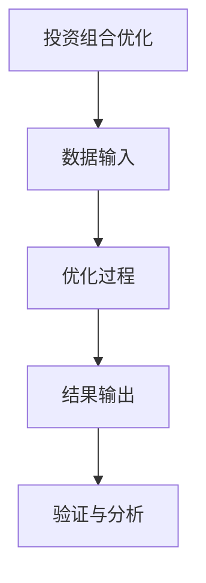

                 


# 巴菲特如何看待分散投资

## 关键词：巴菲特，分散投资，投资策略，价值投资，风险管理

## 摘要：本文从巴菲特的分散投资理念出发，分析其投资哲学、数学模型和系统架构，结合实战案例，深入探讨分散投资的核心概念、算法原理和系统实现。

---

# 第一部分: 巴菲特分散投资的背景与核心理念

## 第1章: 分散投资的背景与重要性

### 1.1 投资的基本概念与问题背景

#### 1.1.1 投资的基本定义与分类
- 投资是将资金投入资产以获得收益的行为。
- 资产类型包括股票、债券、房地产、现金等。

#### 1.1.2 投资中的主要问题与挑战
- 风险：市场波动、经济周期、公司基本面变化。
- 收益：追求超额收益，但需平衡风险。

#### 1.1.3 分散投资的提出与意义
- 分散投资通过多样化降低风险。
- 避免过度依赖单一资产或行业。

### 1.2 巴菲特的投资哲学与分散投资的关系

#### 1.2.1 巴菲特的投资理念概述
- 价值投资：寻找市场低估的企业。
- 长期持有：相信优秀企业会创造价值。
- 风险控制：分散投资以降低风险。

#### 1.2.2 巴菲特分散投资的核心思想
- 分散投资不是随机的，而是基于对企业基本面的深入研究。
- 通过持有优质企业分散风险，而非简单地分散到多个低相关资产。

#### 1.2.3 巴菲特分散投资与集中投资的平衡
- 集中投资高风险高回报。
- 分散投资降低风险，但可能错过超额收益。

### 1.3 分散投资的数学模型与边界

#### 1.3.1 投资组合的数学模型
- 期望收益：$$ E(r_p) = \sum w_i E(r_i) $$
- 风险（方差）：$$ Var(r_p) = \sum w_i^2 Var(r_i) + 2\sum_{i<j} w_i w_j Cov(r_i, r_j) $$

#### 1.3.2 分散投资的风险与收益边界
- 效前沿：在给定风险下，收益最大化；或在给定收益下，风险最小化。
- 夏普比率：衡量单位风险超额收益。

#### 1.3.3 投资组合的有效前沿与夏普比率
- 夏普比率公式：$$ \text{夏普比率} = \frac{E(r_p) - r_f}{\sigma_p} $$
- 有效前沿上的组合具有更高的夏普比率。

## 第2章: 巴菲特分散投资的核心概念与联系

### 2.1 投资组合的核心要素与结构

#### 2.1.1 投资组合的构成要素
- 资产配置：股票、债券、现金等。
- 资产类别：成长股、价值股、周期性行业等。
- 投资目标：收益、风险、流动性。

#### 2.1.2 资产配置的层次与结构
- 全球化配置：考虑不同国家和地区的经济周期。
- 行业分散：避免集中于单一行业。

#### 2.1.3 股票与债券在投资组合中的角色
- 股票：高风险高回报，成长性和价值性。
- 债券：提供稳定收益，降低整体波动。

### 2.2 投资策略与分散投资的关系

#### 2.2.1 价值投资与分散投资的结合
- 价值投资注重企业内在价值，分散投资降低特定风险。
- 巴菲特通过购买多个低估企业分散风险。

#### 2.2.2 成长投资与分散投资的平衡
- 成长投资高风险，需分散到多个成长型企业。
- 巴菲特有时也投资成长股，但更倾向于价值股。

#### 2.2.3 技术分析与分散投资的联系
- 技术分析辅助判断短期趋势，但分散投资更关注长期基本面。

### 2.3 分散投资的ER实体关系图



## 第3章: 巴菲特分散投资的数学模型与公式

### 3.1 投资组合的期望收益与风险计算

#### 3.1.1 投资组合的期望收益公式
$$ E(r_p) = \sum w_i E(r_i) $$

#### 3.1.2 投资组合的方差公式
$$ Var(r_p) = \sum w_i^2 Var(r_i) + 2\sum_{i<j} w_i w_j Cov(r_i, r_j) $$

### 3.2 分散投资的优化模型

#### 3.2.1 现代投资组合理论（MPT）概述
- 由哈里·马科维茨提出，旨在通过分散投资降低风险。

#### 3.2.2 均值-方差优化模型
$$ \min w^T \Sigma w $$
$$ \text{s.t. } w^T \mu = \text{target return} $$
$$ \sum w_i = 1 $$

### 3.3 巴菲特分散投资的数学实例

#### 3.3.1 两资产投资组合的夏普比率计算
$$ \text{夏普比率} = \frac{E(r_p) - r_f}{\sigma_p} $$

## 第4章: 巴菲特分散投资的系统分析与架构设计

### 4.1 投资组合管理系统架构

#### 4.1.1 系统功能模块


#### 4.1.2 系统交互设计



### 4.2 系统架构设计

#### 4.2.1 系统架构图


### 4.3 系统接口设计

#### 4.3.1 接口描述
- 输入：投资者风险承受能力、投资目标。
- 输出：优化后的投资组合。

#### 4.3.2 接口交互



### 4.4 系统交互设计

#### 4.4.1 交互流程



---

# 第二部分: 巴菲特分散投资的算法实现与实战分析

## 第5章: 巴菲特分散投资的算法实现

### 5.1 分散投资的算法原理

#### 5.1.1 现代投资组合理论（MPT）的算法实现
- 使用Python优化库（如SciPy）实现均值-方差优化。

#### 5.1.2 巴菲特分散投资的Python代码实现

```python
import numpy as np
from scipy.optimize import minimize

# 示例数据：资产的期望收益和协方差矩阵
n_assets = 3
mu = np.array([0.1, 0.15, 0.08])
cov_matrix = np.array([
    [0.16, 0.05, 0.02],
    [0.05, 0.20, 0.03],
    [0.02, 0.03, 0.10]
])

# 定义优化函数
def portfolio_variance(weights, mu, cov):
    return np.dot(weights.T, np.dot(cov, weights))

# 定义约束条件
cons = ({'type': 'eq', 'fun': lambda w: np.sum(w) - 1},
        {'type': 'eq', 'fun': lambda w: np.dot(w, mu) - 0.12})

# 初始化权重（假设初始权重为均匀分布）
initial_guess = np.array([1/3, 1/3, 1/3])

# 使用最小二乘法优化
result = minimize(portfolio_variance, initial_guess, args=(mu, cov_matrix), constraints=cons)

# 输出结果
print("最优权重：", result.x)
print("最优方差：", result.fun)
```

### 5.2 巴菲特分散投资的实战分析

#### 5.2.1 投资组合优化的环境安装
- 安装必要的Python库：`numpy`, `scipy`, `pandas`。

#### 5.2.2 投资组合优化的Python实现

```python
import numpy as np
from scipy.optimize import minimize

def portfolio_optimization(mu, cov, target_return):
    n = len(mu)
    # 定义目标函数
    def objective(weights):
        return np.dot(weights.T, np.dot(cov, weights))
    # 定义约束条件
    cons = [
        {'type': 'eq', 'fun': lambda w: np.sum(w) - 1},
        {'type': 'eq', 'fun': lambda w: np.dot(w, mu) - target_return}
    ]
    # 初始权重
    initial_guess = np.array([1/n]*n)
    # 优化
    result = minimize(objective, initial_guess, constraints=cons)
    return result.x, result.fun

# 示例数据
mu = np.array([0.1, 0.15, 0.08])
cov = np.array([
    [0.16, 0.05, 0.02],
    [0.05, 0.20, 0.03],
    [0.02, 0.03, 0.10]
])
target_return = 0.12

weights, variance = portfolio_optimization(mu, cov, target_return)
print("优化后的权重：", weights)
print("最小方差：", variance)
```

#### 5.2.3 投资组合优化的实际案例分析



### 5.3 分散投资的系统实现

#### 5.3.1 系统实现的步骤
- 数据输入：资产收益和协方差矩阵。
- 优化过程：应用MPT算法。
- 结果输出：优化后的权重和风险收益比。

#### 5.3.2 系统实现的注意事项
- 数据质量：确保输入数据准确。
- 约束条件：合理设置目标收益和风险约束。
- 计算效率：优化算法的选择影响计算时间。

---

# 第三部分: 巴菲特分散投资的最佳实践与小结

## 第6章: 巴菲特分散投资的最佳实践

### 6.1 分散投资的小结

#### 6.1.1 分散投资的核心要点
- 分散投资降低风险。
- 选择优质资产。
- 长期持有。

#### 6.1.2 巴菲特分散投资的独特性
- 价值导向的分散。
- 长期持有的纪律性。

### 6.2 分散投资的注意事项

#### 6.2.1 风险管理的重要性
- 定期再平衡。
- 监控市场变化。
- 考虑经济周期。

#### 6.2.2 分散投资的误区
- 过度分散：降低收益。
- 忽略质量：分散不等于随便选择。

### 6.3 分散投资的扩展阅读

#### 6.3.1 经典书籍推荐
- 《The Intelligent Investor》。
- 《Portfolio Selection》。

#### 6.3.2 网络资源与工具
- Python库：pandas, numpy, scipy。
- 在线工具：Yahoo Finance，Morningstar。

---

# 结语

巴菲特的分散投资理念结合了价值投资与风险管理，通过科学的方法和长期的纪律实现稳健收益。理解并应用这些原则，投资者可以在复杂多变的市场中稳健前行。

