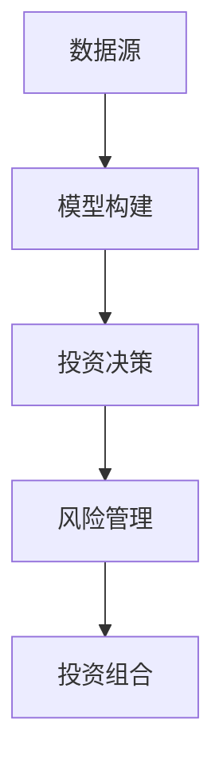

                 


# 巴菲特如何看待可持续发展投资

> 关键词：巴菲特，可持续发展投资，价值投资，ESG，长期投资，绿色投资

> 摘要：本文从巴菲特的投资哲学出发，探讨其如何看待可持续发展投资。通过分析可持续发展投资的核心概念、其与传统投资的联系，以及巴菲特的具体投资策略，文章旨在揭示巴菲特如何将长期价值投资与可持续发展理念相结合，为企业和社会创造双重价值。

---

# 第一部分：可持续发展投资的核心概念

## 第1章：可持续发展投资的背景与定义

### 1.1 可持续发展投资的背景

随着全球环境问题的加剧、社会不平等的扩大以及企业治理问题的频发，可持续发展投资（Sustainable Investment）逐渐成为全球投资者关注的焦点。可持续发展投资不仅关注企业的财务表现，还注重其在环境（Environmental）、社会（Social）和治理（Governance）方面的表现，即所谓的“ESG因素”。

### 1.2 可持续发展投资的定义

可持续发展投资是一种通过筛选和投资具有较高环境、社会和治理标准的企业，以实现长期投资收益和推动社会可持续发展的投资策略。其核心在于将企业的外部性和长期风险纳入投资决策，从而实现经济效益与社会价值的双重目标。

### 1.3 可持续发展投资的核心要素

| 要素 | 描述 |
|------|------|
| 环境（E） | 企业对环境保护的重视程度，包括减少碳排放、资源利用效率等。 |
| 社会（S） | 企业对社会责任的承担，包括员工权益、社区贡献等。 |
| 治理（G） | 企业的治理结构和透明度，包括董事会构成、公司治理政策等。 |

---

## 第2章：可持续发展投资与传统投资的对比

### 2.1 传统投资的核心特点

传统投资主要关注企业的财务指标，如利润、市盈率、ROE（净资产收益率）等。投资者通常关注短期收益和股价波动，而较少考虑企业的长期社会影响和外部性。

### 2.2 可持续发展投资的独特优势

与传统投资相比，可持续发展投资更注重企业的长期价值和社会责任。通过关注ESG因素，投资者可以筛选出那些具有较强抗风险能力和长期增长潜力的企业。

### 2.3 巴菲特与可持续发展投资的契合点

巴菲特的价值投资理念与可持续发展投资有诸多契合点。例如，他长期关注企业的长期盈利能力和社会责任感，这与可持续发展投资的核心理念不谋而合。

---

# 第二部分：巴菲特的投资哲学与可持续发展投资的联系

## 第3章：巴菲特的价值投资原则

### 3.1 价值投资的核心理念

巴菲特的价值投资理念强调以合理的价格买入具有强大竞争优势和长期盈利能力的企业。他认为，投资的本质是寻找具有持久竞争优势的企业，并长期持有。

### 3.2 长期投资与可持续发展的契合

长期投资与可持续发展的契合点在于，两者都关注企业的长期价值和社会影响。通过长期投资，投资者可以更好地评估企业的ESG表现，并在长期中获得更高的回报。

### 3.3 巴菲特对企业治理的关注

巴菲特非常重视企业治理结构，认为良好的治理是企业长期成功的关键。他倾向于投资那些治理透明、董事会高效的企业。

---

## 第4章：巴菲特与可持续发展投资的实践

### 4.1 巴菲特对可再生能源的投资

近年来，巴菲特通过旗下公司伯克希尔哈撒韦（Berkshire Hathaway）对可再生能源行业进行了大量投资。例如，他投资了太阳能和风能项目，以推动绿色能源的发展。

### 4.2 巴菲特对绿色企业的长期价值判断

巴菲特认为，具有可持续发展优势的企业在未来具有更强的竞争力和盈利能力。他倾向于投资那些在环境保护、社会责任和企业治理方面表现优异的企业。

---

## 第5章：巴菲特可持续发展投资的数学模型

### 5.1 巴菲特投资策略的数学模型

巴菲特的投资策略可以简化为以下步骤：

1. 筛选出具有强大竞争优势的企业。
2. 评估企业的财务健康状况。
3. 计算企业的内在价值。
4. 以低于内在价值的价格买入并长期持有。

### 5.2 内在价值的计算公式

$$
\text{内在价值} = \frac{\text{未来现金流的现值}}{1 + r}
$$

其中，\( r \) 是折现率。

### 5.3 可持续发展投资的优化模型

通过引入ESG因素，可以对企业的内在价值进行进一步优化：

$$
\text{优化后的内在价值} = \text{内在价值} \times (1 + \beta \times \text{ESG得分})
$$

其中，\( \beta \) 是ESG因素的权重，ESG得分是企业ESG表现的综合评分。

---

## 第6章：系统分析与架构设计

### 6.1 可持续发展投资的系统架构

| 组件 | 描述 |
|------|------|
| 数据源 | 包括企业的财务数据、ESG评分、市场数据等。 |
| 模型构建 | 基于价值投资和ESG评分构建投资模型。 |
| 投资决策 | 根据模型结果制定投资策略。 |
| 风险管理 | 监控投资组合的风险，并进行动态调整。 |

### 6.2 系统流程图



---

## 第7章：项目实战与案例分析

### 7.1 实战环境搭建

- 数据源：获取企业的财务数据和ESG评分。
- 工具：使用Python和Pandas进行数据处理，使用Matplotlib进行可视化。

### 7.2 核心代码实现

```python
import pandas as pd
import numpy as np

# 假设我们有一个包含企业财务数据和ESG评分的数据框
df = pd.DataFrame({
    '公司': ['公司A', '公司B', '公司C'],
    '营业收入': [100, 200, 150],
    '净利润': [20, 30, 25],
    'ESG评分': [80, 70, 90]
})

# 计算内在价值
df['内在价值'] = df['净利润'] * (1 + 0.1)  # 假设折现率为10%
df['优化后的内在价值'] = df['内在价值'] * (1 + 0.05 * df['ESG评分'] / 100)

print(df)
```

### 7.3 案例分析

以公司C为例，其净利润为25，ESG评分为90。计算其优化后的内在价值：

$$
\text{优化后的内在价值} = 25 \times (1 + 0.05 \times 90/100) = 25 \times 1.045 = 26.125
$$

---

## 第8章：总结与展望

### 8.1 总结

巴菲特的价值投资理念与可持续发展投资具有高度契合性。通过关注企业的长期价值和社会责任，投资者可以在实现财务回报的同时，推动社会可持续发展。

### 8.2 展望

未来，随着全球对可持续发展的关注不断增加，可持续发展投资将逐渐成为主流。投资者需要更加注重企业的ESG表现，并结合长期投资策略，以实现双重目标。

---

## 第9章：最佳实践与小结

### 9.1 最佳实践

1. **关注企业的长期价值**：选择具有强大竞争优势和可持续发展优势的企业。
2. **结合ESG因素**：在投资决策中引入ESG评分，以优化投资组合。
3. **长期持有**：避免短期波动，坚持长期投资策略。

### 9.2 小结

巴菲特的投资哲学为可持续发展投资提供了重要启示。通过结合长期价值投资和ESG因素，投资者可以在实现财务回报的同时，推动社会可持续发展。

---

## 第10章：注意事项与拓展阅读

### 10.1 注意事项

- **数据的准确性**：确保使用的财务数据和ESG评分准确可靠。
- **模型的局限性**：投资模型仅供参考，实际投资需结合市场环境和专业判断。

### 10.2 拓展阅读

- 巴菲特的《巴菲特致股东的信》
- 环境、社会和治理（ESG）投资的相关文献

---

# 结语

通过本文的分析，我们可以看到，巴菲特的投资哲学与可持续发展投资具有高度契合性。未来，随着全球对可持续发展的关注不断增加，投资者需要更加注重企业的ESG表现，并结合长期投资策略，以实现双重目标。

