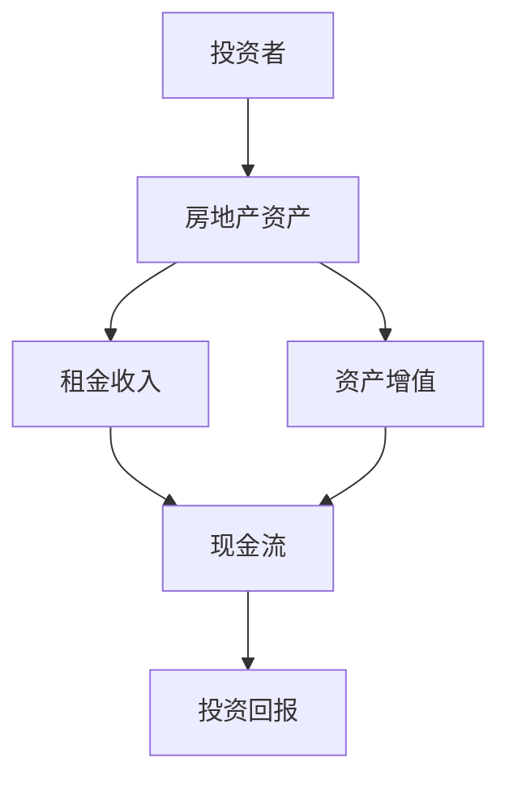
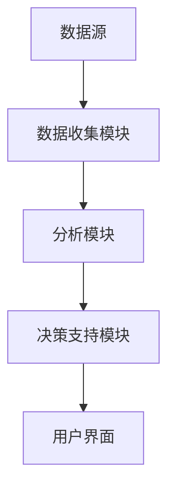

                 


# 巴菲特如何看待房地产投资

## 关键词：巴菲特、房地产投资、价值投资、财务分析、投资策略

## 摘要：本文深入探讨巴菲特的房地产投资理念，分析其独特的价值投资方法，结合实际案例和财务模型，为读者提供系统的房地产投资策略。文章涵盖从基本概念到系统架构的详细分析，帮助读者理解如何将巴菲特的智慧应用于房地产投资中。

---

# 引言

巴菲特作为价值投资的代表人物，其房地产投资策略备受关注。本文将分析巴菲特如何运用价值投资原则于房地产市场，探讨其投资理念、财务分析方法及长期策略，为读者提供系统的房地产投资指南。

---

## 第一部分：背景介绍

### 1.1 核心概念与术语

- **房地产投资**：涉及购买、开发和管理房地产资产，以获取收益或资本增值。
- **价值投资**：寻找市场价格低于内在价值的资产，长期持有，等待市场回归。
- **现金流**：房地产投资中的主要收益来源，包括租金收入和潜在增值。

### 1.2 问题背景

房地产市场的波动性高，影响因素复杂。投资者需在不确定中寻找长期稳定的回报。

### 1.3 问题解决

巴菲特的价值投资策略强调长期稳定现金流和安全边际，帮助投资者在市场波动中获利。

### 1.4 边界与外延

- **边界**：关注住宅、商业地产和工业地产，避免高风险投机。
- **外延**：房地产相关金融工具，如房地产信托基金（REITs）。

### 1.5 核心要素

- **地理位置**：决定房地产价值的关键因素。
- **租金回报率**：衡量投资收益的标准。
- **市场周期**：理解周期波动，避免高位投资。

---

## 第二部分：核心概念与联系

### 2.1 核心概念原理

- **现金流分析**：评估房地产投资的收益能力。
- **资本化率**：衡量投资回报率。
- **杠杆效应**：利用债务融资放大收益或风险。

### 2.2 概念属性对比

| 概念      | 定义                                                                 | 优点                           | 缺点                           |
|-----------|----------------------------------------------------------------------|--------------------------------|--------------------------------|
| 现金流     | 进出项目的资金流量                                                 | 稳定收益                       | 初期资金需求高                   |
| 资本化率   | NOI与资产价值比率                                                 | 快速评估                       | 忽略再投资成本                   |
| 杠杆率     | 债务与资本比率                                                   | 放大收益                       | 增加风险                       |

### 2.3 实体关系图



---

## 第三部分：算法原理

### 3.1 现金流分析

#### 3.1.1 净现值（NPV）

公式：$$NPV = \sum_{t=0}^{n} \frac{C_t}{(1 + r)^t}$$

其中，$C_t$为第t年的现金流，$r$为折现率。

#### 3.1.2 内部收益率（IRR）

$$IRR = r \text{ 使得 } NPV = 0$$

#### 3.1.3 投资回收期

计算所需时间使现金流现值等于初始投资。

#### 3.1.4 Python实现

```python
import numpy as np

def calculate_npv(cash_flows, discount_rate):
    return np.npv(discount_rate, cash_flows)

def calculate_irr(cash_flows):
    return np.irr(cash_flows)

# 示例
cash_flows = [-100000, 50000, 60000, 70000]
discount_rate = 0.08

npv = calculate_npv(cash_flows, discount_rate)
 irr = calculate_irr(cash_flows)

print(f"NPV: {npv:.2f}")
print(f"IRR: {irr:.2%}")
```

---

## 第四部分：数学模型

### 4.1 资本化率

$$\text{资本化率} = \frac{\text{NOI}}{\text{资产价值}}$$

### 4.2 杠杆率

$$\text{杠杆率} = \frac{\text{债务}}{\text{资产价值}}$$

### 4.3 投资回报率

$$\text{ROI} = \frac{\text{净收益}}{\text{初始投资}} \times 100\%$$

---

## 第五部分：系统分析与架构设计

### 5.1 系统功能设计

- 数据收集模块：收集市场数据、财务指标。
- 分析模块：计算NPV、IRR等。
- 决策支持模块：提供投资建议。

### 5.2 系统架构图



### 5.3 接口设计

- API接口：数据获取、分析请求。

---

## 第六部分：项目实战

### 6.1 环境安装

- Python 3.8+
- NumPy、Pandas库安装：`pip install numpy pandas`

### 6.2 核心代码实现

```python
import numpy as np
import pandas as pd

def analyze_real Estate(property_data, discount_rate):
    # 计算NPV和IRR
    npv = np.npv(discount_rate, property_data.cash_flows)
    irr = np.irr(property_data.cash_flows)
    return npv, irr

# 示例数据
data = {
    'year': [0, 1, 2, 3],
    'cash_flows': [-100000, 50000, 60000, 70000]
}
df = pd.DataFrame(data)

discount_rate = 0.08
npv, irr = analyze_real_estate(df, discount_rate)
print(f"NPV: {npv:.2f}")
print(f"IRR: {irr:.2%}")
```

### 6.3 案例分析

假设购买一处住宅，初始投资100万元，3年收回，每年租金收入30万，年金利8%。

计算NPV和IRR，评估投资可行性。

---

## 第七部分：最佳实践

### 7.1 投资策略

- 长期思维：关注长期现金流，而非短期价格波动。
- 安全边际：确保买入价格低于内在价值。
- 持续学习：适应市场变化，优化投资组合。

### 7.2 小结

巴菲特的房地产投资策略强调基本面分析、财务纪律和长期视角，值得投资者深入学习和借鉴。

### 7.3 注意事项

- 避免高杠杆：控制债务比例，防止市场下跌时的强制平仓。
- 风险管理：分散投资，避免过度集中于单一市场或资产。

### 7.4 拓展阅读

推荐书籍和资源，帮助读者深入学习房地产投资和价值投资。

---

# 结语

通过系统分析和实际案例，本文展示了巴菲特的房地产投资策略及其在现代技术环境下的应用。希望读者能够从中汲取智慧，做出明智的投资决策。

