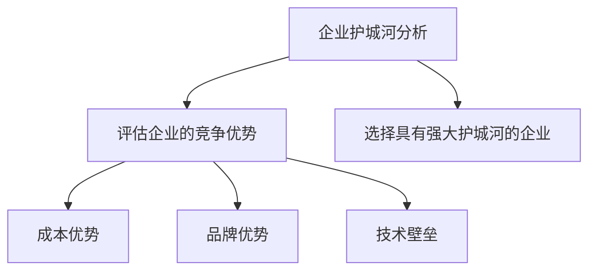
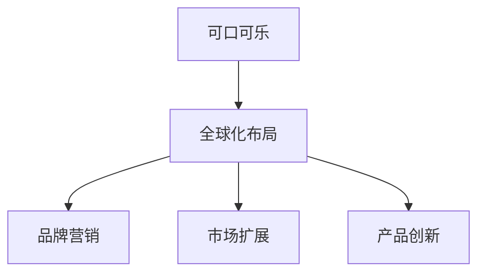

                 

# 巴菲特如何看待新兴市场投资

## 关键词：巴菲特，新兴市场，投资策略，价值投资，风险管理

## 摘要：本文将探讨巴菲特对新兴市场的看法，分析他的投资策略和分析框架，结合实际案例，为投资者提供风险管理建议。通过详细分析，揭示巴菲特在新兴市场的成功秘诀。

---

## 目录大纲

### 第1章 巴菲特的背景与投资理念

#### 1.1 巴菲特的生平与投资历程

- 1.1.1 早年经历与价值投资的起源
- 1.1.2 巴菲特的投资哲学与原则

#### 1.2 巴菲特的价值投资理念

- 1.2.1 价值投资的核心概念
- 1.2.2 长期投资与复利效应
- 1.2.3 投资中的安全边际

---

### 第2章 新兴市场的定义与特点

#### 2.1 新兴市场的定义与分类

- 2.1.1 新兴市场的概念
- 2.1.2 新兴市场的地理分布与经济特征
- 2.1.3 新兴市场与发达市场的对比

#### 2.2 新兴市场的投资机会

- 2.2.1 经济增长的潜力
- 2.2.2 行业分布与投资机会
- 2.2.3 新兴市场的风险与挑战

---

### 第3章 巴菲特对新兴市场的投资策略

#### 3.1 巴菲特对新兴市场的看法

- 3.1.1 新兴市场的长期潜力
- 3.1.2 新兴市场的风险与应对策略

#### 3.2 巴菲特的选股标准在新兴市场的应用

- 3.2.1 寻找具有强大护城河的企业
- 3.2.2 选择优秀的管理层
- 3.2.3 重视企业的财务状况

---

### 第4章 巴菲特的分析框架与工具

#### 4.1 护城河分析

- 4.1.1 护城河的定义与类型
- 4.1.2 如何评估企业的护城河
- 4.1.3 护城河在新兴市场的应用

#### 4.2 管理层分析

- 4.2.1 管理层的诚信与能力
- 4.2.2 管理层的决策风格
- 4.2.3 管理层在新兴市场的挑战

#### 4.3 财务分析

- 4.3.1 财务报表的基本分析
- 4.3.2 重点关注的财务指标
- 4.3.3 财务分析在新兴市场的应用

---

### 第5章 实际案例分析

#### 5.1 可口可乐的全球扩张

- 5.1.1 可口可乐的全球市场策略
- 5.1.2 巴菲特对可口可乐的投资逻辑
- 5.1.3 案例分析的启示

#### 5.2 比亚迪的投资故事

- 5.2.1 比亚迪的发展历程
- 5.2.2 巴菲特对比亚迪的投资逻辑
- 5.2.3 案例分析的启示

---

### 第6章 风险管理与投资策略

#### 6.1 新兴市场的风险管理

- 6.1.1 分散投资的重要性
- 6.1.2 风险评估与应对策略
- 6.1.3 如何在新兴市场中保持长期投资

---

### 第7章 总结与行动建议

#### 7.1 巴菲特的新兴市场投资总结

- 7.1.1 长期投资的重要性
- 7.1.2 价值投资的核心理念
- 7.1.3 风险管理的关键作用

#### 7.2 对投资者的行动建议

- 7.2.1 如何应用巴菲特的投资理念
- 7.2.2 如何选择新兴市场的投资标的
- 7.2.3 如何进行风险管理与长期规划

---

## 第1章 巴菲特的背景与投资理念

### 1.1 巴菲特的生平与投资历程

#### 1.1.1 早年经历

沃伦·巴菲特（Warren Buffett）于1934年出生在美国堪萨斯州，早年展现出对数字和投资的浓厚兴趣。他在青少年时期就开始接触股票投资，并通过购买周刊和阅读投资书籍积累了大量知识。

#### 1.1.2 巴菲特的投资哲学与原则

巴菲特的投资哲学以“价值投资”为核心，强调购买那些具有强大内在价值的企业，并长期持有。他的投资策略注重企业的财务状况、管理层能力和市场地位，而非短期市场波动。

---

## 第2章 新兴市场的定义与特点

### 2.1 新兴市场的定义与分类

#### 2.1.1 新兴市场的概念

新兴市场通常指那些经济发展迅速、但尚未达到发达水平的国家。这些市场通常具有较高的增长率和较大的投资潜力，但也伴随着较高的风险。

#### 2.1.2 新兴市场的地理分布与经济特征

新兴市场主要分布在亚洲、拉丁美洲和东欧等地，包括中国、印度、巴西等国家。这些市场的经济特征包括快速工业化、人口增长和消费市场的扩大。

#### 2.1.3 新兴市场与发达市场的对比

与发达市场相比，新兴市场具有更高的增长潜力，但也面临更多的不确定性，如政策风险、市场波动和经济波动。

---

## 第3章 巴菲特对新兴市场的投资策略

### 3.1 巴菲特对新兴市场的看法

#### 3.1.1 新兴市场的长期潜力

巴菲特认为新兴市场具有巨大的增长潜力，尤其是那些具备强大内需和产业升级潜力的国家。他特别看好那些能够满足消费者需求的企业。

#### 3.1.2 新兴市场的风险与应对策略

尽管新兴市场潜力巨大，但风险也较高。巴菲特强调通过分散投资和选择具有强大护城河的企业来降低风险。

---

## 第4章 巴菲特的分析框架与工具

### 4.1 护城河分析

#### 4.1.1 护城河的定义与类型

护城河是巴菲特用来评估企业竞争优势的重要工具。护城河可以是成本优势、品牌优势、技术壁垒等。

#### 4.1.2 如何评估企业的护城河

通过分析企业的市场份额、成本结构、品牌影响力等因素，可以评估其护城河的强弱。

#### 4.1.3 护城河在新兴市场的应用

在新兴市场中，选择那些具有强大护城河的企业，可以有效抵御竞争压力和市场波动。

---

## 第5章 实际案例分析

### 5.1 可口可乐的全球扩张

#### 5.1.1 可口可乐的全球市场策略

可口可乐通过全球化布局和品牌营销，成功占据了全球饮料市场的主导地位。

#### 5.1.2 巴菲特对可口可乐的投资逻辑

巴菲特看重新可乐强大的品牌影响力和全球市场布局，认为其具备长期增长潜力。

#### 5.1.3 案例分析的启示

通过可口可乐的案例，可以看出巴菲特对品牌和全球化的重视。

---

## 第6章 风险管理与投资策略

### 6.1 新兴市场的风险管理

#### 6.1.1 分散投资的重要性

通过分散投资，可以降低单一市场的风险。

#### 6.1.2 风险评估与应对策略

定期评估新兴市场的风险，及时调整投资组合。

#### 6.1.3 如何在新兴市场中保持长期投资

选择具有长期竞争优势的企业，避免短期波动的影响。

---

## 第7章 总结与行动建议

### 7.1 巴菲特的新兴市场投资总结

#### 7.1.1 长期投资的重要性

长期投资是巴菲特成功的关键，新兴市场的潜力也需要时间来体现。

#### 7.1.2 价值投资的核心理念

选择具有强大护城河和长期竞争优势的企业，是价值投资的核心。

#### 7.1.3 风险管理的关键作用

通过分散投资和风险评估，可以有效管理新兴市场的波动风险。

### 7.2 对投资者的行动建议

#### 7.2.1 如何应用巴菲特的投资理念

投资者应学习巴菲特的价值投资理念，注重企业的基本面分析。

#### 7.2.2 如何选择新兴市场的投资标的

选择那些具有强大护城河和长期增长潜力的企业。

#### 7.2.3 如何进行风险管理与长期规划

通过分散投资和定期评估，降低投资风险，实现长期收益。

---

## 附录

#### 附录1：巴菲特的护城河分析框架（Mermaid流程图）

#### 附录2：可口可乐的全球市场策略分析（Mermaid流程图）

---

通过以上结构和内容，文章将详细阐述巴菲特对新兴市场的看法，并结合实际案例和分析框架，为投资者提供有价值的见解和行动建议。

