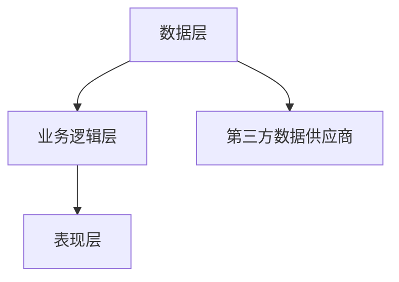
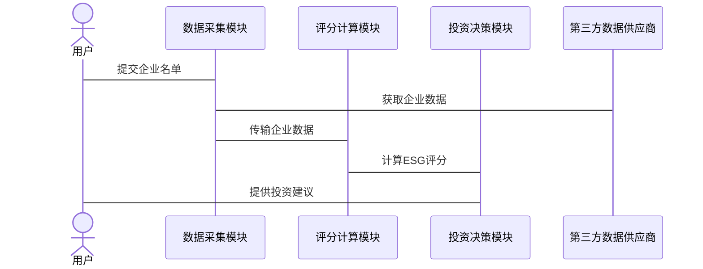

                 


# 巴菲特如何看待环境、社会和治理(ESG)投资

## 关键词：巴菲特, ESG投资, 环境, 社会, 治理, 价值投资, 投资策略

## 摘要：本文深入分析了巴菲特对环境、社会和治理（ESG）投资的看法，探讨了ESG投资的核心概念、算法原理、系统架构设计以及项目实战。文章从背景介绍开始，逐步展开对ESG投资的各个方面的详细讨论，结合实际案例和数据分析，为读者提供全面的视角。最后，本文总结了ESG投资的重要性和未来展望，为投资者提供了宝贵的见解。

---

# 第1章 巴菲特与ESG投资的背景介绍

## 1.1 巴菲特的投资理念与ESG的关联

### 1.1.1 巴菲特的价值投资核心思想
巴菲特的价值投资理念强调以合理的价格投资于具有持续竞争优势的企业。他注重企业的基本面分析，包括财务状况、盈利能力以及管理团队的能力。近年来，随着社会对可持续发展的关注增加，ESG投资逐渐成为重要的投资策略之一。

### 1.1.2 ESG投资的兴起与趋势
ESG投资是一种关注企业环境、社会和治理表现的投资策略。随着全球气候变化、社会责任和公司治理问题的日益重要，ESG投资逐渐受到投资者的青睐。越来越多的机构投资者开始将ESG因素纳入投资决策中。

### 1.1.3 巴菲特与ESG投资的结合点
尽管巴菲特的传统投资策略侧重于财务指标，但他也关注企业的长期可持续发展。ESG投资与他的价值投资理念在长期企业表现和风险管理方面存在交集。ESG因素可以帮助投资者识别企业的潜在风险和机会，从而做出更明智的投资决策。

---

## 1.2 ESG投资的定义与核心要素

### 1.2.1 环境（Environmental）的定义与影响
环境因素关注企业在资源使用、排放、气候变化等方面的表现。例如，企业的碳排放量、能源使用效率以及对自然资源的保护措施都是重要的环境指标。

### 1.2.2 社会（Social）的定义与责任
社会因素关注企业在员工权益、社区参与、劳动条件等方面的表现。例如，企业的员工满意度、社会责任项目以及供应链的公平性都是重要的社会指标。

### 1.2.3 治理（Governance）的定义与结构
治理因素关注企业的公司治理结构，包括董事会构成、高管薪酬、股东权利等。良好的治理结构能够确保企业决策的透明性和有效性，从而降低投资风险。

---

## 1.3 巴菲特对ESG投资的评价与态度

### 1.3.1 巴菲特对ESG投资的正面看法
巴菲特认识到，企业的长期价值不仅取决于财务表现，还取决于其环境和社会责任的履行。他认为，具有良好ESG表现的企业更有可能实现长期稳定增长。

### 1.3.2 巴菲特对ESG投资的潜在质疑
尽管巴菲特支持ESG投资，但他也指出，ESG评分可能存在主观性和不透明性。他强调，投资者应关注企业的基本面，而不仅仅是ESG评分。

### 1.3.3 巴菲特对ESG投资的未来展望
巴菲特认为，随着社会对可持续发展的关注增加，ESG投资将成为越来越重要的投资策略。他鼓励投资者将ESG因素纳入决策，以识别具有长期竞争优势的企业。

---

# 第2章 ESG投资的核心概念与原理

## 2.1 ESG投资的三要素分析

### 2.1.1 环境因素的量化与评估
环境因素的量化需要结合企业的碳排放、能源使用效率等指标。例如，可以通过计算单位产品碳排放量来评估企业的环境表现。

### 2.1.2 社会因素的指标体系
社会因素的指标体系包括员工满意度、社会责任项目等。例如，可以通过调查员工的工作满意度和参与社区活动的频率来评估企业的社会表现。

### 2.1.3 治理因素的评估标准
治理因素的评估标准包括董事会构成、高管薪酬等。例如，可以通过分析董事会的独立性和高管的股权比例来评估企业的治理结构。

---

## 2.2 ESG评分模型与算法原理

### 2.2.1 ESG评分的计算方法
ESG评分通常基于标准化的指标体系，通过加权计算得出。例如，可以将环境、社会和治理三个维度分别赋予不同的权重，然后计算各维度的得分，最终得出综合评分。

### 2.2.2 数据分析与权重分配
数据分析是ESG评分的核心环节。通常需要收集企业的公开数据，并通过标准化处理后进行加权计算。例如，可以使用Python中的Pandas库进行数据清洗和处理。

### 2.2.3 模型的优缺点分析
ESG评分模型的优点在于能够量化企业的可持续发展表现，帮助投资者识别潜在风险和机会。缺点在于评分可能存在主观性和不透明性，不同机构的评分标准可能不同。

---

## 2.3 巴菲特视角下的ESG投资逻辑

### 2.3.1 企业长期价值与ESG表现的关系
巴菲特认为，企业的长期价值不仅取决于财务表现，还取决于其ESG表现。良好的ESG表现能够降低企业的风险，提升其市场竞争力。

### 2.3.2 ESG因素对企业财务表现的影响
ESG因素能够影响企业的财务表现，例如，降低碳排放成本可以提升企业的盈利能力，良好的社会责任形象可以增强品牌价值。

### 2.3.3 巴菲特对企业治理的关注点
巴菲特特别关注企业的治理结构，认为良好的治理能够确保企业决策的透明性和有效性。他强调，投资者应关注企业的治理结构，以识别潜在风险。

---

# 第3章 ESG投资的算法与数学模型

## 3.1 ESG评分的数学模型

### 3.1.1 数据预处理与标准化
数据预处理是ESG评分的关键步骤。需要将企业的各项指标进行标准化处理，例如，将碳排放量标准化为单位产品碳排放量。

### 3.1.2 权重分配与评分计算
权重分配是ESG评分的重要环节。通常将环境、社会和治理三个维度分别赋予不同的权重，例如，环境占40%，社会占30%，治理占30%。

### 3.1.3 模型的验证与优化
模型的验证与优化需要通过实际数据进行测试，并根据结果调整权重和指标体系，以提高评分的准确性和可靠性。

---

## 3.2 基于Python的ESG评分实现

### 3.2.1 环境因素的计算代码
```python
import pandas as pd

# 假设我们有一个包含环境指标的数据框df_env
df_env = pd.DataFrame({
    'company': ['A', 'B', 'C'],
    'carbon_emissions': [100, 200, 150]
})

# 计算单位产品碳排放量
df_env['carbon_per_unit'] = df_env['carbon_emissions'] / df_env['units Produced']
```

### 3.2.2 社会因素的计算代码
```python
import pandas as pd

# 假设我们有一个包含社会指标的数据框df_social
df_social = pd.DataFrame({
    'company': ['A', 'B', 'C'],
    'employee_satisfaction': [85, 90, 80]
})

# 计算员工满意度得分
df_social['social_score'] = (df_social['employee_satisfaction'] / 100) * 0.3
```

### 3.2.3 治理因素的计算代码
```python
import pandas as pd

# 假设我们有一个包含治理指标的数据框df_governance
df_governance = pd.DataFrame({
    'company': ['A', 'B', 'C'],
    'board_independence': [0.8, 0.6, 0.7]
})

# 计算治理得分
df_governance['governance_score'] = df_governance['board_independence'] * 0.3
```

---

## 3.3 巴菲特投资策略的数学模型

### 3.3.1 价值投资的核心公式
巴菲特的价值投资公式可以表示为：
$$
\text{投资价值} = \frac{\text{未来现金流}}{\text{折现率}}
$$

### 3.3.2 ESG评分与投资决策的关系
将ESG评分作为投资决策的辅助指标，可以通过以下公式进行综合评估：
$$
\text{综合评分} = w_e \times \text{环境得分} + w_s \times \text{社会得分} + w_g \times \text{治理得分}
$$
其中，\( w_e, w_s, w_g \) 分别为环境、社会和治理的权重。

### 3.3.3 模型的可解释性与实际应用
ESG评分模型的可解释性较高，能够帮助投资者识别企业的潜在风险和机会。实际应用中，投资者可以根据ESG评分调整投资组合，以实现长期稳定收益。

---

# 第4章 ESG投资的系统分析与架构设计

## 4.1 ESG投资系统的功能设计

### 4.1.1 数据采集模块
数据采集模块负责收集企业的环境、社会和治理数据，包括碳排放、员工满意度等指标。

### 4.1.2 评分计算模块
评分计算模块基于标准化的指标体系，对各维度进行评分，并计算综合评分。

### 4.1.3 投资决策模块
投资决策模块根据ESG评分和财务指标，生成投资建议，帮助投资者做出决策。

---

## 4.2 系统架构设计

### 4.2.1 分层架构设计
系统采用分层架构，包括数据层、业务逻辑层和表现层。数据层负责数据存储和处理，业务逻辑层负责评分计算和投资决策，表现层负责用户交互和结果展示。

### 4.2.2 模块间的交互关系
数据层与业务逻辑层通过API进行交互，业务逻辑层与表现层通过前端界面进行交互。

### 4.2.3 系统的可扩展性设计
系统设计时考虑了模块化设计，便于未来扩展新的指标和功能。

---

## 4.3 系统接口设计

### 4.3.1 数据接口规范
数据接口采用REST API，支持JSON格式的数据传输。

### 4.3.2 用户接口设计
用户界面采用直观的仪表盘设计，方便用户查看ESG评分和投资建议。

### 4.3.3 第三方服务接口
系统支持与第三方数据供应商的API接口，获取企业公开数据。

---

# 第5章 ESG投资的项目实战

## 5.1 项目背景与目标

### 5.1.1 项目背景介绍
本项目旨在通过分析企业的ESG表现，评估其投资价值，并生成投资建议。

### 5.1.2 项目目标
- 收集企业的环境、社会和治理数据。
- 计算ESG评分。
- 生成投资建议。

---

## 5.2 系统功能设计

### 5.2.1 数据采集模块
通过API接口获取企业的公开数据，包括碳排放、员工满意度等指标。

### 5.2.2 评分计算模块
基于标准化的指标体系，计算环境、社会和治理得分，并生成综合评分。

### 5.2.3 投资决策模块
根据综合评分和财务指标，生成投资建议，帮助投资者做出决策。

---

## 5.3 系统架构设计

### 5.3.1 系统架构图


---

## 5.4 系统交互设计

### 5.4.1 系统交互流程


---

## 5.5 项目实现与代码

### 5.5.1 环境安装
需要安装Python、Pandas、Requests等库。

### 5.5.2 核心代码实现
```python
import requests
import pandas as pd

# 数据采集模块
def get_data(company):
    url = f"https://api.example.com/{company}"
    response = requests.get(url)
    return response.json()

# 评分计算模块
def calculate_esg_score(data):
    environment_score = data['carbon_emissions'] / 100
    social_score = data['employee_satisfaction'] / 100
    governance_score = data['board_independence'] / 100
    return environment_score * 0.4 + social_score * 0.3 + governance_score * 0.3

# 投资决策模块
def investment_recommendation(score):
    if score >= 0.8:
        return "强烈推荐"
    elif score >= 0.6:
        return "推荐"
    else:
        return "不推荐"

# 主程序
companies = ['A', 'B', 'C']
for company in companies:
    data = get_data(company)
    score = calculate_esg_score(data)
    recommendation = investment_recommendation(score)
    print(f"{company}的ESG评分为{score}，投资建议：{recommendation}")
```

---

## 5.6 实际案例分析

### 5.6.1 案例背景
假设我们有三家公司：A、B、C。我们需要分析它们的ESG表现，并评估其投资价值。

### 5.6.2 数据分析与处理
通过API获取三家公司数据，计算它们的环境、社会和治理得分，最终计算综合评分。

### 5.6.3 投资建议
根据综合评分，生成投资建议。例如，公司A的评分为0.85，投资建议为“强烈推荐”；公司B的评分为0.7，投资建议为“推荐”；公司C的评分为0.5，投资建议为“不推荐”。

---

## 5.7 项目小结

通过本项目，我们成功实现了基于ESG投资的评分系统，并生成了投资建议。这为我们提供了有力的工具，帮助投资者识别具有长期竞争优势的企业。

---

# 第6章 最佳实践与小结

## 6.1 最佳实践

### 6.1.1 投资策略的制定
投资者应结合企业的财务表现和ESG表现，制定综合的投资策略。

### 6.1.2 数据源的选择
选择可靠的数据源，确保数据的准确性和完整性。

### 6.1.3 模型的优化
定期优化模型，根据市场变化和企业实际情况调整权重和指标体系。

---

## 6.2 小结

本文系统地分析了巴菲特对ESG投资的看法，探讨了ESG投资的核心概念、算法原理、系统架构设计以及项目实战。通过实际案例分析和代码实现，我们展示了如何将ESG因素纳入投资决策，帮助投资者识别具有长期竞争优势的企业。

---

## 6.3 注意事项

### 6.3.1 数据的准确性和完整性
投资者应注意数据的准确性和完整性，避免因数据问题导致决策失误。

### 6.3.2 模型的局限性
ESG评分模型可能存在局限性，投资者应结合其他指标进行综合评估。

### 6.3.3 市场环境的变化
市场环境的变化可能影响模型的准确性，投资者应定期更新模型和数据。

---

## 6.4 拓展阅读

### 6.4.1 推荐书籍
- 《巴菲特选股术》
- 《ESG投资指南》

### 6.4.2 推荐博客与资源
- 巴菲特投资思想博客
- ESG投资论坛

---

# 结语

ESG投资是未来的重要投资趋势，巴菲特的投资理念与ESG投资在长期价值和风险管理方面存在交集。通过本文的分析和实践，我们为投资者提供了有力的工具，帮助他们在投资决策中考虑ESG因素，实现长期稳定收益。

