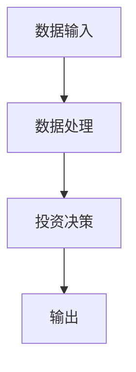

                 

# 巴菲特如何看待科技股投资

> 关键词：巴菲特，科技股，价值投资，投资策略，投资分析

> 摘要：本文从巴菲特的投资理念出发，结合科技股的特点，详细分析了巴菲特如何看待科技股投资。通过构建分析框架，结合具体案例，阐述了如何运用巴菲特的投资理念进行科技股投资分析和决策。

---

## 正文

### 第一部分：背景介绍

#### 第1章：巴菲特投资理念概述

##### 1.1 巴菲特的价值投资理论

巴菲特是价值投资的代表人物，其投资理念的核心在于寻找具有长期竞争优势的企业，并以合理的价格买入。他强调企业基本面分析，注重企业的盈利能力、财务健康和管理层素质。巴菲特认为，市场的短期波动不可预测，但企业的长期价值是可以评估的。

##### 1.2 科技股的定义与特性

科技股是指那些与科技行业相关的上市公司股票。科技行业具有高成长性、高波动性和高创新性的特点。科技股的投资价值往往依赖于企业的技术创新能力和市场竞争力，同时受政策、市场需求和技术变革的影响较大。

##### 1.3 巴菲特与科技股的结合

尽管巴菲特最初以投资传统行业（如银行、保险、制造业）为主，但随着科技行业的崛起，科技股在巴菲特的投资组合中占据了越来越重要的位置。巴菲特对科技股的投资并非盲目跟风，而是基于对企业长期价值的判断。

---

### 第二部分：巴菲特投资理念的核心概念与分析框架

#### 第2章：巴菲特投资理念的核心要素

##### 2.1 价值投资的核心要素

- **企业基本面分析**：巴菲特强调对企业基本面的深入研究，包括盈利能力、财务状况、竞争优势等。
- **安全边际**：巴菲特认为，投资时应考虑安全边际，即以低于内在价值的价格买入股票。
- **股东权益最大化**：巴菲特关注企业的长期价值，而非短期股价波动。

##### 2.2 科技股的财务指标分析

科技股的财务指标分析需要重点关注以下几个方面：

- **盈利能力**：净利润率、ROE（净资产收益率）。
- **成长性**：收入增长率、净利润增长率。
- **估值指标**：市盈率（P/E）、市净率（P/B）。

##### 2.3 巴菲特投资理念与科技股的结合

- **长期价值**：巴菲特关注科技企业的长期竞争优势，如技术壁垒、市场占有率等。
- **风险控制**：科技股的高波动性要求投资者具备较强的风险控制能力。
- **周期性分析**：科技行业具有较强的周期性，巴菲特强调在行业低谷时寻找投资机会。

---

### 第三部分：系统分析与架构设计方案

#### 第3章：科技股投资的系统分析

##### 3.1 投资系统的整体架构

- **系统目标**：构建一个基于巴菲特投资理念的科技股分析系统，帮助投资者找到具有长期竞争优势的科技股。
- **系统输入**：财务数据、行业数据、市场数据。
- **系统输出**：投资决策、风险评估。

##### 3.2 系统功能设计

- **数据收集模块**：收集科技股的财务数据、行业数据、市场数据。
- **数据分析模块**：计算财务指标、评估内在价值、分析竞争优势。
- **决策模块**：生成投资建议、风险预警。

##### 3.3 系统架构设计

- **数据流图**：数据输入 → 数据处理 → 投资决策输出。

---

### 第四部分：项目实战

#### 第4章：科技股投资的实战分析

##### 4.1 选择科技股的案例分析

以苹果公司为例，分析其财务状况、竞争优势和投资价值。

##### 4.2 投资策略的制定

基于巴菲特的投资理念，制定科技股的投资策略，包括资产配置、买入时机、风险控制等。

##### 4.3 投资组合的构建

结合具体案例，构建一个科技股投资组合，并分析其风险和收益。

---

### 第五部分：总结与展望

#### 第5章：总结与展望

##### 5.1 总结

本文从巴菲特的投资理念出发，结合科技股的特点，构建了一个科技股投资分析框架，并通过具体案例分析了如何应用巴菲特的投资理念进行科技股投资。

##### 5.2 展望

未来，随着科技行业的快速发展，科技股的投资价值将更加重要。投资者需要不断学习和调整投资策略，以应对科技行业的变化和挑战。

---

### 第六部分：附录

#### 附录A：巴菲特投资理念的数学模型

- **企业价值公式**：
  $$ \text{内在价值} = \text{未来现金流的现值} $$
- **ROE公式**：
  $$ \text{ROE} = \frac{\text{净利润}}{\text{净资产}} $$

#### 附录B：系统架构图

---

### 第七部分：参考文献

- 巴菲特的著作和演讲
- 科技行业的相关研究
- 金融分析的理论书籍

---

### 第八部分：结束语

巴菲特的投资理念为科技股的投资提供了重要的指导。通过本文的分析，读者可以更好地理解如何将巴菲特的价值投资理念应用于科技股的投资中。希望本文能为投资者提供有价值的参考和启发。

--- 

以上是《巴菲特如何看待科技股投资》的技术博客文章的目录大纲和内容概要，涵盖了从背景介绍到实战分析的全过程。

