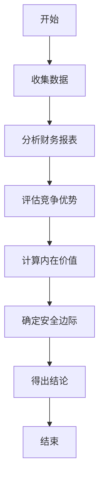
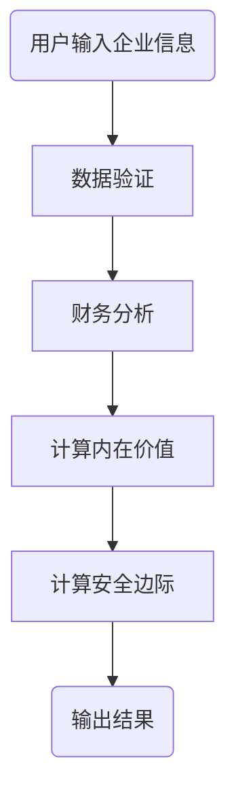

                 


# 巴菲特如何运用价值投资理念

## 关键词：
- 巴菲特
- 价值投资
- 股票分析
- 投资策略
- 风险管理

## 摘要：
本文深入探讨了巴菲特的价值投资理念，从其核心原理到实际应用，结合技术视角进行分析。文章详细讲解了内在价值计算、安全边际、企业竞争优势分析等关键点，并通过案例和系统架构图帮助读者理解如何在实际投资中应用这些理念。

---

# 第1章: 巴菲特价值投资理念概述

## 1.1 价值投资的定义与核心理念

### 1.1.1 价值投资的起源与发展
- 价值投资起源于20世纪，由本杰明·格雷厄姆和大卫·多德提出。
- 巴菲特师承格雷厄姆，发展了这一理念，强调长期持有和安全边际。

### 1.1.2 巴菲特的价值投资核心理念
- **核心理念**：寻找市场定价低于内在价值的股票。
- **长期主义**：投资于优秀的公司，而非短期波动。
- **安全边际**：买入价格低于估算的内在价值，以降低风险。

### 1.1.3 价值投资与计算机技术的结合
- 利用技术工具分析财务数据，优化投资决策。
- 使用算法筛选具备价值投资潜力的公司。

## 1.2 巴菲特投资哲学的核心要素

### 1.2.1 资本的长期主义
- 长期持有优质资产，避免频繁交易。
- 选择具备持续竞争优势的企业。

### 1.2.2 安全边际的概念
- 安全边际公式：内在价值 × (1 - 安全边际率)。
- 例如，若安全边际率为20%，买入价格应低于内在价值的80%。

### 1.2.3 企业的内在价值评估
- 内在价值计算公式：$$\text{内在价值} = \sum_{t=1}^{n} \frac{\text{现金流}_t}{(1 + r)^t}$$
- 其中，r为折现率，现金流为未来现金流。

## 1.3 价值投资的适用场景与边界

### 1.3.1 价值投资的适用领域
- 适用于稳定的行业，如消费品、公用事业。
- 不适合高波动的新兴行业，如科技初创公司。

### 1.3.2 价值投资的局限性
- 无法预测市场短期波动。
- 需要长期等待价值回归，期间可能错过其他投资机会。

### 1.3.3 价值投资与其他投资策略的对比
- **与趋势投资对比**：趋势投资关注市场趋势，而价值投资关注基本面。
- **与成长投资对比**：成长投资关注高增长企业，而价值投资关注低估值企业。

## 1.4 本章小结
本章介绍了巴菲特的价值投资理念，强调了内在价值、安全边际和长期持有。同时，探讨了其在技术视角下的应用潜力。

---

# 第2章: 巴菲特价值投资的核心算法与数学模型

## 2.1 价值投资的核心算法

### 2.1.1 内在价值计算的数学公式
- 内在价值公式：
  $$\text{内在价值} = \frac{\text{现金流}}{(1 + r)^n}$$
- 现金流预测需考虑企业的竞争优势和行业地位。

### 2.1.2 安全边际的计算方法
- 安全边际公式：
  $$\text{安全边际} = \text{内在价值} \times (1 - \text{安全边际率})$$
- 例如，若内在价值为100，安全边际率为20%，则安全边际为80。

### 2.1.3 投资组合优化的数学模型
- 使用均值-方差优化模型：
  $$\min \sigma^2 \text{ s.t. } \mu \geq \text{目标收益}$$
- 巴菲特更倾向于低风险、高收益的资产组合。

## 2.2 内在价值计算的详细步骤

### 2.2.1 企业财务报表分析
- 利润表：分析收入和利润。
- 资产负债表：评估资产和负债。
- 现金流量表：检查现金流健康性。

### 2.2.2 企业竞争优势分析
- **护城河**：品牌的市场占有率、专利等。
- **管理层**：能力强且诚信的管理层更可靠。

### 2.2.3 企业未来现金流预测
- 使用历史数据和行业趋势预测未来现金流。
- 考虑宏观经济因素对现金流的影响。

## 2.3 安全边际的计算与应用

### 2.3.1 安全边际的定义与公式
- 安全边际是买入价格与内在价值的差距。
- 计算公式：$$\text{安全边际} = \text{内在价值} - \text{买入价格}$$

### 2.3.2 安全边际的计算步骤
1. 计算企业的内在价值。
2. 确定安全边际率（通常为20%-25%）。
3. 计算买入价格：$$\text{买入价格} = \text{内在价值} \times (1 - \text{安全边际率})$$

### 2.3.3 安全边际的实际应用案例
- 以苹果公司为例，假设内在价值为100美元，安全边际率为20%。
- 买入价格应低于80美元。

## 2.4 本章小结
本章详细讲解了巴菲特价值投资中的数学模型和算法，强调了内在价值和安全边际的计算方法。

---

# 第3章: 巴菲特价值投资的系统分析与架构设计

## 3.1 价值投资的系统分析框架

### 3.1.1 系统分析的层次划分
- **微观层**：单个企业分析。
- **宏观层**：市场整体分析。
- **策略层**：投资策略制定。

### 3.1.2 系统分析的流程图


### 3.1.3 系统分析的工具与方法
- **工具**：Excel、财务分析软件。
- **方法**：定量分析与定性分析结合。

## 3.2 价值投资的系统架构设计

### 3.2.1 系统架构的模块划分
- 数据收集模块：获取企业财务数据。
- 分析模块：计算内在价值和安全边际。
- 决策模块：制定投资策略。

### 3.2.2 系统架构的交互设计


### 3.2.3 系统架构的优化策略
- 优化数据处理速度。
- 提高算法的准确性。

## 3.3 价值投资的系统实现方案

### 3.3.1 系统实现的步骤
1. 收集企业数据。
2. 进行财务分析。
3. 计算内在价值和安全边际。
4. 制定投资策略。

### 3.3.2 系统实现的关键技术
- 数据分析技术：Python、Pandas。
- 可视化工具：Matplotlib。

### 3.3.3 系统实现的注意事项
- 确保数据准确性。
- 定期更新模型。

## 3.4 本章小结
本章从系统分析的角度，详细讲解了巴菲特价值投资的架构设计和实现方案。

---

# 第4章: 巴菲特价值投资的项目实战

## 4.1 项目背景与目标
- 分析某公司的内在价值和安全边际。
- 制定投资策略。

## 4.2 项目实施步骤

### 4.2.1 数据收集
- 收集目标公司的财务报表。
- 获取行业数据和宏观经济指标。

### 4.2.2 数据分析
- 使用Python进行数据清洗和分析。
- 代码示例：
  ```python
  import pandas as pd

  df = pd.read_csv('financial_data.csv')
  print(df.head())
  ```

### 4.2.3 计算内在价值
- 使用现金流折现法计算内在价值。

### 4.2.4 确定安全边际
- 根据计算结果确定买入价格。

## 4.3 实际案例分析

### 4.3.1 案例介绍
- 以苹果公司为例，分析其内在价值。

### 4.3.2 分析过程
1. 收集苹果公司的财务数据。
2. 计算其内在价值。
3. 确定安全边际。

### 4.3.3 结果解读
- 内在价值为100美元，安全边际率为20%，买入价格应低于80美元。

## 4.4 本章小结
本章通过实际案例，展示了如何应用巴菲特的价值投资理念进行投资决策。

---

# 第5章: 巴菲特价值投资的未来展望与优化建议

## 5.1 未来展望

### 5.1.1 数字化工具的进一步应用
- 利用AI和大数据分析优化投资决策。

### 5.1.2 全球化投资机会
- 关注新兴市场的投资机会。

## 5.2 优化建议

### 5.2.1 提高数据准确性
- 使用多源数据验证。

### 5.2.2 加强风险控制
- 定期评估投资组合的风险。

## 5.3 本章小结
未来，随着技术的进步，价值投资将更加依赖数字化工具，同时需要不断优化策略以应对新的挑战。

---

# 总结

本文从技术视角深入分析了巴菲特的价值投资理念，详细讲解了其核心算法、系统架构和实战应用。通过案例分析，展示了如何在实际投资中应用这些理念。未来，随着技术的进步，价值投资将更加依赖数字化工具，同时需要不断优化策略以应对新的挑战。

---

通过以上结构，我们可以清晰地看到，巴菲特的价值投资理念在技术视角下是如何被分析和应用的。这种结构化的思考方式，帮助我们更好地理解和应用这些投资理念。

