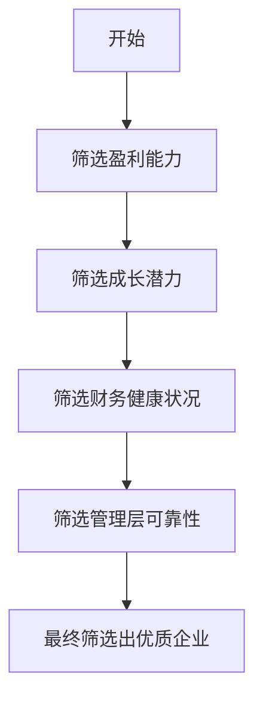
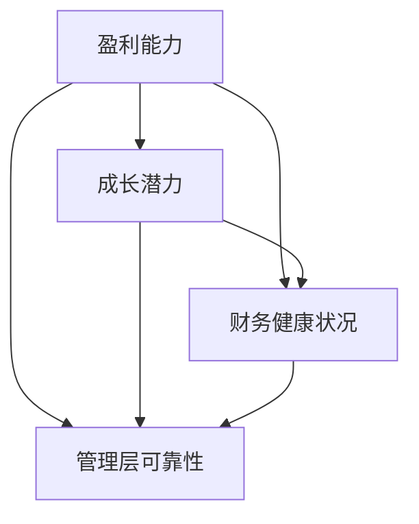
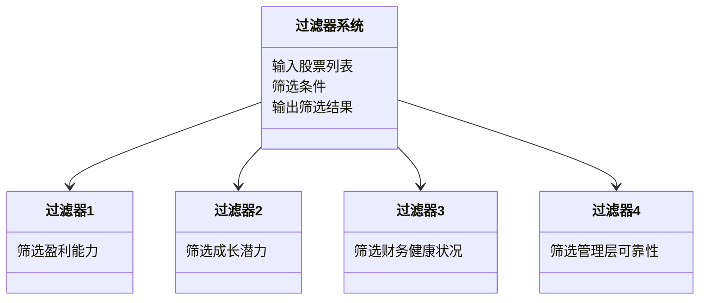
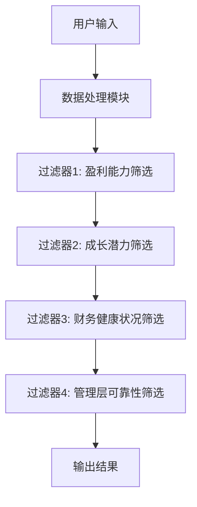

                 


# 巴菲特的“四个过滤器”：选股的科学方法

## 关键词：巴菲特, 投资, 股票筛选, 价值投资, 选股策略

## 摘要：
巴菲特的“四个过滤器”是一种科学的选股方法，结合了基本面分析和价值投资的理念。通过这四个过滤器，投资者可以系统地筛选出具备持续盈利能力、良好财务状况、成长潜力和可靠管理层的优质企业。本文将详细讲解这四个过滤器的核心原理、数学模型、系统架构以及实际应用，帮助投资者科学选股。

---

# 第一部分: 巴菲特“四个过滤器”的背景与核心理念

## 第1章: 巴菲特“四个过滤器”概述

### 1.1 巴菲特投资理念的核心思想
巴菲特的投资理念以价值投资为核心，强调长期持有的投资策略。他主张通过深入分析企业的基本面，找到那些具有持续盈利能力、良好财务状况和成长潜力的优质企业进行投资。这种理念不仅适用于传统投资，也可以通过科学的选股方法进一步优化。

#### 1.1.1 价值投资的基本原理
价值投资的核心在于寻找市场价格低于其内在价值的股票。巴菲特认为，市场的短期波动不可预测，但优质企业的长期价值是可以被分析和评估的。他强调企业的基本面分析，包括盈利能力、财务健康状况、管理层素质等因素。

#### 1.1.2 巴菲特投资策略的演变
巴菲特的投资策略经历了从集中投资到分散投资的演变，但始终坚持价值投资的核心理念。他提出的“四个过滤器”是一种系统化的方法，帮助投资者在选股过程中逐步筛选出符合价值投资标准的企业。

#### 1.1.3 “四个过滤器”的提出背景
为了应对市场的不确定性和提高选股效率，巴菲特提出了“四个过滤器”方法。这种方法通过逐步筛选企业，排除不符合条件的股票，最终选出优质的投资标的。

### 1.2 “四个过滤器”的概念与作用
#### 1.2.1 过滤器的定义与分类
“四个过滤器”是指四个筛选条件，分别从企业的盈利能力、成长潜力、财务健康状况和管理层可靠性四个方面对企业进行评估。这些过滤器相互独立，但又共同作用于选股过程。

#### 1.2.2 过滤器在选股中的核心作用
过滤器的作用在于通过逐步筛选，排除不符合条件的企业，最终筛选出优质的投资标的。这种方法不仅提高了选股效率，还确保了选股的科学性和系统性。

#### 1.2.3 过滤器的逻辑关系与整体架构
过滤器的逻辑关系是一个层层筛选的过程，每个过滤器都对企业的某个方面进行评估。通过这种逐步筛选的方式，最终选出符合所有条件的优质企业。

### 1.3 过滤器的数学模型与公式
#### 1.3.1 过滤器的量化指标
- 盈利能力：ROE（净资产收益率）
- 成长潜力：营收增长率
- 财务健康状况：资产负债率
- 管理层可靠性：管理层稳定性

#### 1.3.2 过滤器的逻辑关系图（Mermaid流程图）


---

## 第2章: 过滤器的核心概念与联系

### 2.1 过滤器的核心概念
#### 2.1.1 企业盈利能力的量化
盈利能力是衡量企业财务健康状况的重要指标之一。常用的指标包括净利润率、ROE（净资产收益率）等。ROE越高，企业的盈利能力越强。

#### 2.1.2 企业成长性的评估
成长性是企业未来发展的潜力指标。常用的指标包括营收增长率、净利润增长率等。成长性好的企业通常具有更大的发展空间。

#### 2.1.3 企业财务健康状况的分析
财务健康状况是企业抵御风险的能力。常用的指标包括资产负债率、流动比率等。财务健康的企业通常具有更强的偿债能力和抗风险能力。

#### 2.1.4 企业管理层的可靠性评估
管理层的可靠性是企业长期发展的关键。管理层的稳定性、决策能力和历史业绩是评估管理层可靠性的重要指标。

### 2.2 过滤器的属性特征对比
#### 2.2.1 各个过滤器的属性特征对比表格
| 过滤器 | 核心指标       | 属性特征               |
|--------|----------------|------------------------|
| 盈利能力 | ROE            | 高ROE值表示高盈利能力 |
| 成长潜力 | 营收增长率      | 高增长率表示高成长性  |
| 财务健康 | 资产负债率      | 低负债率表示财务健康 |
| 管理层可靠性 | 管理层稳定性 | 稳定管理层表示可靠性 |

#### 2.2.2 过滤器之间的关系与依赖（Mermaid实体关系图）


---

## 第3章: 过滤器的算法原理与数学模型

### 3.1 过滤器的算法原理
#### 3.1.1 过滤器的逻辑流程（Mermaid流程图）


#### 3.1.2 过滤器的数学模型与公式
- 盈利能力：ROE（净资产收益率）= 净利润 / 净资产
- 成长潜力：营收增长率 = (当年营收 - 上年营收) / 上年营收
- 财务健康状况：资产负债率 = 负债总额 / 资产总额
- 管理层可靠性：管理层稳定性 = 管理层任期平均 / 最大任期

### 3.2 过滤器的数学模型
#### 3.2.1 盈利能力的量化公式
$$ ROE = \frac{\text{净利润}}{\text{净资产}} $$

#### 3.2.2 成长性的评估公式
$$ \text{营收增长率} = \frac{\text{当年营收} - \text{上年营收}}{\text{上年营收}} $$

#### 3.2.3 财务健康状况的评估公式
$$ \text{资产负债率} = \frac{\text{负债总额}}{\text{资产总额}} $$

#### 3.2.4 管理层可靠性的评估公式
$$ \text{管理层稳定性} = \frac{\text{管理层任期平均}}{\text{最大任期}} $$

---

## 第4章: 系统分析与架构设计

### 4.1 系统分析
#### 4.1.1 问题场景介绍
在选股过程中，投资者需要综合考虑企业的盈利能力、成长潜力、财务健康状况和管理层可靠性。通过系统化的分析，投资者可以更高效地筛选出优质企业。

#### 4.1.2 系统功能设计（领域模型Mermaid类图）


### 4.2 系统架构设计
#### 4.2.1 系统架构Mermaid架构图


---

## 第5章: 项目实战

### 5.1 环境安装
为了实现过滤器的选股功能，需要安装以下Python库：
- pandas
- numpy
- matplotlib

### 5.2 系统核心实现源代码
```python
import pandas as pd
import numpy as np

# 过滤器1: 盈利能力筛选
def filter_profitability(df, threshold=0.1):
    return df[df['ROE'] > threshold]

# 过滤器2: 成长潜力筛选
def filter_growth(df, threshold=0.1):
    return df[df['营收增长率'] > threshold]

# 过滤器3: 财务健康状况筛选
def filter_health(df, threshold=0.5):
    return df[df['资产负债率'] < threshold]

# 过滤器4: 管理层可靠性筛选
def filter_management(df, threshold=0.7):
    return df[df['管理层稳定性'] > threshold]

# 综合筛选
def apply_filters(df):
    df = filter_profitability(df)
    df = filter_growth(df)
    df = filter_health(df)
    df = filter_management(df)
    return df
```

### 5.3 代码应用解读与分析
上述代码实现了四个过滤器的筛选功能，分别从盈利能力、成长潜力、财务健康状况和管理层可靠性四个方面对企业进行筛选。通过逐步应用这些过滤器，最终筛选出符合所有条件的优质企业。

### 5.4 实际案例分析和详细讲解剖析
假设我们有如下股票数据：

| 股票代码 | ROE  | 营收增长率 | 资产负债率 | 管理层稳定性 |
|----------|-------|------------|------------|-------------|
| A        | 0.15  | 0.12       | 0.45       | 0.8         |
| B        | 0.10  | 0.08       | 0.50       | 0.7         |
| C        | 0.20  | 0.15       | 0.30       | 0.9         |
| D        | 0.08  | 0.05       | 0.60       | 0.6         |

应用四个过滤器的筛选过程如下：
1. **盈利能力筛选**：ROE > 0.1，筛选出A、C。
2. **成长潜力筛选**：营收增长率 > 0.1，筛选出A、C。
3. **财务健康状况筛选**：资产负债率 < 0.5，筛选出A、C。
4. **管理层可靠性筛选**：管理层稳定性 > 0.7，筛选出C。

最终筛选出股票C作为优质投资标的。

### 5.5 项目小结
通过上述代码和案例分析，我们可以看到，“四个过滤器”方法在选股过程中起到了重要作用。通过逐步筛选，最终筛选出符合所有条件的优质企业。

---

## 第6章: 最佳实践 tips、小结、注意事项、拓展阅读

### 6.1 最佳实践 tips
- 在实际应用中，可以根据市场环境和投资策略调整各个过滤器的筛选阈值。
- 定期更新股票数据，确保筛选结果的准确性。
- 结合其他分析方法，如技术分析，进一步优化选股策略。

### 6.2 小结
通过本文的讲解，我们可以看到，“四个过滤器”方法是一种科学的选股方法，通过逐步筛选，最终选出优质的投资标的。这种方法不仅提高了选股效率，还确保了选股的科学性和系统性。

### 6.3 注意事项
- 数据来源的可靠性是筛选结果的关键，建议使用权威的数据源。
- 在实际应用中，需要根据市场环境和投资目标调整筛选条件。
- 定期回顾和优化筛选策略，确保筛选结果的有效性。

### 6.4 拓展阅读
- 《巴菲特传》：了解巴菲特的投资理念和成功经验。
- 《投资学》：深入学习价值投资和基本面分析的理论知识。
- 《Python数据处理》：掌握数据处理和分析的编程技能。

---

通过本文的详细讲解，我们可以看到，“四个过滤器”方法在选股过程中起到了重要作用。通过逐步筛选，最终筛选出符合所有条件的优质企业。这种方法不仅提高了选股效率，还确保了选股的科学性和系统性。

